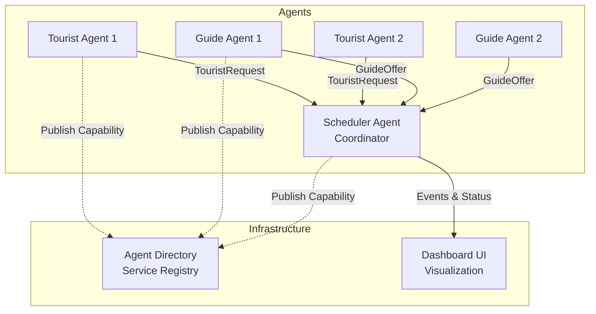
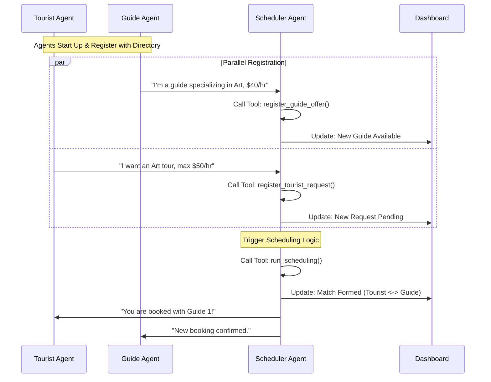

In the rapidly evolving landscape of AI, multi-agent systems represent a paradigm shift from isolated chatbots to collaborative, autonomous ecosystems. Today, we're exploring the **Tourist Scheduling System**, a reference implementation built with Google's **Agent Development Kit (ADK)** that demonstrates how independent agents can negotiate, coordinate, and solve complex scheduling problems in real-time.

## What is the Tourist Scheduling System?

The Tourist Scheduling System models a real-world scenario where three distinct types of agents collaborate:

*   **Tourist Agents**: Represent travelers with specific preferences, budgets, and constraints.
*   **Guide Agents**: Represent local tour guides with specialized knowledge and availability.
*   **Scheduler Agent**: A central coordinator that acts as a marketplace, matching tourists with the perfect guides.

This isn't just a simulated conversation; it's a fully distributed system featuring **Dynamic Service Discovery**, **Secure Agent-to-Agent (A2A) Communication** via SLIM, and full observability with **OpenTelemetry**.

## How It Works

At its core, the system relies on the **Agent Development Kit (ADK)** to give each "actor" in the system a brain (an LLM) and a set of tools. The agents communicate using the **Agent-to-Agent (A2A)** protocol, which can run over standard HTTP or our secure SLIM transport.

### 1. The Architecture

The system follows a hub-and-spoke model where the Scheduler Agent acts as the coordinator.



### 2. The Implementation Details

Each agent is implemented as a Python class inheriting from ADK's `LlmAgent`.

#### The Scheduler (The Brain)
The Scheduler Agent (`src/agents/scheduler_agent.py`) is the most complex. It is equipped with specific **Tools** that define its capabilities:
*   `register_tourist_request`: Parses natural language requests from tourists into structured data (budget, dates, preferences).
*   `register_guide_offer`: Onboards guides and logs their specialties and rates.
*   `run_scheduling`: executes a greedy matching algorithm to pair high-budget/high-match requests first.
*   `get_schedule_status`: Reports the current state of the system.

When a Tourist Agent sends a message like *"I'm looking for a history tour on Monday, budget is $50"*, the Scheduler's LLM interprets this and automatically calls the `register_tourist_request` tool.

#### The Protocol (A2A)
Communication happens via the **Agent-to-Agent (A2A)** protocol.
*   **Discovery**: Agents look up the Scheduler's address in the `Agent Directory`.
*   **Transport**: Messages are sent either via standard HTTP or **SLIM**.
    *   **SLIM (Secure Layer for Intelligent Messaging)** provides automatic mTLS encryption and identity verification, ensuring that *Tourist Agent A* is actually who they say they are.

### 3. The Workflow

Here is the sequence of events that happens when you run the demo:



## Key Features

1.  **Dynamic Discovery**: Agents publish their "Business Cards" (capabilities) to a central Directory, eliminating brittle hard-coded endpoints.
2.  **Secure Transport**: Uses [SLIM](https://github.com/agntcy/slim) for encrypted, authenticated communication.
3.  **Observability**: Integrated distributed tracing with Jaeger allows you to visualize the entire negotiation flow across agent boundaries.
4.  **Human-in-the-Loop**: A real-time dashboard provides visibility into the system's state.

## 🚀 Running the System Locally

Getting the system up and running on your local machine is straightforward. We use Docker to host the supporting infrastructure (SLIM, Jaeger, Directory) while running the agents as local processes.

### Prerequisites
*   Python 3.12+
*   [UV](https://github.com/astral-sh/uv) package manager
*   Docker
*   An API Key for Azure OpenAI or Google Gemini

### Step 1: Setup

Clone the repository and set up your environment:

```bash
git clone https://github.com/agntcy/agentic-apps.git
cd agentic-apps/tourist_scheduling_system

# Create virtual environment and install dependencies
uv venv
source .venv/bin/activate
uv sync
```

### Step 2: Configuration

Export your LLM credentials.

**For Google Gemini:**
```bash
export MODEL_PROVIDER="gemini"
export GOOGLE_GEMINI_API_KEY="your-google-api-key"
# Optional: Specify model
export MODEL_NAME="gemini/gemini-3-pro-preview"
```

**Or for Azure OpenAI:**
```bash
export MODEL_PROVIDER="azure"
export AZURE_OPENAI_API_KEY="your-key"
export AZURE_OPENAI_ENDPOINT="https://your-endpoint.openai.azure.com"
export AZURE_OPENAI_DEPLOYMENT_NAME="gpt-4o"
```

### Step 3: Launch

Start the infrastructure and run the demo:

```bash
# Start SLIM transport and Jaeger tracing containers
./setup.sh start

# Run the agents with SLIM transport enabled
source run.sh --transport slim --tracing
```

You can now access the **Dashboard** at `http://localhost:10021` to watch the agents coordinate in real-time. Use `http://localhost:16686` to view the distinct traces of their interactions in Jaeger.

## 📁 Project Structure

It's helpful to understand how the project is organized. Here's a look at the key directories:

```
tourist_scheduling_system/
├── src/
│   ├── agents/                  # The core agent logic
│   │   ├── scheduler_agent.py   # The "Brain" - coordinates matches
│   │   ├── ui_agent.py          # Serves the Dashboard
│   │   ├── guide_agent.py       # Simulated guide behavior
│   │   ├── tourist_agent.py     # Simulated tourist behavior
│   │   └── tools.py             # Tools the Scheduler can use
│   └── core/                    # Shared utilities
│       ├── a2a_cards.py         # Agent capability definitions
│       ├── slim_transport.py    # Secure transport logic
│       └── tracing.py           # OpenTelemetry setup
├── scripts/                     # Kubernetes deployment helpers
│   ├── directory.sh             # Deploys Agent Directory
│   ├── spire.sh                 # Deploys SPIRE identity provider
│   └── slim-*.sh                # Deploys SLIM infrastructure
├── deploy/
│   └── k8s/                     # Kubernetes YAML manifests
├── frontend/                    # Flutter-based UI Dashboard code
├── a2a_cards/                   # JSON definitions for agent capabilities
└── oasf_records/                # Directory registration records
```

### Helper Scripts for Local Use

The repository includes a set of bash scripts to simplify this process:

#### `setup.sh`
This is your infrastructure manager. It spins up the necessary containers for SLIM, Jaeger, and the Directory.
*   **Start Infrastructure**: `./setup.sh start`
*   **Stop Infrastructure**: `./setup.sh stop`
*   **Clean Up**: `./setup.sh clean` (removes containers and volumes)

#### `run.sh`
This script launches the actual Multi-Agent System. It runs the Scheduler, Dashboard, and simulated Guides and Tourists.

**Basic Usage:**
```bash
# Run with SLIM secure transport
source run.sh --transport slim

# Run with open HTTP transport
source run.sh --transport http
```

**Advanced Parameters:**
*   `--tracing`: Enable OpenTelemetry tracing (requires `./setup.sh start` first).
*   `--guides N`: Simulate N guide agents (default: 2).
*   `--tourists N`: Simulate N tourist agents (default: 3).
*   `--duration N`: Run the demo for N minutes (0 = run once).
*   `--real-agents`: Use fully autonomous ADK agents instead of simplified simulators.
*   `--provider [azure|google]`: Switch LLM providers dynamically.

**Example: Scale Up Test**
To run a larger simulation with 5 tourists and 5 guides using Gemini Pro, with full tracing:
```bash
source run.sh \
  --transport slim \
  --tracing \
  --guides 5 \
  --tourists 5 \
  --provider google
```

## �📊 Observability: Logs and Traces

Debugging distributed agents can be challenging. To solve this, the system includes a comprehensive telemetry stack powered by **OpenTelemetry** and **Jaeger**.

### Distributed Tracing

When you enable tracing (via the `--tracing` flag or the SLIM configuration), every agent interaction is recorded as a "span" in a distributed trace.

*   **Global Context**: See the entire request lifecycle, starting from the Tourist's initial request to the Scheduler, through the internal tool calls (`register_tourist_request`), and finally to the Guide's confirmation.
*   **Performance Bottlenecks**: Identify which part of the negotiation process is slow (e.g., latency in LLM generation vs. network transport).
*   **Error Diagnosis**: Pinpoint exactly where a negotiation failed (e.g., did the Guide reject the budget, or did the Scheduler fail to find a match?).

### Structured Logging

In addition to traces, each agent process generates detailed structured logs. These logs capture:
*   **Agent Decisions**: Why did an agent choose a specific tool?
*   **LLM Prompts & Completions**: What exact text was sent to the model and what did it return?
*   **State Changes**: Updates to the schedule, new bookings, and status transitions.

Logs are written to the `logs/` directory locally or streamed to standard output in Docker/Kubernetes environments, making them easy to collect with tools like Fluentd or Promtail.

## 🖥️ Sample Output

When you run the system, you'll see the infrastructure spin up, followed by the agents coming online. The demo runner will then simulate a stream of tourists and guides entering the system.

To generate the output below, we first ensure a clean environment, start the infrastructure, and then execute the demo runner:

```bash
./setup.sh clean
./setup.sh start --tracing
./run.sh --transport slim --tracing --duration 1
```

Here is what a successful run looks like:

```text
=======================================================
Tourist Scheduling System
=======================================================
[RUN] Transport: slim
[RUN] Tracing: true
[RUN] Scheduler: http://localhost:10000
[RUN] Dashboard: http://localhost:10021
[RUN] Guides: 2 | Tourists: 3
...
[OK] Agents running!
   📊 Dashboard: http://localhost:10021
   🗓️  Scheduler: http://localhost:10000
   🔍 Jaeger: http://localhost:16686

======================================================================
🎯 Simulation Mode
======================================================================

🔄 Iteration 1...
📝 Registering 2 guides...
   🗺️ Guide silvia1_b1: shopping, history, adventure @ $85/hr
   🗺️ Guide elisa2_b1: nightlife @ $95/hr

📝 Registering 3 tourists...
   🧳 Tourist amelia1_b1: wine, museums, architecture @ $175/hr budget
   🧳 Tourist charlotte2_b1: architecture, museums, wine @ $167/hr budget

🔄 Running scheduling algorithm...
   The scheduling algorithm has successfully completed...

📤 Creating 2 assignments...
   🔗 amelia1_b1 ↔ silvia1_b1
   🔗 charlotte2_b1 ↔ elisa2_b1
   ✅ Sent 2 assignments

📊 Getting final status...
   - Total Assignments Completed: 3
   - Tourist Satisfaction: 100%
   - Guide Utilization: 50%
```

## ☸️ Deploying to Kubernetes

Moving from local development to a production-like environment is seamless. The system comes with ready-to-use Kubernetes manifests and helper scripts.

### Deployment Helper Scripts

Located in `scripts/`, these helper scripts automate complex K8s tasks:

*   `scripts/directory.sh`: Deploys the **Agent Directory** via Helm. It handles downloading the chart, configuring persistence, and optionally registering the workload with SPIRE for identity.
*   `scripts/spire.sh`: Installs **SPIRE** (SPIFFE Runtime Environment) to provide mTLS identities for SLIM. It sets up the Server and Agent (DaemonSet) on your cluster.
*   `scripts/slim-controller.sh` & `scripts/slim-node.sh`: Deploy the **SLIM Control Plane** and **Data Plane**. These scripts manage the necessary `StatefulSets` and config maps to get the secure transport layer running.

To deploy the full dependency stack on a fresh cluster:
```bash
# 1. Identity Infrastructure
./scripts/spire.sh install

# 2. Secure Transport Layer
./scripts/slim-controller.sh install
./scripts/slim-node.sh install

# 3. Service Registry
./scripts/directory.sh install
```

### Prerequisites
*   A running Kubernetes cluster (e.g., MicroK8s, GKE, EKS)
*   `kubectl` configured
*   Container images (or build your own)

### Deployment Steps

1.  **Navigate to the deployment directory**:
    ```bash
    cd deploy/k8s
    ```

2.  **Configure Environment Variables**:
    Set the namespace and image registry details.
    ```bash
    export NAMESPACE=tourist-system
    export IMAGE_REGISTRY=ghcr.io/agntcy/apps
    export IMAGE_TAG=latest
    ```

3.  **Configure Credentials**:
    Create the namespace and export your API keys. The deployment script will read these environment variables and create the Kubernetes secrets for you.
    ```bash
    kubectl create namespace $NAMESPACE

    # For Google Gemini:
    export MODEL_PROVIDER="google"
    export GOOGLE_API_KEY="your-google-api-key"

    # OR for Azure OpenAI:
    export MODEL_PROVIDER="azure"
    export AZURE_OPENAI_API_KEY="your-key"
    export AZURE_OPENAI_ENDPOINT="your-endpoint"
    export AZURE_OPENAI_DEPLOYMENT_NAME="gpt-4o"
    ```

4.  **Deploy**:
    You can deploy using the standard HTTP transport or the secure SLIM transport. To deploy with the default HTTP transport:
    ```bash
    ./deploy.sh http
    ```

    Or, if you have set up the SLIM infrastructure (SPIRE, Controller, Nodes):
    ```bash
    ./deploy.sh slim
    ```

5.  **Scale Agents**:
    Simulate load by spawning multiple tourists and guides:
    ```bash
    ./spawn-agents.sh 5 tourists
    ./spawn-agents.sh 3 guides
    ```

## Conclusion

The Tourist Scheduling System demonstrates that building complex, multi-agent workflows doesn't have to be chaotic. By leveraging standardized protocols like SLIM and robust observability tools, developers can build autonomous systems that are secure, scalable, and easy to debug.

Check out the full source code in the [repository](https://github.com/agntcy/agentic-apps) and try running it yourself!
