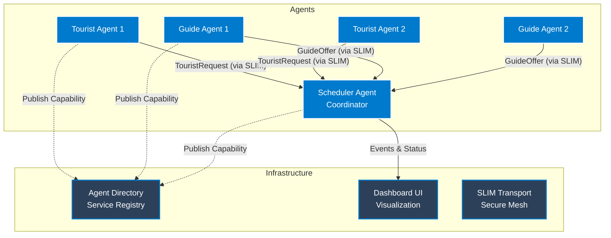
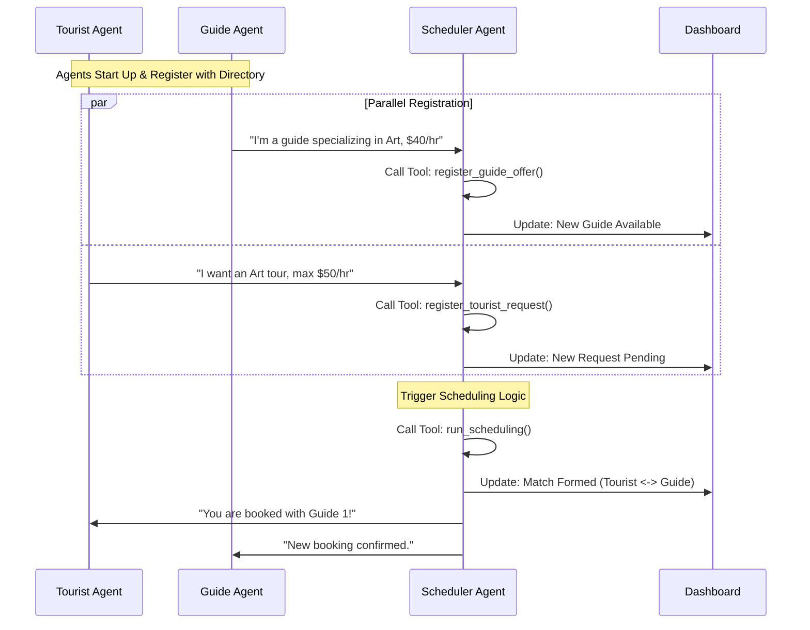

Imagine a travel agency that never sleeps. A world where tourists get personalized itineraries in seconds, guides find the perfect clients instantly, and complex logistics are solved without a single human phone call.

This isn't science fiction—it's the power of **Multi-Agent Systems**. And to prove it, we've built the **Tourist Scheduling System**, a reference implementation that uses Google's **[Agent Development Kit (ADK)](https://google.github.io/adk-docs/)** to turn this vision into code.

In this deep dive, we'll peel back the layers of a fully distributed AI ecosystem. We'll show you how independent agents—representing tourists and guides—negotiate, coordinate, and solve problems in real-time, powered by secure communication and dynamic discovery.

## 🌍 The Concept: A Digital Marketplace

The Tourist Scheduling System models a bustling travel marketplace. Instead of rigid algorithms, we have autonomous agents acting with intent:

*   **Tourist Agents**: The demanding travelers. They have budgets, specific interests (like "Architecture" or "Food"), and tight schedules.
*   **Guide Agents**: The local experts. They have specialties, hourly rates, and limited availability.
*   **Scheduler Agent**: The ultimate matchmaker. It's the central hub that listens to everyone and orchestrates the perfect itinerary.

This goes beyond a simple chat simulation. It's a living, breathing distributed system featuring **Dynamic Service Discovery**, **[Secure Agent-to-Agent (A2A) Communication](https://a2a-protocol.org)** via [Secure Layer for Intelligent Messaging (SLIM)](https://docs.agntcy.org/messaging/slim-core/), and full observability with **[OpenTelemetry](https://opentelemetry.io/)**.

## ⚙️ How It Works: The Agentic Web

We didn't just want agents that chat; we wanted agents that *work*. To achieve this, we combined the intelligence of LLMs with the reliability of distributed systems engineering.

### 1. The Hub-and-Spoke Architecture

The system operates on a hub-and-spoke model. The **Scheduler Agent** sits at the center, not as a dictator, but as a coordinator, managing the flow of information between the transient Tourists and Guides.



### 2. Anatomy of an Agent

Each agent in our system is a specialized Python class inheriting from ADK's `LlmAgent`. But an agent is only as good as its tools.

#### The Scheduler: The Brains of the Operation
The Scheduler Agent (`src/agents/scheduler_agent.py`) is the heavy lifter. Instead of a single prompt doing everything, we equipped it with precise **Tools**:
*   **Request Parser** (`register_tourist_request`): Translates "I want a cheap art tour on Monday" into structured JSON constraints.
*   **Guide Onboarding** (`register_guide_offer`): Registers new guides, capturing their niche expertise and rates.
*   **The Matchmaker** (`run_scheduling`): Executes a greedy matching algorithm that optimizes for budget and interest overlap.
*   **Status Reporter** (`get_schedule_status`): Provides real-time visibility into the system's state.

#### The A2A Protocol
How do these agents find each other?
1.  **Discovery**: No hard-coded IPs here. Agents publish their "Business Cards" to the **Agent Directory** and look up the Scheduler dynamically.
2.  **Transport**: They communicate via the A2A protocol. We use **SLIM** (Secure Real-Time Interactive Messaging) to ensure every message is encrypted and authenticated via MLS. It's like a VIP line for your AI agents.

### 3. The Live Performance

Here is the sequence of events that unfolds when you run the demo:



## 🌟 Why This Matters

We aren't just building chat-bots; we are building **Digital Employees**. The Tourist Scheduling System showcases the pillars of enterprise agentic architecture:

1.  **No Hard-Coding**: Thanks to **Dynamic Discovery**, you can spin up 100 new Guide agents, and the system adapts instantly. No config file updates required.
2.  **Zero-Trust Security**: With **SLIM**, security isn't an afterthought. Every connection is mutually authenticated and encrypted. You know exactly who is talking to whom.
3.  **X-Ray Vision**: Distributed tracing with **Jaeger** lets you see the "thought process" of your entire swarm. Pinpoint latency and debug negotiation failures with surgical precision.
4.  **Human Command Center**: The **Dashboard** keeps humans in the loop, providing a real-time view of the marketplace without requiring micromanagement.

## 🚀 Hands-On: Run the System Locally

Ready to conduct? Getting this system up and running on your local machine is straightforward. We use Docker to host the heavy infrastructure (SLIM, Jaeger, Directory) while running the agents as agile local processes.

### Prerequisites
*   Python 3.12+
*   [UV](https://github.com/astral-sh/uv) package manager
*   Docker
*   An API Key for Azure OpenAI or Google Gemini

### Step 1: Set the Stage

Clone the repository and prepare your environment:

```bash
git clone https://github.com/agntcy/agentic-apps.git
cd agentic-apps/tourist_scheduling_system

# Create virtual environment and install dependencies
uv venv
source .venv/bin/activate
uv sync
```

### Step 2: Configuration

Export your LLM credentials.

**For Google Gemini:**
```bash
export MODEL_PROVIDER="gemini"
export GOOGLE_GEMINI_API_KEY="your-google-api-key"
# Optional: Specify model
export MODEL_NAME="gemini/gemini-3-pro-preview"
```

**Or for Azure OpenAI:**
```bash
export MODEL_PROVIDER="azure"
export AZURE_OPENAI_API_KEY="your-key"
export AZURE_OPENAI_ENDPOINT="https://your-endpoint.openai.azure.com"
export AZURE_OPENAI_DEPLOYMENT_NAME="gpt-4o"
```

### Step 3: Launch

Start the infrastructure and run the demo:

```bash
# Start SLIM transport and Jaeger tracing containers
./setup.sh start

# Run the agents with SLIM transport enabled
source run.sh --transport slim --tracing
```

### Step 4: Visualization (Optional)

While the system provides a basic dashboard at `http://localhost:10021`, you can launch the rich Flutter frontend for a better experience:

```bash
cd frontend
./setup.sh
flutter run -d web-server --web-port 8080
```

Open `http://localhost:8080` to see the live system. Use `http://localhost:16686` to view the distinct traces of their interactions in Jaeger.

## 📁 Project Structure

It's helpful to understand how the project is organized. Here's a look at the key directories:

```
tourist_scheduling_system/
├── src/
│   ├── agents/                  # The core agent logic
│   │   ├── scheduler_agent.py   # The "Brain" - coordinates matches
│   │   ├── ui_agent.py          # Serves the Dashboard
│   │   ├── guide_agent.py       # Simulated guide behavior
│   │   ├── tourist_agent.py     # Simulated tourist behavior
│   │   └── tools.py             # Tools the Scheduler can use
│   └── core/                    # Shared utilities
│       ├── a2a_cards.py         # Agent capability definitions
│       ├── slim_transport.py    # Secure transport logic
│       └── tracing.py           # OpenTelemetry setup
├── scripts/                     # Kubernetes deployment helpers
│   ├── directory.sh             # Deploys Agent Directory
│   ├── spire.sh                 # Deploys SPIRE identity provider
│   └── slim-*.sh                # Deploys SLIM infrastructure
├── deploy/
│   └── k8s/                     # Kubernetes YAML manifests
├── frontend/                    # Flutter-based UI Dashboard code
├── a2a_cards/                   # JSON definitions for agent capabilities
└── oasf_records/                # Directory registration records
```

### Helper Scripts for Local Use

The repository includes a set of bash scripts to simplify this process:

#### `setup.sh`
This is your infrastructure manager. It spins up the necessary containers for SLIM, Jaeger, and the Directory.
*   **Start Infrastructure**: `./setup.sh start`
*   **Stop Infrastructure**: `./setup.sh stop`
*   **Clean Up**: `./setup.sh clean` (removes containers and volumes)

#### `run.sh`
This script launches the actual Multi-Agent System. It runs the Scheduler, Dashboard, and simulated Guides and Tourists.

**Basic Usage:**
```bash
# Run with SLIM secure transport
source run.sh --transport slim

# Run with open HTTP transport
source run.sh --transport http
```

**Advanced Parameters:**
*   `--tracing`: Enable OpenTelemetry tracing (requires `./setup.sh start` first).
*   `--guides N`: Simulate N guide agents (default: 2).
*   `--tourists N`: Simulate N tourist agents (default: 3).
*   `--duration N`: Run the demo for N minutes (0 = run once).
*   `--real-agents`: Use fully autonomous ADK agents instead of simplified simulators.
*   `--provider [azure|google]`: Switch LLM providers dynamically.

**Example: Scale Up Test**
To run a larger simulation with 5 tourists and 5 guides using Gemini Pro, with full tracing:
```bash
source run.sh \
  --transport slim \
  --tracing \
  --guides 5 \
  --tourists 5 \
  --provider google
```
### 🖥️ Running the Frontend (Optional)

For a richer, visual experience, the system includes a modern Flutter-based dashboard.

**Prerequisites:**
*   [Flutter SDK](https://docs.flutter.dev/get-started/install) installed.

**Launch Instructions:**
1.  Ensure the backend agents are running (see above).
2.  Open a new terminal and run:
    ```bash
    cd frontend
    ./setup.sh
    flutter run -d web-server --web-port 8080
    ```
3.  Open `http://localhost:8080` to view the live dashboard.
## 📊 Observability: Logs and Traces

Debugging distributed agents can be challenging. To solve this, the system includes a comprehensive telemetry stack powered by **OpenTelemetry** and **Jaeger**.

### Distributed Tracing

When you enable tracing (via the `--tracing` flag or the SLIM configuration), every agent interaction is recorded as a "span" in a distributed trace.

*   **Global Context**: See the entire request lifecycle, starting from the Tourist's initial request to the Scheduler, through the internal tool calls (`register_tourist_request`), and finally to the Guide's confirmation.
*   **Performance Bottlenecks**: Identify which part of the negotiation process is slow (e.g., latency in LLM generation vs. network transport).
*   **Error Diagnosis**: Pinpoint exactly where a negotiation failed (e.g., did the Guide reject the budget, or did the Scheduler fail to find a match?).

### Structured Logging

In addition to traces, each agent process generates detailed structured logs. These logs capture:
*   **Agent Decisions**: Why did an agent choose a specific tool?
*   **LLM Prompts & Completions**: What exact text was sent to the model and what did it return?
*   **State Changes**: Updates to the schedule, new bookings, and status transitions.

Logs are written to the `logs/` directory locally or streamed to standard output in Docker/Kubernetes environments, making them easy to collect with tools like Fluentd or Promtail.

## 🖥️ Sample Output

When you run the system, you'll see the infrastructure spin up, followed by the agents coming online. The demo runner will then simulate a stream of tourists and guides entering the system.

To generate the output below, we first ensure a clean environment, start the infrastructure, and then execute the demo runner:

```bash
./setup.sh clean
./setup.sh start --tracing
./run.sh --transport slim --tracing --duration 1
```

Here is what a successful run looks like:

```text
[RUN] Inferred MODEL_PROVIDER=azure from AZURE_OPENAI_API_KEY
=======================================================
Tourist Scheduling System
=======================================================
[RUN] Transport: slim
[RUN] Tracing: true
[RUN] Scheduler: http://localhost:10000
[RUN] Dashboard: http://localhost:10021
[RUN] Guides: 2 | Tourists: 3
[RUN] Duration: 1 minutes
[RUN] SLIM: http://localhost:46357
[RUN] Jaeger: http://localhost:16686
=======================================================
[RUN] Starting scheduler agent...
[RUN] Scheduler PID: 54557 -> /Users/lumuscar/Projects/agntcy/agentic-apps/tourist_scheduling_system/scheduler_agent.log
[RUN] Starting dashboard agent...
[RUN] Dashboard PID: 54633 -> /Users/lumuscar/Projects/agntcy/agentic-apps/tourist_scheduling_system/ui_agent.log
[RUN] Waiting for Scheduler on port 10000...
[OK] Scheduler ready
[RUN] Checking Dashboard health...
[OK] Dashboard healthy
=======================================================
[OK] Agents running!
   📊 Dashboard: http://localhost:10021
   🗓️  Scheduler: http://localhost:10000
   🔍 Jaeger: http://localhost:16686

Logs:
   tail -f /Users/lumuscar/Projects/agntcy/agentic-apps/tourist_scheduling_system/scheduler_agent.log
   tail -f /Users/lumuscar/Projects/agntcy/agentic-apps/tourist_scheduling_system/ui_agent.log
=======================================================
[RUN] Running demo simulation...
13:47:29 | INFO | Logs will be written to: /Users/lumuscar/Projects/agntcy/agentic-apps/tourist_scheduling_system/logs
13:47:29 | INFO | OTLP trace exporter configured: http://localhost:4318/v1/traces
13:47:29 | INFO | File trace exporter configured: /Users/lumuscar/Projects/agntcy/agentic-apps/tourist_scheduling_system/traces/traces_20260113_134729.jsonl
13:47:29 | INFO | OpenTelemetry tracing initialized for service: tourist-scheduling-demo
13:47:29 | INFO | OpenTelemetry tracing enabled
======================================================================
🎯 Simulation Mode
======================================================================

Sending demo traffic to running agents:
  • Scheduler: http://localhost:10000
  • Dashboard: http://localhost:10021
  • 2 guides, 3 tourists
  • Duration: 1 minutes


🔄 Iteration 1 (approx 0 min remaining)...
📝 Registering 2 guides...
   🗺️ Guide silvia1_b1: shopping, history, adventure @ $85/hr
   🗺️ Guide elisa2_b1: nightlife @ $95/hr

📝 Registering 3 tourists...
   🧳 Tourist amelia1_b1: wine, museums, architecture @ $175/hr budget
   🧳 Tourist charlotte2_b1: architecture, museums, wine @ $167/hr budget
   🧳 Tourist james3_b1: architecture @ $174/hr budget

🔄 Running scheduling algorithm...
   The scheduling algorithm has successfully completed, resulting in 3 assignments. Here's the summary of the matches made:

1. **Tourist**: amelia1_b1
   - **Guide**: silvia1_b1
   - **Time Window**: 09...
📤 Creating 2 assignments...
   🔗 amelia1_b1 ↔ silvia1_b1
   🔗 charlotte2_b1 ↔ elisa2_b1
   ✅ Sent 2 assignments

📊 Getting final status...
   Here is the current schedule status:

- **Total Tourist Requests:** 3
- **Total Guide Offers:** 2
- **Total Assignments Completed:** 3
- **Tourist Satisfaction:** 100%
- **Guide Utilization:** 50%
- **Pending Tourist Requests:** 0
- **Available Guides:** 1

All tourist requests have been successfull...

✅ Batch 1 complete!
   Dashboard updates: 17 successful, 0 failed
   ⏳ Next iteration in 2.4s...

🔄 Iteration 2 (approx 0 min remaining)...
📝 Registering 2 guides...
   🗺️ Guide riccardo1_b2: shopping @ $100/hr
   🗺️ Guide valentina2_b2: architecture, food, shopping @ $91/hr

📝 Registering 3 tourists...
   🧳 Tourist william1_b2: architecture, entertainment, photography @ $136/hr budget
   🧳 Tourist chloe2_b2: adventure, music, culture @ $102/hr budget
   🧳 Tourist emma3_b2: architecture, entertainment, photography @ $163/hr budget

🔄 Running scheduling algorithm...
   The scheduling algorithm has successfully matched tourists with guides. Here are the results:

1. **Amelia** has been matched with guide **Valentina** from 2025-06-01 09:00 to 17:00 focusing on catego...
📤 Creating 2 assignments...
   🔗 william1_b2 ↔ riccardo1_b2
   🔗 chloe2_b2 ↔ valentina2_b2
   ✅ Sent 2 assignments

📊 Getting final status...
   The current schedule status is as follows:

- **Total Tourists**: 6
- **Total Guides**: 4
- **Total Assignments Completed**: 6
- **Tourist Satisfaction**: 100%
- **Guide Utilization**: 50%
- **Pending Tourist Requests**: 0
- **Available Guides**: 2

All tourist requests have been fulfilled, and ther...

✅ Batch 2 complete!
   Dashboard updates: 17 successful, 0 failed
   ⏳ Next iteration in 2.6s...

🔄 Iteration 3 (approx 0 min remaining)...
📝 Registering 2 guides...
   🗺️ Guide lorenzo1_b3: history, art @ $79/hr
   🗺️ Guide riccardo2_b3: wine, food @ $109/hr

📝 Registering 3 tourists...
   🧳 Tourist benjamin1_b3: music, shopping, photography @ $181/hr budget
   🧳 Tourist luna2_b3: entertainment, architecture, adventure @ $157/hr budget
   🧳 Tourist evelyn3_b3: nightlife, museums, adventure @ $106/hr budget

🔄 Running scheduling algorithm...
   The scheduling algorithm has successfully matched 9 tourists with guides. Here are the details of the assignments:

1. **Tourist ID: amelia1_b1**
   - Guide ID: valentina2_b2
   - Time Window: 2025-06...
📤 Creating 2 assignments...
   🔗 benjamin1_b3 ↔ lorenzo1_b3
   🔗 luna2_b3 ↔ riccardo2_b3
   ✅ Sent 2 assignments

📊 Getting final status...
   Here is the current schedule status:

- **Total Tourist Requests**: 9
- **Total Guide Offers**: 6
- **Total Completed Assignments**: 9
- **Tourist Satisfaction**: 100%
- **Guide Utilization**: 33.3%
- **Pending Tourist Requests**: 0
- **Available Guides**: 4

All tourist requests have been matched, ...

✅ Batch 3 complete!
   Dashboard updates: 17 successful, 0 failed
   ⏳ Next iteration in 4.3s...

⏱️  Duration elapsed!

✅ Simulation complete!
[OK] Demo complete!

[RUN] Dashboard still running at http://localhost:10021
[RUN] Press Ctrl+C to stop agents.
[WARN] Shutting down...
[RUN] Stopping PID 54557
[RUN] Stopping PID 54633
[OK] Stopped
```
### 📸 Dashboard Screenshots

Here is a glimpse of the system in action:


<div style="text-align: center; margin-top: 10px;">
  
</div>

<div style="text-align: center; margin-top: 10px;">
  
</div>

<div style="display: flex; flex-wrap: wrap; gap: 10px; justify-content: center;">
  
  
</div>

## ☸️ Deploying to Kubernetes

Moving from local development to a production-like environment is seamless. The system comes with ready-to-use Kubernetes manifests and helper scripts.

### Deployment Helper Scripts

Located in `scripts/`, these helper scripts automate complex Kubernetes tasks:

*   `scripts/directory.sh`: Deploys the **Agent Directory** via Helm. It handles downloading the chart, configuring persistence, and optionally registering the workload with SPIRE for identity.
*   `scripts/spire.sh`: Installs **SPIRE** (SPIFFE Runtime Environment) to provide secure identities for SLIM. It sets up the Server and Agent (DaemonSet) on your cluster.
*   `scripts/slim-controller.sh` & `scripts/slim-node.sh`: Deploy the **SLIM Control Plane** and **Data Plane**. These scripts manage the necessary `StatefulSets` and config maps to get the secure transport layer running.

To deploy the full dependency stack on a fresh cluster:
```bash
# 1. Identity Infrastructure
./scripts/spire.sh install

# 2. Secure Transport Layer
./scripts/slim-controller.sh install
./scripts/slim-node.sh install

# 3. Service Registry
./scripts/directory.sh install
```

### Prerequisites
*   A running Kubernetes cluster (e.g., MicroK8s, GKE, EKS)
*   `kubectl` configured
*   Container images (or build your own)

### Deployment Steps

1.  **Navigate to the deployment directory**:
    ```bash
    cd deploy/k8s
    ```

2.  **Configure Environment Variables**:
    Set the namespace and image registry details.
    ```bash
    export NAMESPACE=tourist-system
    export IMAGE_REGISTRY=ghcr.io/agntcy/apps
    export IMAGE_TAG=latest
    ```

3.  **Configure Credentials**:
    Create the namespace and export your API keys. The deployment script will read these environment variables and create the Kubernetes secrets for you.
    ```bash
    kubectl create namespace $NAMESPACE

    # For Google Gemini:
    export MODEL_PROVIDER="google"
    export GOOGLE_API_KEY="your-google-api-key"

    # OR for Azure OpenAI:
    export MODEL_PROVIDER="azure"
    export AZURE_OPENAI_API_KEY="your-key"
    export AZURE_OPENAI_ENDPOINT="your-endpoint"
    export AZURE_OPENAI_DEPLOYMENT_NAME="gpt-4o"
    ```

4.  **Deploy**:
    You can deploy using the standard HTTP transport or the secure SLIM transport. To deploy with the default HTTP transport:
    ```bash
    ./deploy.sh http
    ```

    Or, if you have set up the SLIM infrastructure (SPIRE, Controller, Nodes):
    ```bash
    ./deploy.sh slim
    ```

5.  **Scale Agents**:
    Simulate load by spawning multiple tourists and guides:
    ```bash
    ./spawn-agents.sh 5 tourists
    ./spawn-agents.sh 3 guides
    ```

6.  **Access the Dashboard**:
    The deployment automatically spins up the frontend. Retrieve its external address:

    ```bash
    kubectl get svc frontend -n $NAMESPACE
    ```
    Open the provided External-IP in your browser to watch the system in action.

## The Future is Agentic

The Tourist Scheduling System proves that building complex, multi-agent workflows doesn't have to be chaotic. By leveraging standardized protocols like **SLIM** and robust observability tools, we've transformed a complex coordination problem into a structured, scalable system.

This isn't just about scheduling tours. It's about a future where software services don't just wait for API calls—they actively cooperate to solve your problems.

**Ready to start building?** Check out the full source code in the [repository](https://github.com/agntcy/agentic-apps) and join the revolution!
