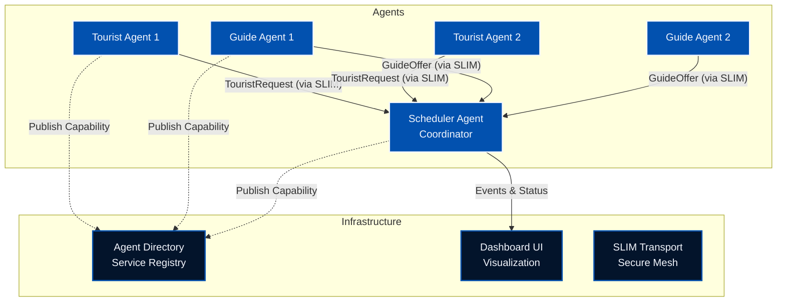

Imagine a travel agency that never sleeps. A world where tourists get
personalized itineraries in seconds, guides find the perfect clients instantly,
and complex logistics are solved without a single human phone call.

This isn't science fiction—it's the power of **Multi-Agent Systems**. And to
prove it, we've built the **Tourist Scheduling System**, a reference
implementation that uses Google's **[Agent Development Kit
(ADK)](https://google.github.io/adk-docs/)** to turn this vision into code.

In this deep dive, we'll peel back the layers of a fully distributed AI
ecosystem. We'll show you how independent agents—representing tourists and
guides—negotiate, coordinate, and solve problems in real-time, powered by secure
communication and dynamic discovery.

## 🌍 The Concept: A Digital Marketplace

The Tourist Scheduling System models a bustling travel marketplace. Instead of
rigid algorithms, we have autonomous agents acting with intent:

* **Tourist Agents**: The demanding travelers. They have budgets, specific interests (like "Architecture" or "Food"), and tight schedules.
* **Guide Agents**: The local experts. They have specialties, hourly rates, and limited availability.
* **Scheduler Agent**: The ultimate matchmaker. It's the central hub that listens to everyone and orchestrates the perfect itinerary.

This goes beyond a simple chat simulation. It's a living, breathing distributed
system featuring **Dynamic Service Discovery**, **[Secure Agent-to-Agent (A2A)
Communication](https://a2a-protocol.org)** via [Secure Low Latency Interactive
Messaging (SLIM)](https://docs.agntcy.org/messaging/slim-core/), and full
observability with **[OpenTelemetry](https://opentelemetry.io/)**.

## ⚙️ How It Works: The Internet of Agents

We didn't just want agents that chat; we wanted agents that *work*. To achieve
this, we combined  LLMs with the reliability of distributed
systems engineering.

### 1. The Hub-and-Spoke Architecture

The system operates on a hub-and-spoke model. The **Scheduler Agent** sits at
the center, not as a dictator, but as a coordinator, managing the flow of
information between the transient Tourists and Guides.



### 2. Anatomy of an Agent

Each agent in our system is a specialized Python class inheriting from [ADK](https://github.com/google/adk-python)'s
`LlmAgent`. But an agent is only as good as its tools.

#### The Scheduler: The Brains of the Operation

The Scheduler Agent (`src/agents/scheduler_agent.py`) is the heavy lifter.
Instead of a single prompt doing everything, we equipped it with precise
**Tools**:

* **Request Parser** (`register_tourist_request`): Translates "I want a cheap art tour on Monday" into structured JSON constraints.
* **Guide Onboarding** (`register_guide_offer`): Registers new guides, capturing their niche expertise and rates.
* **The Matchmaker** (`run_scheduling`): Executes a greedy matching algorithm that optimizes for budget and interest overlap.
* **Status Reporter** (`get_schedule_status`): Provides real-time visibility into the system's state.

#### The Dashboard Agent: The Face

While the Scheduler handles the logic, the **Dashboard Agent**
(`src/agents/ui_agent.py`) translates the system's state for human consumption.
It communicates with the Flutter frontend using the **[A2UI
(Agent-to-UI)](https://github.com/google/A2UI)** protocol. This standardizes
how agents stream generative UI components to client applications, allowing for
dynamic, rich interfaces that update in real-time.

#### The A2A Protocol

How do these agents find each other?

1. **Discovery**: No hard-coded IPs here. Agents publish their "Business Cards" to the **[Agent Directory](https://github.com/agntcy/dir)** and look up the Scheduler dynamically.
2. **Transport**: They communicate via the [A2A protocol](https://github.com/a2aproject/a2a-python). We use **[SLIM](https://github.com/agntcy/slim)** to ensure every message is encrypted and authenticated via MLS. It's like a VIP line for your AI agents.

### 3. The Live Performance

Here is the sequence of events that unfolds when you run the demo:


## 🛠️ Under the Hood: The Code

The full source code for this demo is available in the **[Tourist Scheduling
System
repository](https://github.com/agntcy/agentic-apps/tree/main/tourist_scheduling_system)**.
Let's look at the actual code powering these agents. Using the **Google ADK**,
we can define agents that are both autonomous and collaborative, interacting via
well-defined interfaces.

### 1. Giving Agents Skills (Server-Side)

By giving the LLM agency through tools, we transform it from a passive chatbot
into an active system controller capable of executing complex business logic
deterministically.

The **Scheduler Agent** isn't just a text generator; it's a function caller. We
give it specific `tools`—Python functions that modify the system state (like
registering a request or running the matching algorithm). The LLM determines
*when* and *how* to call them based on the conversation context.

```python
# From src/agents/scheduler_agent.py

from google.adk.agents.llm_agent import LlmAgent
# We import the actual python functions that perform the business logic
from src.agents.tools import (
    register_tourist_request,
    register_guide_offer,
    run_scheduling,
    get_schedule_status,
    clear_scheduler_state
)

def get_scheduler_agent(model_config, ...):
    scheduler_agent = LlmAgent(
        model=LiteLlm(model_config),
        # We explicitly pass the tools this agent can use
        tools=[
            register_tourist_request,
            register_guide_offer,
            run_scheduling,
            get_schedule_status,
            clear_scheduler_state
        ],
        # System instructions guide the agent on tool usage
        system_instructions=SCHEDULER_INSTRUCTIONS,
        # ...
    )
    return scheduler_agent
```

### 2. Auto-Discovery with RemoteA2aAgent (Client-Side)

This abstraction decouples the agent's logic from network complexity. The agent
simply expresses an intent to communicate, and the framework handles the
underlying discovery, transport negotiation, and message routing, whether over
local HTTP or a secure mesh.

How does a Tourist Agent know how to "talk" to the Scheduler? It uses the
`RemoteA2aAgent`. This class handles the **discovery** of the remote agent's
capabilities (via its Agent Card) and facilitates the conversation.

In **HTTP mode**, discovery is direct via a URL. In **SLIM mode**, discovery
works via a topic string, allowing for location-transparent routing over the
secure mesh.

```python
# From src/agents/tourist_agent.py
from google.adk.agents.remote_a2a_agent import RemoteA2aAgent

async def create_tourist_agent(...):
    # Determine how to find the scheduler based on transport mode
    if transport_mode == "http":
        scheduler_url = os.getenv("SCHEDULER_URL", "http://localhost:8000")
        agent_card = f"{scheduler_url.rstrip('/')}/.well-known/agent-card.json"
    else:
        # For SLIM, we use a minimal card with the topic string
        scheduler_topic = os.getenv("SCHEDULER_SLIM_TOPIC", "agntcy/tourist_scheduling/scheduler/0")
        agent_card = minimal_slim_agent_card(scheduler_topic)

    # The RemoteA2aAgent acts as a proxy for the remote scheduler
    scheduler_agent = RemoteA2aAgent(
        agent_card=agent_card,
        client=client,  # HTTP or SLIM client
        # ...
    )

    # We add the remote scheduler as a "sub-agent" so the tourist can call it
    tourist_agent.add_sub_agent("scheduler", scheduler_agent)
    return tourist_agent
```

### 3. The Data Contracts (A2A Agent Card)

Protocols only work if everyone agrees on the data format. This JSON document is
the "Business Card" of the agent. It defines the `skills` (what it can do) and
the inputs/outputs it expects.

```json
/* a2a_cards/guide_agent.json */
{
  "name": "Tour Guide Agent",
  "skills": [
    {
      "id": "offer_tour",
      "name": "Offer Tour Services",
      "description": "Submits a tour offer to the scheduler...",
      "inputModes": ["text/plain"],
      "outputModes": ["text/plain"]
    }
  ],
  "capabilities": {
    "streaming": false,
    "stateTransitionHistory": false
  }
}
```

### 4. Joining the Secure Mesh (SLIM)

Security is often the hardest part of distributed systems. SLIM abstracts this
away by providing a "dial-tone" for secure messaging. By simply initializing
this client, the agent automatically gains mutual authentication and end-to-end
encryption without managing complex certificate chains manually.

When running in **SLIM mode**, we need to configure the secure transport. This
snippet shows how the Tourist Agent initializes its connection to the secure
mesh using a `SLIMConfig` tailored with a unique local ID. This establishes the
MLS context for secure A2A checks.

```python
# From src/agents/tourist_agent.py
from src.core.slim_transport import SLIMConfig, create_slim_client_factory
from google.adk.agents.remote_a2a_agent import RemoteA2aAgent

async def run_tourist_agent(local_id: str):
    # ...
    # 1. Initialize SLIM Client
    if transport_mode == "slim":
        # Configure the Secure Layer for Intelligent Messaging
        config = SLIMConfig(
            server_address=os.getenv("SLIM_SERVER_ADDRESS", "127.0.0.1:3000"),
            local_id=local_id,  # Unique ID for this specific tourist instance
            connect_timeout=10.0
        )
        # Create an encrypted, authenticated client factory
        client_factory = await create_slim_client_factory(config)

    # 2. Use it in RemoteA2aAgent
    # The A2A loop now happens over the encrypted SLIM mesh
    scheduler_remote = RemoteA2aAgent(
        agent_card=minimal_slim_agent_card(scheduler_topic),
        a2a_client_factory=client_factory,  # Inject the secure transport factory
        # ...
    )

    # 3. Agents communicate securely by default
    response = await tourist_agent.send_message(
        "I need a tour guide...",
        connection=scheduler_remote
    )
    # ...
```

### 5. Publishing to the Directory

In a dynamic ecosystem, static configuration files are brittle. By publishing
their capabilities to a central Directory, agents become instantly discoverable
to the entire fleet, enabling a truly scalable and self-organizing marketplace.

Before any discovery can happen, agents must announce themselves. We use the
**Agent Directory SDK** to publish a **Directory Record** (often called an
**Agent Card** in the context of the directory). Note that this is distinct from
the **A2A Agent Card** mentioned earlier; while the A2A Card defines the
protocol interface, this Directory Record serves as the **registration entry**
used for lookup and routing.

```python
# from publish_card.py
from agntcy.dir_sdk.client import Client
from agntcy.dir_sdk.models import core_v1, routing_v1
from google.protobuf.struct_pb2 import Struct
from google.protobuf.json_format import ParseDict

def publish_card(card_data: dict):
    # Initialize the Directory Client (defaults to localhost:8888)
    client = Client()

    # 1. Wrap the card JSON in a Record structure
    data_struct = Struct()
    ParseDict(card_data, data_struct)
    record = core_v1.Record(data=data_struct)

    # 2. Push the record to the immutable store
    # This returns a Content ID (CID) for the unique data blob
    refs = client.push([record])
    cid = refs[0].cid

    # 3. Publish the CID to the routing table
    # This makes the agent discoverable by its UUID or alias
    pub_req = routing_v1.PublishRequest(
        record_refs=routing_v1.RecordRefs(
            refs=[core_v1.RecordRef(cid=cid)]
        )
    )
    client.publish(pub_req)
    print(f"Agent successfully published with CID: {cid}")
```

The Directory provides more than just discovery—it provides **Trust**. Built on
top of an **[OCI (Open Container Initiative)](https://opencontainers.org/)**
compliant registry, it employs **sigstore-based provenance**. Crucially, the
record itself remains lightweight; signatures and public keys are linked to the
record using **OCI referrers**. This allows consuming agents to cryptographically
verify the origin and integrity of the service they are about to contact,
preventing spoofing attacks in the open mesh.

### 6. Pulling Cards from the Directory

This runtime lookup capability is what makes the system resilient. Agents can
come and go, change IPs, or update their pricing, and their peers will always
find the most up-to-date connection details via the Directory.

Conversely, when an agent needs to find a peer, it can query the Directory
instead of relying on local config files. This snippet demonstrates searching
for an agent by its published name to retrieve its live Agent Card.

```python
# From src/core/a2a_cards.py
from agntcy.dir_sdk.client import Client
from agntcy.dir_sdk.models import search_v1
from google.protobuf.json_format import MessageToDict

def fetch_agent_card(agent_name: str):
    client = Client()

    # Search for the record by its 'name' field
    query = search_v1.RecordQuery(
        type=search_v1.RECORD_QUERY_TYPE_NAME,
        value=agent_name  # e.g., "Tourist Scheduling Coordinator"
    )

    # Execute the search
    req = search_v1.SearchRecordsRequest(queries=[query], limit=1)
    results = client.search_records(req)

    if results:
        record = results[0].record
        # Convert the protobuf Struct back to a Python dict
        card_data = MessageToDict(record.data)
        print(f"Found card for {agent_name}: {card_data}")
        return card_data

    return None
```

### 7. The Conversation: Agents in Action

How do these agents actually talk to each other? Let's look at the two main
communication patterns in the system.

**1. Client-Server Pattern (Tourist → Scheduler)**

The Tourist Agent treats the Scheduler as a "sub-agent." It doesn't need to know
the low-level details of HTTP or SLIM; it just knows the Scheduler is a helpful
entity it can talk to.

```python
# From src/agents/tourist_agent.py

# 1. We create a proxy for the remote Scheduler Agent
scheduler_remote = RemoteA2aAgent(
    name="scheduler",
    description="The tourist scheduling coordinator that handles tour requests",
    # The 'agent_card' tells us HOW to connect (URL or SLIM topic)
    agent_card=agent_card,
    client=client,
)

# 2. We add it as a sub-agent to the Tourist
tourist_agent = LlmAgent(
    name=f"tourist_{tourist_id}",
    instruction="You are a tourist... communicate with the scheduler sub-agent.",
    sub_agents=[scheduler_remote],
)
```

**2. Fire-and-Forget Pattern (Scheduler → UI Agent)**

When the Scheduler processes a request, it pushes real-time updates to the
Dashboard (UI Agent). This allows the frontend to react instantly—drawing new
nodes on the graph or updating the schedule view—without the Scheduler waiting
for a response.

```python
# From src/agents/tools.py

def register_tourist_request(tourist_id, preferences, ...):
    # 1. Update internal state
    request = TouristRequest(tourist_id=tourist_id, ...)
    _scheduler_state.tourist_requests.append(request)

    # 2. Notify the UI Agent immediately
    # This sends a raw event that the UI Agent converts into visual elements
    send_to_ui_agent({
        "type": "tourist_request",
        "tourist_id": tourist_id,
        "preferences": preferences,
        "budget": budget,
        "availability": {
            "start": availability_start,
            "end": availability_end,
        }
    })

    return {"status": "registered"}
```

### 8. The UI Protocol (A2UI)

Instead of hardcoding widgets, the Dashboard Agent streams "Generative UI"
updates. This schema defines valid operations like `render`, `update`, or
`append`, allowing the frontend to dynamically construct the view based on the
agent's internal state.

```python
# src/agents/a2ui_schema.py
A2UI_SCHEMA = """
{
  "type": "array",
  "items": {
    "type": "object",
    "properties": {
      "operation": {
        "type": "string",
        "enum": ["render", "update", "append", "delete"]
      },
      "componentName": { "type": "string" },
      "data": { "type": "object" }
    },
    "required": ["operation"]
  }
}
"""
```

## 🌟 Why This Matters

1. **Decoupled Architecture**: Agents don’t need to know *where* other agents are running, just *what* they can do.
2. **Secure Communication**: **SLIM** ensures that every message is encrypted and authenticated. You know exactly who is talking to whom.
3. **X-Ray Vision**: Distributed tracing with **Jaeger** lets you see the "thought process" of your entire swarm. Pinpoint latency and debug negotiation failures with surgical precision.
4. **Human Command Center**: The **Dashboard** keeps humans in the loop, providing a real-time view of the marketplace without requiring micromanagement.

## 🚀 Hands-On: Run the System Locally

Ready to conduct? Getting this system up and running on your local machine is
straightforward. We use Docker to host the heavy infrastructure (SLIM, Jaeger,
Directory) while running the agents as agile local processes.

### Prerequisites

* Python 3.12+
* [UV](https://github.com/astral-sh/uv) package manager
* Docker
* An API Key for Azure OpenAI or Google Gemini

### Step 1: Set the Stage

Clone the repository and prepare your environment:

```bash
git clone https://github.com/agntcy/agentic-apps.git
cd agentic-apps/tourist_scheduling_system

# Create virtual environment and install dependencies
uv venv
source .venv/bin/activate
uv sync
```

### Step 2: Configuration

Export your LLM credentials.

**For Google Gemini:**

```bash
export MODEL_PROVIDER="gemini"
export GOOGLE_GEMINI_API_KEY="your-google-api-key"
# Optional: Specify model
export MODEL_NAME="gemini/gemini-3-pro-preview"
```

**Or for Azure OpenAI:**

```bash
export MODEL_PROVIDER="azure"
export AZURE_OPENAI_API_KEY="your-key"
export AZURE_OPENAI_ENDPOINT="https://your-endpoint.openai.azure.com"
export AZURE_OPENAI_DEPLOYMENT_NAME="gpt-4o"
```

### Step 3: Launch

Start the infrastructure and run the demo:

```bash
# Start SLIM transport and Jaeger tracing containers
./setup.sh start

# Run the agents with SLIM transport enabled
source run.sh --transport slim --tracing
```

### Step 4: Visualization (Optional)

While the system provides a basic dashboard at `http://localhost:10021`, you can
launch the rich Flutter frontend for a better experience:

```bash
cd frontend
./setup.sh
flutter run -d web-server --web-port 8080
```

Open `http://localhost:8080` to see the live system. Use
`http://localhost:16686` to view the distinct traces of their interactions in
Jaeger.

## 📁 Project Structure

It's helpful to understand how the project is organized. Here's a look at the
key directories:

```text
tourist_scheduling_system/
├── src/
│   ├── agents/                  # The core agent logic
│   │   ├── scheduler_agent.py   # The "Brain" - coordinates matches
│   │   ├── ui_agent.py          # Serves the Dashboard
│   │   ├── guide_agent.py       # Simulated guide behavior
│   │   ├── tourist_agent.py     # Simulated tourist behavior
│   │   └── tools.py             # Tools the Scheduler can use
│   └── core/                    # Shared utilities
│       ├── a2a_cards.py         # Agent capability definitions
│       ├── slim_transport.py    # Secure transport logic
│       └── tracing.py           # OpenTelemetry setup
├── scripts/                     # Kubernetes deployment helpers
│   ├── directory.sh             # Deploys Agent Directory
│   ├── spire.sh                 # Deploys SPIRE identity provider
│   └── slim-*.sh                # Deploys SLIM infrastructure
├── deploy/
│   └── k8s/                     # Kubernetes YAML manifests
├── frontend/                    # Flutter-based UI Dashboard code
├── a2a_cards/                   # JSON definitions for agent capabilities
└── oasf_records/                # Directory registration records
```

### Helper Scripts for Local Use

The repository includes a set of bash scripts to simplify this process:

#### `setup.sh`

This is your infrastructure manager. It spins up the necessary containers for
SLIM, Jaeger, and the Directory.

* **Start Infrastructure**: `./setup.sh start`
* **Stop Infrastructure**: `./setup.sh stop`
* **Clean Up**: `./setup.sh clean` (removes containers and volumes)

#### `run.sh`

This script launches the actual Multi-Agent System. It runs the Scheduler,
Dashboard, and simulated Guides and Tourists.

**Basic Usage:**

```bash
# Run with SLIM secure transport
source run.sh --transport slim

# Run with open HTTP transport
source run.sh --transport http
```

**Advanced Parameters:**

* `--tracing`: Enable OpenTelemetry tracing (requires `./setup.sh start` first).
* `--guides N`: Simulate N guide agents (default: 2).
* `--tourists N`: Simulate N tourist agents (default: 3).
* `--duration N`: Run the demo for N minutes (0 = run once).
* `--real-agents`: Use fully autonomous ADK agents instead of simplified simulators.
* `--provider [azure|google]`: Switch LLM providers dynamically.

**Example: Scale Up Test**
To run a larger simulation with 5 tourists and 5 guides using Gemini Pro, with
full tracing:

```bash
source run.sh \
  --transport slim \
  --tracing \
  --guides 5 \
  --tourists 5 \
  --provider google
```

### 🖥️ Running the Frontend (Optional)

For a richer, visual experience, the system includes a modern Flutter-based
dashboard.

**Prerequisites:**

* [Flutter SDK](https://docs.flutter.dev/get-started/install) installed.

**Launch Instructions:**

1. Ensure the backend agents are running (see above).
2. Open a new terminal and run:

    ```bash
    cd frontend
    ./setup.sh
    flutter run -d web-server --web-port 8080
    ```

3. Open `http://localhost:8080` to view the live dashboard.

## 📊 Observability: Logs and Traces

Debugging distributed agents can be challenging. To solve this, the system
includes a comprehensive telemetry stack powered by **OpenTelemetry** and
**Jaeger**.

### Distributed Tracing

When you enable tracing (via the `--tracing` flag or the SLIM configuration),
every agent interaction is recorded as a "span" in a distributed trace.

* **Global Context**: See the entire request lifecycle, starting from the Tourist's initial request to the Scheduler, through the internal tool calls (`register_tourist_request`), and finally to the Guide's confirmation.
* **Performance Bottlenecks**: Identify which part of the negotiation process is slow (e.g., latency in LLM generation vs. network transport).
* **Error Diagnosis**: Pinpoint exactly where a negotiation failed (e.g., did the Guide reject the budget, or did the Scheduler fail to find a match?).

### Structured Logging

In addition to traces, each agent process generates detailed structured logs.
These logs capture:

* **Agent Decisions**: Why did an agent choose a specific tool?
* **LLM Prompts & Completions**: What exact text was sent to the model and what did it return?
* **State Changes**: Updates to the schedule, new bookings, and status transitions.

Logs are written to the `logs/` directory locally or streamed to standard output
in Docker/Kubernetes environments, making them easy to collect with tools like
Fluentd or Promtail.

## 🖥️ Sample Output

When you run the system, you'll see the infrastructure spin up, followed by the
agents coming online. The demo runner will then simulate a stream of tourists
and guides entering the system.

To generate the output below, we first ensure a clean environment, start the
infrastructure, and then execute the demo runner:

```bash
./setup.sh clean
./setup.sh start --tracing
./run.sh --transport slim --tracing --duration 1
```

Here is what a successful run looks like. In the log output below, you can see
the startup sequence of the Scheduler and Dashboard, followed by the "Simulation
Mode" where simulated Tourists and Guides register themselves and begin
negotiating bookings in real-time.

```text
[RUN] Inferred MODEL_PROVIDER=azure from AZURE_OPENAI_API_KEY
=======================================================
Tourist Scheduling System
=======================================================
[RUN] Transport: slim
[RUN] Tracing: true
[RUN] Scheduler: http://localhost:10000
[RUN] Dashboard: http://localhost:10021
[RUN] Guides: 2 | Tourists: 3
[RUN] Duration: 1 minutes
[RUN] SLIM: http://localhost:46357
[RUN] Jaeger: http://localhost:16686
=======================================================
[RUN] Starting scheduler agent...
[RUN] Scheduler PID: 54557 -> /Users/lumuscar/Projects/agntcy/agentic-apps/tourist_scheduling_system/scheduler_agent.log
[RUN] Starting dashboard agent...
[RUN] Dashboard PID: 54633 -> /Users/lumuscar/Projects/agntcy/agentic-apps/tourist_scheduling_system/ui_agent.log
[RUN] Waiting for Scheduler on port 10000...
[OK] Scheduler ready
[RUN] Checking Dashboard health...
[OK] Dashboard healthy
=======================================================
[OK] Agents running!
   📊 Dashboard: http://localhost:10021
   🗓️  Scheduler: http://localhost:10000
   🔍 Jaeger: http://localhost:16686

Logs:
   tail -f /Users/lumuscar/Projects/agntcy/agentic-apps/tourist_scheduling_system/scheduler_agent.log
   tail -f /Users/lumuscar/Projects/agntcy/agentic-apps/tourist_scheduling_system/ui_agent.log
=======================================================
[RUN] Running demo simulation...
13:47:29 | INFO | Logs will be written to: /Users/lumuscar/Projects/agntcy/agentic-apps/tourist_scheduling_system/logs
13:47:29 | INFO | OTLP trace exporter configured: http://localhost:4318/v1/traces
13:47:29 | INFO | File trace exporter configured: /Users/lumuscar/Projects/agntcy/agentic-apps/tourist_scheduling_system/traces/traces_20260113_134729.jsonl
13:47:29 | INFO | OpenTelemetry tracing initialized for service: tourist-scheduling-demo
13:47:29 | INFO | OpenTelemetry tracing enabled
======================================================================
🎯 Simulation Mode
======================================================================

Sending demo traffic to running agents:
  • Scheduler: http://localhost:10000
  • Dashboard: http://localhost:10021
  • 2 guides, 3 tourists
  • Duration: 1 minutes


🔄 Iteration 1 (approx 0 min remaining)...
📝 Registering 2 guides...
   🗺️ Guide silvia1_b1: shopping, history, adventure @ $85/hr
   🗺️ Guide elisa2_b1: nightlife @ $95/hr

📝 Registering 3 tourists...
   🧳 Tourist amelia1_b1: wine, museums, architecture @ $175/hr budget
   🧳 Tourist charlotte2_b1: architecture, museums, wine @ $167/hr budget
   🧳 Tourist james3_b1: architecture @ $174/hr budget

🔄 Running scheduling algorithm...
   The scheduling algorithm has successfully completed, resulting in 3 assignments. Here's the summary of the matches made:

1. **Tourist**: amelia1_b1
   - **Guide**: silvia1_b1
   - **Time Window**: 09...
📤 Creating 2 assignments...
   🔗 amelia1_b1 ↔ silvia1_b1
   🔗 charlotte2_b1 ↔ elisa2_b1
   ✅ Sent 2 assignments

📊 Getting final status...
   Here is the current schedule status:

- **Total Tourist Requests:** 3
- **Total Guide Offers:** 2
- **Total Assignments Completed:** 3
- **Tourist Satisfaction:** 100%
- **Guide Utilization:** 50%
- **Pending Tourist Requests:** 0
- **Available Guides:** 1

All tourist requests have been successfull...

✅ Batch 1 complete!
   Dashboard updates: 17 successful, 0 failed
   ⏳ Next iteration in 2.4s...

🔄 Iteration 2 (approx 0 min remaining)...
📝 Registering 2 guides...
   🗺️ Guide riccardo1_b2: shopping @ $100/hr
   🗺️ Guide valentina2_b2: architecture, food, shopping @ $91/hr

📝 Registering 3 tourists...
   🧳 Tourist william1_b2: architecture, entertainment, photography @ $136/hr budget
   🧳 Tourist chloe2_b2: adventure, music, culture @ $102/hr budget
   🧳 Tourist emma3_b2: architecture, entertainment, photography @ $163/hr budget

🔄 Running scheduling algorithm...
   The scheduling algorithm has successfully matched tourists with guides. Here are the results:

1. **Amelia** has been matched with guide **Valentina** from 2025-06-01 09:00 to 17:00 focusing on catego...
📤 Creating 2 assignments...
   🔗 william1_b2 ↔ riccardo1_b2
   🔗 chloe2_b2 ↔ valentina2_b2
   ✅ Sent 2 assignments

📊 Getting final status...
   The current schedule status is as follows:

- **Total Tourists**: 6
- **Total Guides**: 4
- **Total Assignments Completed**: 6
- **Tourist Satisfaction**: 100%
- **Guide Utilization**: 50%
- **Pending Tourist Requests**: 0
- **Available Guides**: 2

All tourist requests have been fulfilled, and ther...

✅ Batch 2 complete!
   Dashboard updates: 17 successful, 0 failed
   ⏳ Next iteration in 2.6s...

🔄 Iteration 3 (approx 0 min remaining)...
📝 Registering 2 guides...
   🗺️ Guide lorenzo1_b3: history, art @ $79/hr
   🗺️ Guide riccardo2_b3: wine, food @ $109/hr

📝 Registering 3 tourists...
   🧳 Tourist benjamin1_b3: music, shopping, photography @ $181/hr budget
   🧳 Tourist luna2_b3: entertainment, architecture, adventure @ $157/hr budget
   🧳 Tourist evelyn3_b3: nightlife, museums, adventure @ $106/hr budget

🔄 Running scheduling algorithm...
   The scheduling algorithm has successfully matched 9 tourists with guides. Here are the details of the assignments:

1. **Tourist ID: amelia1_b1**
   - Guide ID: valentina2_b2
   - Time Window: 2025-06...
📤 Creating 2 assignments...
   🔗 benjamin1_b3 ↔ lorenzo1_b3
   🔗 luna2_b3 ↔ riccardo2_b3
   ✅ Sent 2 assignments

📊 Getting final status...
   Here is the current schedule status:

- **Total Tourist Requests**: 9
- **Total Guide Offers**: 6
- **Total Completed Assignments**: 9
- **Tourist Satisfaction**: 100%
- **Guide Utilization**: 33.3%
- **Pending Tourist Requests**: 0
- **Available Guides**: 4

All tourist requests have been matched, ...

✅ Batch 3 complete!
   Dashboard updates: 17 successful, 0 failed
   ⏳ Next iteration in 4.3s...

⏱️  Duration elapsed!

✅ Simulation complete!
[OK] Demo complete!

[RUN] Dashboard still running at http://localhost:10021
[RUN] Press Ctrl+C to stop agents.
[WARN] Shutting down...
[RUN] Stopping PID 54557
[RUN] Stopping PID 54633
[OK] Stopped
```

### 📸 Dashboard Screenshots

The dashboard provides a real-time window into the agent marketplace.

**1. The Live Graph View**: This view visualizes the active agents (Tourists,
*Guides, Scheduler) and the messages flowing between them. The lines animate to
*show the negotiation process as it happens.

<div style="text-align: center; margin-top: 10px;">
  
</div>

<div style="text-align: center; margin-top: 10px;">
  
</div>

<div style="display: flex; flex-wrap: wrap; gap: 10px; justify-content: center;">
  
  
</div>

## ☸️ Deploying to Kubernetes

Moving from local development to a production-like environment is seamless. The
system comes with ready-to-use Kubernetes manifests and helper scripts.

### Deployment Helper Scripts

Located in `scripts/`, these helper scripts automate complex Kubernetes tasks:

* `scripts/directory.sh`: Deploys the **Agent Directory** via Helm. It handles downloading the chart, configuring persistence, and optionally registering the workload with SPIRE for identity.
* `scripts/spire.sh`: Installs **SPIRE** (SPIFFE Runtime Environment) to provide secure identities for SLIM. It sets up the Server and Agent (DaemonSet) on your cluster.
* `scripts/slim-controller.sh` & `scripts/slim-node.sh`: Deploy the **SLIM Control Plane** and **Data Plane**. These scripts manage the necessary `StatefulSets` and config maps to get the secure transport layer running.

To deploy the full dependency stack on a fresh cluster:

```bash
# 1. Identity Infrastructure
./scripts/spire.sh install

# 2. Secure Transport Layer
./scripts/slim-controller.sh install
./scripts/slim-node.sh install

# 3. Service Registry
./scripts/directory.sh install
```

### Prerequisites

* A running Kubernetes cluster (e.g., MicroK8s, GKE, EKS)
* `kubectl` configured
* Container images (or build your own)

### Deployment Steps

1. **Navigate to the deployment directory**:

    ```bash
    cd deploy/k8s
    ```

2. **Configure Environment Variables**:

    Set the namespace and image registry details.

    ```bash
    export NAMESPACE=tourist-system
    export IMAGE_REGISTRY=ghcr.io/agntcy/apps
    export IMAGE_TAG=latest
    ```

3. **Configure Credentials**:

    Create the namespace and export your API keys. The deployment script will
    read these environment variables and create the Kubernetes secrets for you.

    ```bash
    kubectl create namespace $NAMESPACE

    # For Google Gemini:
    export MODEL_PROVIDER="google"
    export GOOGLE_API_KEY="your-google-api-key"

    # OR for Azure OpenAI:
    export MODEL_PROVIDER="azure"
    export AZURE_OPENAI_API_KEY="your-key"
    export AZURE_OPENAI_ENDPOINT="your-endpoint"
    export AZURE_OPENAI_DEPLOYMENT_NAME="gpt-4o"
    ```

4. **Deploy**:

    You can deploy using the standard HTTP transport or the secure SLIM
    transport. To deploy with the default HTTP transport:

    ```bash
    ./deploy.sh http
    ```

    Or, if you have set up the SLIM infrastructure (SPIRE, Controller, Nodes):

    ```bash
    ./deploy.sh slim
    ```

5. **Scale Agents**:

    Simulate load by spawning multiple tourists and guides:

    ```bash
    ./spawn-agents.sh 5 tourists
    ./spawn-agents.sh 3 guides
    ```

6. **Access the Dashboard**:

    The deployment automatically spins up the frontend. Retrieve its external
    address:

    ```bash
    kubectl get svc frontend -n $NAMESPACE
    ```

    Open the provided External-IP in your browser to watch the system in action.

### 📊 Real-world Deployment

When deployed to a cluster, the system efficiently manages dozens of concurrent
agent processes.

**Test Environment:**

The following metrics and logs were captured from a deployment on a **6-node
Kubernetes cluster** (Nodes `tf-node-0` through `tf-node-5`).

In this topology:

* **SLIM DaemonSet**: A `slim-node` pod runs on every worker node, providing a local, low-latency secure gateway for any agent scheduled on that machine.
* **Agent Distribution**: Guide and Tourist agents are scheduled across the fleet, communicating seamlessly over the mesh regardless of their physical location.

To demonstrate the reproducibility of the environment, we first perform a full
cleanup and re-deployment of the core infrastructure.

**1. Infrastructure Cleanup & Installation:**

We start by cleaning up any existing resources to ensure a fresh state. We
execute the following commands to remove previous agent jobs, the application
deployment, and the infrastructure layers:

```bash
# Clean up agent jobs and application deployment
./deploy/k8s/spawn-agents.sh clean
./deploy/k8s/deploy.sh clean

# Clean up core infrastructure
./scripts/directory.sh uninstall
./scripts/slim-controller.sh uninstall
```

**Agent Directory Cleanup:**

```text
[WARN] Cleaning up all Agent Directory resources in namespace lumuscar-jobs...
[INFO] Uninstalling Helm release dir...
release "dir" uninstalled
[INFO] Removing Helm release secrets...
[INFO] Cleanup complete
```

**SLIM Controller Cleanup:**

```text
[WARN] Cleaning up all SLIM controller resources in namespace lumuscar-jobs...
[INFO] Uninstalling Helm release slim-controller...
release "slim-controller" uninstalled
[INFO] Removing Helm release secrets...
[INFO] Cleanup complete
```

**Agent Directory Installation:**

```text
[INFO] Installing Agent Directory in namespace lumuscar-jobs...
[INFO] Installing new release...
NAME: dir
STATUS: deployed
DESCRIPTION: Install complete
[INFO] Waiting for Agent Directory to be ready...
deployment "dir-apiserver" successfully rolled out
```

**SLIM Controller Installation:**

```text
[INFO] Installing SLIM controller in namespace lumuscar-jobs...
[INFO] Installing new release...
NAME: slim-controller
STATUS: deployed
DESCRIPTION: Install complete
[INFO] Waiting for SLIM controller to be ready...
deployment "slim-control" successfully rolled out
```

**2. Application Deployment:**

With the infrastructure ready, we deploy the Tourist Scheduling System agents
using the SLIM transport.

```text
[INFO] Deploying Tourist Scheduling System with SLIM transport...
[INFO] Namespace: lumuscar-jobs
[INFO] Deploying scheduler agent...
deployment.apps/scheduler-agent created
service/scheduler-agent created
[INFO] Deploying UI dashboard agent...
deployment.apps/ui-dashboard-agent created
[INFO] Deployment complete with SLIM transport!
[INFO] Agents will communicate via SLIM gateway at:
[INFO]   Host: slim-node
[INFO]   Port: 46357
```

**3. Running State:**

Here is a snapshot of the cluster running a full simulation with multiple guide
and tourist agents spawned as Kubernetes Jobs alongside the SLIM DaemonSet
infrastructure.

**Active Pods (SLIM Nodes & Agents):**

```text
NAME                              READY   STATUS      RESTARTS     AGE     IP             NODE
dir-apiserver-7f85dd58d5-tmf6j    1/1     Running     0            49m     10.1.196.203   tf-node-0
slim-node-9f2v5                   1/1     Running     0            8d      10.1.37.211    tf-node-3
slim-node-bm249                   1/1     Running     0            8d      10.1.69.243    tf-node-5
slim-node-gzh72                   1/1     Running     0            8d      10.1.86.4      tf-node-1
guide-agent-g1005-vdz59           1/1     Running     0            28s     10.1.196.206   tf-node-0
guide-agent-g1007-f6xzb           1/1     Running     0            24s     10.1.196.208   tf-node-0
guide-agent-g1014-qg4cj           1/1     Running     0            9s      10.1.196.195   tf-node-0
scheduler-agent-69cbc8485f-lw6ht  1/1     Running     0            5m36s   10.1.196.232   tf-node-0
...
```

**Job Execution Status:**

```text
NAME                  COMPLETIONS   DURATION   AGE
guide-agent-g1001     1/1           34s        38s
guide-agent-g1003     0/1           34s        34s
guide-agent-g1005     0/1           29s        29s
guide-agent-g1007     0/1           25s        25s
guide-agent-g1008     0/1           23s        23s
guide-agent-g1011     0/1           17s        17s
...
```

**Agent Logs (Guide Agent):**

The agent automatically initializes, discovers the scheduler, and begins negotiation.

```text
[Guide g1005] Starting with ADK (transport: slim)...
[Guide g1005] Connecting to SLIM at http://slim-node:46357
[Guide g1005] Using SLIM ID: agntcy/tourist_scheduling/guide_g1005
INFO:slimrpc.common:agntcy/tourist_scheduling/guide_g1005/ce1d336764105c0d Connected to http://slim-node:46357
[Guide g1005] SLIM client factory created successfully
INFO:agents.guide_agent:[Guide g1005] Using SLIM transport to scheduler topic: agntcy/tourist_scheduling/scheduler
[Guide g1005] Sending offer...
User > Please register guide offer:
- Guide ID: g1005
- Categories: photography, art
- Available from: 2025-06-01T09:00:00
- Available until: 2025-06-01T14:00:00
- Hourly rate: $42.0
- Max group size: 3
```

**Agent Logs (Scheduler Agent):**

The scheduler receives offers, negotiates with tourists, and updates the dashboard in real-time.

```text
INFO:agents.tools:[Scheduler] Created 7 assignments
INFO:slimrpc.server:sending response for session 531412045 with code 0
INFO:core.slim_transport:[SLIM] agntcy/tourist_scheduling/scheduler/8191387809365850102 received session: 1242699209
INFO:slimrpc.server:new session from agntcy/tourist_scheduling/guide_g1170/f9fba0e58e4f85a8 to agntcy/tourist_scheduling/scheduler-a2a.v1.A2AService-SendMessage/71ada7d012b777f6
INFO:agents.tools:[Scheduler] Registered guide offer: g1170
INFO:agents.tools:[ADK Scheduler] Sending update to dashboard: http://ui-dashboard-agent:80/api/update
INFO:agents.tools:[ADK Scheduler] ✅ Sent update to dashboard: guide_offer
INFO:agents.tools:[ADK Scheduler] Sending update to dashboard: http://ui-dashboard-agent:80/api/update
INFO:agents.tools:[ADK Scheduler] ✅ Sent update to dashboard: communication_event
INFO:slimrpc.server:sending response for session 1242699209 with code 0
```

## The Power of Protocols

The Tourist Scheduling System proves that building complex, multi-agent
workflows requires more than just smart LLMs—it requires a robust foundation of
standard protocols. This demo acts as a blueprint for that future by bringing
together four critical pillars:

1. **[MCP (Model Context Protocol)](https://github.com/modelcontextprotocol/python-sdk)**: Providing a universal way for agents to interface with tools and data sources.
2. **[A2A (Agent-to-Agent)](https://github.com/a2aproject/a2a-python)**: Defining a common language for negotiation and task coordination.
3. **[Agent Directory](https://github.com/agntcy/dir)**: Enabling dynamic service discovery so the mesh can self-organize.
4. **[SLIM (Secure Low Latency Interactive Messaging)](https://github.com/agntcy/slim)**: Ensuring that every interaction is encrypted and authenticated.

By combining these standards, we move from isolated chatbots to a true
**Internet of Agents**—where software services actively cooperate to solve your
problems.

**Ready to start building?** Check out the full source code in the
[repository](https://github.com/agntcy/agentic-apps) and join the revolution!

## 📚 References

* [Tourist Scheduling System Source Code](https://github.com/agntcy/agentic-apps)
* [Agent Directory](https://github.com/agntcy/dir)
* [SLIM (Secure Low Latency Interactive Messaging)](https://github.com/agntcy/slim)
* [A2A Protocol (Python)](https://github.com/a2aproject/a2a-python)
* [Model Context Protocol (Python SDK)](https://github.com/modelcontextprotocol/python-sdk)
* [Google ADK (Python)](https://github.com/google/adk-python)
* [Flutter GenUI](https://github.com/flutter/genui)
* [Google A2UI](https://github.com/google/A2UI)
