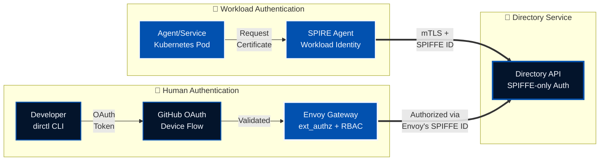
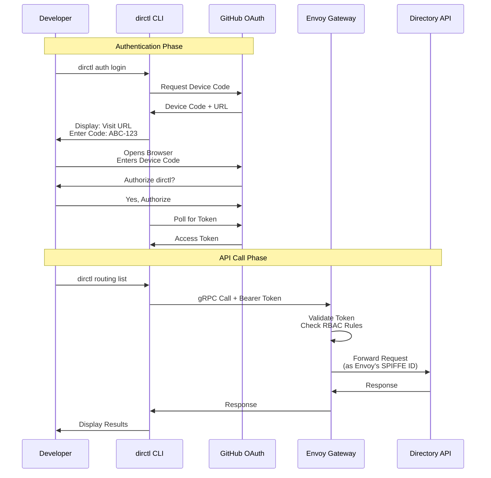
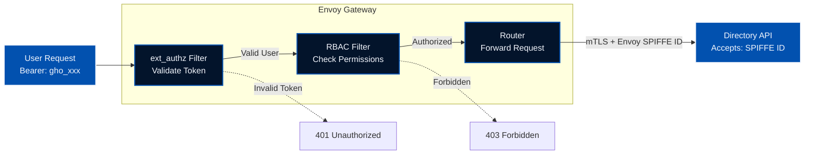
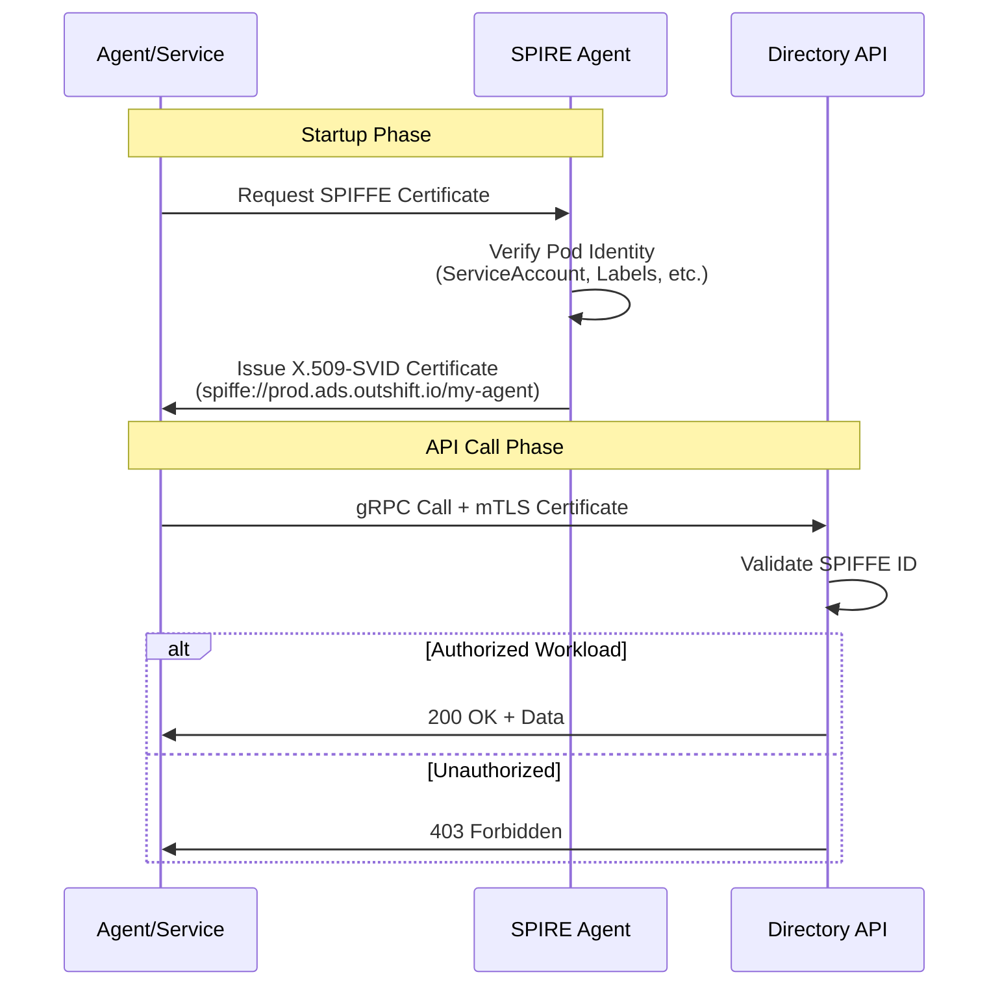

The **Agent Directory** is more than just a service registry—it's a **trusted gateway** for discovering and verifying AI agents. With the release of **v1.0**, we're introducing a robust dual-mode authentication system that combines the convenience of **GitHub OAuth** for human operators with the security of **SPIFFE workload identity** for automated services.

This post explores the architecture, implementation, and practical usage of Directory's new authentication system, designed for both interactive CLI users and automated workloads.

<!--more-->

## The Challenge: Two Types of Users

When building the Agent Directory, we encountered a fundamental question: Who should be allowed to access the system?

The answer wasn't simple. We had two distinct user personas with very different needs:

- **Human Operators** (developers, administrators) need interactive authentication via CLI tools with familiar OAuth flows
- **Automated Workloads** (services, agents, applications) need machine-to-machine authentication with automatic certificate rotation in Kubernetes

Traditional authentication systems force you to choose one approach. We built a system that supports both.

## The Solution: Dual-Mode Authentication

Directory v1.0 introduces a **dual-mode authentication architecture** that seamlessly handles both human and workload authentication:



**Key Insight:** The Directory API itself has zero authentication code. It only validates SPIFFE IDs, trusting that callers have already been authenticated upstream.

---

# Part 1: Authentication for Human Operators

The most common way to interact with Directory is through the `dirctl` CLI. This section covers everything you need to know about authenticating as a human user using GitHub OAuth.

## Why GitHub OAuth?

Human operators need:
- ✅ **Interactive authentication** - Simple browser-based login flow
- ✅ **No cluster access required** - Works from any laptop or CI/CD runner
- ✅ **Familiar experience** - Uses your existing GitHub account
- ✅ **Organization-based access** - Leverage GitHub org memberships for authorization

This makes GitHub OAuth perfect for developers, administrators, and CI/CD pipelines.

## How It Works: Architecture & Flow

For human operators using the `dirctl` CLI, we use **GitHub OAuth 2.0 Device Flow**. This provides a familiar authentication experience without requiring a local web server.



**How it works:**

1. **Device Flow Initiation**: CLI requests a device code from GitHub
2. **User Authorization**: User visits GitHub and authorizes the application
3. **Token Issuance**: CLI receives an OAuth access token
4. **Envoy Gateway**: Token is sent to Envoy, which validates it and enforces RBAC
5. **SPIFFE Impersonation**: Envoy calls the API using its own SPIFFE ID

**Key Advantage:** The Directory API never sees user tokens - it only sees Envoy's trusted SPIFFE ID.

## The Envoy Gateway: Policy Enforcement Point

The Envoy gateway is the linchpin of the human authentication flow. It handles:

1. **Token Validation** - Verifies GitHub OAuth tokens
2. **Authorization** - Enforces role-based access control (RBAC)
3. **Protocol Translation** - Converts OAuth → SPIFFE



**Envoy Configuration Highlights:**

- **Custom `ext_authz` Service**: Validates GitHub tokens and extracts user identity
- **Casbin-Based RBAC**: Policy-driven authorization with role assignments for users and organizations
- **Fine-Grained Permissions**: Control access per API method (e.g., allow read but deny write operations)
- **SPIFFE Integration**: Uses its own workload identity to call the Directory API

## Hands-On: GitHub Authentication

Now that we understand the architecture, let's walk through GitHub authentication with practical examples using the Agntcy-hosted testbed environment.

### Prerequisites

1. **CLI Tool**: `dirctl` installed ([Installation Guide](https://github.com/agntcy/dir#installation))
2. **Authorization**: Your GitHub username or organization must be in the production environment's allowed list. In case you are not:

   - Contact your Directory administrator if you don't have access
   - See the [Authorization section](#authorization-who-can-access-what) for details on allow lists

### Testbed Environment

Agntcy hosts a **public testbed environment** where you can experiment with Directory authentication without needing your own infrastructure. This environment is ideal for learning, testing, and prototyping.

**Testbed Endpoints:**

| Service | URL | Purpose |
|---------|-----|---------|
| **GitHub OAuth Gateway** | `https://prod.gateway.ads.outshift.io:443` | Human authentication via GitHub OAuth (public access) |

**Authentication Support:**
- ✅ **GitHub OAuth**: Authenticate interactively using your GitHub account - **Available for all testbed users**
- ✅ **Public Access**: No VPN required - accessible from anywhere
- ⚠️ **Authorization Required**: Your GitHub username or organization must be in the allowed list
- ❌ **SPIFFE mTLS**: Not available for public testbed users (requires your own SPIRE infrastructure)

**Use Cases:**
- **Testing**: Validate your integration before deploying to your own environment
- **Learning**: Understand how Directory authentication works in practice
- **Development**: Build and test applications that use Directory APIs
- **Demos**: Showcase Directory capabilities to stakeholders

### Step-by-Step Guide

Perfect for developers who want quick, interactive access without cluster credentials.

**Step 1: Configure Environment**

```bash
export DIRECTORY_CLIENT_SERVER_ADDRESS="prod.gateway.ads.outshift.io:443"
export DIRECTORY_CLIENT_AUTH_MODE="github"
```

**Step 2: Authenticate with GitHub**

```bash
dirctl auth login
```

You'll see:

```text
╔════════════════════════════════════════════════════════════╗
║          GitHub OAuth Authentication (Device Flow)         ║
╚════════════════════════════════════════════════════════════╝

🔐 To authenticate, please follow these steps:

  1. Visit: https://github.com/login/device
  2. Enter code: AEC4-D40B

💡 You can complete this on any device (phone, laptop, etc.)
⏱️  Code expires in 15 minutes

Waiting for authorization...
```

Open your browser, visit the URL, and enter the code. After authorizing, you'll see:

```text
✓ Authorization complete!

Fetching user information...
✓ Authenticated as: yourusername (Your Name)
Fetching organization memberships...
✓ Organizations: your-org, another-org
✓ Token cached for future use
  Cache location: ~/.config/dirctl/auth-token.json

╔════════════════════════════════════════════════════════════╗
║              Authentication Complete! ✓                    ║
╚════════════════════════════════════════════════════════════╝

You can now use 'dirctl' commands with --auth-mode=github
```

**Step 3: Use the CLI**

```bash
# Get info about a record
dirctl info baeareiesad3lyuacjirp6gxudrzheltwbodtsg7ieqpox36w5j637rchwq

# Pull a specific record
dirctl pull baeareiesad3lyuacjirp6gxudrzheltwbodtsg7ieqpox36w5j637rchwq -o json

# Check authentication status
dirctl auth status
```

**Token Caching:** Your OAuth token is securely cached at `~/.config/dirctl/auth-token.json`. Subsequent commands automatically use the cached token until it expires (default: 8 hours).

**Step 4: Check Authorization Logs (Self-Hosted Only)**

If you're running your own Directory deployment and have cluster access, you can verify that requests are being authorized:

```bash
# Replace with your namespace and label selectors
kubectl logs -n <your-namespace> -l app=envoy-authz-authz --tail=50 | grep yourusername
```

**Note:** This step is not available for public testbed users as it requires Kubernetes cluster access.

## Authorization: Role-Based Access Control (RBAC)

Now that you've successfully authenticated, the next critical question is: what can you actually do? Authentication proves **who you are**, but authorization determines **what you can access**.

The Envoy gateway enforces authorization using a role-based access control (RBAC) system powered by [Casbin](https://casbin.org), configured in the Helm chart:

```yaml
# Helm values for Envoy gateway
authServer:
  authorization:
    # Default role for any authenticated user (empty = deny by default)
    defaultRole: "reader"
    
    # Explicitly deny specific users (highest priority)
    userDenyList:
      - "github:malicious-user"
    
    # Role definitions
    roles:
      # Admin role - full access to all API methods
      admin:
        allowedMethods:
          - "*"  # Wildcard = all Directory API methods
        users:
          - "github:alexdemo2026"
          - "github:saradev2026"
        orgs:
          - "agntcy"  # All members of "agntcy" org get admin access
      
      # Reader role - read-only access
      reader:
        allowedMethods:
          - "/agntcy.dir.store.v1.StoreService/Pull"
          - "/agntcy.dir.store.v1.StoreService/Lookup"
          - "/agntcy.dir.routing.v1.RoutingService/Search"
          - "/agntcy.dir.routing.v1.RoutingService/List"
          - "/agntcy.dir.search.v1.SearchService/SearchCIDs"
          # ... more read-only methods
        users:
          - "github:mikeprod2026"
        orgs:
          - "contributors"
```

**Authorization Logic (Precedence Order):**
1. **Deny List** (highest priority) - Blocks access even if user has a role
2. **User Role** - Direct user-to-role assignment (e.g., specific users in `admin.users`)
3. **Organization Role** - Org-to-role assignment (e.g., all members of `agntcy` org)
4. **Default Role** - Fallback for any authenticated user not explicitly assigned
5. **Deny by Default** - If no role matches and no default role is set

**Key Features:**
- **Policy-Driven**: Authorization rules defined in YAML, no code changes needed
- **Fine-Grained**: Control access per API method (e.g., allow `Pull` but deny `Push`)
- **Flexible Wildcards**: Use `"*"` for full access or specify individual methods
- **Org-Based Assignment**: Leverage GitHub organization membership for role assignment

## Security & Best Practices

Understanding how to use authentication is important, but implementing it securely is critical. Let's examine key security practices for managing GitHub tokens and integrating with CI/CD pipelines.

### Token Security

**GitHub OAuth Tokens:**
- Tokens are stored with **0600 permissions** (owner read/write only)
- Tokens expire after **8 hours** (configurable)
- Token cache location: `~/.config/dirctl/auth-token.json`
- **Never commit tokens to version control**
- Use environment variables or secrets management for automation

### CI/CD Integration

GitHub Actions provides two approaches for authenticating with Directory. The automatic `GITHUB_TOKEN` is recommended for most use cases.

#### Option 1: Using Automatic `GITHUB_TOKEN` (Recommended)

GitHub Actions automatically provides a `GITHUB_TOKEN` in every workflow - no manual token creation needed!

```yaml
# GitHub Actions example using automatic token
name: Deploy Agent
on: [push]

jobs:
  deploy:
    runs-on: ubuntu-latest
    steps:
      - name: Checkout code
        uses: actions/checkout@v3
      
      - name: Authenticate with Directory
        env:
          DIRECTORY_CLIENT_SERVER_ADDRESS: "prod.gateway.ads.outshift.io:443"
          DIRECTORY_CLIENT_AUTH_MODE: "github"
          DIRECTORY_CLIENT_GITHUB_TOKEN: ${{ secrets.GITHUB_TOKEN }}
        run: |
          dirctl auth login
          dirctl auth status
      
      - name: Push agent card
        env:
          DIRECTORY_CLIENT_SERVER_ADDRESS: "prod.gateway.ads.outshift.io:443"
          DIRECTORY_CLIENT_AUTH_MODE: "github"
        run: |
          dirctl push ./agent-card.json
```

**Prerequisites:**
1. **Identify the GitHub user** that will be authenticated:
   ```yaml
   # Add this step to check what user the token represents
   - name: Check GitHub Token Identity
     env:
       GITHUB_TOKEN: ${{ secrets.GITHUB_TOKEN }}
     run: |
       curl -H "Authorization: Bearer $GITHUB_TOKEN" https://api.github.com/user | jq '.login'
   ```
   This typically returns `github-actions[bot]` or your repository name.

2. **Assign the user to a role** in your Directory configuration:
   ```yaml
   authServer:
     authorization:
       roles:
         writer:  # Or any role with required permissions
           allowedMethods:
             - "/agntcy.dir.store.v1.StoreService/Push"
             - "/agntcy.dir.store.v1.StoreService/Pull"
           users:
             - "github:github-actions[bot]"  # Add the bot user here
   ```

**How it works:**
- ✅ GitHub automatically provides the token (no manual creation)
- ✅ Token is automatically rotated by GitHub
- ✅ Works without `read:org` scope (authorization via direct user role assignment)
- ⚠️ Organization fetch during login may show a warning (this is expected and harmless)

#### Option 2: Using Custom PAT (For Organization-Based Access)

If you need organization-based authorization or cross-repository access, use a Personal Access Token with `read:org` scope:

```yaml
# GitHub Actions example using custom PAT
jobs:
  deploy:
    runs-on: ubuntu-latest
    steps:
      - name: Use dirctl with PAT
        env:
          DIRECTORY_CLIENT_SERVER_ADDRESS: "prod.gateway.ads.outshift.io:443"
          DIRECTORY_CLIENT_AUTH_MODE: "github"
          DIRECTORY_CLIENT_GITHUB_TOKEN: ${{ secrets.DIRECTORY_GITHUB_PAT }}
        run: |
          dirctl auth login
          dirctl info <cid>
          dirctl push ./agent-card.json
```

**Prerequisites:**
1. Create a GitHub PAT with `user:email` and `read:org` scopes
2. Store it as a repository secret: `DIRECTORY_GITHUB_PAT`
3. Ensure your GitHub user or organization is assigned to a role with required permissions

**When to use this:**
- Need organization-based role assignment (leverage GitHub org membership)
- Need cross-repository access
- Need to impersonate a specific user

**Best Practices:**
- ✅ **Prefer automatic `GITHUB_TOKEN`** - No manual token management
- ✅ Store custom PATs in repository secrets (never in code)
- ✅ Use dedicated service accounts for PAT-based automation
- ✅ Rotate custom PATs regularly (e.g., quarterly)
- ✅ Scope tokens to minimum required permissions
- ✅ Assign the workflow identity to an appropriate RBAC role for automatic token usage

---

# Part 2: Authentication for Automated Workloads

While GitHub OAuth is perfect for humans, automated services and agents running in Kubernetes need a different approach. This section covers SPIFFE-based workload identity for machine-to-machine authentication.

## Why SPIFFE?

Automated workloads need:
- ✅ **No human intervention** - Fully automated certificate lifecycle
- ✅ **Strong cryptographic identity** - Workload-to-workload mTLS
- ✅ **Automatic rotation** - Certificates renew without restarts
- ✅ **Kubernetes-native** - Identity tied to pods, namespaces, and service accounts

This makes SPIFFE perfect for production services, agents, and microservices running in Kubernetes clusters.

## How It Works: Architecture & Flow

**SPIFFE** (Secure Production Identity Framework For Everyone) provides workload identity through **mTLS certificates**. This is ideal for service-to-service communication within Kubernetes.



**How it works:**

1. **Workload Registration**: Services are registered in SPIRE with their intended SPIFFE ID
2. **Certificate Issuance**: SPIRE Agent validates the workload and issues a short-lived X.509 certificate
3. **mTLS Communication**: The service uses this certificate for mutual TLS with the Directory API
4. **Automatic Rotation**: Certificates rotate automatically (typically every 1 hour)

**Security Benefits:**
- ✅ **No secrets to manage** - No passwords, API keys, or tokens
- ✅ **Automatic expiration** - Certificates rotate without human intervention
- ✅ **Strong identity binding** - Identity tied to Kubernetes resources
- ✅ **Zero-trust security** - Every call is cryptographically authenticated

## Hands-On: SPIFFE Authentication

**Note:** SPIFFE authentication is not available for the public testbed environment. This option is for organizations running their own Directory deployment with SPIRE infrastructure.

Ideal for services running within your own Kubernetes cluster that need programmatic access. This method works best in environments where the **SPIRE Agent** is deployed as a DaemonSet, allowing workloads to automatically obtain their identity certificates via the Workload API.

### Two Approaches

1. **Production Workloads (Recommended)**: Use SPIRE Agent + Workload API for fully automated certificate management
2. **Local Development/Testing**: Manually export certificates from SPIRE Server for experimentation on your laptop

The manual export approach is only for demonstration and experimenting in your local environment. It allows you to test SPIFFE authentication without needing the full SPIRE infrastructure on your machine. Production workloads should always use the SPIRE Agent for automatic, zero-touch certificate management.

### Manual Certificate Export (Local Testing Only)

When you want to test Directory authentication from your laptop without SPIRE Agent, you can manually mint a certificate from your own SPIRE server (requires cluster access and administrative permissions):

**Step 1: Mint SPIFFE Certificate**

```bash
# Replace with your own SPIRE server pod name and namespace
kubectl exec -n <your-spire-namespace> <your-spire-server-pod> \
  -c spire-server -- \
  /opt/spire/bin/spire-server x509 mint \
  -dns <your-directory-api-address> \
  -spiffeID spiffe://<your-trust-domain>/demo-client \
  -ttl 1h \
  -output json > spiffe-local.json
```

**Example for your own deployment:**
```bash
kubectl exec -n my-spire spire-server-0 \
  -c spire-server -- \
  /opt/spire/bin/spire-server x509 mint \
  -dns directory.mycompany.com \
  -spiffeID spiffe://mycompany.com/demo-client \
  -ttl 1h \
  -output json > spiffe-local.json
```

**Step 2: Configure Environment**

```bash
# Use your own Directory deployment endpoints
export DIRECTORY_CLIENT_SERVER_ADDRESS="<your-directory-api>:443"
export DIRECTORY_CLIENT_AUTH_MODE="token"
export DIRECTORY_CLIENT_SPIFFE_TOKEN="spiffe-local.json"
```

**Step 3: Use the CLI**

```bash
dirctl info <cid>
dirctl pull <cid> -o json
```

### Production Deployment (Recommended)

The manual certificate export approach above is useful for testing and debugging, but production workloads should use the SPIRE Workload API to automatically obtain and rotate certificates. This requires the SPIRE Agent to be running on the same node as your workload (typically deployed as a Kubernetes DaemonSet).

**Key Benefits of SPIRE Agent Integration:**
- ✅ **Zero manual steps** - Certificates are obtained automatically via the Workload API
- ✅ **Automatic rotation** - Certificates renew before expiration without restarts
- ✅ **No exported files** - No need to manage `spiffe-local.json` files
- ✅ **Production-ready** - The recommended approach for all Kubernetes workloads
- ✅ **Just works** - Your service discovers the SPIRE Agent via the standard Unix domain socket

**When to Use Manual Certificate Export:**
- Testing/debugging from your laptop (outside the cluster)
- CI/CD runners without SPIRE Agent deployed
- One-time administrative tasks
- Development environments without full SPIRE infrastructure

For implementation details, see the [Directory Go client documentation](https://github.com/agntcy/dir/tree/main/client) and [SPIRE Workload API guide](https://spiffe.io/docs/latest/spire-about/spire-concepts/#workload-api).

## Authorization: Workload Identity Allow Lists

The Directory API maintains an allow list of trusted SPIFFE IDs:

```go
// Directory API configuration (in your self-hosted deployment)
authorizedIDs := []spiffeid.ID{
    spiffeid.RequireFromString("spiffe://mycompany.com/envoy"),
    spiffeid.RequireFromString("spiffe://mycompany.com/agent-service"),
    spiffeid.RequireFromString("spiffe://mycompany.com/indexer"),
}
```

**Authorization Logic:**
1. Extract SPIFFE ID from client certificate
2. Check against authorized ID list
3. Deny by default if not found

**Why This Matters:**
- ✅ **Least Privilege** - Only explicitly authorized workloads can access the API
- ✅ **Defense in Depth** - Even if an attacker compromises a pod, they can't access the Directory without the correct SPIFFE ID
- ✅ **Audit Trail** - Every request is logged with the authenticated SPIFFE ID

## Security & Best Practices

**SPIFFE Certificate Security:**
- Certificates are short-lived, typically one hour
- Certificates auto-rotate before expiration
- Certificates are cryptographically bound to workload identity
- No manual rotation required
- **No secrets stored** - All key material is ephemeral

**Production Best Practices:**
- Deploy SPIRE Agent as a DaemonSet in all nodes
- Use pod selectors for fine-grained workload registration
- Monitor certificate expiry and rotation
- Implement proper SPIRE Server high availability
- Use SPIRE's federation features for multi-cluster scenarios

---

# Part 3: Choosing the Right Method

## Comparison: When to Use Each Method

With both authentication methods available, you might wonder which one to choose. The answer depends on your use case, environment, and operational requirements. Here's a comprehensive comparison to help you decide:

| Criteria | GitHub OAuth | SPIFFE (mTLS) |
|----------|--------------|---------------|
| **Use Case** | Human operators | Automated workloads |
| **Testbed Support** | ✅ Available | ❌ Not available |
| **Self-Hosted Support** | ✅ Available | ✅ Available |
| **Environment** | CLI, laptops, CI/CD | Kubernetes clusters with SPIRE |
| **Setup Complexity** | Low (just GitHub account) | Medium (requires SPIRE infrastructure) |
| **Security Model** | User identity | Workload identity |
| **Token Lifetime** | Medium (8 hours) | Short (1 hour) |
| **Rotation** | Manual (re-login) | Automatic (with SPIRE Agent) |
| **Production Workflow** | Login once per 8 hours | Fully automated via Workload API |
| **Local Testing** | Same as production | Manual cert export (demo/experimentation) |
| **Cluster Access** | Not required | Required for setup |
| **Best For** | Development, testing, demos | Production services in self-hosted |

**Rule of Thumb:**
- **For Agntcy Testbed**: Use GitHub OAuth (only authentication method available for public testbed)
- **For Human Users (any environment)**: Use GitHub OAuth for CLI interactions, development, and CI/CD
- **For Self-Hosted Production Workloads**: Use **SPIFFE with SPIRE Agent** for Kubernetes services (fully automated, zero manual steps)
- **For Local Development/Testing**: Use **SPIFFE manual cert export** for experimentation with your own infrastructure (demo purposes only)

## What's Next?

Directory v1.0 provides a solid foundation for secure agent discovery with **fine-grained RBAC** already implemented. The authentication story continues to evolve with these planned enhancements:

- **OIDC Provider Support**: Integration with enterprise identity providers (Okta, Azure AD, Zitadel)
- **Enhanced RBAC**: Per-resource permissions (e.g., read/write access to specific CIDs or namespaces)
- **Audit Logging**: Comprehensive access logs for compliance and security monitoring
- **Multi-Tenancy**: Namespace-based isolation for multi-organization deployments
- **Dynamic Policy Updates**: Hot-reload RBAC policies without service restarts

## Conclusion

Directory v1.0's dual-mode authentication architecture demonstrates that **security doesn't have to compromise usability**. By combining GitHub OAuth, SPIFFE workload identity, and Casbin-based RBAC, we've created a system that's:

- ✅ **Developer-friendly** - Familiar OAuth flows, cached tokens, simple CLI
- ✅ **Secure by default** - Zero-trust, mutual TLS, automatic rotation, fine-grained permissions
- ✅ **Production-ready** - Battle-tested in real-world environments with policy-driven authorization
- ✅ **Flexible** - Supports both human operators and automated workloads with customizable roles

Whether you're building AI agents, deploying microservices, or managing a service mesh, the Agent Directory provides the trusted foundation for secure service discovery with enterprise-grade access control.

## 📚 References

- [Directory GitHub Repository](https://github.com/agntcy/dir)
- [SPIFFE/SPIRE Documentation](https://spiffe.io)
- [OAuth 2.0 Device Flow (RFC 8628)](https://datatracker.ietf.org/doc/html/rfc8628)
- [Envoy External Authorization](https://www.envoyproxy.io/docs/envoy/latest/configuration/http/http_filters/ext_authz_filter)
- [GitHub OAuth Apps](https://docs.github.com/en/developers/apps/building-oauth-apps)
- [Casbin - Authorization Library](https://casbin.org)