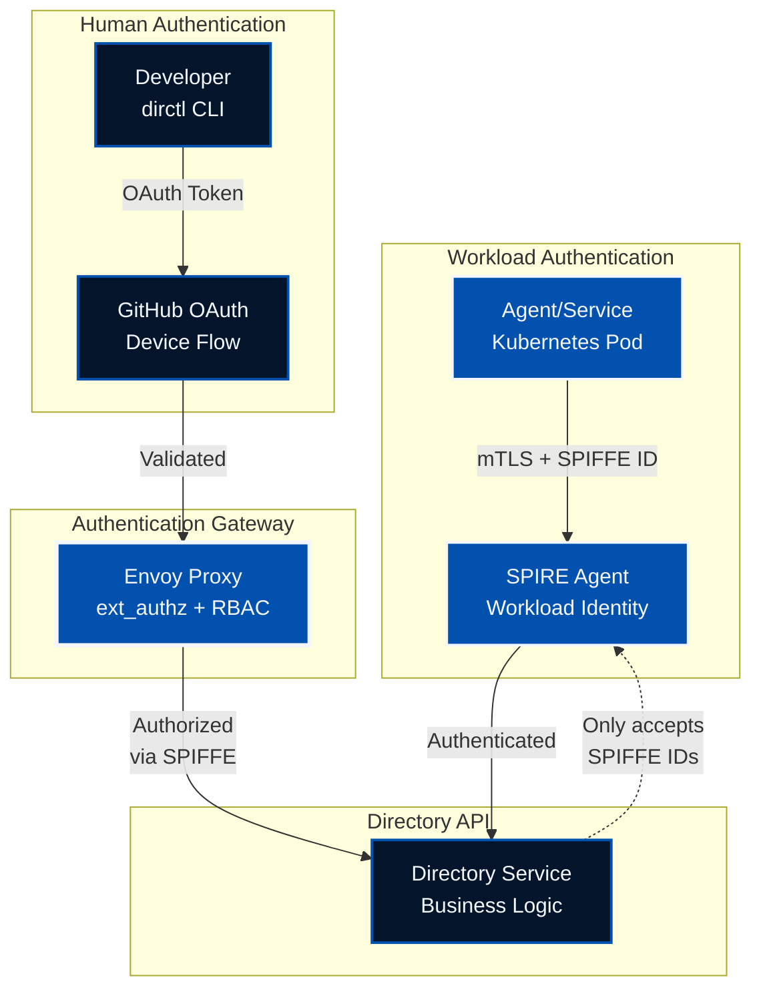
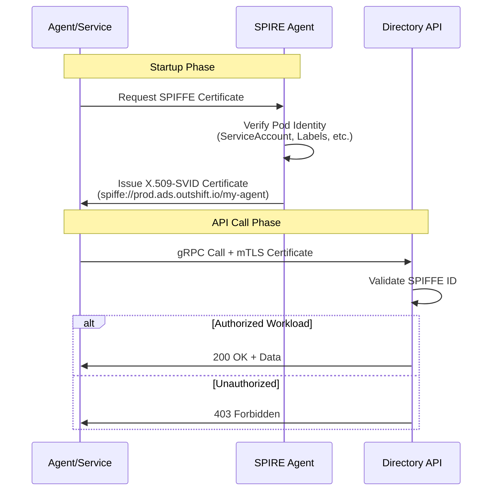
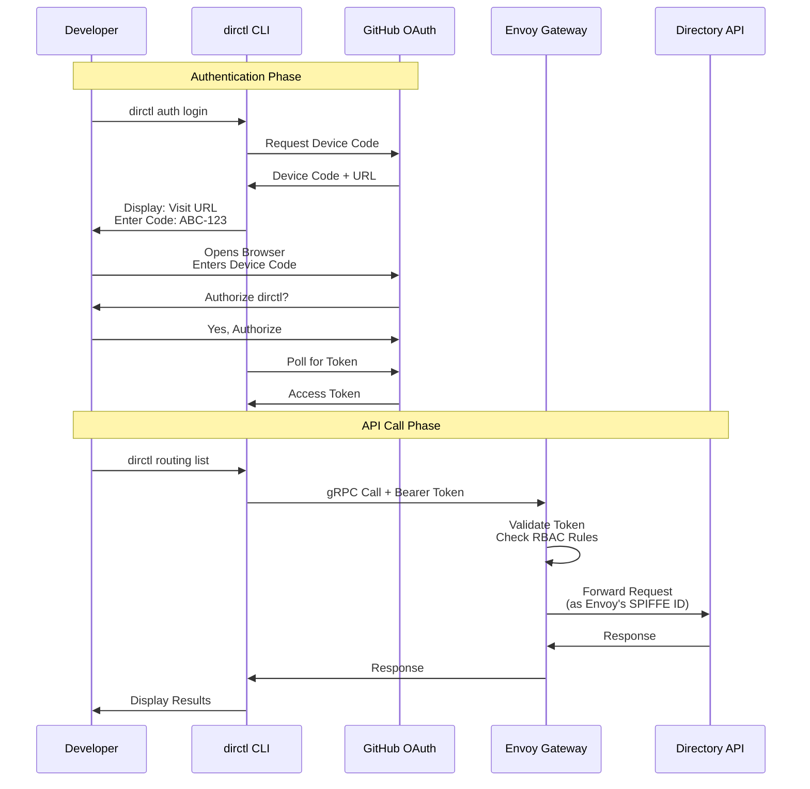
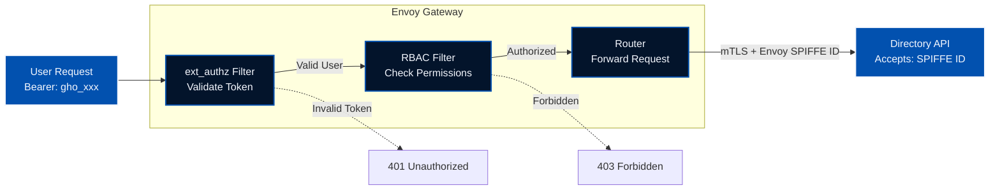

The **Agent Directory** is more than just a service registry—it's a **trusted gateway** for discovering and verifying AI agents. With the release of **v1.0.0**, we're introducing a robust dual-mode authentication system that combines the security of **SPIFFE workload identity** with the convenience of **GitHub OAuth** for human operators.

This post explores the architecture, implementation, and practical usage of Directory's new authentication system, designed for both automated workloads and interactive CLI users.

<!--more-->

## The Challenge: Two Types of Users

When building the Agent Directory, we encountered a fundamental question: **Who should be allowed to access the system?**

The answer wasn't simple. We had two distinct user personas:

1. **Automated Workloads** (services, agents, applications)
   - Need machine-to-machine authentication
   - Run continuously without human intervention
   - Must establish identity within Kubernetes clusters
   - Require automatic certificate rotation

2. **Human Operators** (developers, administrators)
   - Need interactive authentication
   - Access the system via CLI tools
   - Don't have direct cluster access
   - Want familiar OAuth flows

Traditional authentication systems force you to choose one approach. We built a system that supports both.

## The Solution: Dual-Mode Authentication

Directory v1.0.0 introduces a **dual-mode authentication architecture** that seamlessly handles both workload and human authentication:



**Key Insight:** The Directory API itself has **zero authentication code**. It only validates SPIFFE IDs, trusting that callers have already been authenticated upstream.

## Architecture: Two Paths, One Destination

Let's dive deeper into how each authentication mode works.

### Path 1: SPIFFE Authentication (Workloads)

**SPIFFE** (Secure Production Identity Framework For Everyone) provides workload identity through **mTLS certificates**. This is ideal for service-to-service communication within Kubernetes.



**How it works:**

1. **Workload Registration**: Services are registered in SPIRE with their intended SPIFFE ID
2. **Certificate Issuance**: SPIRE Agent validates the workload and issues a short-lived X.509 certificate
3. **mTLS Communication**: The service uses this certificate for mutual TLS with the Directory API
4. **Automatic Rotation**: Certificates rotate automatically (typically every 1 hour)

**Security Benefits:**
- ✅ **No secrets to manage** - No passwords, API keys, or tokens
- ✅ **Automatic expiration** - Certificates rotate without human intervention
- ✅ **Strong identity binding** - Identity tied to Kubernetes resources
- ✅ **Zero-trust security** - Every call is cryptographically authenticated

### Path 2: GitHub OAuth (Human Operators)

For human operators using the `dirctl` CLI, we use **GitHub OAuth 2.0 Device Flow**. This provides a familiar authentication experience without requiring a local web server.



**How it works:**

1. **Device Flow Initiation**: CLI requests a device code from GitHub
2. **User Authorization**: User visits GitHub and authorizes the application
3. **Token Issuance**: CLI receives an OAuth access token
4. **Envoy Gateway**: Token is sent to Envoy, which validates it and enforces RBAC
5. **SPIFFE Impersonation**: Envoy calls the API using its own SPIFFE ID

**Key Advantage:** The Directory API **never sees user tokens** - it only sees Envoy's trusted SPIFFE ID.

## The Envoy Gateway: Policy Enforcement Point

The Envoy gateway is the **linchpin** of the human authentication flow. It handles:

1. **Token Validation** - Verifies GitHub OAuth tokens
2. **Authorization** - Enforces role-based access control (RBAC)
3. **Protocol Translation** - Converts OAuth → SPIFFE



**Envoy Configuration Highlights:**

- **Custom ext_authz Service**: Validates GitHub tokens and extracts user identity
- **RBAC Rules**: Configurable allow/deny lists based on GitHub username and organization membership
- **SPIFFE Integration**: Uses its own workload identity to call the Directory API

## Hands-On: Using Directory Authentication

Now that we understand the architecture, let's walk through both authentication methods with practical examples using the Agntcy-hosted testbed environment.

### Prerequisites

1. **CLI Tool**: `dirctl` installed ([Installation Guide](https://github.com/agntcy/dir#installation))
2. **Authorization**: Your GitHub username or organization must be in the production environment's allowed list
   - Contact your Directory administrator if you don't have access
   - See the [Authorization section](#authorization-who-can-access-what) for details on allow lists

### Testbed Environment

Agntcy hosts a **public testbed environment** where you can experiment with Directory authentication without needing your own infrastructure. This environment is ideal for learning, testing, and prototyping.

**Testbed Endpoints:**

| Service | URL | Purpose |
|---------|-----|---------|
| **GitHub OAuth Gateway** | `https://prod.gateway.ads.outshift.io:443` | Human authentication via GitHub OAuth (public access) |

**Authentication Support:**
- ✅ **GitHub OAuth**: Authenticate interactively using your GitHub account - **Available for all testbed users**
- ✅ **Public Access**: No VPN required - accessible from anywhere
- ⚠️ **Authorization Required**: Your GitHub username or organization must be in the allowed list
- ❌ **SPIFFE mTLS**: Not available for public testbed users (requires your own SPIRE infrastructure)

**Use Cases:**
- **Testing**: Validate your integration before deploying to your own environment
- **Learning**: Understand how Directory authentication works in practice
- **Development**: Build and test applications that use Directory APIs
- **Demos**: Showcase Directory capabilities to stakeholders

### Option A: GitHub Authentication (Recommended for CLI Users)

Perfect for developers who want quick, interactive access without cluster credentials.

**Step 1: Configure Environment**

```bash
export DIRECTORY_CLIENT_SERVER_ADDRESS="prod.gateway.ads.outshift.io:443"
export DIRECTORY_CLIENT_AUTH_MODE="github"
```

**Step 2: Authenticate with GitHub**

```bash
dirctl auth login
```

You'll see:

```text
╔════════════════════════════════════════════════════════════╗
║          GitHub OAuth Authentication (Device Flow)        ║
╚════════════════════════════════════════════════════════════╝

🔐 To authenticate, please follow these steps:

  1. Visit: https://github.com/login/device
  2. Enter code: AEC4-D40B

💡 You can complete this on any device (phone, laptop, etc.)
⏱️  Code expires in 15 minutes

Waiting for authorization...
```

Open your browser, visit the URL, and enter the code. After authorizing, you'll see:

```text
✓ Authorization complete!

Fetching user information...
✓ Authenticated as: yourusername (Your Name)
Fetching organization memberships...
✓ Organizations: your-org, another-org
✓ Token cached for future use
  Cache location: ~/.config/dirctl/auth-token.json

╔════════════════════════════════════════════════════════════╗
║              Authentication Complete! ✓                    ║
╚════════════════════════════════════════════════════════════╝

You can now use 'dirctl' commands with --auth-mode=github
```

**Step 3: Use the CLI**

```bash
# List records
dirctl list

# Pull a specific record
dirctl pull baeareiesad3lyuacjirp6gxudrzheltwbodtsg7ieqpox36w5j637rchwq -o json

# Check authentication status
dirctl auth status
```

**Token Caching:** Your OAuth token is securely cached at `~/.config/dirctl/auth-token.json`. Subsequent commands automatically use the cached token until it expires (default: 8 hours).

**Step 4: Check Authorization Logs (Self-Hosted Only)**

If you're running your own Directory deployment and have cluster access, you can verify that requests are being authorized:

```bash
# Replace with your namespace and label selectors
kubectl logs -n <your-namespace> -l app=envoy-authz-authz --tail=50 | grep yourusername
```

**Note:** This step is not available for public testbed users as it requires Kubernetes cluster access.

### Option B: SPIFFE Authentication (For Self-Hosted Environments)

**Note:** SPIFFE authentication is **not available for the public testbed** environment. This option is for organizations running their own Directory deployment with SPIRE infrastructure.

Ideal for services running within your own Kubernetes cluster that need programmatic access. This method works best in environments where the **SPIRE Agent** is deployed as a DaemonSet, allowing workloads to automatically obtain their identity certificates via the Workload API.

**Two Approaches:**

1. **Production Workloads (Recommended)**: Use SPIRE Agent + Workload API for fully automated certificate management
2. **Local Development/Testing**: Manually export certificates from SPIRE Server for experimentation on your laptop

The manual export approach is **only for demonstration and experimenting in your local environment**. It allows you to test SPIFFE authentication without needing the full SPIRE infrastructure on your machine. Production workloads should always use the SPIRE Agent for automatic, zero-touch certificate management.

**Step 1: Mint SPIFFE Certificate (Manual Export for Local Testing)**

When you want to test Directory authentication from your laptop without SPIRE Agent, you can manually mint a certificate from your own SPIRE server (requires cluster access and administrative permissions):

```bash
# Replace with your own SPIRE server pod name and namespace
kubectl exec -n <your-spire-namespace> <your-spire-server-pod> \
  -c spire-server -- \
  /opt/spire/bin/spire-server x509 mint \
  -dns <your-directory-api-address> \
  -spiffeID spiffe://<your-trust-domain>/demo-client \
  -ttl 1h \
  -output json > spiffe-local.json
```

**Example for your own deployment:**
```bash
kubectl exec -n my-spire spire-server-0 \
  -c spire-server -- \
  /opt/spire/bin/spire-server x509 mint \
  -dns directory.mycompany.com \
  -spiffeID spiffe://mycompany.com/demo-client \
  -ttl 1h \
  -output json > spiffe-local.json
```

**Step 2: Configure Environment**

```bash
# Use your own Directory deployment endpoints
export DIRECTORY_CLIENT_SERVER_ADDRESS="<your-directory-api>:443"
export DIRECTORY_CLIENT_AUTH_MODE="token"
export DIRECTORY_CLIENT_SPIFFE_TOKEN="spiffe-local.json"
```

**Step 3: Use the CLI**

```bash
dirctl list
dirctl pull <cid> -o json
```

**Step 4: For Production Workloads (Recommended)**

The manual certificate export approach above is useful for testing and debugging, but **production workloads should use the SPIRE Workload API** to automatically obtain and rotate certificates. This requires the SPIRE Agent to be running on the same node as your workload (typically deployed as a Kubernetes DaemonSet).

**Key Benefits of SPIRE Agent Integration:**
- ✅ **Zero manual steps** - Certificates are obtained automatically via the Workload API
- ✅ **Automatic rotation** - Certificates renew before expiration without restarts
- ✅ **No exported files** - No need to manage `spiffe-prod.json` files
- ✅ **Production-ready** - The recommended approach for all Kubernetes workloads
- ✅ **Just works** - Your service discovers the SPIRE Agent via the standard Unix domain socket

**When to Use Manual Certificate Export:**
- Testing/debugging from your laptop (outside the cluster)
- CI/CD runners without SPIRE Agent deployed
- One-time administrative tasks
- Development environments without full SPIRE infrastructure

For implementation details, see the [Directory Go client documentation](https://github.com/agntcy/dir/tree/main/client) and [SPIRE Workload API guide](https://spiffe.io/docs/latest/spire-about/spire-concepts/#workload-api).

## Authorization: Who Can Access What?

Now that you've successfully authenticated, the next critical question is: what can you actually do? Authentication proves **who you are**, but authorization determines **what you can access**. Let's explore how the Directory controls access for both GitHub users and SPIFFE workloads.

### GitHub OAuth: User and Organization Allow Lists

The Envoy gateway enforces authorization rules configured in the Helm chart:

```yaml
# Helm values for Envoy gateway
authServer:
  authorization:
    # Allow users from specific GitHub organizations
    allowedOrgConstructs:
      - "agntcy"
      - "spiffe"
    
    # Explicitly allow specific users
    userAllowList:
      - "github:alexdemo2026"
      - "github:saradev2026"
      - "github:mikeprod2026"
    
    # Explicitly deny specific users (takes precedence)
    userDenyList:
      - "github:malicious-user"
```

**Authorization Logic:**
1. Check deny list (immediate rejection)
2. Check allow list (immediate approval)
3. Check organization membership (approval if in allowed org)
4. Deny by default

### SPIFFE: Workload Identity Allow Lists

The Directory API maintains an allow list of trusted SPIFFE IDs:

```go
// Directory API configuration (in your self-hosted deployment)
authorizedIDs := []spiffeid.ID{
    spiffeid.RequireFromString("spiffe://mycompany.com/envoy"),
    spiffeid.RequireFromString("spiffe://mycompany.com/agent-service"),
    spiffeid.RequireFromString("spiffe://mycompany.com/indexer"),
}
```

**Why This Matters:**
- ✅ **Least Privilege** - Only explicitly authorized workloads can access the API
- ✅ **Defense in Depth** - Even if an attacker compromises a pod, they can't access the Directory without the correct SPIFFE ID
- ✅ **Audit Trail** - Every request is logged with the authenticated SPIFFE ID

## Security Considerations

Understanding how to use authentication and authorization is important, but implementing them securely is critical. Let's examine key security practices for managing tokens, certificates, and integrating with CI/CD pipelines.

### Token Security

**GitHub OAuth Tokens:**
- Tokens are stored with **0600 permissions** (owner read/write only)
- Tokens expire after **8 hours** (configurable)
- Token cache location: `~/.config/dirctl/auth-token.json`
- **Never commit tokens to version control**

**SPIFFE Certificates:**
- Certificates are **short-lived** (typically 1 hour)
- Certificates **auto-rotate** before expiration
- Certificates are **cryptographically bound** to workload identity
- **No manual rotation required**

### CI/CD Integration

For CI/CD pipelines, you can use GitHub Personal Access Tokens (PATs) or OAuth tokens:

```yaml
# GitHub Actions example
jobs:
  deploy:
    runs-on: ubuntu-latest
    steps:
      - name: Use dirctl
        env:
          DIRECTORY_CLIENT_SERVER_ADDRESS: "prod.gateway.ads.outshift.io:443"
          DIRECTORY_CLIENT_AUTH_MODE: "github"
          DIRECTORY_CLIENT_GITHUB_TOKEN: ${{ secrets.DIRECTORY_GITHUB_TOKEN }}
        run: |
          dirctl list
          dirctl push ./agent-card.json
```

**Best Practices:**
- ✅ Store tokens in CI/CD secrets (never in code)
- ✅ Use dedicated service accounts for automation
- ✅ Rotate tokens regularly
- ✅ Scope tokens to minimum required permissions

## Comparison: When to Use Each Method

With both authentication methods available, you might wonder which one to choose. The answer depends on your use case, environment, and operational requirements. Here's a comprehensive comparison to help you decide:

| Criteria | SPIFFE (mTLS) | GitHub OAuth |
|----------|---------------|--------------|
| **Use Case** | Automated workloads | Human operators |
| **Testbed Support** | ❌ Not available | ✅ Available |
| **Self-Hosted Support** | ✅ Available | ✅ Available |
| **Environment** | Kubernetes clusters with SPIRE | CLI, laptops, CI/CD |
| **Setup Complexity** | Medium (requires SPIRE infrastructure) | Low (just GitHub account) |
| **Security Model** | Workload identity | User identity |
| **Token Lifetime** | Short (1 hour) | Medium (8 hours) |
| **Rotation** | Automatic (with SPIRE Agent) | Manual (re-login) |
| **Production Workflow** | Fully automated via Workload API | Login once per 8 hours |
| **Local Testing** | Manual cert export (demo/experimentation) | Same as production |
| **Cluster Access** | Required for setup | Not required |
| **Best For** | Production services in self-hosted | Development, testing, demos |

**Rule of Thumb:**
- **For Agntcy Testbed**: Use **GitHub OAuth** (only authentication method available for public testbed)
- **For Self-Hosted Production**: Use **SPIFFE with SPIRE Agent** for Kubernetes workloads (fully automated, zero manual steps)
- **For Local Development**: Use **SPIFFE manual cert export** for experimentation with your own infrastructure (demo purposes only)
- **For Human Users (any environment)**: Use **GitHub OAuth** for CLI interactions, development, and CI/CD

## Troubleshooting

Even with robust authentication systems, you may encounter issues during setup or daily use. Here are common problems and their solutions for both authentication methods:

### GitHub Authentication Issues

**Problem:** `dirctl auth login` times out

**Solution:**
1. Check your internet connection
2. Verify you can access `https://github.com/login/device`
3. Ensure you authorized the application within 15 minutes
4. Try again: `dirctl auth login`

---

**Problem:** `not authenticated with GitHub` error

**Solution:**
1. Check if token is cached: `dirctl auth status`
2. Re-authenticate: `dirctl auth login`
3. Verify environment variables:
   ```bash
   echo $DIRECTORY_CLIENT_SERVER_ADDRESS
   echo $DIRECTORY_CLIENT_AUTH_MODE
   ```

---

**Problem:** `403 Forbidden` error after authentication

**Solution:**
1. Verify you're in the allowed users or organizations list
2. Contact the Directory administrator to add your GitHub username
3. **(Self-Hosted Only)** Check Envoy logs for authorization details if you have cluster access:
   ```bash
   # Replace with your namespace and label selectors
   kubectl logs -n <your-namespace> -l app=envoy-authz-authz --tail=100
   ```
   **Note:** Testbed users should contact the Agntcy team for authorization issues

### SPIFFE Authentication Issues

**Problem:** `connection refused` error

**Solution:**
1. Verify you're on the VPN
2. Check the server address: `prod.api.ads.outshift.io:443`
3. Verify SPIFFE certificate is valid:
   ```bash
   cat spiffe-prod.json | jq '.svids[0].x509_svid' -r | \
     base64 -d | openssl x509 -noout -dates
   ```

---

**Problem:** Certificate expired

**Solution:**
1. Mint a new certificate (see Step 1 in SPIFFE authentication)
2. For workloads, ensure SPIRE Agent is running and can communicate with SPIRE Server

## What's Next?

Directory v1.0.0 provides a solid foundation for secure agent discovery, but the authentication story continues to evolve. Here's what's on the roadmap:

The dual-mode authentication system in Directory v1.0.0 is just the beginning. Future enhancements include:

- **OIDC Provider Support**: Integration with enterprise identity providers (Okta, Azure AD, Zitadel)
- **Fine-Grained RBAC**: Per-resource permissions (read vs. write access)
- **Audit Logging**: Comprehensive access logs for compliance
- **Multi-Tenancy**: Namespace-based isolation

## Conclusion

Directory v1.0.0's dual-mode authentication architecture demonstrates that **security doesn't have to compromise usability**. By supporting both SPIFFE workload identity and GitHub OAuth, we've created a system that's:

- ✅ **Secure by default** - Zero-trust, mutual TLS, automatic rotation
- ✅ **Developer-friendly** - Familiar OAuth flows, cached tokens, simple CLI
- ✅ **Production-ready** - Battle-tested in real-world environments
- ✅ **Flexible** - Supports both automated workloads and human operators

Whether you're building AI agents, deploying microservices, or managing a service mesh, the Agent Directory provides the trusted foundation for secure service discovery.

**Try it today:**
```bash
# Install dirctl
curl -sSL https://get.agntcy.dev/dir | sh

# Authenticate
dirctl auth login

# Explore
dirctl list
```

## 📚 References

- [Directory GitHub Repository](https://github.com/agntcy/dir)
- [SPIFFE/SPIRE Documentation](https://spiffe.io)
- [OAuth 2.0 Device Flow (RFC 8628)](https://datatracker.ietf.org/doc/html/rfc8628)
- [Envoy External Authorization](https://www.envoyproxy.io/docs/envoy/latest/configuration/http/http_filters/ext_authz_filter)
- [GitHub OAuth Apps](https://docs.github.com/en/developers/apps/building-oauth-apps)
