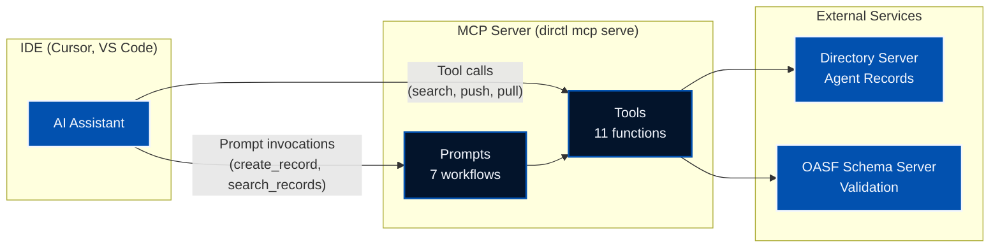

The Model Context Protocol (MCP) has emerged as a powerful standard for connecting AI assistants with external tools and data sources. In this post, we'll explore the Directory MCP server—a feature that brings AI agent discovery and management directly into your IDE, enabling seamless interaction with the Directory ecosystem.

<!--more-->

## What is Directory?

[Directory](https://github.com/agntcy/dir) is a distributed peer-to-peer network for publishing, exchanging, and discovering information about AI agents. It uses [OASF (Open Agent Standard Format)](https://github.com/agntcy/oasf) to describe AI agents with structured metadata, enabling:

- **Capability-Based Discovery**: Find agents based on their functional characteristics using hierarchical skill and domain taxonomies
- **Verifiable Claims**: Cryptographic mechanisms ensure data integrity and provenance tracking
- **Distributed Architecture**: Content-addressing and distributed hash tables (DHT) for scalable discovery across decentralized networks
- **Multi-Format Support**: Import and export between OASF, A2A (Agent-to-Agent), and MCP formats

## Why an MCP Server?

While Directory provides CLI tools and SDKs for interacting with the network, developers increasingly work within AI-assisted IDEs like Cursor. The MCP server bridges this gap by exposing Directory functionality directly to AI assistants, allowing you to:

- Search for agents using natural language
- Validate and push agent records without leaving your editor
- Generate OASF records by analyzing your codebase
- Import and export between different agent formats

Instead of context-switching to the terminal, you can simply ask your AI assistant to perform these operations.

## Architecture

The MCP server acts as a bridge between your AI assistant and the Directory ecosystem:



The server communicates via stdin/stdout using the MCP protocol, making it compatible with any MCP-enabled IDE.

## Prerequisites

Before setting up the MCP server, you'll need:

1. **dirctl CLI** - Install via [Homebrew](https://github.com/agntcy/dir/tree/main/HomebrewFormula) or download from [GitHub Releases](https://github.com/agntcy/dir/releases). Alternatively, use the Docker image.

2. **A running Directory server** - Either:
   - **Local development**: Start one with `task server:start` in the [Directory repository](https://github.com/agntcy/dir), or use Docker Compose:
     ```bash
     cd install/docker && docker compose up -d
     ```
   - **Remote server**: Use an existing Directory deployment (e.g., `prod.gateway.ads.outshift.io:443`)

3. **An MCP-enabled IDE** - Such as [Cursor](https://cursor.sh/) or VS Code with an MCP extension.

## Setup

The MCP server runs via the `dirctl` CLI tool. Add it to your Cursor configuration at `~/.cursor/mcp.json`:

### Using the Binary

```json
{
  "mcpServers": {
    "dir-mcp-server": {
      "command": "/path/to/dirctl",
      "args": ["mcp", "serve"],
      "env": {
        "OASF_API_VALIDATION_SCHEMA_URL": "https://schema.oasf.outshift.com",
        "DIRECTORY_CLIENT_SERVER_ADDRESS": "localhost:8888"
      }
    }
  }
}
```

### Using Docker

```json
{
  "mcpServers": {
    "dir-mcp-server": {
      "command": "docker",
      "args": [
        "run", "--rm", "-i",
        "-e", "OASF_API_VALIDATION_SCHEMA_URL=https://schema.oasf.outshift.com",
        "ghcr.io/agntcy/dir-ctl:latest",
        "mcp", "serve"
      ]
    }
  }
}
```

**Note:** Environment variables must be passed via `-e` flags in the args array when using Docker, not in the `env` object.

### Connecting to a Remote Directory Server

To connect to a remote Directory server (e.g., the production gateway), you'll need to configure the server address and provide a GitHub Personal Access Token (PAT) for authentication:

```json
{
  "mcpServers": {
    "dir-mcp-server": {
      "command": "/path/to/dirctl",
      "args": ["mcp", "serve"],
      "env": {
        "OASF_API_VALIDATION_SCHEMA_URL": "https://schema.oasf.outshift.com",
        "DIRECTORY_CLIENT_SERVER_ADDRESS": "prod.gateway.ads.outshift.io:443",
        "DIRECTORY_CLIENT_AUTH_MODE": "github",
        "DIRECTORY_CLIENT_GITHUB_TOKEN": "ghp_your_token_here"
      }
    }
  }
}
```

Generate a PAT at [GitHub Settings > Developer settings > Personal access tokens](https://github.com/settings/tokens) with `user:email` and `read:org` scopes.

## Available Tools

The MCP server exposes 11 tools that AI assistants can call directly:

| Tool | Category | Description |
|------|----------|-------------|
| `agntcy_oasf_list_versions` | Schema | Lists all available OASF schema versions |
| `agntcy_oasf_get_schema` | Schema | Retrieves complete schema JSON for a version |
| `agntcy_oasf_get_schema_skills` | Schema | Navigates skill taxonomy hierarchically |
| `agntcy_oasf_get_schema_domains` | Schema | Navigates domain taxonomy hierarchically |
| `agntcy_oasf_validate_record` | Record | Validates record against schema |
| `agntcy_dir_push_record` | Record | Pushes record to Directory server |
| `agntcy_dir_pull_record` | Record | Retrieves record by CID |
| `agntcy_dir_verify_record` | Record | Verifies digital signature and trust status |
| `agntcy_dir_search_local` | Record | Searches records with wildcard filters |
| `agntcy_oasf_import_record` | Format | Imports from MCP or A2A to OASF |
| `agntcy_oasf_export_record` | Format | Exports OASF to A2A or GitHub Copilot |

## Guided Workflows with Prompts

Beyond individual tools, the MCP server provides 7 prompts—guided workflows that orchestrate multiple tool calls:

| Prompt | Description |
|--------|-------------|
| `create_record` | Analyzes codebase and generates OASF record |
| `validate_record` | Validates existing record against schema |
| `push_record` | Validates and pushes record to Directory |
| `search_records` | Translates natural language to structured search |
| `pull_record` | Retrieves and displays record by CID |
| `import_record` | Imports from MCP/A2A with enrichment |
| `export_record` | Exports to A2A or GitHub Copilot format |

## Usage Examples

Here are real-world scenarios showing the MCP server in action.

### Scenario 1: Publishing Your Agent to Directory

You've built an AI agent and want to share it with the community. Instead of manually crafting an OASF record, just ask:

> "Create an OASF record for this project and push it to Directory"

The AI assistant will:
1. Analyze your codebase structure and README
2. Extract metadata from `package.json`, `pyproject.toml`, or similar
3. Query the OASF schema to find matching skills and domains
4. Generate a complete, valid OASF record
5. Show you the record for review
6. Push it to Directory and return the CID

What would take 30+ minutes of reading documentation and manual JSON editing happens in seconds.

### Scenario 2: Finding the Right Agent for Your Project

You need an agent that can help with a specific task:

> "Find me agents that can translate text between languages and run as Docker containers"

The AI translates this to a structured search:
```json
{
  "skill_names": ["*translat*", "*language*"],
  "locators": ["docker-image:*"]
}
```

It then presents matching agents with their capabilities, versions, and how to deploy them.

### Scenario 3: Converting Between Agent Formats

You found an A2A agent card but need it in OASF format for your workflow:

> "Import this A2A card and enrich it with proper OASF skills"

The AI reads the A2A card, maps its capabilities to OASF's skill taxonomy, adds missing metadata, validates the result, and saves a complete OASF record.

### Scenario 4: Validating Before Deployment

Before pushing changes to your agent's OASF record:

> "Validate agent.json against the latest OASF schema and fix any issues"

The AI validates your record, identifies problems (missing required fields, invalid skill references, schema mismatches), and can automatically fix them while explaining what changed.

## Video Walkthrough

If you prefer a visual demonstration, check out this video where I walk through the Directory MCP server in action:

<div style="position: relative; padding-bottom: 56.25%; height: 0; overflow: hidden; max-width: 100%; margin-bottom: 1.5em;">
  <iframe src="https://www.youtube.com/embed/pdVqhlyJHo4" style="position: absolute; top: 0; left: 0; width: 100%; height: 100%;" frameborder="0" allowfullscreen></iframe>
</div>

## Implementation Details

The MCP server is implemented in Go using the [MCP Go SDK](https://github.com/modelcontextprotocol/go-sdk). Here's a simplified view of how tools are registered:

```go
server := mcp.NewServer(&mcp.Implementation{
    Name:    "dir-mcp-server",
    Version: "v0.1.0",
}, nil)

mcp.AddTool(server, &mcp.Tool{
    Name: "agntcy_oasf_validate_record",
    Description: `Validates an OASF agent record against the schema...`,
}, tools.ValidateRecord)

mcp.AddTool(server, &mcp.Tool{
    Name: "agntcy_dir_search_local",
    InputSchema: tools.SearchLocalInputSchema(),
    Description: `Searches for agent records using structured filters...`,
}, tools.SearchLocal)
```

Each tool handler receives structured input and returns results that the AI assistant can interpret and present to the user.

Prompts work similarly but return instructional messages that guide the AI through multi-step workflows:

```go
server.AddPrompt(&mcp.Prompt{
    Name: "create_record",
    Description: "Analyzes the current directory and creates an OASF record.",
    Arguments: []*mcp.PromptArgument{
        {Name: "output_path", Required: false},
        {Name: "schema_version", Required: false},
    },
}, prompts.CreateRecord)
```

## The Bigger Picture

The Directory MCP server is part of a broader vision for AI agent interoperability. By standardizing how agents describe their capabilities (OASF), how they're discovered (Directory), and how they communicate (A2A), we're building infrastructure for an ecosystem where:

- Agents can find and collaborate with other agents
- Developers can discover pre-built agents for their needs
- Organizations can publish and share agents securely

The MCP server brings this infrastructure directly into developer workflows, reducing friction and enabling AI-assisted agent development.

Check out the [Directory documentation](https://docs.agntcy.org/dir/overview/) for a complete walkthrough, and the [MCP server README](https://github.com/agntcy/dir/tree/main/mcp) for detailed configuration options.

## References

- [Directory GitHub Repository](https://github.com/agntcy/dir)
- [Directory MCP Server README](https://github.com/agntcy/dir/tree/main/mcp)
- [Directory Documentation](https://docs.agntcy.org/dir/overview/)
- [OASF (Open Agent Standard Format)](https://github.com/agntcy/oasf)
- [Model Context Protocol](https://modelcontextprotocol.io/)
- [MCP Go SDK](https://github.com/modelcontextprotocol/go-sdk)

---

*Have questions about Directory or the MCP server? Join our [Slack community](https://join.slack.com/t/agntcy/shared_invite/zt-3hb4p7bo0-5H2otGjxGt9OQ1g5jzK_GQ) or check out our [GitHub](https://github.com/agntcy).*
