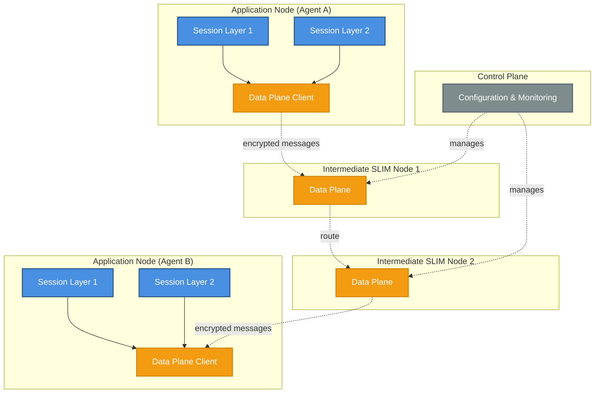
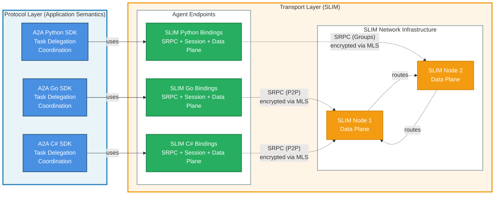

The AI landscape is rapidly evolving from isolated models to interconnected
networks of intelligent agents. As AI systems become more sophisticated, they
need to communicate, collaborate, and coordinate in real-time. Protocols like
[A2A (Agent-to-Agent)](https://a2a-protocol.org/latest/) define *what*
agents say to each other: standardized messages, task delegation, and coordination semantics. But A2A
standardized messages, task delegation, and coordination semantics. But A2A
needs a robust transport layer that defines *how* agents securely exchange
these messages across network boundaries.

Existing messaging frameworks weren't designed for the unique demands of
agentic AI: they either sacrifice security for performance, lack proper group
communication primitives, can't scale to support distributed multi-agent
systems, or rely on centralized brokers that can't be safely exposed across
network boundaries therefore limiting agents to run only where the broker is deployed.

Enter [SLIM (Secure Low-Latency Interactive Messaging)](https://docs.agntcy.org/slim/overview/), a next-generation
communication framework that provides the secure, scalable transport layer for
agentic AI protocols like A2A. SLIM handles the "piping": secure connections,
message routing, group communication, and end-to-end encryption, so protocol
implementations can focus on agent semantics, not infrastructure.

## The Problem: Agent Protocols Need Secure Transport

Modern AI applications are increasingly agentic. They don't just respond to
prompts, they take action, use tools, coordinate with other agents, and make
autonomous decisions. The A2A protocol has emerged as a
standard for defining how agents communicate: specifying message formats, task
delegation patterns, and coordination semantics. A2A comes with SDKs in
multiple languages (Python, JavaScript, Java, C#, Go) that implement these
agent-level semantics.

However, A2A and similar agent protocols need a robust transport layer beneath
them. Whether you're building:

- **Multi-agent AI systems** where specialized agents collaborate to solve
  complex problems.
- **AI-powered workflows** that orchestrate between LLMs, tools, and data
  sources.
- **Real-time agent collaboration** where agents need to share context and
  coordinate actions.
- **Distributed AI services** that span data centers, edge devices, and
  browsers.

You need a messaging infrastructure that can handle:

1. **Real-time, low-latency communication** — AI agents can't wait seconds for
   responses.
2. **End-to-end security** — Agent communications must remain confidential even
   through untrusted infrastructure.
3. **Flexible communication patterns** — From point-to-point tool calls to
   group coordination.
4. **Scale** — Supporting thousands of concurrent agents across distributed
   environments.
5. **Protocol flexibility** — Supporting A2A, MCP, and custom agent protocols
6. **Simplicity** — Developers shouldn't need to be cryptography or distributed
   systems experts.
7. **Flexible deployment** — Agents should be reachable without requiring
   direct server exposure.

Traditional messaging systems fall short. [MQTT](https://mqtt.org/) and
[AMQP](https://www.amqp.org/) weren't designed for
interactive AI workflows. [gRPC](https://grpc.io/) provides excellent RPC semantics but lacks
group capabilities and end-to-end encryption. Message queues add latency and
complexity. Rolling your own solution means reinventing security, scaling, and
reliability.

A critical networking challenge also emerges: when A2A runs on direct HTTP/gRPC
connections, servers must be continuously exposed and directly reachable.
However, A2A can instead use SLIM as its transport layer. SLIM's
registration-based model allows agents to register with the SLIM network and
become reachable by peers without exposing server ports. While SLIM routing
nodes themselves need to be exposed, agent endpoints can run behind NATs and
firewalls while remaining fully accessible, significantly simplifying
deployment.

SLIM was built to solve exactly these challenges. It provides the secure,
scalable "piping" that agent protocols like A2A need to operate across
network boundaries.

## What is SLIM?

SLIM is a secure, scalable, and developer-friendly messaging framework that
provides the transport layer for agent communication protocols like A2A.

While A2A defines *what* agents say (message formats, task semantics, coordination
patterns), SLIM defines *how* these messages are securely delivered across
distributed networks.

At its core, SLIM combines:

- **gRPC's performance and reliability** — Built on HTTP/2 for efficient,
  multiplexed transport.
- **Messaging capabilities** — Native support for channels and group
  communication.
- **End-to-end encryption** — Using Message Layer Security (MLS) protocol.
- **Native RPC support** — SRPC (SLIM RPC) for request-response patterns
  alongside messaging.
- **Distributed architecture** — Separate control and data planes for
  scalability and management.
- **Protocol flexibility** — Transport layer for A2A, MCP, and custom agent
  protocols.

SLIM enables AI agents to communicate securely whether they're running in a
data center, in a browser, on mobile devices, or across organizational
boundaries, all while maintaining sub-second latencies and strong security
guarantees.

## Key Strengths and Capabilities

The strengths and capabilities of SLIM are:

- [Scalable Distributed Architecture](#scalable-distributed-architecture)
- [End-to-End Security by Design](#end-to-end-security-by-design)
- [Two Powerful Session Types](#two-powerful-session-types)
- [Intelligent Routing and Naming](#intelligent-routing-and-naming)
- [Low Latency Architecture](#low-latency-architecture)
- [Developer-Friendly APIs](#developer-friendly-apis)
- [Native RPC Support with SRPC](#native-rpc-support-with-srpc)

### Scalable Distributed Architecture

SLIM is architected with three main components that cleanly separate
concerns:

#### The Data Plane

The data plane's sole purpose is to route messages across SLIM nodes. It
handles:

- Efficient message forwarding based on hierarchical names.
- Connection management between SLIM nodes.
- Network topology and routing table maintenance.
- Transport optimization without needing to inspect message contents.

The data plane operates purely on message metadata, forwarding packets without
understanding application-level sessions or encryption.

#### The Session Layer

The session layer sits on top of the data plane and handles the complex
requirements of secure agent communication:

- Reliable delivery: automatic retries, acknowledgments, and ordering
  guarantees.
- Encryption: end-to-end encryption using the Message Layer Security
  (MLS) protocol.
- Session management: group creation, invites, membership changes, and
  state synchronization.

While the session layer is required for applications to achieve secure,
reliable communication, it is not used by SLIM nodes themselves—they only need
the data plane.

#### The Control Plane

The control plane manages the distributed network of SLIM nodes:

- Configuration management for routing nodes.
- Monitoring and telemetry collection.
- Network orchestration and service discovery.
- Administrative operations across the SLIM infrastructure.

#### Architecture Diagram

The following diagram illustrates how these components are distributed across
applications and intermediate routing nodes:



#### Distributed Artifacts

This architecture dictates how SLIM is distributed:

- **Pure Data Plane**

  We distribute the `slim` binary and Docker images as
  pure data-plane artifacts. Since SLIM routing nodes only forward messages
  and don't participate in application sessions, they don't need the session
  layer. This keeps the infrastructure lightweight, fast, and simple to deploy.

- **Language Bindings**

  We distribute libraries (Python, JavaScript, etc.)
  that include both the data plane client and the session layer on top.
  Applications use these bindings to get the full stack: secure, reliable,
  encrypted communication with automatic session management.

This separation means you can run a global network of SLIM routing nodes
without any application logic, while your agents use the rich, full-featured
language bindings for their communication needs. The control plane manages the
routing infrastructure independently, ensuring the network operates efficiently.

### End-to-End Security by Design

SLIM leverages the **Message Layer Security (MLS)** protocol (RFC 9420) to
provide end-to-end encryption for all agent communications. Unlike TLS, which
only secures point-to-point connections, MLS ensures that messages remain
encrypted even when passing through intermediate nodes or experiencing TLS
termination along the path.

This means:

- Messages are confidential. Only authorized group members can decrypt
  content.
- Authentication is built-in. Cryptographic identities verify agent
  authenticity.
- Zero-trust architecture. You don't need to trust intermediate
  infrastructure
- Group security. Add or remove agents from secure groups without
  rekeying everything.

For AI applications, this is crucial. Your agent conversations, tool outputs,
and coordination messages stay private even when traversing cloud
infrastructure you don't control.

### Two Powerful Session Types

SLIM provides two session abstractions that map perfectly to agentic AI
patterns: point-to-point and group sessions.

#### Point-to-Point Sessions

Perfect for tool invocations and direct agent-to-agent communication:

```python
# Discover and connect to a specific service instance
session_config = slim_bindings.SessionConfig(
    session_type=slim_bindings.SessionType.POINT_TO_POINT,
    enable_mls=True,
    max_retries=5,
    interval=datetime.timedelta(seconds=5),
    metadata={}
)

# Create session and wait for establishment
session_context = await app.create_session_async(session_config, remote_name)
await session_context.completion.wait_async()
session = session_context.session

# Send a request
await session.publish_async(
    b"execute_tool: search(query='AI agents')", None, None
)

# Get the response
received_msg = await session.get_message_async(
    timeout=datetime.timedelta(seconds=30)
)
result = received_msg.payload
```

The session automatically:

- Discovers an available service instance.
- Establishes a secure MLS group (if enabled).
- Binds all subsequent communication to that instance.
- Provides reliable delivery with automatic retries.

#### Group Sessions

Ideal for multi-agent coordination, broadcast updates, and
collaborative workflows:

```python
# Create a coordination channel
session_config = slim_bindings.SessionConfig(
    session_type=slim_bindings.SessionType.GROUP,
    enable_mls=True,
    max_retries=5,
    interval=datetime.timedelta(seconds=5),
    metadata={}
)

# Create group session and wait for establishment
session_context = await app.create_session_async(session_config, channel_name)
await session_context.completion.wait_async()
session = session_context.session

# Invite other agents to join
handle = await session.invite_async(agent_name)
await handle.wait_async()

# Broadcast to all participants
await session.publish_async(
    b"task_update: analysis complete", None, None
)
```

Group sessions support:

- Many-to-many communication: all messages delivered to all participants.
- Dynamic membership: add or remove agents on the fly.
- Moderation: channel creators control membership.
- Secure group state: MLS ensures all members share cryptographic context.

### Intelligent Routing and Naming

SLIM uses a hierarchical naming system based on Decentralized Identifiers
(DIDs) that enables both human-readable names and secure, globally unique
identifiers:

```text
organization/namespace/service/instance
```

For example: `agntcy/production/search-agent/a3f9k2`

This structure supports:

- Anycast routing: send to `org/ns/service` and reach any available instance.
- Unicast routing: target a specific instance with the full four-part name.
- Service discovery: find agents by their organizational and service identifiers.
- Scalable forwarding: hierarchical names aggregate efficiently in routing tables.

No more hardcoded endpoints or complex service registries. SLIM's naming
system just works.

### Low Latency Architecture

SLIM is optimized for interactive AI workloads where every millisecond
counts:

- Multiplexed streams: multiple logical streams over single connections.
- Efficient message routing: intelligent forwarding tables minimize hops.
- Zero-copy operations: where possible, avoid unnecessary data copying.
- Async-first design: non-blocking I/O throughout the stack.
- HTTP/2 transport: proven, efficient binary protocol.

Real-world deployments show sub-second end-to-end latencies even with MLS
encryption enabled.

### Developer-Friendly APIs

SLIM provides high-quality bindings for multiple languages that abstract
complexity. Here's an example in Python:

```python
import slim_bindings
import datetime

# Initialize the global service
service = slim_bindings.get_global_service()

# Create a SLIM instance with shared secret auth
local_name = slim_bindings.Name("org", "namespace", "my-agent")
app = service.create_app_with_secret(
    local_name, "my-shared-secret"
)

# Connect to SLIM node
client_config = slim_bindings.new_insecure_client_config(
    "http://127.0.0.1:46357"
)
conn_id = await service.connect_async(client_config)

# Subscribe to receive messages
await app.subscribe_async(local_name, conn_id)

# Listen for incoming session
session = await app.listen_for_session_async(None)

# Receive and reply to messages
received_msg = await session.get_message_async(
    timeout=datetime.timedelta(seconds=30)
)
payload = received_msg.payload
await session.publish_async(b"response", None, None)
```

No need to manage MLS groups manually, handle connection pooling, or worry
about encryption keys — SLIM's session layer handles it all.

### Native RPC Support with SRPC

Many agent-facing protocols (like A2A and MCP) are RPC-oriented. SLIM includes
**SRPC** (SLIM RPC), which provides gRPC-like streaming RPC semantics directly
over the SLIM transport.

SRPC supports all four gRPC patterns:

- **Unary → Unary** — Simple request-response
- **Unary → Stream** — Server streaming responses
- **Stream → Unary** — Client streaming requests
- **Stream → Stream** — Bidirectional streaming

Define services with Protocol Buffers:

```proto
service AgentService {
  rpc ExecuteTool(ToolRequest) returns (ToolResponse);
  rpc StreamResults(Query) returns (stream Result);
  rpc CollectInputs(stream Input) returns (Summary);
  rpc Coordinate(stream Message) returns (stream Message);
}
```

The SLIM RPC compiler generates language-specific stubs that work seamlessly
with SLIM's secure messaging layer. You get familiar RPC semantics with SLIM's
security and group communication benefits. We are also studying how to extend
these RPC interaction patterns to support group communication scenarios,
enabling multi-agent RPC workflows.

### Single Implementation, Multiple Languages

SLIM is implemented in Rust, providing a high-performance, memory-safe
core that powers all language bindings. This approach ensures:

- Consistent behavior: all language bindings use the same battle-tested
  implementation.
- Performance: Rust's zero-cost abstractions deliver native speed across
  all platforms.
- Security: Memory safety guarantees prevent entire classes of
  vulnerabilities.
- Maintainability: Bug fixes and improvements benefit all language
  ecosystems simultaneously.

**Currently Available:**

- **Python**. Full-featured bindings with async/await support
- **Go**. Native Go bindings for seamless integration (see our technical
  blog posts on [integrating Rust and Go with
  UniFFI](https://blogs.agntcy.org/technical/2026/01/27/integrating-rust-and-go-with-uniffi.html)
  and [distributing C artifacts for Go
  modules](https://blogs.agntcy.org/technical/2026/01/20/distributing-c-artifacts-for-go-modules.html))

**Coming Soon:**

- **C#**. For .NET and Unity applications.
- **JavaScript/TypeScript**. Browser and Node.js support.
- **Kotlin**. Android and JVM applications.

This multi-language strategy means you can build heterogeneous agent systems
where different components use their most appropriate language, all
communicating seamlessly through SLIM's unified protocol.

One of the key reasons SLIM provides multiple language bindings is to
support agent communication protocols like A2A across different
programming ecosystems. A2A
comes with SDKs in multiple languages (Python, JavaScript, Java, C#, Go), and
SLIM's language bindings enable these A2A SDKs to communicate securely. An A2A
Python agent can securely communicate with an A2A Java agent, with SLIM
handling the underlying transport transparently.

## Real-World Use Cases

### SLIM + A2A: Agent-to-Agent Communication

SLIM and A2A are designed to work together:

- [A2A SDKs](https://a2a-protocol.org/latest/sdk/) (Python, JavaScript,
  Java, C#, Go) implement agent-level
  semantics — task delegation, message formats, coordination patterns.
- [SLIM bindings](https://github.com/agntcy/slim/tree/main/data-plane/bindings)
  provide the secure transport, handling connection
  management, routing, encryption, and delivery guarantees.

Currently, A2A sits on top of SLIM RPC (SRPC), enabling secure point-to-point agent interactions.
We provide [slim-a2a-python](https://github.com/agntcy/slim-a2a-python), a
Python A2A SDK implementation built on SLIMRPC that enables developers to
build A2A-compliant agents with SLIM as the transport layer. We are actively
working to add A2A SDK support for the remaining SLIM language bindings (Go,
C#, JavaScript/TypeScript, Kotlin).

Looking ahead, A2A is evolving to support bidirectional streaming for real-time, interactive agent conversations and group communication for multi-agent coordination and collaboration.

SLIM naturally provides both capabilities at the transport level through SRPC
and MLS-based end-to-end encryption for groups, which many pub-sub
systems lack. This positions SLIM as an ideal transport foundation for A2A's
continued evolution toward richer, more secure agent communication
patterns.

The following diagram illustrates how A2A and SLIM capabilities combine:



**Architecture Overview:**

- **Protocol Layer** (blue, left): A2A SDKs implement agent-level
  semantics — defining *what* agents say through standardized task
  delegation, message formats, and coordination patterns.
- **Transport Layer** (green/orange, right): SLIM provides the secure
  infrastructure for *how* messages are delivered:
  - **SLIM Bindings** (green): Include SRPC for RPC semantics, Session
    Layer for reliability and encryption, and Data Plane client for
    connectivity.
  - **SLIM Network** (orange): Pure data plane nodes route encrypted
    messages without understanding agent semantics.

**Communication Patterns:**

- **Current**: A2A uses SRPC for point-to-point (P2P) agent interactions
  with MLS encryption.
- **Future**: SLIM naturally provides SRPC group capabilities and
  MLS-based group encryption, ready to support A2A's evolution toward
  groups and bidirectional streaming.

SLIM also provides the transport layer for other agent communication
protocols:

- **MCP (Model Context Protocol)** for context sharing between agents and tools.
- **Custom protocols** for domain-specific agent interactions.

For more information about A2A, see the [official A2A
documentation](https://a2a-protocol.org/).

## Getting Started

### Installation

Install the SLIM node:

```bash
# Docker
docker pull ghcr.io/agntcy/slim:v1.0.0

# Cargo
cargo install agntcy-slim

# Helm (Kubernetes)
helm pull oci://ghcr.io/agntcy/slim/helm/slim --version v1.0.0
```

Install Python bindings:

```bash
pip install slim-bindings
```

### Quick Example

Create your first SLIM agent in minutes:

```python
import asyncio
import slim_bindings
import datetime

async def main():
    # Initialize the global service
    service = slim_bindings.get_global_service()
    
    # Create app with shared secret authentication
    local_name = slim_bindings.Name("org", "namespace", "agent")
    app = service.create_app_with_secret(local_name, "my-shared-secret")
    
    # Connect to SLIM node
    client_config = slim_bindings.new_insecure_client_config(
        "http://127.0.0.1:46357"
    )
    conn_id = await service.connect_async(client_config)
    
    # Subscribe to local name
    await app.subscribe_async(local_name, conn_id)
    
    # Listen for incoming session
    session = await app.listen_for_session_async(None)
    
    # Handle messages
    while True:
        received_msg = await session.get_message_async(
            timeout=datetime.timedelta(seconds=30)
        )
        payload = received_msg.payload
        print(f"Received: {payload.decode()}")
        await session.publish_async(b"Acknowledged: " + payload, None, None)

asyncio.run(main())
```

## The Road Ahead

SLIM is being actively developed as an open-source project under the Apache
2.0 license. The protocol specification has been submitted as an
Internet-Draft to
the IETF, reflecting its ambition to become a standard for agentic AI
communication.

Current capabilities include:

- Rust core with multi-language bindings (Python, Go, and more coming)
- MLS-based end-to-end encryption
- Point-to-point and group sessions
- SRPC for RPC patterns
- Control plane for management
- Kubernetes deployment support

The community is working on:

- Additional language bindings (C#, JavaScript/TypeScript, Kotlin)
- Enhanced monitoring and observability
- Integration with popular AI frameworks
- Extended A2A support for groups and bidirectional streaming
- Reference implementations of MCP over SLIM
- Performance optimizations

## Why SLIM Matters

As AI systems evolve from monolithic models to distributed networks of
specialized agents, the communication infrastructure becomes critical. SLIM
provides a foundation that:

- Ensures security: end-to-end encryption without complexity.
- Scales with demand: from prototype to production.
- Simplifies development: intuitive APIs for complex capabilities.
- Future-proofs architecture: standards-based, extensible design.

Whether you're building a multi-agent AI system, an agentic workflow platform,
or the next generation of AI applications, SLIM provides the messaging
infrastructure you need.

## Get Involved

SLIM is open source and welcomes contributions:

- [GitHub](https://github.com/agntcy/slim)
- [Documentation](https://docs.agntcy.org/slim/overview)
- [Specification](https://spec.slim.agntcy.org/draft-mpsb-agntcy-slim.html)

You can find comprehensive Python examples in the GitHub repository.

Join the community building the communication layer for agentic AI. Try
SLIM in your next project with our [language binding
examples](https://github.com/agntcy/slim/tree/main/data-plane/bindings),
contribute to the codebase, or share your use cases.

The future of AI is collaborative, distributed, and secure. SLIM makes it
possible.

---

*SLIM is developed by AGNTCY Contributors and released under the Apache 2.0
License.*
