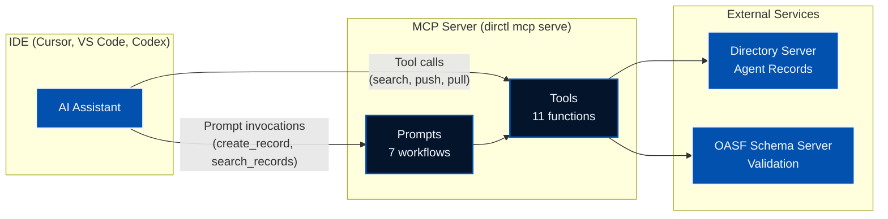

The Model Context Protocol (MCP) has emerged as a powerful standard for connecting AI assistants with external tools and data sources. In this post, we'll explore the Directory MCP server—a feature that brings AI agent discovery and management directly into your IDE, enabling seamless interaction with the Directory ecosystem.

<!--more-->

## What is Directory?

[Directory](https://github.com/agntcy/dir) is a distributed peer-to-peer network for publishing, exchanging, and discovering information about AI agents. It uses [OASF (Open Agentic Schema Framework)](https://github.com/agntcy/oasf) to describe AI agents with structured metadata, enabling:

- **Capability-Based Discovery**: Find agents based on their functional characteristics using hierarchical skill and domain taxonomies
- **Verifiable Claims**: Cryptographic mechanisms ensure data integrity and provenance tracking
- **Distributed Architecture**: Content-addressing and distributed hash tables (DHT) for scalable discovery across decentralized networks
- **Multi-Format Support**: Import and export between OASF, A2A (Agent-to-Agent), and MCP formats

## Why an MCP Server?

While Directory provides CLI tools and SDKs for interacting with the network, developers increasingly work within AI-assisted IDEs like [Cursor](https://cursor.com), [VS Code](https://code.visualstudio.com) or [Codex](https://openai.com/codex/). The MCP server bridges this gap by exposing Directory functionality directly to AI assistants, allowing you to:

- Search for agents using natural language
- Validate and push agent records without leaving your editor
- Generate OASF records by analyzing your codebase
- Import and export between different agent formats

Instead of context-switching to the terminal, you can simply ask your AI assistant to perform these operations.

## Architecture

The MCP server acts as a bridge between your AI assistant and the Directory ecosystem:



The server communicates via stdin/stdout using the MCP protocol, making it compatible with any MCP-enabled IDE.

## Prerequisites

Before setting up the MCP server, you'll need:

1. **dirctl CLI** - Install via [Homebrew](https://github.com/agntcy/dir/tree/main/HomebrewFormula) or download from [GitHub Releases](https://github.com/agntcy/dir/releases). Alternatively, use the Docker image.

2. **A running Directory server** - Either:
   - **Local development**: Start one with `task server:start` in the [Directory repository](https://github.com/agntcy/dir), or use Docker Compose:
     ```bash
     cd install/docker && docker compose up -d
     ```
   - **Remote server**: Use an existing Directory deployment (e.g., `prod.gateway.ads.outshift.io:443`)

3. **An MCP-enabled IDE** - Such as [Cursor](https://cursor.com), [VS Code](https://code.visualstudio.com) or [Codex](https://openai.com/codex/) with an MCP extension.

## Setup

The MCP server runs via the `dirctl` CLI tool. Below are configuration instructions some AI IDEs, with both binary and Docker options.

### Cursor

Add the MCP server to your Cursor configuration at `~/.cursor/mcp.json`:

**Using the binary:**

```json
{
  "mcpServers": {
    "dir-mcp-server": {
      "command": "/path/to/dirctl",
      "args": ["mcp", "serve"],
      "env": {
        "OASF_API_VALIDATION_SCHEMA_URL": "https://schema.oasf.outshift.com",
        "DIRECTORY_CLIENT_SERVER_ADDRESS": "localhost:8888"
      }
    }
  }
}
```

**Using Docker:**

```json
{
  "mcpServers": {
    "dir-mcp-server": {
      "command": "docker",
      "args": [
        "run", "--rm", "-i",
        "-e", "OASF_API_VALIDATION_SCHEMA_URL=https://schema.oasf.outshift.com",
        "-e", "DIRECTORY_CLIENT_SERVER_ADDRESS=localhost:8888",
        "ghcr.io/agntcy/dir-ctl:latest",
        "mcp", "serve"
      ]
    }
  }
}
```

After saving, restart Cursor for the changes to take effect.

### VS Code

For VS Code with GitHub Copilot, add the MCP server to your workspace configuration at `.vscode/mcp.json`, or to your user settings at `~/.vscode/mcp.json` for global availability:

**Using the binary:**

```json
{
  "servers": {
    "dir-mcp-server": {
      "command": "/path/to/dirctl",
      "args": ["mcp", "serve"],
      "env": {
        "OASF_API_VALIDATION_SCHEMA_URL": "https://schema.oasf.outshift.com",
        "DIRECTORY_CLIENT_SERVER_ADDRESS": "localhost:8888"
      }
    }
  }
}
```

**Using Docker:**

```json
{
  "servers": {
    "dir-mcp-server": {
      "command": "docker",
      "args": [
        "run", "--rm", "-i",
        "-e", "OASF_API_VALIDATION_SCHEMA_URL=https://schema.oasf.outshift.com",
        "-e", "DIRECTORY_CLIENT_SERVER_ADDRESS=localhost:8888",
        "ghcr.io/agntcy/dir-ctl:latest",
        "mcp", "serve"
      ]
    }
  }
}
```

### Codex

For OpenAI's Codex, you can also add the MCP server config to you workspace configuration at `.codex/config.toml` or to your settings at `~/.codex/config.toml`:

**Using the binary:**

```toml
[mcp_servers.dir-mcp-server]
command = "/path/to/dirctl"
args = ["mcp", "serve"]

[mcp_servers.dir-mcp-server.env]
OASF_API_VALIDATION_SCHEMA_URL = "https://schema.oasf.outshift.com"
DIRECTORY_CLIENT_SERVER_ADDRESS = "localhost:8888"
```

**Using Docker:**

```toml
[mcp_servers.dir-mcp-server]
command = "docker"
args = [
  "run", "--rm", "-i",
  "-e", "OASF_API_VALIDATION_SCHEMA_URL=https://schema.oasf.outshift.com",
  "-e", "DIRECTORY_CLIENT_SERVER_ADDRESS=localhost:8888",
  "ghcr.io/agntcy/dir-ctl:latest",
  "mcp", "serve"
]
```

**Note:** When using Docker, environment variables must be passed via `-e` flags in the args array, not in the `env` section.

### Connecting to a Remote Directory Server

To connect to a remote Directory server (e.g., the production gateway), update the environment variables to include the server address and GitHub authentication:

| Variable | Value |
|----------|-------|
| `OASF_API_VALIDATION_SCHEMA_URL` | `https://schema.oasf.outshift.com` |
| `DIRECTORY_CLIENT_SERVER_ADDRESS` | `prod.gateway.ads.outshift.io:443` |
| `DIRECTORY_CLIENT_AUTH_MODE` | `github` |
| `DIRECTORY_CLIENT_GITHUB_TOKEN` | Your GitHub PAT |

Generate a PAT at [GitHub Settings > Developer settings > Personal access tokens](https://github.com/settings/tokens) with `user:email` and `read:org` scopes.

## Usage Examples

Once the Directory MCP server is installed, you can use it to arrange different type of tasks. Here are two real-world scenarios.

### Scenario 1: Publishing Your Agents to Directory

In this scenario, you've built a multi-agent system and want to publish each agent to Directory so others can discover them. We'll use the [Tourist Scheduling System](https://github.com/agntcy/agentic-apps/tree/main/tourist_scheduling_system) as an example—a system with 4 agents built with Google's Agent Development Kit (ADK).

**Step 1: Generate OASF records for each agent**

Open your project in Cursor and ask the AI to create records for each agent:

> "Create OASF record `schema_version 1.0.0` for all agents in the src/agents/ folder. Use the installed directory mcp server's tools for this task. Save the created records in the project's root."

The AI analyzes your codebase, queries the OASF schema for valid skills and domains, and generates complete records.

**Scheduler Agent** - The central coordinator:

```json
{
  "schema_version": "1.0.0",
  "name": "tourist-scheduler-agent",
  "version": "1.0.0",
  "description": "Central coordinator agent for the Tourist Scheduling System. Receives tour requests from tourists and availability offers from guides, runs a greedy scheduling algorithm to match tourists with guides based on preferences, availability, and budget. Exposed via A2A protocol with HTTP and SLIM transport support.",
  "authors": ["AGNTCY Contributors"],
  "created_at": "2026-02-11T14:00:00Z",
  "skills": [
    {"id": 1003, "name": "agent_orchestration/multi_agent_planning"},
    {"id": 1004, "name": "agent_orchestration/agent_coordination"},
    {"id": 1005, "name": "agent_orchestration/negotiation_resolution"},
    {"id": 1002, "name": "agent_orchestration/role_assignment"}
  ],
  "domains": [
    {"id": 1506, "name": "hospitality_and_tourism/travel_services"},
    {"id": 1505, "name": "hospitality_and_tourism/tourism_management"}
  ],
  "locators": [
    {"type": "source_code", "urls": ["https://github.com/agntcy/agentic-apps/tree/main/tourist_scheduling_system/src/agents/scheduler_agent.py"]}
  ]
}
```

**Guide Agent** - Offers tour services:

```json
{
  "schema_version": "1.0.0",
  "name": "tourist-guide-agent",
  "version": "1.0.0",
  "description": "Tour guide agent that communicates with the scheduler to offer tour services. Creates and sends guide offers with specializations, availability windows, hourly rates, and group size limits. Receives assignment confirmations and manages availability. Uses ADK RemoteA2aAgent with HTTP or SLIM transport.",
  "authors": ["AGNTCY Contributors"],
  "created_at": "2026-02-11T14:00:00Z",
  "skills": [
    {"id": 1004, "name": "agent_orchestration/agent_coordination"},
    {"id": 1005, "name": "agent_orchestration/negotiation_resolution"}
  ],
  "domains": [
    {"id": 1506, "name": "hospitality_and_tourism/travel_services"}
  ],
  "locators": [
    {"type": "source_code", "urls": ["https://github.com/agntcy/agentic-apps/tree/main/tourist_scheduling_system/src/agents/guide_agent.py"]}
  ]
}
```

**Tourist Agent** - Requests tour services:

```json
{
  "schema_version": "1.0.0",
  "name": "tourist-tourist-agent",
  "version": "1.0.0",
  "description": "Tourist agent that communicates with the scheduler to request tour services. Creates and sends tour requests with preferences, availability windows, and budget constraints. Receives schedule proposals with matched guides. Uses ADK RemoteA2aAgent with HTTP or SLIM transport.",
  "authors": ["AGNTCY Contributors"],
  "created_at": "2026-02-11T14:00:00Z",
  "skills": [
    {"id": 1004, "name": "agent_orchestration/agent_coordination"}
  ],
  "domains": [
    {"id": 1506, "name": "hospitality_and_tourism/travel_services"}
  ],
  "locators": [
    {"type": "source_code", "urls": ["https://github.com/agntcy/agentic-apps/tree/main/tourist_scheduling_system/src/agents/tourist_agent.py"]}
  ]
}
```

**UI Agent** - Real-time dashboard:

```json
{
  "schema_version": "1.0.0",
  "name": "tourist-ui-agent",
  "version": "1.0.0",
  "description": "Dashboard agent that monitors the Tourist Scheduling System and provides real-time visibility into system state. Connects to the scheduler as a RemoteA2aAgent, maintains dashboard state (tourists, guides, assignments, metrics), and provides natural language summaries of scheduling activity via WebSocket updates.",
  "authors": ["AGNTCY Contributors"],
  "created_at": "2026-02-11T14:00:00Z",
  "skills": [
    {"id": 1004, "name": "agent_orchestration/agent_coordination"}
  ],
  "domains": [
    {"id": 1506, "name": "hospitality_and_tourism/travel_services"}
  ],
  "locators": [
    {"type": "source_code", "urls": ["https://github.com/agntcy/agentic-apps/tree/main/tourist_scheduling_system/src/agents/ui_agent.py"]}
  ]
}
```

**Step 2: Validate the records**

Before publishing, validate each record against the OASF schema:

> "Validate these OASF records with the MCP server's `agntcy_oasf_validate_record` tool."

```json
{"schema_version": "1.0.0", "valid": true, "validation_errors": ["WARNING: Recommended attribute \"modules\" is missing."]}
```

All records are valid. The warning about `modules` is optional—it's used for agents that expose MCP tools.

**Step 3: Push to Directory**

Push all agents to your Directory node:

> "Push these records to Directory"

| Agent | CID |
|-------|-----|
| tourist-scheduler-agent | `baeareifmeckgczj35wcy6fpdhwttdbkjkskbcktarufpgfvc4xcmhjc2k4` |
| tourist-guide-agent | `baeareicotuifn25dker2qdxmh3ygummhfe3uduai5z546ywov43cwlxeoq` |
| tourist-tourist-agent | `baeareibfhsxilernxc2szj2x3znbz4s5pdpymrt5qdhe6gsjgohulvldji` |
| tourist-ui-agent | `baeareiff6cb7caqbq7fn4px25fykjof2toa4s47vfos7vvybxmdu2gadji` |

Each CID (Content Identifier) is a unique, content-addressed hash that anyone can use to retrieve the agent's record from the Directory network.

**Step 4: Sign the records**

After pushing, sign the records to establish trust and provenance using the `dirctl` CLI. Directory uses [Sigstore](https://www.sigstore.dev/) for keyless signing—no need to manage your own keys.

**Sign with OIDC (recommended):**

```bash
$ dirctl sign baeareifmeckgczj35wcy6fpdhwttdbkjkskbcktarufpgfvc4xcmhjc2k4
Your browser will now be opened to:
https://oauth2.sigstore.dev/auth/auth?access_type=online&client_id=sigstore&...
Record is: signed
```

This opens a browser for authentication with Sigstore's OIDC provider (supports GitHub, Google, Microsoft). Sigstore issues a short-lived certificate from [Fulcio](https://docs.sigstore.dev/certificate_authority/overview/) tied to your identity, signs the record, and logs the signature to the [Rekor](https://docs.sigstore.dev/logging/overview/) transparency log.

**Sign with a private key (for CI/CD):**

```bash
dirctl sign <cid> --key /path/to/cosign.key
```

Supports various key sources: local files, environment variables (`env://COSIGN_PRIVATE_KEY`), or KMS providers (AWS KMS, GCP KMS, Azure Key Vault, HashiCorp Vault).

**Sign all agents:**

```bash
dirctl sign baeareifmeckgczj35wcy6fpdhwttdbkjkskbcktarufpgfvc4xcmhjc2k4
dirctl sign baeareicotuifn25dker2qdxmh3ygummhfe3uduai5z546ywov43cwlxeoq
dirctl sign baeareibfhsxilernxc2szj2x3znbz4s5pdpymrt5qdhe6gsjgohulvldji
dirctl sign baeareiff6cb7caqbq7fn4px25fykjof2toa4s47vfos7vvybxmdu2gadji
```

**Step 5: Verify the signatures**

Anyone can verify a record's signature using the MCP server:

> "Verify the signature for record baeareifmeckgczj35wcy6fpdhwttdbkjkskbcktarufpgfvc4xcmhjc2k4"

```json
{
  "success": true,
  "message": "trusted",
  "signers": [
    {
      "identity": "adam.tagscherer@gmail.com",
      "issuer": "https://github.com/login/oauth"
    }
  ]
}
```

All 4 agents are now verified as trusted:

| Agent | Status | Signer |
|-------|--------|--------|
| tourist-scheduler-agent | trusted | adam.tagscherer@gmail.com (GitHub) |
| tourist-guide-agent | trusted | adam.tagscherer@gmail.com (GitHub) |
| tourist-tourist-agent | trusted | adam.tagscherer@gmail.com (GitHub) |
| tourist-ui-agent | trusted | adam.tagscherer@gmail.com (GitHub) |

This confirms each record was signed by a verified GitHub identity and hasn't been tampered with.

**Step 6: Publish to the DHT**

The final step is publishing your records to the distributed hash table (DHT), making them discoverable by other peers on the Directory network:

```bash
$ dirctl routing publish baeareifmeckgczj35wcy6fpdhwttdbkjkskbcktarufpgfvc4xcmhjc2k4
Successfully submitted publication request
Record will be discoverable by other peers once the publication service processes the request
```

**Publish all agents:**

```bash
dirctl routing publish baeareifmeckgczj35wcy6fpdhwttdbkjkskbcktarufpgfvc4xcmhjc2k4
dirctl routing publish baeareicotuifn25dker2qdxmh3ygummhfe3uduai5z546ywov43cwlxeoq
dirctl routing publish baeareibfhsxilernxc2szj2x3znbz4s5pdpymrt5qdhe6gsjgohulvldji
dirctl routing publish baeareiff6cb7caqbq7fn4px25fykjof2toa4s47vfos7vvybxmdu2gadji
```

Your agents are now fully published to the Directory network—signed, verified, and discoverable by anyone!

### Scenario 2: Discovering and Installing an Agent

You're building an Azure application and need access to Microsoft's documentation directly in your IDE. Instead of switching between browser tabs, you ask your AI assistant to find an MCP server that can help.

> We're using Microsoft Learn for this example because it's a **remote MCP server that requires no authentication**—making it easy to demonstrate.

**Step 1: Search for an agent with the capability you need**

> "Search Directory for agents that can help with Microsoft documentation"

```json
{
  "count": 1,
  "has_more": false,
  "record_cids": ["baeareichybxgzdz36nr7kaskepwqu5hhizu5dbr5tsujx7p56kk3pgsdsi"]
}
```

Found a match! Let's see what it is.

**Step 2: Pull the record to inspect it**

> "Pull that record and show me the details"

```json
{
  "name": "microsoft-learn-mcp",
  "version": "1.0.0",
  "description": "Official Microsoft Learn MCP Server providing real-time, trusted documentation and code samples for AI assistants and LLMs.",
  "authors": ["Microsoft"],
  "skills": [
    {"name": "natural_language_processing/information_retrieval_synthesis"},
    {"name": "retrieval_augmented_generation/retrieval_of_information"}
  ],
  "modules": [
    {
      "name": "integration/mcp",
      "data": {
        "name": "microsoft-learn",
        "connections": [
          {
            "type": "streamable-http",
            "url": "https://learn.microsoft.com/api/mcp"
          }
        ],
        "tools": [
          {"name": "microsoft_docs_search", "description": "Search Microsoft Learn documentation"},
          {"name": "microsoft_docs_fetch", "description": "Fetch full content from a documentation page"},
          {"name": "microsoft_code_sample_search", "description": "Search for code samples"}
        ]
      }
    }
  ]
}
```

This is exactly what we need—Microsoft's official MCP server. Notice the `connections` field shows this is a **remote MCP server** (`streamable-http`), so we don't need to install anything locally.

**Step 3: Configure the MCP server in your IDE**

Here's the key insight: **the AI assistant can update your IDE configuration directly**. Ask it to add the MCP server:

> "Add the Microsoft Learn MCP server to my Cursor config"

The assistant reads the connection details from the OASF record and updates `~/.cursor/mcp.json`:

```json
{
  "mcpServers": {
    "microsoft-learn": {
      "url": "https://learn.microsoft.com/api/mcp"
    }
  }
}
```

No manual configuration required—the assistant handles it.

**Step 4: Start using the new capability**

After restarting Cursor, you now have access to Microsoft's documentation tools. Let's try them:

> "Explain Azure Blob Storage"

The assistant uses the `microsoft_docs_search` tool:

```json
{
  "results": [
    {
      "title": "Introduction to Azure Blob Storage",
      "content": "Azure Blob Storage is Microsoft's object storage solution for the cloud. Blob Storage is optimized for storing massive amounts of unstructured data...",
      "contentUrl": "https://learn.microsoft.com/azure/storage/blobs/storage-blobs-introduction"
    }
  ]
}
```

And provides a comprehensive answer with up-to-date documentation:

**Azure Blob Storage** is Microsoft's object storage solution optimized for storing massive amounts of unstructured data. It's designed for:
- Serving images/documents directly to browsers
- Storing files for distributed access
- Streaming video and audio
- Backup, disaster recovery, and archiving

The storage hierarchy consists of **Storage Accounts** → **Containers** → **Blobs** (Block, Append, or Page blobs).

> "Show me Python code samples for uploading to Azure Blob Storage"

The assistant uses the `microsoft_code_sample_search` tool:

```python
from azure.storage.blob import BlobServiceClient

connection_string = "your_connection_string"
blob_service_client = BlobServiceClient.from_connection_string(connection_string)

container_client = blob_service_client.get_container_client("my-container")
with open("local-file.txt", "rb") as data:
    container_client.upload_blob(name="uploaded-file.txt", data=data)
```

This is the power of Directory: discoverable agents from trusted sources like Microsoft, with standardized metadata that the AI assistant can use to **automatically configure and start using new capabilities**.

## Video Walkthrough

If you prefer a visual demonstration, check out this video where I walk through the Directory MCP server in action:

<div style="position: relative; padding-bottom: 56.25%; height: 0; overflow: hidden; max-width: 100%; margin-bottom: 1.5em;">
  <iframe src="https://www.youtube.com/embed/pdVqhlyJHo4" style="position: absolute; top: 0; left: 0; width: 100%; height: 100%;" frameborder="0" allowfullscreen></iframe>
</div>

## The Bigger Picture

The Directory MCP server is part of a broader vision for AI agent interoperability. By standardizing how agents describe their capabilities (OASF), how they're discovered (Directory), and how they communicate (A2A), we're building infrastructure for an ecosystem where:

- Agents can find and collaborate with other agents
- Developers can discover pre-built agents for their needs
- Organizations can publish and share agents securely

The MCP server brings this infrastructure directly into developer workflows, reducing friction and enabling AI-assisted agent development.

Check out the [Directory documentation](https://docs.agntcy.org/dir/overview/) for a complete walkthrough, and the [MCP server README](https://github.com/agntcy/dir/tree/main/mcp) for detailed configuration options.

## References

- [Directory GitHub Repository](https://github.com/agntcy/dir)
- [Directory MCP Server README](https://github.com/agntcy/dir/tree/main/mcp)
- [Directory Documentation](https://docs.agntcy.org/dir/overview/)
- [OASF (Open Agent Standard Format)](https://github.com/agntcy/oasf)
- [Model Context Protocol](https://modelcontextprotocol.io/)
- [MCP Go SDK](https://github.com/modelcontextprotocol/go-sdk)

---

*Have questions about Directory or the MCP server? Join our [Slack community](https://join.slack.com/t/agntcy/shared_invite/zt-3hb4p7bo0-5H2otGjxGt9OQ1g5jzK_GQ) or check out our [GitHub](https://github.com/agntcy).*
