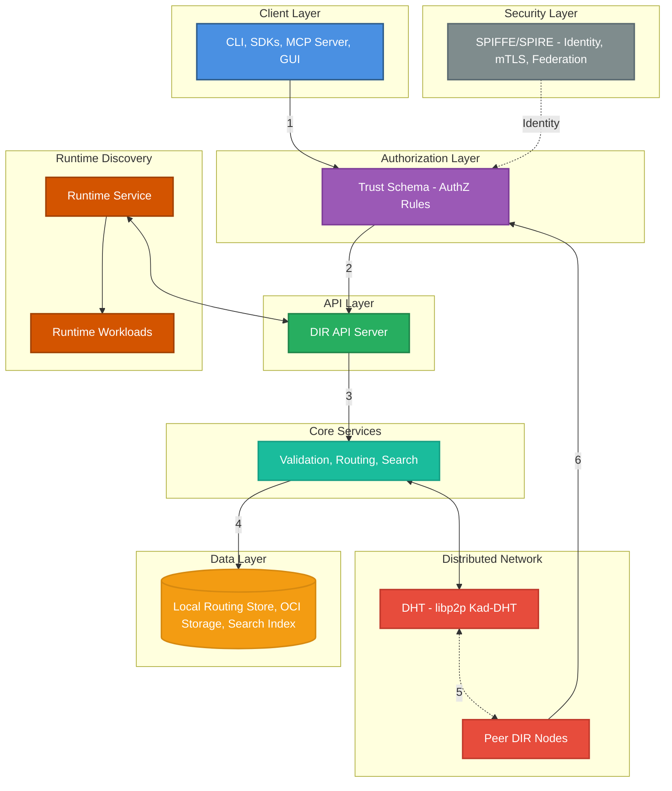

As AI systems evolve from isolated models into interconnected networks of specialized agents, a critical challenge emerges: how do agents find each other? How does an AI application discover which agents can perform image recognition, natural language translation, or financial analysis? How do developers publish their agents so others can find and use them?

Traditional service discovery systems weren't designed for the agentic AI ecosystem. They lack semantic understanding of agent capabilities, don't support skill-based discovery, and can't handle the rich metadata that describes what agents can do. Developer platforms often resort to centralized marketplaces or proprietary directories, fragmenting the ecosystem and limiting agent reusability.

Enter [DIR (Directory)](https://docs.agntcy.org/dir/overview/), a distributed directory service designed specifically for announcing and discovering AI agents across multi-agentic systems. DIR enables agents to publish their capabilities using structured metadata defined by the [Open Agentic Schema Framework (OASF)](https://docs.agntcy.org/oasf/open-agentic-schema-framework/), and allows others to discover them through capability-based queries. Whether you're building a multi-agent AI system, an agent marketplace, or a platform that coordinates specialized AI services, DIR provides the discovery infrastructure you need.

## The Problem: Agent Discovery at Scale

Modern AI applications increasingly rely on specialized agents working together:

- **Multi-agent workflows** where different agents handle specific tasks (data processing, analysis, synthesis)
- **Agent marketplaces** where developers publish agents for others to discover and use
- **Dynamic agent coordination** where systems discover and invoke agents based on current requirements
- **Federated AI services** spanning organizations, platforms, and deployment environments

These scenarios require sophisticated discovery capabilities:

1. **Capability-based search** — Find agents by what they *can do*, not just by name or identifier
2. **Semantic discovery** — Match agent capabilities to requirements using hierarchical skill taxonomies
3. **Verifiable metadata** — Trust that agent descriptions are authentic and haven't been tampered with
4. **Distributed architecture** — Enable discovery across organizational boundaries without centralized control
5. **Protocol flexibility** — Support various agent protocols (A2A, MCP) while maintaining semantic consistency
6. **Developer experience** — Make it simple to publish and discover agents programmatically

Existing solutions fall short. DNS-based service discovery provides naming but lacks semantic understanding. Cloud-native service meshes focus on network routing, not capability matching. Container registries store artifacts but don't organize by functional attributes. Centralized marketplaces work within single platforms but don't enable cross-platform discovery.

DIR was built to solve exactly these challenges, providing a distributed, capability-aware directory service purpose-built for the agentic AI ecosystem.

## What is DIR?

DIR (Directory) is a distributed directory service that enables agents to announce their capabilities and allows others to discover them through capability-based queries. Built on proven distributed systems principles, DIR uses content-addressing for global uniqueness and distributed hash tables (DHT) for scalable discovery across decentralized networks.

At its core, DIR combines:

- **Capability-based discovery** — Agents publish structured metadata describing their functional characteristics as defined by OASF
- **Hierarchical skill taxonomy** — Capabilities organized through semantic taxonomies for efficient matching
- **Content-addressed naming** — Cryptographic hashes (CIDs) ensure global uniqueness and data integrity
- **Distributed architecture** — DHT-based routing enables scalable discovery without centralized control
- **Verifiable claims** — Cryptographic signing provides data integrity and provenance tracking
- **OCI integration** — Standard OCI distribution protocol for interoperable storage and retrieval
- **Multi-protocol support** — Native integration with A2A, MCP, and custom agent protocols

DIR enables developers to publish agent metadata once and make it discoverable across the entire ecosystem, while consumers can find the right agents for their needs through natural capability queries.

## Architecture Overview

The following diagram illustrates how DIR's components work together to enable distributed agent discovery:



**Request Tracing:**

- **Client Request Flow** (1→2→3→4): Client → AuthZ → API Server → Core Services → Data Layer
- **Peer Request Flow** (A→B): Peer DIR Node → AuthZ → API Server (then follows same path as client)

**Component Overview:**

- **Client Layer** (blue): Developer interfaces including CLI, language SDKs, MCP server for AI assistants, and GUI application
- **Authorization Layer** (purple): Trust schema enforcing authorization rules based on SPIFFE IDs for all incoming requests
- **API Layer** (green): gRPC-based API server handling all client requests
- **Core Services** (purple): Business logic for OASF validation, cryptographic signing/verification, skill-based content routing, and search/query engine
- **Data Layer** (orange): Local routing store for skill-to-CID mappings, OCI-compliant storage for records, and SQL-based search index
- **Distributed Network** (red): DHT for peer discovery and cross-node routing via libp2p Kad-DHT; peer nodes interact through the authorization layer
- **Runtime Discovery** (teal): Dynamic discovery of agents running in Kubernetes and Docker environments
- **Security Layer** (gray): SPIFFE/SPIRE provides workload identity and mTLS; SPIRE Federation enables trust bundle exchange between organizations

## Key Strengths and Capabilities

The strengths and capabilities of DIR are:

- [The Problem: Agent Discovery at Scale](#the-problem-agent-discovery-at-scale)
- [What is DIR?](#what-is-dir)
- [Architecture Overview](#architecture-overview)
- [Key Strengths and Capabilities](#key-strengths-and-capabilities)
  - [Capability-Based Discovery with OASF](#capability-based-discovery-with-oasf)
  - [Content-Addressed Naming and Global Uniqueness](#content-addressed-naming-and-global-uniqueness)
  - [Distributed DHT-Based Routing](#distributed-dht-based-routing)
  - [Security, Identity, and Trust](#security-identity-and-trust)
    - [Content Integrity and Verification](#content-integrity-and-verification)
    - [Zero-Trust Security with SPIFFE/SPIRE](#zero-trust-security-with-spiffespire)
    - [Trust Chain Verification](#trust-chain-verification)
  - [OCI-Based Distributed Storage](#oci-based-distributed-storage)
  - [Runtime Discovery Integration](#runtime-discovery-integration)
  - [Developer-Friendly Tools](#developer-friendly-tools)
- [Real-World Use Cases](#real-world-use-cases)
  - [Building Agent Marketplaces](#building-agent-marketplaces)
  - [Multi-Agent System Coordination](#multi-agent-system-coordination)
  - [Federated Agent Networks](#federated-agent-networks)
  - [Protocol-Agnostic Discovery](#protocol-agnostic-discovery)
- [Getting Started](#getting-started)
  - [Installation](#installation)
  - [Quick Example: Creating and Publishing Your First Agent Record](#quick-example-creating-and-publishing-your-first-agent-record)
  - [Importing from Other Formats](#importing-from-other-formats)
- [The Road Ahead](#the-road-ahead)
- [Why DIR Matters](#why-dir-matters)
- [Get Involved](#get-involved)

### Capability-Based Discovery with OASF

DIR leverages the [Open Agentic Schema Framework (OASF)](https://docs.agntcy.org/oasf/open-agentic-schema-framework/) to provide standardized, capability-based agent discovery. OASF defines a structured schema for describing AI agents through:

**Skills Taxonomy**: Hierarchical organization of agent capabilities, from high-level categories like "natural language processing" down to specific skills like "sentiment analysis" or "named entity recognition". The current skill taxonomy is available at [Taxonomy of AI Agent Skills](https://schema.oasf.outshift.com/0.7.0/main_skills).

**Domain Classification**: Agents can be categorized by application domains such as "healthcare", "finance", or "manufacturing", enabling domain-specific discovery.

**Modular Extensions**: OASF records support modular extensions for protocol-specific metadata (A2A cards, MCP server configurations, GitHub Copilot integrations), allowing agents to work seamlessly across different agent frameworks.

When publishing an agent to DIR, you create an OASF record that includes:

```json
{
  "name": "example.org/image-analysis-agent",
  "schema_version": "1.0.0",
  "version": "v1.0.0",
  "description": "AI agent for advanced image analysis and object detection",
  "authors": ["developer@example.com"],
  "skills": [
    {
      "name": "computer_vision/image_analysis",
      "id": 201
    },
    {
      "name": "computer_vision/object_detection",
      "id": 202
    }
  ],
  "domains": [
    {
      "name": "technology/artificial_intelligence",
      "id": 101
    }
  ],
  "locators": [
    {
      "type": "docker_image",
      "url": "ghcr.io/example/image-analysis:v1.0.0"
    }
  ]
}
```

DIR indexes records by their skills and domains, enabling natural capability-based queries like:

- "Find agents with image analysis capabilities"
- "Discover agents that can perform sentiment analysis"
- "Show me all agents in the healthcare domain with natural language processing skills"

This semantic approach to discovery is far more powerful than simple name-based lookups, enabling developers to find the right agents based on what they need them to *do*.

### Content-Addressed Naming and Global Uniqueness

DIR uses [Content Identifiers (CIDs)](https://github.com/multiformats/cid) for naming directory records. CIDs provide a self-describing, content-addressed naming scheme that ensures:

**Global Uniqueness**: CIDs are cryptographic hashes of the record content, making them globally unique without requiring a central authority to assign identifiers.

**Immutability**: Any change to a record produces a different CID, providing a natural versioning mechanism and tamper detection.

**Self-Verification**: Anyone can verify that the content matches its CID by recomputing the hash, enabling trustless verification.

Example CID:
```
bafkreiabcd1234567890abcdefghijklmnopqrstuvwxyz01234567890
```

In addition to CID-based addressing, DIR supports **verifiable domain-based names** that enable human-readable references while maintaining cryptographic verification. For example, `example.org/my-agent` can be mapped to a CID while preserving the trust model through DNS-based verification.

This dual naming approach provides both the usability of human-readable names and the security guarantees of content-addressed identifiers.

### Distributed DHT-Based Routing

DIR implements a two-phase discovery process powered by distributed hash tables (DHT):

**1. Capability-to-Record Mapping**

When an agent publishes its capabilities, DIR:
- Extracts skills from the OASF record
- Announces the record's CID associated with those skills to the DHT
- Updates routing tables that map skill taxonomies to record identifiers

**2. Record-to-Server Mapping**

DIR tracks which directory nodes store which records:
- When a node stores a record, it announces its availability to the DHT
- The DHT maintains mappings from CIDs to server addresses
- Query resolution identifies optimal data sources

Discovery queries execute this two-phase process:

```
Query: "agents with natural_language_processing skills"
  ↓
Phase 1: DHT lookup → matches CIDs of records with NLP skills
  ↓
Phase 2: DHT lookup → finds servers hosting those CIDs
  ↓
Result: Download records from identified servers
```

DIR uses [libp2p Kad-DHT](https://github.com/libp2p/specs/tree/master/kad-dht) for both server and content discovery, providing a proven, scalable foundation for distributed routing.

This architecture enables:
- **Decentralized operation**: No single point of failure or central authority
- **Scalability**: DHT-based routing scales to thousands of nodes and millions of records
- **Resilience**: Multiple nodes can host the same records, providing redundancy
- **Efficient lookup**: Logarithmic search complexity for fast discovery even at scale

### Security, Identity, and Trust

In distributed agentic systems, trust is paramount. DIR provides a comprehensive security model that combines content integrity and workload identity to enable secure agent discovery across organizational boundaries.

#### Content Integrity and Verification

All records are identified by their CID, enabling anyone to verify that content hasn't been tampered with by recomputing the hash. Records can be signed using private keys, proving authorship and enabling trust decisions based on publisher reputation.

```bash
# Verify a record's signature and trust chain
dirctl verify bafkreiabcd1234567890

# Output includes verification status, signer identity, and trust chain details
```

#### Zero-Trust Security with SPIFFE/SPIRE

DIR leverages [SPIFFE (Secure Production Identity Framework For Everyone)](https://spiffe.io/) and its runtime implementation [SPIRE](https://spiffe.io/docs/latest/spire-about/) to provide zero-trust security for workload communication. This enables:

**Workload Identity**: Every DIR component (API servers, clients, agents) receives a cryptographically verifiable identity in the form of a SPIFFE ID:
```
spiffe://dir.example/ns/production/sa/my-agent
```

**Mutual TLS (mTLS)**: SPIRE issues SVIDs (SPIFFE Verifiable Identity Documents) as X.509 certificates, enabling automatic mTLS between all DIR components. Communication is encrypted and both parties are authenticated without manual certificate management.

**Cross-Organization Federation**: Organizations can federate their SPIRE deployments by exchanging trust bundles. This enables secure, authenticated communication between DIR nodes in different organizations without custom integration:

```yaml
# Example federation configuration
dir:
  apiserver:
    spire:
      enabled: true
      trustDomain: dir.example
      federation:
        - trustDomain: partner.example
          bundleEndpointURL: https://partner.example/spire/bundle
```

**Policy-Based Access Control**: SPIFFE IDs enable fine-grained authorization policies. Organizations can define which workloads can push records, which can query, and which external trust domains are authorized for federation.

#### Trust Chain Verification

DIR supports local trust chain verification, allowing organizations to:
- Establish their own trust anchors
- Define verification policies for external records
- Validate complete provenance chains from publisher to record
- Make informed decisions about agent selection based on trust policies specific to their use case

This multi-layered security approach—combining content-addressed integrity and workload identity via SPIFFE—enables secure agent discovery across organizational boundaries without requiring a centralized trust authority.

### OCI-Based Distributed Storage

DIR differs from block storage systems like [IPFS](https://ipfs.tech/) in its approach to distributed object storage, leveraging the **OCI (Open Container Initiative) distribution specification** for content storage and retrieval.

**Simplified Content Retrieval**

- DIR directly stores complete records rather than splitting them into blocks
- Records are retrieved as complete units using standard OCI protocols
- No complex block reassembly or multi-source optimization needed

**OCI Integration Benefits**

- Records are stored and transferred using OCI artifacts
- Any OCI distribution-compliant server can participate in the DIR network
- Servers retrieve records from each other using well-established OCI protocols
- Existing OCI infrastructure (registries, caching layers, CDNs) can be leveraged

**Reference Implementation**

While DIR uses [zot](https://zotregistry.dev/) as its reference OCI server implementation, the system works with **any server that implements the OCI distribution specification**. This means you can use existing container registries like Docker Registry, Harbor, or cloud-provider managed registries as DIR storage backends.

This OCI-based approach provides:
- **Interoperability**: Leverage existing OCI tooling and infrastructure
- **Simplicity**: Standard HTTP-based protocol without custom networking requirements
- **Enterprise integration**: Use existing OCI registries and security policies
- **Efficiency**: Single-request record retrieval without block coordination overhead

### Runtime Discovery Integration

DIR includes a **runtime discovery service** that automatically discovers and indexes agent workloads running in container environments, bridging the gap between deployed agents and directory records.

The runtime discovery system:

**Watches Container Workloads**
- Monitors Docker containers and Kubernetes pods
- Detects agents through standard labels or annotations
- Tracks lifecycle events (creation, updates, termination)

**Resolves Metadata**
- Extracts A2A cards or OASF records from agent endpoints
- Validates metadata against OASF schema
- Enriches records with runtime information (endpoints, health status)

**Exposes Discovery API**
- Provides gRPC API for querying discovered agents
- Integrates with Directory storage for persistent records
- Enables dynamic agent discovery in orchestrated environments

Example: In a Kubernetes cluster, developers can label their agent pods:

```yaml
apiVersion: v1
kind: Pod
metadata:
  name: translation-agent
  labels:
    agent.dir.agntcy.org/discover: "true"
```

The DIR runtime discovers these pods, fetches their metadata, and makes them queryable alongside statically published records. This enables hybrid discovery where some agents are published ahead of time while others are discovered dynamically as they're deployed.

### Developer-Friendly Tools

DIR provides a comprehensive suite of tools that make it easy to publish, discover, and work with agent records:

**CLI Tool (dirctl)**

The `dirctl` command-line tool provides intuitive commands for all DIR operations:

```bash
# Create an OASF record
dirctl create record --name "my-agent" --version "v1.0.0" \
  --skill "natural_language_processing/text_completion" \
  --domain "technology/artificial_intelligence"

# Validate the record
dirctl validate record.json

# Publish to DIR
dirctl push record.json

# Search for agents
dirctl search --skill "computer_vision/image_analysis"

# Pull a record by CID
dirctl pull bafkreiabcd1234567890
```

Installation is simple via Homebrew or direct binary download:

```bash
# Homebrew
brew tap agntcy/dir
brew install dirctl

# Or download from GitHub Releases
# Available for macOS, Linux, and Windows
```

**Language SDKs**

DIR provides SDKs for multiple languages:

- **Go**: Native integration via `github.com/agntcy/dir/client`
- **Python**: `pip install agntcy-dir`
- **JavaScript**: `npm install agntcy-dir`

Example Python usage:

```python
from agntcy_dir import DirectoryClient

# Connect to DIR
client = DirectoryClient("localhost:8888")

# Create and publish a record
record = {
    "name": "example.org/my-agent",
    "schema_version": "1.0.0",
    "skills": [{"name": "natural_language_processing/text_completion", "id": 101}],
    # ... other fields
}
cid = client.push_record(record)

# Search for agents
results = client.search(skill_names=["*image*analysis*"])
for cid in results:
    record = client.pull_record(cid)
    print(f"Found: {record['name']}")
```

**MCP Server Integration**

DIR includes a [Model Context Protocol (MCP)](https://modelcontextprotocol.io/) server that enables AI assistants like Claude, ChatGPT, or Cursor to interact with the directory directly. This provides a natural language interface for discovering and working with agents:

```bash
# Start the MCP server
dirctl mcp serve
```

Once configured in your AI assistant, you can use natural language:

- "Search for agents with image processing capabilities"
- "Validate this OASF record"
- "Import this MCP server configuration to OASF format"
- "Show me all agents in the healthcare domain"

The MCP server exposes all DIR functionality through standardized tools and prompts, making agent discovery accessible to both developers and non-technical users.

**OASF Translation Tools**

DIR includes built-in support for importing and exporting between different agent formats:

```bash
# Import MCP server configuration to OASF
dirctl import mcp server.json --output agent.json

# Export OASF record to A2A card
dirctl export a2a agent.json --output agent-a2a.json

# Export OASF record to GitHub Copilot format
dirctl export ghcopilot agent.json --output copilot-config.json
```

This translation capability ensures DIR can work with agents from any ecosystem, providing a unified discovery layer regardless of the underlying protocol.

## Real-World Use Cases

### Building Agent Marketplaces

DIR provides the foundation for building agent marketplaces where developers can publish agents and users can discover them:

**Publisher Workflow**:
1. Developer creates an agent with specific capabilities
2. Generates an OASF record describing skills, domains, and deployment details
3. Signs the record with their private key for authenticity
4. Publishes to DIR, receiving a CID
5. Shares the CID or human-readable name with potential users

**Consumer Workflow**:
1. User queries DIR for agents with specific capabilities
2. DIR returns matching records with CIDs
3. User reviews metadata, verifies signatures, and checks trust chains
4. User pulls the complete record and retrieves deployment artifacts (Docker images, API endpoints)
5. User deploys or invokes the agent

Example marketplace query:

```bash
# Find sentiment analysis agents in the finance domain
dirctl search \
  --skill "natural_language_processing/sentiment_analysis" \
  --domain "business/finance" \
  --limit 20
```

This decentralized marketplace model enables anyone to publish and discover agents without requiring approval from a central authority or platform lock-in.

### Multi-Agent System Coordination

In complex multi-agent systems, agents need to discover collaborators dynamically:

```python
from agntcy_dir import DirectoryClient

client = DirectoryClient("dir.example.org:8888")

# Agent needs image analysis capability
results = client.search(
    skill_names=["computer_vision/image_analysis"],
    limit=5
)

# Select the best candidate based on metadata
for cid in results:
    record = client.pull_record(cid)
    # Verify signature, check version, evaluate endpoints
    if meets_requirements(record):
        endpoint = record['locators'][0]['url']
        # Invoke the discovered agent
        invoke_agent(endpoint, task_data)
        break
```

This pattern enables **dynamic capability discovery** where agents find and coordinate with each other based on current requirements rather than hardcoded integrations.

### Federated Agent Networks

Organizations can run their own DIR nodes while participating in a federated discovery network:

**Internal Directory Node**: Organization runs a DIR node behind their firewall, containing proprietary agents not shared externally.

**Federation**: The internal node connects to external DIR nodes via DHT, enabling discovery of public agents while keeping internal agents private.

**Policy Enforcement**: Organizations define trust policies determining which external agents can be discovered and used, based on publisher identity, signatures, and verification chains.

This federated model enables both private agent catalogs and participation in the broader ecosystem, with fine-grained control over what's shared and discovered.

### Protocol-Agnostic Discovery

DIR's OASF-based approach provides a unified discovery layer across different agent protocols:

**A2A Agents**: Agents implementing the [Agent-to-Agent protocol](https://a2a-protocol.org/) can be described in OASF records with A2A-specific metadata in modules.

**MCP Servers**: Model Context Protocol servers can be imported to OASF format, indexed by capabilities, and discovered through DIR.

**Custom Protocols**: Organizations developing custom agent protocols can define OASF modules for their specific metadata while leveraging DIR's discovery infrastructure.

Example: A user searching for "text completion" might discover agents using A2A, MCP, or custom protocols—all through a single capability-based query. The OASF record clearly indicates which protocol each agent uses, enabling proper invocation.

## Getting Started

### Installation

Install the DIR CLI:

```bash
# Homebrew
brew tap agntcy/dir
brew install dirctl

# Or download from GitHub Releases
# https://github.com/agntcy/dir/releases
```

Install DIR server components:

```bash
# Docker
docker pull ghcr.io/agntcy/dir-ctl:v1.0.0-rc.3
docker pull ghcr.io/agntcy/dir-apiserver:v1.0.0-rc.3

# Helm (Kubernetes)
helm pull oci://ghcr.io/agntcy/dir/helm-charts/dir --version v1.0.0-rc.3
```

### Quick Example: Creating and Publishing Your First Agent Record

Let's walk through creating an agent record, validating it, and publishing it to DIR:

**1. Create an OASF Record**

```bash
# Using the CLI's interactive creation
dirctl create record \
  --name "example.org/sentiment-analyzer" \
  --version "v1.0.0" \
  --description "AI agent for sentiment analysis of text" \
  --author "developer@example.com" \
  --skill "natural_language_processing/sentiment_analysis" \
  --domain "technology/artificial_intelligence" \
  --locator "docker_image=ghcr.io/example/sentiment:v1.0.0" \
  --output sentiment-agent.json
```

This creates a valid OASF record:

```json
{
  "name": "example.org/sentiment-analyzer",
  "schema_version": "1.0.0",
  "version": "v1.0.0",
  "description": "AI agent for sentiment analysis of text",
  "authors": ["developer@example.com"],
  "created_at": "2026-02-12T00:00:00Z",
  "skills": [
    {
      "name": "natural_language_processing/sentiment_analysis",
      "id": 102
    }
  ],
  "domains": [
    {
      "name": "technology/artificial_intelligence",
      "id": 100
    }
  ],
  "locators": [
    {
      "type": "docker_image",
      "url": "ghcr.io/example/sentiment:v1.0.0"
    }
  ]
}
```

**2. Validate the Record**

```bash
dirctl validate sentiment-agent.json
```

DIR validates against the OASF schema and reports any errors or warnings.

**3. Start a Local DIR Server**

```bash
# Using Docker Compose
cd install/docker
export DIRECTORY_SERVER_OASF_API_VALIDATION_SCHEMA_URL=https://schema.oasf.outshift.com
docker compose up -d
```

**4. Publish to DIR**

```bash
dirctl push sentiment-agent.json --server localhost:8888
```

DIR returns the CID of your published record:

```
Published record: bafkreih2xmnjdpvyk5izqxmq4k6yjkzjz4zn5p7nq
```

**5. Discover Your Agent**

```bash
# Search by skill
dirctl search --skill "sentiment_analysis" --server localhost:8888

# Pull the record by CID
dirctl pull bafkreih2xmnjdpvyk5izqxmq4k6yjkzjz4zn5p7nq --server localhost:8888
```

That's it! Your agent is now discoverable by anyone querying the DIR network for sentiment analysis capabilities.

### Importing from Other Formats

DIR makes it easy to bring existing agents into the ecosystem:

```bash
# Import an MCP server
dirctl import mcp mcp-server.json --output agent.json
dirctl push agent.json

# Import an A2A card
dirctl import a2a a2a-card.json --output agent.json
dirctl push agent.json
```

The translation automatically enriches the imported data with appropriate OASF skills and domains based on the agent's description and capabilities.

## The Road Ahead

DIR is being actively developed as an open-source project under the Apache 2.0 license. The protocol specification has been submitted as an [Internet-Draft](https://spec.dir.agntcy.org/) to the IETF, reflecting its ambition to become a standard for agentic AI discovery.

Current capabilities include:

- OASF-based capability discovery
- DHT-based distributed routing
- Content-addressed naming (CIDs)
- OCI-based distributed storage
- Cryptographic signing and verification
- Runtime discovery for containers
- Multi-language SDKs (Go, Python, JavaScript)
- MCP server integration
- CLI tooling and developer experience

The community is working on:

- Enhanced trust models and reputation systems
- Advanced query capabilities (boolean logic, fuzzy matching)
- Performance optimizations for large-scale deployments
- Integration with additional agent frameworks
- Standardized federation protocols
- Observability and monitoring tools
- GUI applications for visual directory browsing

## Why DIR Matters

As AI systems evolve from monolithic models to distributed networks of specialized agents, the discovery infrastructure becomes critical. DIR provides a foundation that:

- **Enables capability-based discovery**: Find agents by what they can do, not just by name
- **Maintains decentralization**: No single point of control or failure
- **Ensures integrity**: Cryptographic verification without trusted intermediaries
- **Supports interoperability**: Works across agent protocols and platforms
- **Scales globally**: DHT-based routing handles millions of records
- **Empowers developers**: Simple tools for publishing and discovering agents

Whether you're building a multi-agent system, an agent marketplace, or the next generation of AI applications, DIR provides the discovery infrastructure you need to connect the right agents to the right tasks.

## Get Involved

DIR is open source and welcomes contributions:

- [GitHub](https://github.com/agntcy/dir)
- [Documentation](https://docs.agntcy.org/dir/overview/)
- [Specification](https://spec.dir.agntcy.org/)

You can find comprehensive examples in the [GitHub repository](https://github.com/agntcy/dir) for:
- [CLI usage](https://github.com/agntcy/dir/tree/main/cli)
- [SDK integration](https://github.com/agntcy/dir/tree/main/sdk)
- [MCP server setup](https://github.com/agntcy/dir/tree/main/mcp)

Join the community building the discovery layer for agentic AI. Try DIR in your next project, contribute to the codebase, or share your use cases.

The future of AI is collaborative, distributed, and discoverable. DIR makes it possible.

---

*DIR is developed by AGNTCY Contributors and released under the Apache 2.0 License.*
