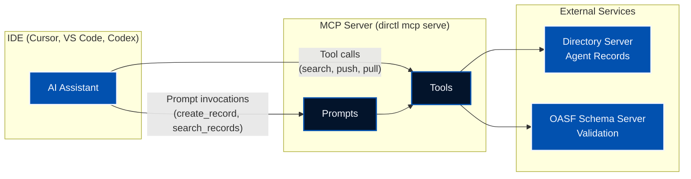

The Model Context Protocol (MCP) has emerged as a powerful standard for connecting AI assistants with external tools and data sources. In this post, we'll explore the Directory MCP server—a feature that brings AI agent discovery and management directly into your IDE, enabling seamless interaction with the Directory ecosystem.

<!--more-->

**TL;DR:** The Directory MCP server lets your AI-powered IDE discover, validate, and use AI agents from the Directory network—without leaving your editor. It bridges Directory's decentralized agent registry with MCP-enabled tools like Cursor, VS Code, and Codex.

### What You'll Learn

In this post, you'll learn:

- What Directory is and why MCP matters
- How to install and configure the Directory MCP server in your IDE
- How to distribute and sign OASF agent records through CI/CD
- How to discover, import, and audit agents using natural language inside your IDE
- How Directory enables secure agent ecosystems

## What is Directory?

[Directory](https://github.com/agntcy/dir) is a distributed peer-to-peer network for publishing, exchanging, and discovering information about AI agents. It uses [OASF (Open Agentic Schema Framework)](https://github.com/agntcy/oasf) to describe AI agents with structured metadata, enabling:

- **Capability-Based Discovery**: Find agents based on their functional characteristics using hierarchical skill and domain taxonomies
- **Verifiable Claims**: Cryptographic mechanisms ensure data integrity and provenance tracking
- **Distributed Architecture**: Content-addressing and distributed hash tables (DHT) for scalable discovery across decentralized networks
- **Multi-Format Support**: Import and export between OASF, A2A (Agent-to-Agent), and MCP formats

## Why an MCP Server?

While Directory provides CLI tools and SDKs for interacting with the network, developers increasingly work within AI-assisted IDEs like [Cursor](https://cursor.com), [VS Code](https://code.visualstudio.com) or [Codex](https://openai.com/codex/). The MCP server bridges this gap by exposing Directory functionality directly to AI assistants, allowing you to:

- Search for agents using natural language
- Validate and push agent records without leaving your editor
- Generate OASF records by analyzing your codebase
- Import and export between different agent formats

Instead of context-switching to the terminal, you can simply ask your AI assistant to perform these operations.

## Architecture

The MCP server acts as a bridge between your AI assistant and the Directory ecosystem:



The server communicates via stdin/stdout or streamable HTTP using the MCP protocol, making it compatible with any MCP-enabled IDE.

## Prerequisites

Before setting up the MCP server, you'll need:

1. **dirctl CLI** - Install via [Homebrew](https://github.com/agntcy/dir/tree/main/HomebrewFormula) or download from [GitHub Releases](https://github.com/agntcy/dir/releases). Alternatively, use the Docker image.

2. **An MCP-enabled IDE**

3. **A running Directory server** - Either:
   - **Local development**: Start one with `task server:start` in the [Directory repository](https://github.com/agntcy/dir), or use Docker Compose:
     ```bash
     cd install/docker && docker compose up -d
     ```
   - **Remote server**: Use an existing Directory deployment (e.g., the [AGNTCY public testbed](https://blogs.agntcy.org/technical/2026/02/19/dir-v1.html) at `prod.gateway.ads.outshift.io:443`)

## Setup

The MCP server runs via the `dirctl` CLI tool. Below are configuration instructions for some AI IDEs, with both binary and Docker options.

### Cursor

Add the MCP server to your Cursor configuration at `~/.cursor/mcp.json`:

**Using the binary:**

```json
{
  "mcpServers": {
    "dir-mcp-server": {
      "command": "/path/to/dirctl",
      "args": ["mcp", "serve"],
      "env": {
        "OASF_API_VALIDATION_SCHEMA_URL": "https://schema.oasf.outshift.com",
        "DIRECTORY_CLIENT_SERVER_ADDRESS": "localhost:8888"
      }
    }
  }
}
```

**Using Docker:**

```json
{
  "mcpServers": {
    "dir-mcp-server": {
      "command": "docker",
      "args": [
        "run", "--rm", "-i",
        "-e", "OASF_API_VALIDATION_SCHEMA_URL=https://schema.oasf.outshift.com",
        "-e", "DIRECTORY_CLIENT_SERVER_ADDRESS=localhost:8888",
        "ghcr.io/agntcy/dir-ctl:latest",
        "mcp", "serve"
      ]
    }
  }
}
```

After saving, restart Cursor for the changes to take effect.

### VS Code

For VS Code with GitHub Copilot, add the MCP server to your workspace configuration at `.vscode/mcp.json`, or to your user settings at `~/.vscode/mcp.json` for global availability:

**Using the binary:**

```json
{
  "servers": {
    "dir-mcp-server": {
      "command": "/path/to/dirctl",
      "args": ["mcp", "serve"],
      "env": {
        "OASF_API_VALIDATION_SCHEMA_URL": "https://schema.oasf.outshift.com",
        "DIRECTORY_CLIENT_SERVER_ADDRESS": "localhost:8888"
      }
    }
  }
}
```

**Using Docker:**

```json
{
  "servers": {
    "dir-mcp-server": {
      "command": "docker",
      "args": [
        "run", "--rm", "-i",
        "-e", "OASF_API_VALIDATION_SCHEMA_URL=https://schema.oasf.outshift.com",
        "-e", "DIRECTORY_CLIENT_SERVER_ADDRESS=localhost:8888",
        "ghcr.io/agntcy/dir-ctl:latest",
        "mcp", "serve"
      ]
    }
  }
}
```

### Codex

For OpenAI's Codex, you can also add the MCP server config to your workspace configuration at `.codex/config.toml` or to your settings at `~/.codex/config.toml`:

**Using the binary:**

```toml
[mcp_servers.dir-mcp-server]
command = "/path/to/dirctl"
args = ["mcp", "serve"]

[mcp_servers.dir-mcp-server.env]
OASF_API_VALIDATION_SCHEMA_URL = "https://schema.oasf.outshift.com"
DIRECTORY_CLIENT_SERVER_ADDRESS = "localhost:8888"
```

**Using Docker:**

```toml
[mcp_servers.dir-mcp-server]
command = "docker"
args = [
  "run", "--rm", "-i",
  "-e", "OASF_API_VALIDATION_SCHEMA_URL=https://schema.oasf.outshift.com",
  "-e", "DIRECTORY_CLIENT_SERVER_ADDRESS=localhost:8888",
  "ghcr.io/agntcy/dir-ctl:latest",
  "mcp", "serve"
]
```

**Note:** When using Docker, environment variables must be passed via `-e` flags in the args array, not in the `env` section.

### Connecting to a Remote Directory Server

To connect to a remote Directory server (e.g., the production gateway), update the environment variables to include the server address and GitHub authentication:

| Variable | Value |
|----------|-------|
| `OASF_API_VALIDATION_SCHEMA_URL` | `https://schema.oasf.outshift.com` |
| `DIRECTORY_CLIENT_SERVER_ADDRESS` | `prod.gateway.ads.outshift.io:443` |
| `DIRECTORY_CLIENT_AUTH_MODE` | `github` |
| `DIRECTORY_CLIENT_GITHUB_TOKEN` | Your GitHub PAT |

Generate a PAT at [GitHub Settings > Developer settings > Personal access tokens](https://github.com/settings/tokens) with `user:email` and `read:org` scopes.

## Usage Examples

Once the Directory MCP server is installed, you can use it for a variety of tasks. Here are three real-world scenarios covering the full lifecycle: distributing agents, discovering and installing them, and auditing their provenance.

### Scenario 1: Distributing Your Agents to Directory

In this scenario, you've built a multi-agent system and want to distribute each agent to Directory so others can discover them. We'll use [CoffeeAgntcy](https://github.com/agntcy/coffeeAgntcy)—AGNTCY's reference application demonstrating a coffee supply chain with multiple collaborating agents.

For simplicity, we'll use the **Corto** setup which has two agents:
- **Exchange Agent** - The coffee buyer that initiates purchases
- **Farm Agent** - The coffee farm that responds to purchase requests

**Step 1: Generate OASF records for each agent**

Open your project in Cursor and ask the AI to create records for each agent:

> "Analyze the Exchange and Farm agents in coffeeAGNTCY/coffee_agents/corto/ and create OASF records (schema_version 1.0.0) for each. Use the Directory MCP tools to fetch valid skills and domains from the OASF schema. Save as agents/coffee-exchange-agent.json and agents/coffee-farm-agent.json"

The AI analyzes your codebase, queries the OASF schema for valid skills and domains, and generates complete records.

**Exchange Agent** - The coffee buyer:

```json
{
  "schema_version": "1.0.0",
  "name": "coffee-exchange-agent",
  "version": "1.0.0",
  "created_at": "2026-02-18T10:00:00Z",
  "description": "Coffee exchange agent that initiates purchases from farm agents. Orchestrates the buying workflow using LangGraph, communicates via A2A protocol over SLIM transport, and integrates with the Observe SDK for tracing.",
  "authors": ["AGNTCY Contributors"],
  "skills": [
    {"id": 1004, "name": "agent_orchestration/agent_coordination"},
    {"id": 1005, "name": "agent_orchestration/negotiation_resolution"}
  ],
  "domains": [
    {"id": 1801, "name": "retail_and_ecommerce/supply_chain_management"},
    {"id": 2301, "name": "agriculture/crop_management"}
  ],
  "locators": [
    {"type": "source_code", "urls": ["https://github.com/agntcy/coffeeAgntcy/tree/main/coffeeAGNTCY/coffee_agents/corto/exchange"]}
  ]
}
```

**Farm Agent** - The coffee seller:

```json
{
  "schema_version": "1.0.0",
  "name": "coffee-farm-agent",
  "version": "1.0.0",
  "created_at": "2026-02-18T10:00:00Z",
  "description": "Coffee farm agent that responds to purchase requests from the exchange. Manages inventory, processes orders, and communicates via A2A protocol. Exposes an A2A server endpoint for incoming requests.",
  "authors": ["AGNTCY Contributors"],
  "skills": [
    {"id": 1004, "name": "agent_orchestration/agent_coordination"}
  ],
  "domains": [
    {"id": 2301, "name": "agriculture/crop_management"},
    {"id": 1801, "name": "retail_and_ecommerce/supply_chain_management"}
  ],
  "locators": [
    {"type": "source_code", "urls": ["https://github.com/agntcy/coffeeAgntcy/tree/main/coffeeAGNTCY/coffee_agents/corto/farm"]}
  ]
}
```

**Step 2: Set up GitHub Actions for CI/CD**

Directory provides [GitHub Actions](https://github.com/agntcy/dir/tree/main/.github/actions) that automate the entire distribution workflow: validation, pushing, signing, and DHT publication.

Create `.github/workflows/publish-agents.yaml` in your repository:


```yaml
name: Distributing Agents to Directory

on:
  push:
    branches: [main]
    paths:
      - 'agents/*.json'

permissions:
  id-token: write  # Required for keyless signing
  contents: read

jobs:
  publish:
    runs-on: ubuntu-latest
    steps:
      - uses: actions/checkout@v4

      - name: Setup dirctl
        uses: agntcy/dir/.github/actions/setup-dirctl@main
        with:
          version: latest

      - name: Validate OASF records
        uses: agntcy/dir/.github/actions/validate-record@main
        with:
          record_paths: |
            agents/*.json

      - name: Push to Directory
        id: push
        uses: agntcy/dir/.github/actions/push-record@main
        with:
          record_paths: agents/*.json
          server_addr: ${{ vars.DIRECTORY_ADDRESS }}
          github_token: ${{ secrets.DIRECTORY_TOKEN }}

      - name: Sign records (keyless with GitHub OIDC)
        uses: agntcy/dir/.github/actions/sign-record@main
        with:
          cids: ${{ steps.push.outputs.cids }}
          server_addr: ${{ vars.DIRECTORY_ADDRESS }}
          github_token: ${{ secrets.DIRECTORY_TOKEN }}
          oidc_client_id: https://github.com/${{ github.repository }}/.github/workflows/publish-agents.yaml@${{ github.ref }}

      - name: Publish to DHT
        uses: agntcy/dir/.github/actions/publish-record@main
        with:
          cids: ${{ steps.push.outputs.cids }}
          server_addr: ${{ vars.DIRECTORY_ADDRESS }}
          github_token: ${{ secrets.DIRECTORY_TOKEN }}
```


This workflow:

1. **Validates** all agent records against the OASF schema, failing early if any record is invalid
2. **Pushes** records to Directory, outputting CIDs for each file
3. **Signs** records using GitHub OIDC (keyless)—no secrets to manage, signatures tied to your GitHub identity
4. **Publishes** to the DHT, making agents discoverable across the Directory network

The signing step uses [Sigstore](https://www.sigstore.dev/) with GitHub's OIDC tokens—Sigstore issues a short-lived certificate from [Fulcio](https://docs.sigstore.dev/certificate_authority/overview/) tied to your workflow identity, signs the records, and logs signatures to the [Rekor](https://docs.sigstore.dev/logging/overview/) transparency log.

**Step 3: Commit and push**

Once your records are ready, commit them to your repository:

```bash
git add agents/
git commit -m "Add OASF records for Exchange and Farm agents"
git push origin main
```

The GitHub Actions workflow triggers automatically and handles everything:
1. **Validates** records against the OASF schema
2. **Pushes** to Directory (outputs CIDs)
3. **Signs** with GitHub OIDC (keyless)
4. **Publishes** to the DHT

**Step 4: Verify the distributed records**

After the workflow completes, anyone can verify a record's signature using the MCP server:

> "Search Directory for coffee-exchange-agent, then verify its signature and show the signer identity"

```json
{
  "success": true,
  "message": "trusted",
  "signers": [
    {
      "identity": "https://github.com/agntcy/coffeeAgntcy/.github/workflows/publish-agents.yaml@refs/heads/main",
      "issuer": "https://token.actions.githubusercontent.com"
    }
  ]
}
```

The signature shows it was signed by a specific GitHub Actions workflow, providing full provenance tracking:
- **Who** signed it (the workflow identity)
- **When** it was signed (Rekor transparency log)
- **What** was signed (content-addressed CID)

Your agents are now fully distributed to the Directory network—signed, verified, and discoverable by anyone!

> For a more complex multi-agent example, check out the [Lungo setup](https://github.com/agntcy/coffeeAgntcy/tree/main/coffeeAGNTCY/coffee_agents/lungo) which includes farm agents for Brazil, Colombia, and Vietnam, plus logistics agents (shipper, accountant) and supervisor agents for auction orchestration.

### Scenario 2: Discovering and Installing an Agent

You need GitHub integration in your IDE—listing issues, searching code, managing pull requests—without leaving your editor. Instead of manually configuring MCP servers, you ask your AI assistant to find one in Directory.

**Step 1: Search for an agent with the capability you need**

> "Search Directory for MCP servers with GitHub API integration skills"

```json
{
  "count": 1,
  "has_more": false,
  "record_cids": ["baeareiarov6l6hcb274t5gxkwujbmcizi4ba5ullqoeyqrhlqc6ymz6fsm"]
}
```

Found a match! Let's see what it offers.

**Step 2: Pull the record to inspect it**

> "Pull record baeareiarov6l6hcb274t5gxkwujbmcizi4ba5ullqoeyqrhlqc6ymz6fsm and show me its capabilities"

```json
{
  "name": "github-mcp",
  "version": "1.0.0",
  "description": "Official GitHub MCP Server providing repository management, issue tracking, pull request workflows, code search, and GitHub API access for AI assistants.",
  "authors": ["GitHub"],
  "skills": [
    {"name": "tool_interaction/api_schema_understanding", "id": 1401},
    {"name": "tool_interaction/workflow_automation", "id": 1402},
    {"name": "devops_mlops/ci_cd_configuration", "id": 1203}
  ],
  "domains": [
    {"name": "technology/software_engineering", "id": 102}
  ],
  "locators": [
    {"type": "source_code", "urls": ["https://github.com/github/github-mcp-server"]}
  ],
  "modules": [
    {
      "name": "integration/mcp",
      "data": {
        "name": "github",
        "description": "GitHub API access for repository management, issues, PRs, and code search",
        "connections": [
          {
            "type": "streamable-http",
            "url": "https://api.githubcopilot.com/mcp/",
            "headers": {
              "Authorization": "Bearer ${GITHUB_PAT}"
            }
          }
        ],
        "tools": [
          {"name": "search_repositories", "description": "Search for GitHub repositories"},
          {"name": "search_code", "description": "Search code across repositories"},
          {"name": "get_file_contents", "description": "Get contents of a file from a repository"},
          {"name": "list_issues", "description": "List issues in a repository"},
          {"name": "get_issue", "description": "Get details of a specific issue"},
          {"name": "create_issue", "description": "Create a new issue"},
          {"name": "list_pull_requests", "description": "List pull requests in a repository"},
          {"name": "get_pull_request", "description": "Get details of a specific pull request"},
          {"name": "create_pull_request", "description": "Create a new pull request"},
          {"name": "get_me", "description": "Get the authenticated user's profile"}
        ]
      }
    }
  ]
}
```

This is exactly what we need—GitHub's official MCP server. The `modules` field contains the MCP configuration: a remote server (`streamable-http`) requiring a GitHub Personal Access Token for authentication.

**Step 3: Configure the MCP server in your IDE**

Here's the key insight: **the AI assistant can update your IDE configuration directly**. Ask it to add the MCP server:

> "Add this GitHub MCP server to my Cursor configuration at ~/.cursor/mcp.json using the connection details from the record"

The assistant reads the connection details from the OASF record and updates `~/.cursor/mcp.json`:

```json
{
  "mcpServers": {
    "github": {
      "url": "https://api.githubcopilot.com/mcp/",
      "headers": {
        "Authorization": "Bearer ${GITHUB_PAT}"
      }
    }
  }
}
```

You'll need a GitHub PAT with appropriate scopes (repo, read:user). Generate one at [GitHub Settings > Developer settings > Personal access tokens](https://github.com/settings/tokens).

**Step 4: Start using the new capability**

After restarting Cursor, you have full GitHub access. Let's try it:

> "List all open GitHub issues assigned to me across all repositories"

The assistant uses the `search_issues` tool:

```json
{
  "total_count": 5,
  "items": [
    {
      "number": 863,
      "title": "Name resolution + verified record name on remote nodes",
      "repository": "agntcy/dir",
      "state": "open",
      "labels": ["go"],
      "milestone": "DIR v1.1.0"
    },
    {
      "number": 39,
      "title": "Blog: How to use AGNTCY MCP server",
      "repository": "agntcy/blogs",
      "state": "open"
    },
    {
      "number": 24,
      "title": "Gather requirements for Migration SDK",
      "repository": "agntcy/oasf-sdk",
      "state": "open",
      "labels": ["enhancement"]
    },
    ...
  ]
}
```

> "List the 5 most recent open issues in the agntcy/dir repository"

The assistant uses the `list_issues` tool:

```json
{
  "issues": [
    {
      "number": 942,
      "title": "[Feature]: Resolve and improve test coverage",
      "state": "OPEN",
      "labels": ["kind/test"],
      "created_at": "2026-02-12T13:59:57Z"
    },
    {
      "number": 929,
      "title": "[Feature]: Remove sync monitor in favor of reconciler indexer task",
      "state": "OPEN",
      "created_at": "2026-02-10T15:59:58Z"
    },
    {
      "number": 926,
      "title": "Revisit local deployment configuration",
      "state": "OPEN",
      "created_at": "2026-02-10T11:56:23Z"
    },
    ...
  ],
  "totalCount": 29
}
```

> "Get the full details for issue #942 in agntcy/dir including the description and comments"

```json
{
  "number": 942,
  "title": "[Feature]: Resolve and improve test coverage",
  "state": "open",
  "author": "ramizpolic",
  "labels": ["kind/test"],
  "milestone": "DIR v1.2.0",
  "created_at": "2026-02-12T13:59:57Z",
  "body": "Currently, the test coverage results are not properly covering certain components (e.g. for apiserver, we are dropping the unit test coverage for the sake of e2e test coverage). Proposed solution: Make sure that all test results are properly combined/merged across different test-cases (unit, e2e, ...)."
}
```

The assistant provides context about the work needed—all without leaving your IDE.

This is the power of Directory: discoverable agents with standardized metadata that the AI assistant can use to **automatically configure and start using new capabilities**.

### Scenario 3: Auditing Agent Provenance (ITOps)

As an IT operations or security team member, you need to audit the agents deployed in your environment to ensure they're from trusted sources and properly signed. Directory's verification capabilities make this straightforward.

**Step 1: List all agents in your environment**

> "Search Directory for all agent records and list their CIDs"

```json
{
  "count": 9,
  "has_more": false,
  "record_cids": [
    "baeareifmeckgczj35wcy6fpdhwttdbkjkskbcktarufpgfvc4xcmhjc2k4",
    "baeareiarov6l6hcb274t5gxkwujbmcizi4ba5ullqoeyqrhlqc6ymz6fsm",
    "baeareigdnp76ayuix5467b7ixjrwwfio2dhnusqxpafidie2py2yw7dwla",
    "baeareihg2hdnkfhdtkermrw7fohbgjffwx3c6jn3zqy4vwsbrru5vyj4tm",
    "..."
  ]
}
```

**Step 2: Verify signatures for each agent**

> "For each of these CIDs, verify the signature and report which agents are signed vs unsigned"

The assistant checks each record:

| CID | Agent Name | Status | Signer |
|-----|------------|--------|--------|
| `baeareifmeck...` | coffee-exchange-agent | Signed | `agntcy/coffeeAgntcy/.github/workflows/publish-agents.yaml@main` |
| `baeareicotuif...` | coffee-farm-agent | Signed | `agntcy/coffeeAgntcy/.github/workflows/publish-agents.yaml@main` |
| `baeareigdnp7...` | fetch-mcp-server | **Not signed** | - |
| `baeareihg2hd...` | memory-mcp-server | **Not signed** | - |

**Step 3: Investigate unsigned agents**

The audit reveals that `fetch-mcp-server` and `memory-mcp-server` are not signed. Let's get more details:

> "Pull record baeareigdnp76ayuix5467b7ixjrwwfio2dhnusqxpafidie2py2yw7dwla and show its authors and locators"

```json
{
  "name": "fetch-mcp-server",
  "version": "2025.3.28",
  "authors": ["Anthropic"],
  "created_at": "2026-02-17T10:00:00Z",
  "locators": [
    {"type": "source_code", "urls": ["https://github.com/modelcontextprotocol/servers/tree/main/src/fetch"]}
  ]
}
```

The record claims to be from Anthropic but has no cryptographic proof. This is a potential security risk—anyone could have pushed this record claiming to be from that organization.

**Step 4: Compare with signed records**

For comparison, let's look at a properly signed record:

> "Verify the signature for coffee-exchange-agent (CID baeareifmeck...) and show full signer details"

```json
{
  "success": true,
  "message": "trusted",
  "signers": [
    {
      "identity": "https://github.com/agntcy/coffeeAgntcy/.github/workflows/publish-agents.yaml@refs/heads/main",
      "issuer": "https://token.actions.githubusercontent.com"
    }
  ]
}
```

This signature confirms:
- **Identity**: Signed by the `agntcy/coffeeAgntcy` CI/CD workflow
- **Issuer**: GitHub Actions OIDC provider
- **Integrity**: The record hasn't been modified since signing

**Audit recommendations**

Based on this audit, you might:

1. **Flag unsigned agents** for review before use in production
2. **Require signatures** from specific identities (e.g., `@yourcompany.com` emails or `https://github.com/yourorg/...` workflows)
3. **Set up alerts** for new unsigned records appearing in your environment
4. **Establish a policy** that all production agents must be signed by CI/CD workflows (not individual developers)

This provenance tracking is what makes Directory suitable for enterprise environments—you always know where an agent came from and whether you can trust it.

## Video Walkthrough

If you prefer a visual demonstration, check out this video where I walk through the Directory MCP server in action:

<div style="position: relative; padding-bottom: 56.25%; height: 0; overflow: hidden; max-width: 100%; margin-bottom: 1.5em;">
  <iframe src="https://www.youtube.com/embed/pdVqhlyJHo4" style="position: absolute; top: 0; left: 0; width: 100%; height: 100%;" frameborder="0" allowfullscreen></iframe>
</div>

## The Bigger Picture

The Directory MCP server is part of a broader vision for AI agent interoperability. By standardizing how agents describe their capabilities (OASF), how they're discovered (Directory), and how they communicate (A2A), we're building infrastructure for an ecosystem where:

- Agents can find and collaborate with other agents
- Developers can discover pre-built agents for their needs
- Organizations can distribute and share agents securely

The MCP server brings this infrastructure directly into developer workflows, reducing friction and enabling AI-assisted agent development.

Check out the [Directory documentation](https://docs.agntcy.org/dir/overview/) for a complete walkthrough, and the [MCP server README](https://github.com/agntcy/dir/tree/main/mcp) for detailed configuration options.

## References

- [Directory GitHub Repository](https://github.com/agntcy/dir)
- [Directory MCP Server README](https://github.com/agntcy/dir/tree/main/mcp)
- [Directory Documentation](https://docs.agntcy.org/dir/overview/)
- [OASF (Open Agentic Schema Framework)](https://github.com/agntcy/oasf)
- [Model Context Protocol](https://modelcontextprotocol.io/)
- [MCP Go SDK](https://github.com/modelcontextprotocol/go-sdk)

---

*Have questions about Directory or the MCP server? Join our [Slack community](https://join.slack.com/t/agntcy/shared_invite/zt-3hb4p7bo0-5H2otGjxGt9OQ1g5jzK_GQ) or check out our [GitHub](https://github.com/agntcy).*
