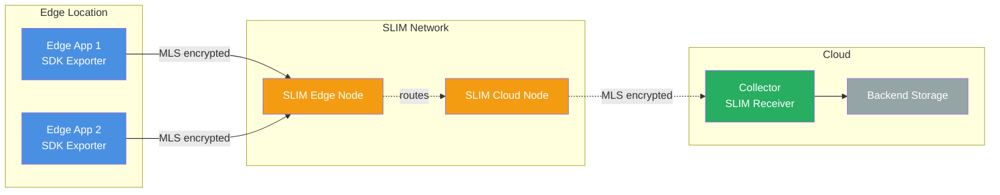
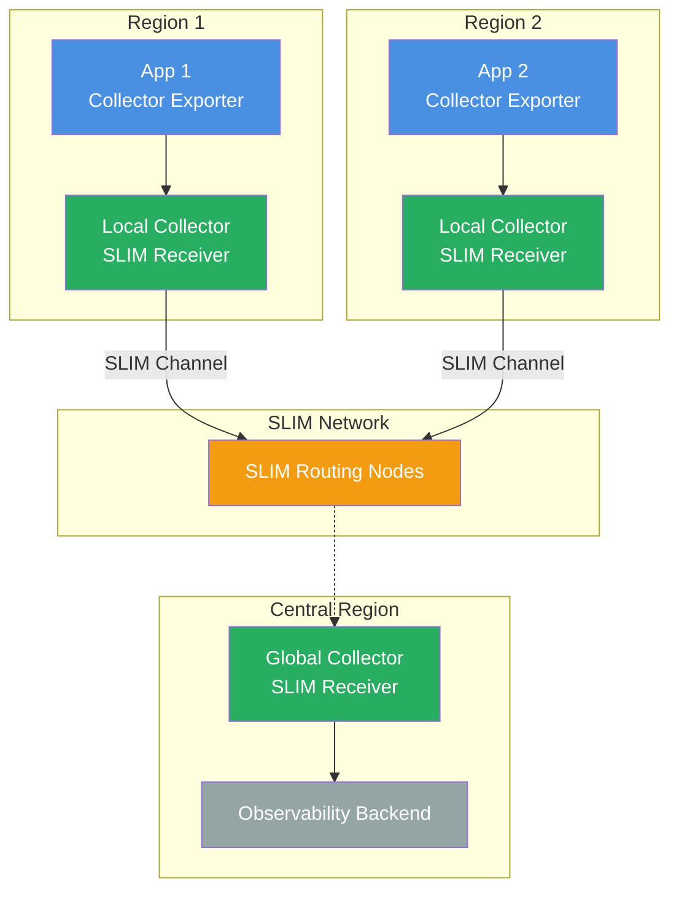
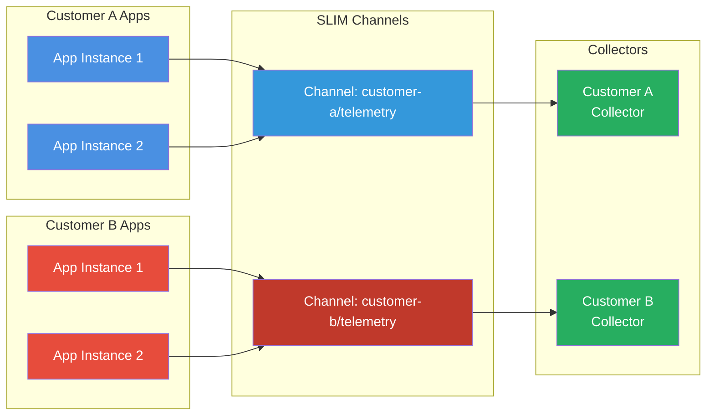

As distributed systems grow in complexity, observability becomes critical. OpenTelemetry has emerged as the standard for collecting traces, metrics, and logs across heterogeneous applications. However, as systems become more distributed—spanning edge devices, cloud regions, and organizational boundaries—transporting telemetry data securely and efficiently becomes a significant challenge.

Traditional telemetry transport solutions require exposed endpoints, lack end-to-end encryption, or introduce unacceptable latency. Sending sensitive telemetry data through untrusted networks without proper encryption exposes business-critical insights. Managing firewall rules and service discovery for collectors at scale adds operational complexity.

Enter [SLIM (Secure Low-Latency Interactive Messaging)](https://docs.agntcy.org/slim/overview/)—a communication framework designed for secure, low-latency distributed communication. While SLIM was originally developed for agentic AI protocols, its capabilities make it ideal for transporting OpenTelemetry data as well. SLIM enables applications and collectors to exchange telemetry with end-to-end encryption, dynamic discovery, and low latency, all without requiring directly exposed endpoints.

## The Telemetry Transport Challenge

Modern observability infrastructure faces several critical challenges:

### Security and Privacy

Telemetry data contains sensitive information: API keys in traces, business metrics revealing usage patterns, log messages exposing internal system details. When collectors receive data over standard HTTP/gRPC, TLS only protects point-to-point connections. If TLS is terminated at a load balancer or proxy, your telemetry flows in plaintext through infrastructure you might not fully trust.

For regulated industries or multi-tenant environments, this is unacceptable. You need **end-to-end encryption** that keeps telemetry confidential from source to destination, even when traversing untrusted infrastructure.

### Network Topology Complexity

Traditional OpenTelemetry deployments require:

- **Exposed collector endpoints**: Applications must know collector addresses and have network access.
- **Firewall management**: Open ports for every collector instance.
- **Service discovery**: Maintain registries of collector locations.
- **Load balancing**: Distribute telemetry across collector instances.

This becomes exponentially more complex in:
- **Multi-region deployments**: Collectors in different data centers.
- **Edge scenarios**: IoT devices or edge servers collecting telemetry.
- **Cross-organizational observability**: Sharing telemetry with partners or vendors.

What if applications could send telemetry to a named channel without knowing where collectors are deployed? What if collectors could receive telemetry without exposing ports to the internet?

### Latency and Performance

Some observability scenarios require real-time telemetry:
- **Live debugging**: Streaming traces for active troubleshooting.
- **Alerting**: Immediate metric delivery for time-sensitive alerts.
- **Distributed tracing**: Low-latency span propagation across services.

Message queues add serialization overhead and multi-second latencies. HTTP polling wastes bandwidth. You need a transport that delivers telemetry with **sub-second latency** while minimizing overhead.

### Flexibility and Scale

Applications generate telemetry at different scales:
- **Microservices**: Thousands of instances generating traces and metrics.
- **Batch jobs**: Periodic bursts of logs and metrics.
- **ML pipelines**: Custom telemetry requiring specialized collectors.

Your telemetry transport should scale elastically, support multiple concurrent channels, and allow dynamic reconfiguration without application restarts.

## How SLIM Solves Telemetry Transport

SLIM was designed for secure, low-latency communication between distributed agents and applications. These same capabilities make it ideal for transporting OpenTelemetry data:

### End-to-End Encryption with MLS

SLIM uses [Message Layer Security (MLS)](https://www.rfc-editor.org/rfc/rfc9420.txt) to provide end-to-end encryption for all communications. Unlike TLS, which only secures point-to-point connections, MLS ensures that telemetry data remains encrypted even when passing through SLIM routing nodes.

For OpenTelemetry, this means:
- **Confidential telemetry**: Only authorized collectors can decrypt traces, metrics, and logs.
- **Zero-trust infrastructure**: You don't need to trust intermediate SLIM nodes.
- **Compliance-ready**: Meet regulatory requirements for data in transit.

MLS encryption happens transparently—applications and collectors just enable it in configuration.

### Discovery Without Exposed Endpoints

SLIM uses a hierarchical naming system based on Decentralized Identifiers (DIDs):

```text
organization/namespace/service/instance
```

Applications send telemetry to a **channel name** like `acme/production/telemetry-traces`. Collectors register to receive from that channel. SLIM handles:
- **Anycast routing**: Messages delivered to available collector instances.
- **Service discovery**: No hardcoded endpoints or DNS management.
- **NAT traversal**: Applications and collectors can run behind firewalls.

Only SLIM routing nodes need exposed addresses—your applications and collectors connect outbound to the SLIM network.

### Channel-Based Routing

SLIM provides **channel-based communication** that maps perfectly to observability patterns:

- **Separate channels per signal type**: Different channels for traces, metrics, and logs.
- **Multi-tenant isolation**: Per-environment or per-customer channels.
- **Dynamic membership**: Add or remove collectors without reconfiguring applications.
- **Broadcast capability**: One application sending to multiple collectors.

Channels provide clean separation and flexible routing beyond simple point-to-point connections.

### Low-Latency Architecture

SLIM is built on HTTP/2 with:
- **Multiplexed streams**: Multiple logical channels over single connections.
- **Efficient routing**: Hierarchical names enable fast forwarding.
- **Async-first design**: Non-blocking I/O throughout the stack.

## SLIM OpenTelemetry Components

The [slim-otel](https://github.com/agntcy/slim-otel) project provides four key components for transporting OpenTelemetry over SLIM:

### 1. SLIM Receiver for Collectors

The **SLIM receiver** integrates with OpenTelemetry Collector to receive traces, metrics, and logs from SLIM channels. It accepts telemetry from any authenticated participant without requiring exposed ports.

**Example configuration**:

```yaml
receivers:
  slim:
    connection-config:
      address: "http://slim-node:46357"
    receiver-name: "acme/production/collector"
    shared-secret: "your-shared-secret"

processors:
  batch:
    timeout: 1s

exporters:
  otlp:
    endpoint: "backend:4317"

service:
  pipelines:
    traces:
      receivers: [slim]
      processors: [batch]
      exporters: [otlp]
    metrics:
      receivers: [slim]
      processors: [batch]
      exporters: [otlp]
    logs:
      receivers: [slim]
      processors: [batch]
      exporters: [otlp]
```

The receiver registers with the SLIM network using `receiver-name` and waits for incoming telemetry sessions. Applications discover the collector automatically through SLIM's naming system.

### 2. SLIM Exporter for Collectors

The **SLIM exporter** enables collectors to forward telemetry to SLIM channels. It can both create channels (inviting specific participants) and passively accept invitations from other participants.

**Example configuration**:

```yaml
exporters:
  slim:
    connection-config:
      address: "http://slim-node:46357"
    exporter-names:
      metrics: "acme/edge/metrics-exporter"
      traces: "acme/edge/traces-exporter"
      logs: "acme/edge/logs-exporter"
    shared-secret: "your-shared-secret"
    channels:
      - channel-name: "acme/production/telemetry-traces"
        signal: traces
        participants:
          - "acme/production/collector"
        mls-enabled: true
      
      - channel-name: "acme/production/telemetry-metrics"
        signal: metrics
        participants:
          - "acme/production/collector"
        mls-enabled: true
      
      - channel-name: "acme/production/telemetry-logs"
        signal: logs
        participants:
          - "acme/production/collector"
        mls-enabled: false
```

This configuration creates three channels—one per signal type—and invites the specified collector to join each. The exporter automatically routes traces to the traces channel, metrics to the metrics channel, and logs to the logs channel. You can invite multiple pariticipants to each channel.

**Passive mode** is always enabled—the exporter continuously listens for channel invitations from other participants, even when you configure channels to create. This allows bidirectional discovery: you can proactively create channels while also accepting invitations from others.

If you only want to receive invitations without creating any channels, simply omit the `channels` configuration:

```yaml
exporters:
  slim:
    connection-config:
      address: "http://slim-node:46357"
    exporter-names:
      metrics: "acme/passive/metrics-exporter"
      traces: "acme/passive/traces-exporter"
      logs: "acme/passive/logs-exporter"
    shared-secret: "your-shared-secret"
    # No channels - only waits for invitations
    channels: []
```

### 3. SDK Exporter for Applications

The **SDK exporter** enables applications to send telemetry directly to SLIM using the OpenTelemetry SDK. This bypasses the collector entirely for direct-to-SLIM telemetry export.

**Key features**:
- **Direct SDK integration**: Works with OpenTelemetry Go SDK.
- **Unified exporter**: Single exporter handling traces, metrics, and logs over one connection.
- **Automatic signal routing**: Each signal type routed to its configured SLIM name.
- **MLS encryption**: End-to-end security from application to collector.
- **Resource awareness**: Integrates with OpenTelemetry resource semantics.

**Example usage in Go**:

```go
import (
    "context"
    "time"
    
    "go.opentelemetry.io/otel"
    "go.opentelemetry.io/otel/log/global"
    sdklog "go.opentelemetry.io/otel/sdk/log"
    sdkmetric "go.opentelemetry.io/otel/sdk/metric"
    "go.opentelemetry.io/otel/sdk/resource"
    sdktrace "go.opentelemetry.io/otel/sdk/trace"
    semconv "go.opentelemetry.io/otel/semconv/v1.26.0"
    
    slimcommon "github.com/agntcy/slim-otel/internal/slim"
    "github.com/agntcy/slim-otel/sdkexporter"
)

func strPtr(s string) *string {
    return &s
}

func main() {
    ctx := context.Background()
    
    // Create resource with service information
    res, err := resource.New(ctx,
        resource.WithAttributes(
            semconv.ServiceName("my-app"),
            semconv.ServiceVersion("1.0.0"),
        ),
    )
    if err != nil {
        panic(err)
    }
    
    // Configure the SLIM exporter
    config := sdkexporter.Config{
        ConnectionConfig: &slimcommon.ConnectionConfig{
            Address: "http://slim-node:46357",
        },
        ExporterNames: &slimcommon.SignalNames{
            Traces:  strPtr("acme/app/traces"),
            Metrics: strPtr("acme/app/metrics"),
            Logs:    strPtr("acme/app/logs"),
        },
        SharedSecret: "your-shared-secret",
        RemoteName:   "acme/production/collector",
        MLSEnabled:   true,
    }
    
    // Create the unified SLIM exporter
    // This single exporter handles all three signals over one connection
    exporter, err := sdkexporter.New(ctx, config)
    if err != nil {
        panic(err)
    }
    
    // Create trace provider
    tp := sdktrace.NewTracerProvider(
        sdktrace.WithBatcher(exporter.TraceExporter(),
            sdktrace.WithBatchTimeout(1*time.Second),
        ),
        sdktrace.WithResource(res),
    )
    otel.SetTracerProvider(tp)
    
    // Create meter provider
    mp := sdkmetric.NewMeterProvider(
        sdkmetric.WithReader(
            sdkmetric.NewPeriodicReader(exporter.MetricExporter(),
                sdkmetric.WithInterval(1*time.Second),
            ),
        ),
        sdkmetric.WithResource(res),
    )
    otel.SetMeterProvider(mp)
    
    // Create logger provider
    lp := sdklog.NewLoggerProvider(
        sdklog.WithProcessor(
            sdklog.NewBatchProcessor(exporter.LogExporter(),
                sdklog.WithExportInterval(1*time.Second),
            ),
        ),
        sdklog.WithResource(res),
    )
    global.SetLoggerProvider(lp)
    
    // Register providers with the exporter for proper shutdown
    exporter.RegisterProviders(tp, mp, lp)
    defer func() {
        if err := exporter.Shutdown(ctx); err != nil {
            panic(err)
        }
    }()
    
    // Your application code using OpenTelemetry
    tracer := otel.Tracer("my-service")
    _, span := tracer.Start(ctx, "operation")
    defer span.End()
    
    // Telemetry automatically exported to SLIM
}
```

The SDK exporter creates a **unified exporter** that handles traces, metrics, and logs over a single SLIM connection. It establishes a session with the specified receiver (`acme/production/collector`) and sends all telemetry signals through SLIM. Applications don't need to know collector IP addresses or manage service discovery—SLIM's naming system handles routing automatically.

### 4. Channel Manager

The **channel manager** is a standalone application that provides a gRPC API for dynamic channel management. It enables runtime control of SLIM channels without restarting collectors or applications.

**Key features**:
- **Dynamic channel creation**: Create new channels on-demand via API.
- **Participant management**: Invite or remove participants dynamically.
- **Channel lifecycle**: Delete channels when no longer needed.
- **Centralized control**: Single service managing multiple channels.

**Configuration**:

```yaml
channel-manager:
  connection-config:
    address: "http://slim-node:46357"
  service-address: "127.0.0.1:46358"
  local-name: "acme/production/channel-manager"
  shared-secret: "your-shared-secret"

channels:
  - name: "acme/production/telemetry-traces"
    participants:
      - "acme/production/collector-1"
      - "acme/production/collector-2"
    mls-enabled: true
```

The channel manager exposes a gRPC API for:
- **Creating channels**: Dynamically provision new telemetry channels.
- **Adding participants**: Invite collectors or applications to existing channels.
- **Removing participants**: Evict participants from channels.
- **Listing channels**: Query active channels and their memberships.

This enables **dynamic observability topologies** where you can:
- Spin up temporary debugging channels for specific services.
- Route telemetry to new collectors without application changes.
- Implement multi-tenant isolation with per-customer channels.
- Reconfigure observability topology in production without downtime.

## Advantages Over Existing Solutions

### vs. Direct HTTP/gRPC OTLP

**Standard OTLP** (OpenTelemetry Protocol over HTTP/gRPC):

- ❌ **No end-to-end encryption**: TLS terminates at proxies/load balancers.
- ❌ **Requires exposed endpoints**: Collectors must have public addresses.
- ❌ **Static configuration**: Applications hardcode collector URLs.
- ❌ **No built-in discovery**: Need external service discovery mechanisms.
- ✅ **Simple and ubiquitous**: Supported by all OpenTelemetry SDKs.

**SLIM transport**:

- ✅ **End-to-end MLS encryption**: Telemetry encrypted source to destination.
- ✅ **No exposed endpoints required**: Only SLIM nodes need public addresses.
- ✅ **Dynamic discovery**: Applications send to channel names, not IPs.
- ✅ **Flexible routing**: Channels, anycast, multi-collector broadcast.
- ✅ **Similarly simple**: Configuration-based, minimal code changes.

### vs. Message Queues (Kafka, RabbitMQ, etc.)

**Message queue approaches**:

- ❌ **Added latency**: Multi-second delays from queuing and batching.
- ❌ **Operational complexity**: Managing Kafka clusters, ZooKeeper, etc.
- ❌ **No end-to-end encryption**: Messages typically encrypted at rest, not in transit.
- ❌ **Overkill for many use cases**: Heavy infrastructure for simple telemetry.
- ✅ **Durability and replay**: Message persistence and reprocessing.

**SLIM transport**:

- ✅ **Sub-second latency**: Real-time telemetry delivery.
- ✅ **Simpler operations**: SLIM nodes are stateless routers.
- ✅ **End-to-end MLS encryption**: Built-in security.
- ✅ **Right-sized**: Lightweight transport without over-engineering.
- ⚠️ **No built-in persistence**: SLIM prioritizes low latency over durability.

For observability, **durability is often less critical** than latency—if a few spans are lost, it's acceptable. When durability matters, persist at the collector level (e.g., Kafka exporter from collector).

### vs. Service Mesh Observability

**Service mesh telemetry**:

- ❌ **Coupled to mesh infrastructure**: Requires Istio, Linkerd, etc.
- ❌ **Limited to service-to-service**: Doesn't cover edge, batch jobs, or non-mesh apps.
- ❌ **Complex configuration**: Sidecars, policies, and mesh overhead.
- ✅ **Automatic instrumentation**: No code changes required.

**SLIM transport**:

- ✅ **Infrastructure-agnostic**: Works with or without service mesh.
- ✅ **Universal applicability**: Any application, anywhere.
- ✅ **Simple configuration**: Connect to SLIM node, send to channel.
- ⚠️ **Requires instrumentation**: Applications must use OpenTelemetry SDK.

SLIM and service meshes are complementary—use mesh for automatic telemetry collection, SLIM for secure transport to collectors across environments.

## Architecture Patterns

SLIM's flexibility enables several observability architectures:

### Edge-to-Cloud Telemetry

**Scenario**: Edge devices or IoT sensors sending telemetry to centralized cloud collectors.



**Benefits**:
- Edge apps don't need to know cloud collector addresses.
- End-to-end encryption protects telemetry across untrusted networks.
- Collectors can scale independently without reconfiguring edge devices.

### Multi-Region Observability

**Scenario**: Applications in multiple regions sending to regional or centralized collectors.



**Benefits**:
- Local collectors aggregate regional telemetry.
- SLIM channels transport data to central collector.
- Add new regions without updating collector configurations.

### Multi-Tenant Observability

**Scenario**: SaaS platform collecting per-customer telemetry with strict isolation.



**Benefits**:
- Strict channel-based isolation between customers.
- MLS encryption ensures tenant data confidentiality.
- Dynamic channel creation via channel manager for new customers.

## Getting Started

### Prerequisites

1. **SLIM node running**: See [SLIM installation guide](https://docs.agntcy.org/slim/overview/).

```bash
# Using Docker
docker run -p 46357:46357 ghcr.io/agntcy/slim:v1.0.0
```

2. **SLIM OTel collector**: Clone and build the SLIM OpenTelemetry collector.

```bash
git clone https://github.com/agntcy/slim-otel.git -b go-sdk
cd slim-otel
task collector:build
```

### Quick Start: Collector-to-Collector

**Step 1**: Start SLIM node (if not already running).

**Step 2**: Configure and start the **receiver collector**:

```yaml
# receiver-config.yaml
receivers:
  slim:
    connection-config:
      address: "http://127.0.0.1:46357"
    receiver-name: "demo/telemetry/receiver"
    shared-secret: "demo-shared-secret-123456789"

exporters:
  debug:
    verbosity: detailed

service:
  pipelines:
    traces:
      receivers: [slim]
      exporters: [debug]
```

```bash
./slim-otelcol/slim-otelcol --config receiver-config.yaml
```

**Step 3**: Configure and start the **exporter collector** (in another terminal):

```yaml
# exporter-config.yaml
receivers:
  otlp:
    protocols:
      grpc:
        endpoint: 0.0.0.0:4317

exporters:
  slim:
    connection-config:
      address: "http://127.0.0.1:46357"
    exporter-names:
      traces: "demo/telemetry/exporter-traces"
      metrics: "demo/telemetry/exporter-metrics"
      logs: "demo/telemetry/exporter-logs"
    shared-secret: "demo-shared-secret-123456789"
    channels:
      - channel-name: "demo/telemetry/channel-traces"
        signal: traces
        participants:
          - "demo/telemetry/receiver"
        mls-enabled: true

service:
  pipelines:
    traces:
      receivers: [otlp]
      exporters: [slim]
```

```bash
./slim-otelcol/slim-otelcol --config exporter-config.yaml
```

**Step 4**: Send test telemetry to the exporter collector.

First, install [telemetrygen](https://github.com/open-telemetry/opentelemetry-collector-contrib/tree/main/cmd/telemetrygen):

```bash
go install github.com/open-telemetry/opentelemetry-collector-contrib/cmd/telemetrygen@latest
export PATH=$PATH:$(go env GOPATH)/bin
```

Generate test traces:

```bash
telemetrygen traces --otlp-insecure --rate 10 --duration 10s
```

You should see the traces appear in the receiver collector's debug output. Telemetry traveled from exporter to receiver over SLIM with MLS encryption!


### Quick Start: Application to Collector

This example shows how to send telemetry directly from an application using the SDK exporter to a collector with the SLIM receiver. We'll use the channel manager to dynamically create channels and invite participants.

**Step 1**: Start SLIM node (if not already running).

**Step 2**: Configure and start the **receiver collector**:

```yaml
# app-receiver-config.yaml
receivers:
  slim:
    connection-config:
      address: "http://127.0.0.1:46357"
    receiver-name: "demo/app/collector"
    shared-secret: "demo-shared-secret-123456789"

processors:
  batch:
    timeout: 1s

exporters:
  debug:
    verbosity: detailed
    sampling_initial: 5
    sampling_thereafter: 200

service:
  pipelines:
    traces:
      receivers: [slim]
      processors: [batch]
      exporters: [debug]
    metrics:
      receivers: [slim]
      processors: [batch]
      exporters: [debug]
    logs:
      receivers: [slim]
      processors: [batch]
      exporters: [debug]
```

```bash
./slim-otelcol/slim-otelcol --config app-receiver-config.yaml
```

The receiver will register with SLIM and wait for channel invitations.

**Step 3**: Create a simple Go application using the SDK exporter:

```go
// main.go
package main

import (
    "context"
    "fmt"
    "log"
    "math/rand"
    "time"
    
    "go.opentelemetry.io/otel"
    "go.opentelemetry.io/otel/attribute"
    "go.opentelemetry.io/otel/log/global"
    otellog "go.opentelemetry.io/otel/log"
    "go.opentelemetry.io/otel/metric"
    sdklog "go.opentelemetry.io/otel/sdk/log"
    sdkmetric "go.opentelemetry.io/otel/sdk/metric"
    "go.opentelemetry.io/otel/sdk/resource"
    sdktrace "go.opentelemetry.io/otel/sdk/trace"
    semconv "go.opentelemetry.io/otel/semconv/v1.26.0"
    
    slimcommon "github.com/agntcy/slim-otel/internal/slim"
    "github.com/agntcy/slim-otel/sdkexporter"
)

func strPtr(s string) *string {
    return &s
}

func main() {
    ctx := context.Background()
    
    // Create resource
    res, err := resource.New(ctx,
        resource.WithAttributes(
            semconv.ServiceName("demo-app"),
            semconv.ServiceVersion("1.0.0"),
        ),
    )
    if err != nil {
        log.Fatal(err)
    }
    
    // Configure SLIM exporter
    config := sdkexporter.Config{
        ConnectionConfig: &slimcommon.ConnectionConfig{
            Address: "http://127.0.0.1:46357",
        },
        ExporterNames: &slimcommon.SignalNames{
            Traces:  strPtr("demo/app/traces"),
            Metrics: strPtr("demo/app/metrics"),
            Logs:    strPtr("demo/app/logs"),
        },
        SharedSecret: "demo-shared-secret-123456789",
        MLSEnabled:   true,
    }
    
    // Create unified exporter
    exporter, err := sdkexporter.New(ctx, config)
    if err != nil {
        log.Fatal(err)
    }
    
    // Set up trace provider
    tp := sdktrace.NewTracerProvider(
        sdktrace.WithBatcher(exporter.TraceExporter(),
            sdktrace.WithBatchTimeout(1*time.Second),
        ),
        sdktrace.WithResource(res),
    )
    otel.SetTracerProvider(tp)
    
    // Set up meter provider
    mp := sdkmetric.NewMeterProvider(
        sdkmetric.WithReader(
            sdkmetric.NewPeriodicReader(exporter.MetricExporter(),
                sdkmetric.WithInterval(1*time.Second),
            ),
        ),
        sdkmetric.WithResource(res),
    )
    otel.SetMeterProvider(mp)
    
    // Set up logger provider
    lp := sdklog.NewLoggerProvider(
        sdklog.WithProcessor(
            sdklog.NewBatchProcessor(exporter.LogExporter(),
                sdklog.WithExportInterval(1*time.Second),
            ),
        ),
        sdklog.WithResource(res),
    )
    global.SetLoggerProvider(lp)
    
    // Register providers for proper shutdown
    exporter.RegisterProviders(tp, mp, lp)
    defer func() {
        if err := exporter.Shutdown(ctx); err != nil {
            log.Printf("Error shutting down: %v", err)
        }
    }()
    
    // Get telemetry instruments
    tracer := otel.Tracer("demo-service")
    meter := otel.Meter("demo-service")
    logger := global.GetLoggerProvider().Logger("demo-service")
    
    // Create a counter metric
    counter, err := meter.Int64Counter(
        "requests_total",
        metric.WithDescription("Total requests"),
    )
    if err != nil {
        log.Fatal(err)
    }
    
    log.Println("Sending telemetry to SLIM...")
    
    // Send telemetry for 30 seconds
    for i := 0; i < 10; i++ {
        // Create a trace
        _, span := tracer.Start(ctx, "process-request")
        span.SetAttributes(
            attribute.String("request.id", fmt.Sprintf("req-%d", i)),
            attribute.Int("iteration", i),
        )
        
        // Simulate work
        time.Sleep(time.Duration(50+rand.Intn(100)) * time.Millisecond)
        
        // Emit a log
        logRecord := otellog.Record{}
        logRecord.SetTimestamp(time.Now())
        logRecord.SetSeverity(otellog.SeverityInfo)
        logRecord.SetBody(otellog.StringValue(fmt.Sprintf("Processing request %d", i)))
        logRecord.AddAttributes(
            otellog.Int("iteration", i),
        )
        logger.Emit(ctx, logRecord)
        
        // Record a metric
        counter.Add(ctx, 1,
            metric.WithAttributes(
                attribute.String("status", "success"),
            ),
        )
        
        span.End()
        
        log.Printf("Sent telemetry batch %d\n", i+1)
        time.Sleep(2 * time.Second)
    }
    
    log.Println("Finished sending telemetry")
    
    // Allow time for final batches to export
    time.Sleep(3 * time.Second)
}
```

**Step 4**: Initialize the Go module and run the application (in another terminal):

```bash
# Initialize module
go mod init demo-app
go mod tidy

# Run the application
go run main.go
```

The application will register with SLIM and wait for channel invitations.

**Step 5**: Configure and start the **channel manager** (in another terminal):

```yaml
# channel-manager-config.yaml
channel-manager:
  connection-config:
    address: "http://127.0.0.1:46357"
  service-address: "127.0.0.1:46358"
  local-name: "demo/app/channel-manager"
  shared-secret: "demo-shared-secret-123456789"

channels:
  - name: "demo/app/channel-traces"
    participants:
      - "demo/app/traces"
      - "demo/app/collector"
    mls-enabled: true
  
  - name: "demo/app/channel-metrics"
    participants:
      - "demo/app/metrics"
      - "demo/app/collector"
    mls-enabled: true
  
  - name: "demo/app/channel-logs"
    participants:
      - "demo/app/logs"
      - "demo/app/collector"
    mls-enabled: true
```

```bash
cd slim-otel
go run channelmanager/cmd/main.go --config channel-manager-config.yaml
```

The channel manager will create three channels (one for each signal type) and invite both the application exporters and the collector receiver to join them.

You should see telemetry flowing from the application to the receiver collector through SLIM. The channel manager creates the channels and invites both the application (via its exporter names) and the collector to join. The receiver collector's debug exporter will show traces, metrics, and logs all correlated with trace IDs and sent securely with MLS encryption!

The telemetry flow is:

```
Channel Manager → Creates Channels → Invites Participants (App Exporters + Collector)
Application (SDK Exporter) → SLIM Channels → Receiver Collector (SLIM Receiver) → Debug Output
```

**Key points**:
- The **channel manager** creates the SLIM channels and manages participant invitations.
- The **application** uses exporter names (`demo/app/traces`, `demo/app/metrics`, `demo/app/logs`) that match the channel participants.
- The **receiver** registers with name `demo/app/collector` which is also invited to all channels.
- All three components must use the **same shared secret** for authentication.

For more complete examples including error handling and graceful shutdown, see the [Go examples](https://github.com/agntcy/slim-otel/tree/go-sdk/sdkexporter/example) in the slim-otel repository.

## Conclusion

Transporting OpenTelemetry telemetry over SLIM solves critical challenges in modern observability:

- **End-to-end encryption**: MLS protects telemetry from source to destination.
- **Dynamic discovery**: Applications and collectors find each other by name.
- **Low latency**: Sub-second telemetry delivery for real-time observability.
- **Flexible topology**: Channels enable multi-tenant, multi-region, and edge scenarios.
- **Operational simplicity**: No exposed endpoints, minimal configuration.

Whether you're building edge telemetry pipelines, multi-region observability platforms, or secure multi-tenant SaaS, SLIM provides the transport infrastructure you need.

The [slim-otel project](https://github.com/agntcy/slim-otel/tree/go-sdk) is open source and under active development. Try it in your environment, contribute to the codebase, or share your use cases with the community.

As distributed systems continue to evolve, secure and efficient telemetry transport becomes more critical. SLIM makes it possible.

---

*SLIM OpenTelemetry components are developed by AGNTCY Contributors and released under the Apache 2.0 License.*
