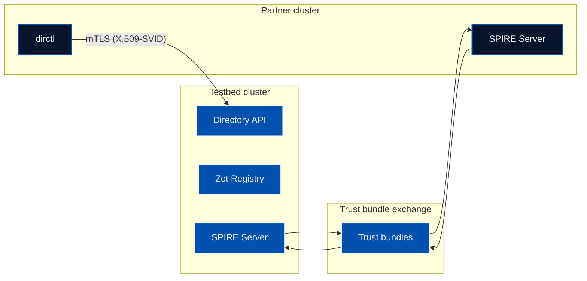

The **Agent Directory** enables secure, decentralized agent discovery across organizational boundaries. To join the public Directory network or federate your own instance, you need **SPIFFE federation**—cryptographic trust between SPIRE servers through trust bundle exchange.

This post walks you through a **hands-on local setup** using two Kind clusters: SPIRE federation with the `https_spiffe` profile, then Directory and dirctl deployed across clusters. No cert-manager or public DNS required—ideal for learning and experimentation. When you're ready for production, the docs cover the `https_web` profile and joining the public Directory.

<!--more-->

**TL;DR:** Run two Kind clusters with SPIRE federation (`https_spiffe`) and cross-cluster Directory + dirctl in about 15–20 minutes. No cert-manager or public DNS required—everything runs locally with MetalLB.

### What You'll Learn

In this post, you'll learn:

- How SPIRE servers exchange trust bundles for cross-cluster authentication
- The difference between `https_spiffe` (local/air-gapped) and `https_web` (production) federation profiles
- How the Directory and dirctl charts create `ClusterFederatedTrustDomain` automatically
- How to verify mTLS-authenticated calls between dirctl (partner cluster) and the Directory API (testbed cluster)

## Why Try Federation Locally?

- **Understand the flow** — Trust bundle exchange, workload identity across clusters
- **No production dependencies** — MetalLB provides LoadBalancer IPs; no Let's Encrypt or DNS
- **Reproducible** — Same steps work on any machine with Docker and kind
- **Foundation for prod** — Concepts transfer directly to production; profile differs (`https_web`)

## Federation Profiles at a Glance

| Profile      | Certificates      | Bootstrap       | Best for                  |
|--------------|-------------------|-----------------|---------------------------|
| **https_spiffe** | SPIRE SVIDs       | Manual exchange | Local Kind, air-gapped    |
| **https_web**    | Let's Encrypt/CA  | None            | Production, public cloud  |

We use `https_spiffe` here because it needs no cert-manager or public DNS. For production federation with the public Directory, use `https_web`. See the [Federation Profiles](https://docs.agntcy.org/dir/federation-profiles/) docs.

## Prerequisites

- [kind](https://kind.sigs.k8s.io/)
- [kubectl](https://kubernetes.io/docs/tasks/tools/)
- [Helm](https://helm.sh/) 3.x
- [Docker](https://www.docker.com/) (with Buildx)

## Architecture Overview



**Trust domains:**
- `testbed.internal.local` — Directory cluster
- `partner.testbed.local` — dirctl cluster

---

## Step 1: Create Two Kind Clusters and Install MetalLB

Create two Kind clusters and install MetalLB so LoadBalancer services receive stable IPs (required for SPIRE federation and the Directory API).

```bash
kind create cluster --name testbed
kind create cluster --name partner
```

MetalLB provides LoadBalancer IPs in Kind. Inspect your Docker network and pick IPs from the kind subnet:

```bash
docker network inspect kind --format '{{range .IPAM.Config}}{{.Subnet}} {{end}}'
```

**Testbed** (e.g. 172.18.255.1–172.18.255.9):

```bash
kubectl config use-context kind-testbed
helm repo add metallb https://metallb.github.io/metallb
helm upgrade --install metallb metallb/metallb -n metallb-system --create-namespace --wait

kubectl apply -f - <<EOF
apiVersion: metallb.io/v1beta1
kind: IPAddressPool
metadata:
  name: testbed-pool
  namespace: metallb-system
spec:
  addresses: ["172.18.255.1-172.18.255.9"]
---
apiVersion: metallb.io/v1beta1
kind: L2Advertisement
metadata:
  name: testbed-l2
  namespace: metallb-system
spec:
  ipAddressPools: [testbed-pool]
EOF
```

**Partner** (e.g. 172.18.255.11–172.18.255.19):

```bash
kubectl config use-context kind-partner
helm upgrade --install metallb metallb/metallb -n metallb-system --create-namespace --wait

kubectl apply -f - <<EOF
apiVersion: metallb.io/v1beta1
kind: IPAddressPool
metadata:
  name: partner-pool
  namespace: metallb-system
spec:
  addresses: ["172.18.255.11-172.18.255.19"]
---
apiVersion: metallb.io/v1beta1
kind: L2Advertisement
metadata:
  name: partner-l2
  namespace: metallb-system
spec:
  ipAddressPools: [partner-pool]
EOF
```

---

## Step 2: Deploy SPIRE on Both Clusters (https_spiffe)

**Testbed:**

```bash
kubectl config use-context kind-testbed

helm repo add spiffe https://spiffe.github.io/helm-charts-hardened/
helm upgrade --install -n spire-server spire-crds spire-crds --repo https://spiffe.github.io/helm-charts-hardened/ --create-namespace
helm upgrade --install -n spire-server spire spire --repo https://spiffe.github.io/helm-charts-hardened/ \
  -f - <<'EOF'
global:
  spire:
    trustDomain: testbed.internal.local
    clusterName: testbed
    namespaces:
      create: false
    ingressControllerType: other
  installAndUpgradeHooks:
    enabled: false
  deleteHooks:
    enabled: false

spire-server:
  federation:
    enabled: true
    tls:
      spire:
        enabled: true
      certManager:
        enabled: false
    ingress:
      enabled: false
  controllerManager:
    watchClassless: true
    className: spire
    identities:
      clusterFederatedTrustDomain:
        enabled: true
      clusterSPIFFEIDs:
        default:
          federatesWith: [partner.testbed.local]
EOF
```

Create LoadBalancer for federation endpoint:

```bash
kubectl apply -f - <<EOF
apiVersion: v1
kind: Service
metadata:
  name: spire-server-federation
  namespace: spire-server
  annotations:
    metallb.io/address-pool: testbed-pool
spec:
  type: LoadBalancer
  selector:
    app.kubernetes.io/name: server
    app.kubernetes.io/instance: spire
  ports:
  - port: 8443
    targetPort: 8443
    name: federation
EOF
```

**Partner:**

```bash
kubectl config use-context kind-partner

helm upgrade --install -n spire-server spire-crds spire-crds --repo https://spiffe.github.io/helm-charts-hardened/ --create-namespace
helm upgrade --install -n spire-server spire spire --repo https://spiffe.github.io/helm-charts-hardened/ \
  -f - <<'EOF'
global:
  spire:
    trustDomain: partner.testbed.local
    clusterName: partner
    namespaces:
      create: false
    ingressControllerType: other
  installAndUpgradeHooks:
    enabled: false
  deleteHooks:
    enabled: false

spire-server:
  federation:
    enabled: true
    tls:
      spire:
        enabled: true
      certManager:
        enabled: false
    ingress:
      enabled: false
  controllerManager:
    watchClassless: true
    className: spire
    identities:
      clusterFederatedTrustDomain:
        enabled: true
      clusterSPIFFEIDs:
        default:
          federatesWith: [testbed.internal.local]
EOF
```

```bash
kubectl apply -f - <<EOF
apiVersion: v1
kind: Service
metadata:
  name: spire-server-federation
  namespace: spire-server
  annotations:
    metallb.io/address-pool: partner-pool
spec:
  type: LoadBalancer
  selector:
    app.kubernetes.io/name: server
    app.kubernetes.io/instance: spire
  ports:
  - port: 8443
    targetPort: 8443
    name: federation
EOF
```

**Verify:**
```bash
kubectl get svc -n spire-server spire-server-federation
# testbed EXTERNAL-IP: 172.18.255.1, partner: 172.18.255.11
```

---

## Step 3: Export Trust Bundles

With `https_spiffe`, each SPIRE server needs the other's trust bundle to bootstrap the TLS connection. The **dir** and **dirctl** charts create `ClusterFederatedTrustDomain` automatically from their `spire.federation` config—you don't need to apply them manually. We export the bundles now so we can embed them in the Helm values.

```bash
kubectl config use-context kind-partner
kubectl exec -n spire-server spire-server-0 -c spire-server -- \
  spire-server bundle show -format spiffe > ./partner.bundle

kubectl config use-context kind-testbed
kubectl exec -n spire-server spire-server-0 -c spire-server -- \
  spire-server bundle show -format spiffe > ./testbed.bundle
```

---

## Step 4: Deploy Directory on Testbed

Deploy the Directory chart (API server, Zot registry, PostgreSQL) with SPIRE enabled and federation to `partner.testbed.local`. The **dir chart creates `ClusterFederatedTrustDomain`** from `apiserver.spire.federation`, so the testbed SPIRE server fetches the partner bundle and the API server can verify dirctl's X.509-SVID over mTLS.

Ensure `./partner.bundle` exists before running (from Step 3).

```bash
kubectl config use-context kind-testbed

helm install dir oci://ghcr.io/agntcy/dir/helm-charts/dir \
  --version v1.0.0 \
  --namespace dir \
  --create-namespace \
  -f - <<EOF
apiserver:
  image:
    repository: ghcr.io/agntcy/dir-apiserver
    tag: v1.0.0
    pullPolicy: IfNotPresent
  service:
    type: ClusterIP
  metrics:
    enabled: false
  routingService:
    type: NodePort
    nodePort: 30555
  spire:
    enabled: true
    className: spire
    trustDomain: testbed.internal.local
    useCSIDriver: true
    federation:
      - trustDomain: partner.testbed.local
        className: spire
        bundleEndpointURL: https://172.18.255.11:8443
        bundleEndpointProfile:
          type: https_spiffe
          endpointSPIFFEID: spiffe://partner.testbed.local/spire/server
        trustDomainBundle: |
$(cat ./partner.bundle | sed 's/^/          /')
  config:
    listen_address: "0.0.0.0:8888"
    oasf_api_validation:
      disable: true
    authn:
      enabled: true
      mode: "x509"
      socket_path: "unix:///run/spire/agent-sockets/api.sock"
      audiences:
        - "spiffe://testbed.internal.local/spire/server"
    authz:
      enabled: true
      enforcer_policy_file_path: "/etc/agntcy/dir/authz_policies.csv"
    ratelimit:
      enabled: false
    store:
      provider: "oci"
      oci:
        registry_address: "dir-zot.dir.svc.cluster.local:5000"
        auth_config:
          insecure: "true"
          username: "admin"
          password: "admin"
    routing:
      listen_address: "/ip4/0.0.0.0/tcp/5555"
      datastore_dir: /etc/routing/datastore
      directory_api_address: "dir-apiserver.dir.svc.cluster.local:8888"
      gossipsub:
        enabled: false
    sync:
      auth_config:
        username: "user"
        password: "user"
    publication:
      scheduler_interval: "1h"
      worker_count: 1
      worker_timeout: "30m"
    database:
      type: "postgres"
      postgres:
        host: ""
        port: 5432
        database: "dir"
        ssl_mode: "disable"
  authz_policies_csv: |
    p,testbed.internal.local,*
    p,partner.testbed.local,*
    p,*,/agntcy.dir.store.v1.StoreService/Push
    p,*,/agntcy.dir.store.v1.StoreService/Pull
    p,*,/agntcy.dir.store.v1.StoreService/PullReferrer
    p,*,/agntcy.dir.store.v1.StoreService/Lookup
    p,*,/agntcy.dir.store.v1.SyncService/RequestRegistryCredentials
  secrets:
    ociAuth:
      username: "admin"
      password: "admin"
  reconciler:
    config:
      regsync:
        enabled: false
      indexer:
        enabled: false
  postgresql:
    enabled: true
    auth:
      username: "dir"
      password: "dir"
      database: "dir"
  strategy:
    type: Recreate
  extraVolumeMounts:
    - name: dir-routing-storage
      mountPath: /etc/routing
  extraVolumes:
    - name: dir-routing-storage
      emptyDir: {}
  zot:
    resources: {}
    mountSecret: true
    authHeader: "admin:admin"
    secretFiles:
      htpasswd: |-
        admin:\$2y\$05\$vmiurPmJvHylk78HHFWuruFFVePlit9rZWGA/FbZfTEmNRneGJtha
        user:\$2y\$05\$L86zqQDfH5y445dcMlwu6uHv.oXFgT6AiJCwpv3ehr7idc0rI3S2G
    mountConfig: true
    configFiles:
      config.json: |-
        {
          "distSpecVersion": "1.1.1",
          "storage": {"rootDirectory": "/var/lib/registry"},
          "http": {
            "address": "0.0.0.0",
            "port": "5000",
            "auth": {"htpasswd": {"path": "/secret/htpasswd"}},
            "accessControl": {
              "adminPolicy": {"users": ["admin"], "actions": ["read", "create", "update", "delete"]},
              "repositories": {"**": {"anonymousPolicy": [], "defaultPolicy": ["read"]}}
            }
          },
          "log": {"level": "info"},
          "extensions": {"search": {"enable": true}, "trust": {"enable": true, "cosign": true, "notation": false}}
        }
EOF
```

Wait for the API server:

```bash
kubectl wait --for=condition=ready pod -n dir -l app.kubernetes.io/name=apiserver --timeout=240s
```

Expose Directory API via LoadBalancer:

```bash
kubectl apply -f - <<EOF
apiVersion: v1
kind: Service
metadata:
  name: dir-apiserver-external
  namespace: dir
  annotations:
    metallb.io/address-pool: testbed-pool
spec:
  type: LoadBalancer
  selector:
    app.kubernetes.io/name: apiserver
    app.kubernetes.io/instance: dir
  ports:
  - port: 8888
    targetPort: 8888
    name: grpc
EOF
# EXTERNAL-IP will be 172.18.255.2
```

---

## Step 5: Deploy dirctl on Partner

Deploy the dirctl chart configured to call the testbed API at `172.18.255.2:8888`. The **dirctl chart creates `ClusterFederatedTrustDomain`** from `spire.federation`, so the partner SPIRE server fetches the testbed bundle and dirctl can verify the API server's certificate over mTLS. The search cronjob runs every minute to demonstrate cross-cluster connectivity.

Ensure `./testbed.bundle` exists before running (from Step 3).

```bash
kubectl config use-context kind-partner

helm install dirctl oci://ghcr.io/agntcy/dir/helm-charts/dirctl \
  --version v1.0.0 \
  --namespace dir-admin \
  --create-namespace \
  -f - <<EOF
global:
  cronjob:
    failedJobsHistoryLimit: 10
    successfulJobsHistoryLimit: 10
    concurrencyPolicy: "Forbid"

image:
  repository: ghcr.io/agntcy/dir-ctl
  tag: v1.0.0
  pullPolicy: IfNotPresent

spire:
  enabled: true
  trustDomain: partner.testbed.local
  useCSIDriver: true
  className: spire
  federation:
    - trustDomain: testbed.internal.local
      className: spire
      bundleEndpointURL: https://172.18.255.1:8443
      bundleEndpointProfile:
        type: https_spiffe
        endpointSPIFFEID: spiffe://testbed.internal.local/spire/server
      trustDomainBundle: |
$(cat ./testbed.bundle | sed 's/^/        /')

env:
  - name: DIRECTORY_CLIENT_SERVER_ADDRESS
    value: "172.18.255.2:8888"
  - name: DIRECTORY_CLIENT_AUTH_MODE
    value: "x509"
  - name: DIRECTORY_CLIENT_TLS_SKIP_VERIFY
    value: "true"

cronjobs:
  search:
    enabled: true
    schedule: "* * * * *"
    args: ["search"]
EOF
```

> **Note:** `DIRECTORY_CLIENT_TLS_SKIP_VERIFY: "true"` is used because the API server is reached via MetalLB IP (no matching cert SAN). For production, use a proper DNS name and valid certificate.

---

## Step 6: Verify

**Optional: verify SPIRE federation first.** Confirm each cluster has the other's trust bundle—helps debug auth failures before running dirctl:

```bash
# On testbed – partner's bundle should appear
kubectl config use-context kind-testbed
kubectl exec -n spire-server spire-server-0 -c spire-server -- \
  spire-server bundle list -id spiffe://partner.testbed.local -format spiffe

# On partner – testbed's bundle should appear
kubectl config use-context kind-partner
kubectl exec -n spire-server spire-server-0 -c spire-server -- \
  spire-server bundle list -id spiffe://testbed.internal.local -format spiffe
```

**Verify dirctl can call the Directory API:**

```bash
kubectl config use-context kind-partner
kubectl create job -n dir-admin dirctl-verify --from=cronjob/dirctl-search --dry-run=client -o yaml | kubectl apply -f -
kubectl wait --for=condition=complete job/dirctl-verify -n dir-admin --timeout=120s
kubectl logs -n dir-admin job/dirctl-verify
```

Expected: successful `search` output (list of records or empty). If you see `remote error: tls: bad certificate`, ensure the Directory API server has `apiserver.spire.federation` for `partner.testbed.local` and `authz_policies_csv` includes `p,partner.testbed.local,*`.

---

## Cleanup

When finished, tear down both clusters:

```bash
# Testbed
kubectl config use-context kind-testbed
helm uninstall dir -n dir
helm uninstall spire -n spire-server
helm uninstall spire-crds -n spire-server

# Partner
kubectl config use-context kind-partner
helm uninstall dirctl -n dir-admin
helm uninstall spire -n spire-server
helm uninstall spire-crds -n spire-server

# Delete clusters
kind delete cluster --name testbed
kind delete cluster --name partner
```

---

## Troubleshooting

| Issue | Check |
|-------|-------|
| dirctl auth failure | `authz_policies_csv` has `p,partner.testbed.local,*`; dirctl pods get SVIDs |
| "no X.509 bundle for trust domain" | dirctl needs testbed bundle via `spire.federation`; reinstall and retry |
| "remote error: tls: bad certificate" | Directory needs `apiserver.spire.federation` for partner; restart apiserver |
| Connection refused | MetalLB pools; LoadBalancer selector; Docker network |
| Zot 401 / hash errors | Use `\$` in bcrypt hashes in heredocs to prevent shell expansion |
| Reconciler 503 | Wait for PostgreSQL and Zot to be ready; reconciler needs both for readiness |
| SPIFFE CSI driver missing | SPIRE chart should provide it; if pods fail, check `spire.useCSIDriver` and agent |

---

## Conclusion

This hands-on setup demonstrates that **SPIFFE federation doesn't require production infrastructure**. With two Kind clusters, MetalLB, and the `https_spiffe` profile, you can run cross-cluster mTLS in under 20 minutes. The Directory and dirctl charts handle trust bundle configuration automatically—no manual `ClusterFederatedTrustDomain` applies needed. The concepts (trust bundles, workload identity, federation profiles) transfer directly to production; only the profile (`https_web`) and infrastructure (Ingress, cert-manager, DNS) change.

## Next Steps: Production and Public Directory

For **production** and joining the **public Directory network** at `prod.api.ads.outshift.io`:

1. **[Production Deployment](https://docs.agntcy.org/dir/prod-deployment/)** — EKS, NGINX Ingress, SSL passthrough, persistent storage, credential management.
2. **[Partner Federation with Prod](https://docs.agntcy.org/dir/partner-prod-federation/)** — Step-by-step guide using the `https_web` profile (Let's Encrypt), public endpoints, and contributing your federation file to dir-staging.

## References

- [Directory GitHub Repository](https://github.com/agntcy/dir)
- [Directory Documentation](https://docs.agntcy.org/dir/overview/)
- [SPIFFE / SPIRE](https://spiffe.io)
- [Federation Profiles](https://docs.agntcy.org/dir/federation-profiles/)
- [Kind](https://kind.sigs.k8s.io/)
- [MetalLB](https://metallb.org/)

---

*Have questions about Directory federation or SPIFFE? Join our [Slack community](https://join.slack.com/t/agntcy/shared_invite/zt-3hb4p7bo0-5H2otGjxGt9OQ1g5jzK_GQ) or check out our [GitHub](https://github.com/agntcy).*
