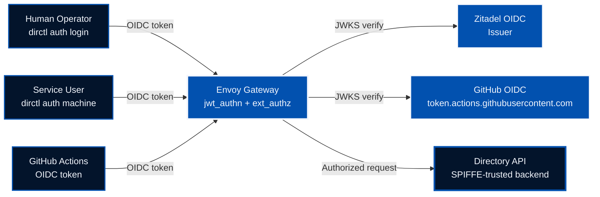
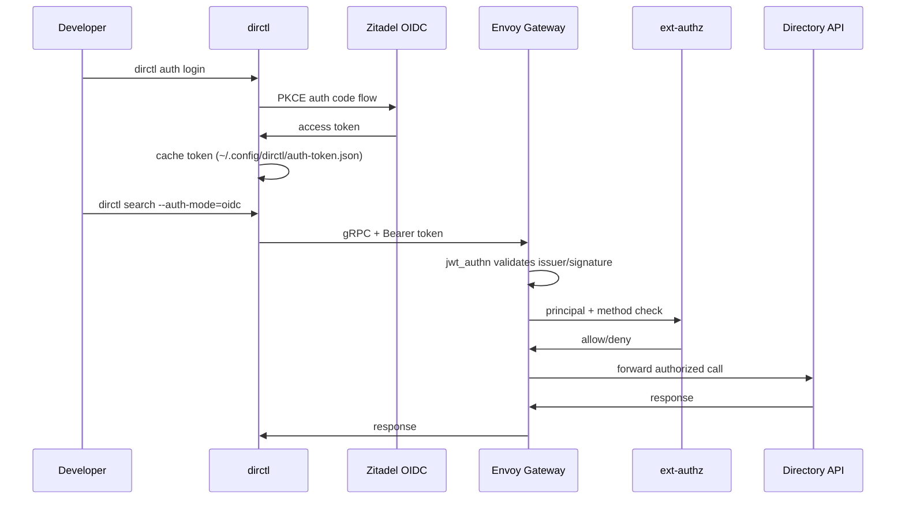

Authentication in Directory has evolved significantly. We moved from a mixed model centered on GitHub OAuth for user access to a **unified OIDC-first model** that supports three real-world access patterns with one consistent trust and authorization pipeline:

1. Human interactive login
2. Service user (machine-to-machine) login
3. GitHub Actions workload identity

This post explains the architecture, security model, migration path, and practical usage patterns for the new OIDC-based setup.

<!--more-->

## Why We Changed

The previous model solved an important problem, but it became limiting as usage expanded:

- Human operators needed browser-based login and cached session behavior
- Service users needed one-step non-interactive auth without manual token curl flows
- CI pipelines needed short-lived workload identity without long-lived PAT secrets

A single OIDC model gives us:

- ✅ One identity protocol across humans, machines, and workflows
- ✅ Short-lived bearer tokens instead of long-lived static credentials
- ✅ Cleaner RBAC principal mapping in `envoy-authz`
- ✅ Better security posture for automation and public gateway usage

## The New Model at a Glance

Directory now uses **OIDC for caller identity**, while preserving **SPIFFE-based service trust** inside the platform.



Key idea: **identity is OIDC at the edge, authorization is policy-driven in ext-authz, backend trust remains SPIFFE-aware.**

---

# Part 1: Human Interactive OIDC

Human users authenticate with OIDC PKCE via `dirctl auth login`.

In practice this is the "developer laptop" path: interactive browser login once, then cached token reuse for normal CLI operations.

## Flow



## Request and dataflow (human path)

1. `dirctl` gets an access token from Zitadel (PKCE) and caches it locally.
2. CLI sends gRPC request with `Authorization: Bearer <token>` to Envoy.
3. Envoy `jwt_authn` validates issuer/signature and routes only verified JWTs forward.
4. `ext_authz` extracts canonical principal (typically `user:{iss}:{sub}`) and checks method permission in Casbin.
5. On allow, request is forwarded and backend sees the authorized identity context.

This keeps authn/authz logic centralized at the edge while keeping backend behavior consistent.

## Example

```bash
export DIRECTORY_CLIENT_OIDC_ISSUER="https://prod.idp.ads.outshift.io"
export DIRECTORY_CLIENT_OIDC_CLIENT_ID="<human-native-client-id>"

dirctl auth login
dirctl auth status

dirctl search --version "v1.*" \
  --server-addr "prod.gateway.ads.outshift.io:443" \
  --auth-mode=oidc \
  --output json
```

---

# Part 2: Service User / Machine OIDC

Machine auth now supports a one-step CLI path with client credentials.

This is the preferred path for non-interactive automation outside GitHub Actions (for example bots, scheduled jobs, and service integrations).

## One-step machine login

```bash
dirctl auth machine \
  --oidc-issuer "https://prod.idp.ads.outshift.io" \
  --oidc-machine-client-id "<machine-client-id>" \
  --oidc-machine-client-secret-file "/path/to/secret.txt" \
  --oidc-machine-scope "openid profile email"
```

The token is cached after login and reused by regular commands.

## Request and dataflow (machine path)

1. `dirctl auth machine` uses client credentials against the OIDC token endpoint.
2. Returned token is cached and reused until expiry.
3. Runtime requests go through the same edge chain: `jwt_authn` -> `ext_authz` -> backend.
4. Principal is resolved as machine/workload identity (for example `client:{iss}:{client_id}` when configured).

Important behavior: this path removes manual curl token acquisition and keeps machine auth consistent with human OIDC transport and policy enforcement.

## Automatic token re-mint

If the cached token expires, `dirctl` can mint a fresh token automatically during command execution when machine credentials are configured:

```bash
export DIRECTORY_CLIENT_OIDC_ISSUER="https://prod.idp.ads.outshift.io"
export DIRECTORY_CLIENT_OIDC_MACHINE_CLIENT_ID="<machine-client-id>"
export DIRECTORY_CLIENT_OIDC_MACHINE_CLIENT_SECRET_FILE="/path/to/secret.txt"
export DIRECTORY_CLIENT_OIDC_MACHINE_SCOPES="openid,profile,email"
```

Then run commands normally:

```bash
dirctl search --version "v1.*" \
  --server-addr "prod.gateway.ads.outshift.io:443" \
  --auth-mode=oidc \
  --output json
```

---

# Part 3: GitHub Actions OIDC (No PAT)

CI now uses workload identity tokens from GitHub OIDC instead of `DIRECTORY_CLIENT_GITHUB_TOKEN` PAT flows.

This gives per-run, short-lived identity and avoids storing long-lived credentials for Directory access in CI.

## Reusable workflow actions

We introduced reusable workflow actions to simplify secure CI usage:

- `./.github/actions/build-dirctl`
- `./.github/actions/fetch-oidc-token`

## Minimal pattern

```yaml
permissions:
  id-token: write
  contents: read

steps:
  - uses: actions/checkout@v4

  - name: Build dirctl from branch source
    id: build-dirctl
    uses: ./.github/actions/build-dirctl
    with:
      go_version: "1.26.1"

  - name: Fetch OIDC token
    id: oidc
    uses: ./.github/actions/fetch-oidc-token
    with:
      audience: dir

  - name: Run search
    env:
      DIRECTORY_CLIENT_OIDC_TOKEN: ${{ steps.oidc.outputs.token }}
      DIRCTL_PATH: ${{ steps.build-dirctl.outputs.dirctl_path }}
    run: |
      "${DIRCTL_PATH}" search --name "*" \
        --server-addr "prod.gateway.ads.outshift.io:443" \
        --auth-mode=oidc \
        --output json
```

This removes long-lived PAT dependence for workflow access to Directory.

## Request and dataflow (GitHub Actions path)

1. Workflow requests OIDC token from GitHub (`id-token: write` permission).
2. Token is passed to `dirctl` via `DIRECTORY_CLIENT_OIDC_TOKEN`.
3. Envoy validates GitHub issuer/JWKS and expected audience.
4. `ext_authz` maps trusted workflow claims to canonical workflow principal (`ghwf:...`) and applies Casbin role checks.
5. Request is allowed only if workflow identity and method permissions match policy.

This is why CI identity is treated as workload identity, not human federation identity.

---

# Part 4: Why This CI Model (Decision Record)

Before landing on the current setup, we evaluated multiple GitHub Actions integration patterns.

## Options we considered

| Option | Security | Effort | Operational Complexity | Final decision |
|---|---|---|---|---|
| Trust GitHub Actions OIDC directly at edge | High (short-lived, workflow identity) | Medium | Medium | ✅ Chosen |
| GitHub OIDC -> broker/token exchange -> internal token | Very high | High | High | Later candidate |
| Zitadel machine client credentials from GitHub secrets | Medium (long-lived secret) | Low | Low/Medium | Useful fallback |

## Why direct GitHub OIDC trust won for now

- It removes long-lived PAT/static-secret dependency in CI
- It maps naturally to workflow-level identity claims
- It fits our current Envoy + `jwt_authn` + `ext_authz` architecture
- It delivered strong security quickly without introducing a new broker service

## Important distinction

GitHub appears in two very different roles:

- **GitHub federation for humans** (browser login UX)
- **GitHub Actions OIDC for workloads** (ephemeral workflow identity)

Treating workflow identity as machine/workload auth (not human federation) was a key design choice.

---

# Part 5: Authorization Model (ext-authz + Casbin)

Identity and authorization are intentionally separated:

1. Envoy `jwt_authn` validates token issuer/signature/audience
2. `envoy-authz` extracts canonical principal
3. Casbin enforces method-level role permissions

## Request pipeline details

```text
Client (Bearer JWT)
  -> Envoy jwt_authn
      - validates token (iss, signature, aud)
      - forwards verified payload
  -> ext_authz
      - computes canonical principal
      - enforces Casbin role/method policy
      - sets authorization identity headers
  -> backend
      - receives request already authorized with canonical identity
```

## Canonical identity consistency

A subtle but important behavior: the backend should see the **same principal** that authorization evaluated.

- `jwt_authn` can expose identity from standard claims (e.g. `sub`)
- `ext_authz` computes canonical principal (`user:...`, `client:...`, `ghwf:...`)
- `ext_authz` returns headers so the backend gets that canonical identity, avoiding "authorized one identity, logged another" drift

This improves auditability and reduces policy confusion.

## Forwarded `x-` headers for backend features

These identity headers are forwarded downstream after authorization and can be used by backend services for rate limits, audit logs, and feature controls:

- `x-authorized-principal`: canonical identity used by Casbin (for example `user:...`, `client:...`, `ghwf:...`)
- `x-user-id`: set to the same canonical principal value for consistent identity handling
- `x-principal-type`: principal class (for example `user`, `service`, `github`, `public`)
- `x-user-issuer`: issuer claim projected by `jwt_authn` (`iss`)

The verified JWT payload header (`x-jwt-payload`) is used by `ext_authz` for extraction/evaluation; client-supplied values are stripped at the edge before JWT validation.

## Principal types

- Human users: `user:{iss}:{sub}`
- Machine clients: `client:{iss}:{client_id}`
- GitHub workflows: `ghwf:repo:{repo}:workflow:{file}:ref:{ref}[:env:{env}]`

## GitHub workflow wildcard support

To avoid per-branch role churn, workflow principals support constrained wildcard matching:

- Allowed: one trailing `*` in branch suffix under `:ref:refs/heads/`
- Example: `ghwf:repo:agntcy/dir:workflow:oidc-test.yml:ref:refs/heads/*`
- Not allowed: multiple wildcards, internal wildcards, wildcard outside branch segment

This keeps matching practical while avoiding regex complexity and policy ambiguity.

---

# Part 6: Claim Validation and Policy Boundaries

For GitHub workflow identity, trust is not just "issuer is GitHub." We also bind authorization to stable workflow context claims.

Typical checks include:

- `iss == https://token.actions.githubusercontent.com`
- `aud == <expected audience>`
- `repository` and `repository_owner`
- `ref` (branch/tag)
- `job_workflow_ref` (workflow file + ref)
- optional `environment`

Design boundary we keep strict:

- **Authentication claims** prove identity context
- **Roles and permissions** come from deployment config/Casbin policy
- We do not treat JWT role claims as authorization truth

---

# Part 7: Security Hardening Improvements

The OIDC rollout included additional hardening:

- Removed `grpc.reflection` from public auth server paths
- Added ingress rate limits for publicly exposed gateway endpoints

Combined with short-lived OIDC tokens and explicit RBAC roles, this improves default security for both human and CI traffic.

---

# Part 8: Migration Notes

If you still have legacy GitHub auth config/docs, this is the practical migration path:

1. Switch CLI and workflows to `--auth-mode=oidc`
2. Replace `DIRECTORY_CLIENT_GITHUB_TOKEN` with `DIRECTORY_CLIENT_OIDC_TOKEN` in CI
3. Configure OIDC issuer/JWKS trust in Envoy
4. Migrate RBAC principals from `github:<user>` to OIDC principal forms
5. Add dedicated least-privilege roles for CI workflows

---

## What This Unlocks Next

Unified OIDC gives us a cleaner base for:

- Consistent policy semantics across user and workload identities
- Better auditability of authenticated principals
- Easier enterprise IdP federation and rollout
- Safer CI automation through ephemeral identities
- Optional IdP role-claim mapping for user/service tokens to reduce per-principal config churn

### Future direction: optional role-claim mapping

A practical next step is to support an opt-in mode where trusted IdP role claims (for human or service-user tokens) can map directly to ext-authz roles.

Potential benefits:

- Faster onboarding for new users or service accounts
- Fewer manual role principal entries in static config
- Better alignment with enterprise IAM role management

Guardrails we would keep:

- Disabled by default (explicit opt-in)
- Issuer-scoped trust policy (only configured issuers/claims accepted)
- Strict allowlist mapping (`token-role` -> `ext-authz role`) instead of free-form trust
- Existing deny-list and method-level Casbin checks remain authoritative
- Auditable logs showing claim-derived role resolution decisions

## Conclusion

Directory’s authentication model is now simpler and stronger:

- ✅ One OIDC-first model for humans, machines, and CI
- ✅ Explicit role-based authorization with method-level control
- ✅ Reduced secret sprawl by removing PAT dependence in CI
- ✅ Preserved service-to-service trust boundaries in backend infrastructure

This is a meaningful step toward secure-by-default Directory operations at scale.

## 📚 References

- [Directory GitHub Repository](https://github.com/agntcy/dir)
- [OpenID Connect Core](https://openid.net/specs/openid-connect-core-1_0.html)
- [OAuth 2.0 Authorization Framework (RFC 6749)](https://datatracker.ietf.org/doc/html/rfc6749)
- [GitHub Actions OIDC Documentation](https://docs.github.com/en/actions/security-for-github-actions/security-hardening-your-deployments/about-security-hardening-with-openid-connect)
- [Envoy JWT Authentication Filter](https://www.envoyproxy.io/docs/envoy/latest/configuration/http/http_filters/jwt_authn_filter)
- [Envoy External Authorization Filter](https://www.envoyproxy.io/docs/envoy/latest/configuration/http/http_filters/ext_authz_filter)
- [SPIFFE/SPIRE Documentation](https://spiffe.io)
