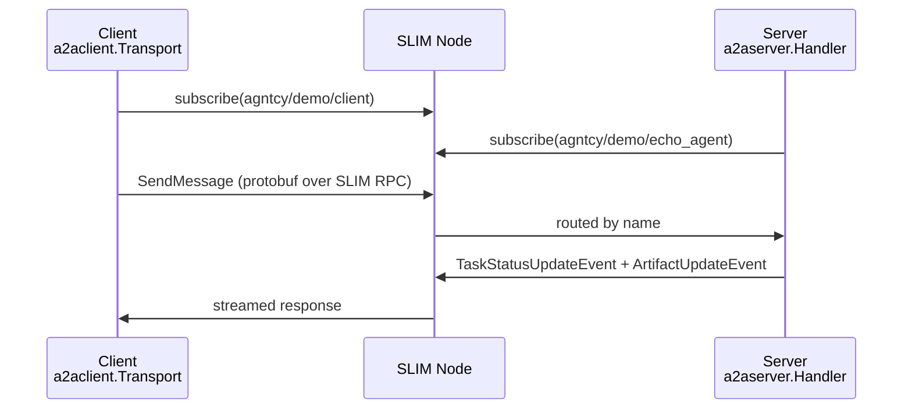
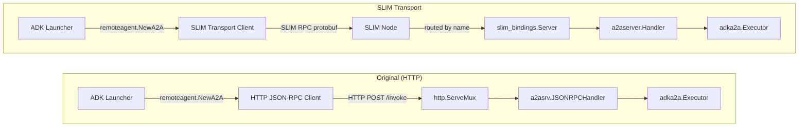

We're excited to announce the initial release of
[**slim-a2a-go**](https://github.com/agntcy/slim-a2a-go) (v0.1.0): a Go library
that lets any [A2A](https://a2a-protocol.org/latest/) agent communicate over
[SLIM](https://github.com/agntcy/slim) instead of HTTP or gRPC — in just a few
lines of code.

<!--more-->

## Why slim-a2a-go?

The [A2A (Agent-to-Agent) protocol](https://a2a-protocol.org/latest/) defines a standard interface
for AI agents to discover and communicate with each other. Its reference Go SDK,
[a2a-go](https://github.com/a2aproject/a2a-go), ships with two transports out of
the box: HTTP/JSON-RPC and gRPC. Both are great for many scenarios, but they
carry the usual baggage of TCP-based networking: you need to know the remote
agent's hostname and port, manage TLS certificates, deal with firewalls and
NAT traversal, and so on.

**SLIM** ([Secure Low-Latency Interactive Messaging](https://github.com/agntcy/slim))
takes a different approach. Instead of addressing agents by IP and port, SLIM
uses a hierarchical naming scheme — think `agntcy/demo/weather_agent` — and
routes messages through lightweight SLIM nodes that act as brokers. Your agents
subscribe to a name, and peers reach them by that name, regardless of where they
physically run. SLIM also provides end-to-end MLS encryption and session-layer
reliability out of the box.

`slim-a2a-go` is the bridge between these two worlds. It adds SLIM as a third
transport option for `a2a-go`, letting you swap HTTP for SLIM with minimal
changes to your agent code.

## Architecture

The library has two packages that mirror the client/server split in `a2a-go`:

* **`a2aclient`** — wraps a `slim_bindings.Channel` and implements the full
  `a2aclient.Transport` interface, so every A2A operation (send message, get
  task, streaming, push notifications…) works over SLIM.
* **`a2aserver`** — wraps an `a2asrv.RequestHandler` and registers it with a
  `slim_bindings.Server`, converting incoming SLIM RPC calls back into A2A
  domain types.

The generated protobuf/SLIM-RPC stubs in the `a2apb` package provide the
wire-format layer, produced by the
[`protoc-gen-slimrpc-go`](https://github.com/agntcy/slim) plugin from the
official [A2A gRPC specification](https://github.com/a2aproject/A2A).



Under the hood, messages are serialised to protobuf (the same wire format as the
gRPC transport) and then carried over SLIM's own binary transport layer. The
application code only ever sees `a2a-go`'s domain types — `*a2a.Message`,
`*a2a.Task`, etc.

---

## Getting Started

Add `slim-a2a-go` to your module:

```bash
go get github.com/agntcy/slim-a2a-go@v0.1.0
```

Then download the pre-compiled SLIM native library:

```bash
go run github.com/agntcy/slim-bindings-go/cmd/slim-bindings-setup
```

This installs a platform-specific shared library that the Go bindings link
against at runtime. It is a one-time step per developer machine and is already
baked into the CI workflow in the `slim-a2a-go` repository.

### Prerequisites

| Requirement | Version |
|---|---|
| Go | 1.23+ |
| SLIM node | any release from [agntcy/slim](https://github.com/agntcy/slim/releases) |
| `slimctl` (optional) | same release |

A SLIM node can be started locally in seconds:

```bash
# Option 1 – via slimctl
slimctl slim start --endpoint 127.0.0.1:46357
```

```bash
# Option 2 – via Docker
docker run -p 46357:46357 ghcr.io/agntcy/slim:latest \
  /slim --config /config.yaml
```

### Repository layout

```
slim-a2a-go/
├── a2aclient/          # Client transport (slim_bindings.Channel → a2aclient.Transport)
├── a2aserver/          # Server handler  (a2asrv.RequestHandler → slim_bindings.Server)
├── a2apb/              # Generated SLIM RPC stubs (protoc-gen-slimrpc-go)
└── examples/
    └── echo_agent/
        ├── cmd/server/ # Echo agent server
        └── cmd/client/ # Echo agent client
```

---

## Example 1: A Simple Native A2A Agent over SLIM

Let's walk through the echo-agent example that ships with the library. It
demonstrates the full server + client lifecycle in about 80 lines each.

### The server

An A2A server over SLIM has four steps:

1. Initialise the runtime
2. Create an application identity
3. Build the A2A handler stack
4. Call `Serve()`

The full source is at [`examples/echo_agent/cmd/server/main.go`](https://github.com/agntcy/slim-a2a-go/blob/main/examples/echo_agent/cmd/server/main.go).

```go
// examples/echo_agent/cmd/server/main.go
package main

import (
    "context"
    "fmt"
    "log/slog"

    "github.com/a2aproject/a2a-go/a2a"
    "github.com/a2aproject/a2a-go/a2asrv"
    "github.com/a2aproject/a2a-go/a2asrv/eventqueue"
    "github.com/agntcy/slim-a2a-go/a2aserver"
    slim_bindings "github.com/agntcy/slim-bindings-go"
)

func run(endpoint string) error {
    // 1. Initialise the global SLIM runtime (Rust library via CGo).
    slim_bindings.InitializeWithDefaults()
    svc := slim_bindings.GetGlobalService()

    // 2. Create this agent's SLIM identity using a hierarchical name (org, namespace, service).
    name := slim_bindings.NewName("agntcy", "demo", "echo_agent")
    app, err := svc.CreateAppWithSecret(name, "my_shared_secret_for_testing_purposes_only")
    if err != nil {
        return fmt.Errorf("create app: %w", err)
    }

    // 3. Connect to the SLIM routing node and subscribe to our name.
    connID, err := svc.Connect(slim_bindings.NewInsecureClientConfig(endpoint))
    if err != nil {
        return fmt.Errorf("connect: %w", err)
    }
    if err := app.Subscribe(name, &connID); err != nil {
        return fmt.Errorf("subscribe: %w", err)
    }

    // 4. Build the A2A handler stack and register it with the SLIM server.
    requestHandler := a2asrv.NewHandler(&echoExecutor{})
    slimHandler    := a2aserver.NewHandler(requestHandler)
    server         := slim_bindings.ServerNewWithConnection(app, name, &connID)
    slimHandler.RegisterWith(server)

    slog.Info("echo agent ready", "slim_name", "agntcy/demo/echo_agent")
    return server.Serve()
}
```

The agent logic lives in an `AgentExecutor`, identical to any `a2a-go` executor
regardless of transport:

```go
type echoExecutor struct{}

func (e *echoExecutor) Execute(
    ctx context.Context,
    reqCtx *a2asrv.RequestContext,
    queue eventqueue.Queue,
) error {
    if reqCtx.StoredTask == nil {
        if err := queue.Write(ctx, a2a.NewStatusUpdateEvent(reqCtx, a2a.TaskStateSubmitted, nil)); err != nil {
            return err
        }
    }
    if err := queue.Write(ctx, a2a.NewStatusUpdateEvent(reqCtx, a2a.TaskStateWorking, nil)); err != nil {
        return err
    }

    text := extractText(reqCtx.Message)

    if err := queue.Write(ctx, a2a.NewArtifactEvent(reqCtx, a2a.TextPart{Text: text})); err != nil {
        return err
    }

    completed := a2a.NewStatusUpdateEvent(reqCtx, a2a.TaskStateCompleted, nil)
    completed.Final = true
    return queue.Write(ctx, completed)
}

func (e *echoExecutor) Cancel(
    ctx context.Context,
    reqCtx *a2asrv.RequestContext,
    queue eventqueue.Queue,
) error {
    evt := a2a.NewStatusUpdateEvent(reqCtx, a2a.TaskStateCanceled, nil)
    evt.Final = true
    return queue.Write(ctx, evt)
}
```

Notice that nothing in the executor knows about SLIM — it just writes events to
the queue, exactly as it would for an HTTP or gRPC server.

### The client

On the client side, swap the usual HTTP/gRPC transport for `slima2aclient.NewTransport`:

The full source is at [`examples/echo_agent/cmd/client/main.go`](https://github.com/agntcy/slim-a2a-go/blob/main/examples/echo_agent/cmd/client/main.go).

```go
// examples/echo_agent/cmd/client/main.go
package main

import (
    "context"
    "fmt"

    "github.com/a2aproject/a2a-go/a2a"
    slima2aclient "github.com/agntcy/slim-a2a-go/a2aclient"
    slim_bindings "github.com/agntcy/slim-bindings-go"
)

func run(endpoint, text string) error {
    slim_bindings.InitializeWithDefaults()
    svc := slim_bindings.GetGlobalService()

    // The client needs its own SLIM identity so it can receive replies.
    // The org and namespace don't have to match the server's — any unique
    // name on the SLIM node works.
    localName := slim_bindings.NewName("agntcy", "demo", "client")
    app, err := svc.CreateAppWithSecret(localName, "my_shared_secret_for_testing_purposes_only")
    if err != nil {
        return fmt.Errorf("create app: %w", err)
    }

    connID, err := svc.Connect(slim_bindings.NewInsecureClientConfig(endpoint))
    if err != nil {
        return fmt.Errorf("connect: %w", err)
    }
    if err := app.Subscribe(localName, &connID); err != nil {
        return fmt.Errorf("subscribe: %w", err)
    }

    // Open a channel to the echo agent by its SLIM name.
    remoteName := slim_bindings.NewName("agntcy", "demo", "echo_agent")
    channel    := slim_bindings.ChannelNewWithConnection(app, remoteName, &connID)
    defer channel.Destroy()

    // Wrap the channel in the SLIM A2A transport.
    transport := slima2aclient.NewTransport(channel)
    defer transport.Destroy() //nolint:errcheck

    result, err := transport.SendMessage(context.Background(), &a2a.MessageSendParams{
        Message: &a2a.Message{
            ID:    a2a.NewMessageID(),
            Role:  a2a.MessageRoleUser,
            Parts: []a2a.Part{a2a.TextPart{Text: text}},
        },
    })
    if err != nil {
        return fmt.Errorf("send message: %w", err)
    }

    fmt.Printf("> %s\n", text)
    printResult(result)
    return nil
}
```

### Running the example

```bash
# Terminal 1 – server
go run ./examples/echo_agent/cmd/server

# Terminal 2 – client
go run ./examples/echo_agent/cmd/client --text "hello from SLIM"
# Output:
# > hello from SLIM
# hello from SLIM
```

---

## Example 2: Integrating slim-a2a-go with Google ADK-Go

[ADK-Go](https://github.com/google/adk-go) is Google's open-source framework
for building AI agents backed by Gemini. Its `examples/a2a` example exposes an
ADK agent as an A2A server over HTTP/JSON-RPC and connects to it via a
`remoteagent.NewA2A` client. Let's replace the HTTP transport with SLIM.

### The original HTTP-based example

The original `startWeatherAgentServer` function looks like this:

```go
// original: google/adk-go/examples/a2a/main.go (HTTP version)
func startWeatherAgentServer() string {
    listener, _ := net.Listen("tcp", "127.0.0.1:0")
    baseURL := &url.URL{Scheme: "http", Host: listener.Addr().String()}

    go func() {
        adkAgent := newWeatherAgent(context.Background())
        agentCard := &a2a.AgentCard{
            Name:               adkAgent.Name(),
            Skills:             adka2a.BuildAgentSkills(adkAgent),
            PreferredTransport: a2a.TransportProtocolJSONRPC,
            URL:                baseURL.JoinPath("/invoke").String(),
        }

        mux := http.NewServeMux()
        mux.Handle(a2asrv.WellKnownAgentCardPath, a2asrv.NewStaticAgentCardHandler(agentCard))

        executor       := adka2a.NewExecutor(adka2a.ExecutorConfig{...})
        requestHandler := a2asrv.NewHandler(executor)
        mux.Handle("/invoke", a2asrv.NewJSONRPCHandler(requestHandler))

        http.Serve(listener, mux)
    }()

    return baseURL.String()
}

func main() {
    a2aServerAddress := startWeatherAgentServer()
    remoteAgent, _ := remoteagent.NewA2A(remoteagent.A2AConfig{
        Name:            "A2A Weather agent",
        AgentCardSource: a2aServerAddress,   // fetches the card over HTTP
    })
    // ...
}
```

The key components we'll replace:
* `http.NewServeMux()` + `a2asrv.NewJSONRPCHandler()` + `http.Serve()` → SLIM server
* The HTTP agent-card URL lookup → pass the `*a2a.AgentCard` directly
* The default `a2aclient.Factory` (JSON-RPC/gRPC) → a SLIM-transport factory

### The SLIM-based server

```go
import (
    "github.com/agntcy/slim-a2a-go/a2aserver"
    slima2aclient "github.com/agntcy/slim-a2a-go/a2aclient"
    slim_bindings  "github.com/agntcy/slim-bindings-go"
)

const (
    slimEndpoint = "http://127.0.0.1:46357"
    sharedSecret = "my_shared_secret_for_testing_purposes_only"
)

// startWeatherAgentServer registers the ADK weather agent as an A2A service
// over SLIM and returns its agent card.
func startWeatherAgentServer(svc *slim_bindings.Service) *a2a.AgentCard {
    // NewName takes (org, namespace, service).
    agentSLIMName := slim_bindings.NewName("agntcy", "demo", "weather_agent")
    app, err := svc.CreateAppWithSecret(agentSLIMName, sharedSecret)
    if err != nil {
        log.Fatalf("create server app: %v", err)
    }

    connID, err := svc.Connect(slim_bindings.NewInsecureClientConfig(slimEndpoint))
    if err != nil {
        log.Fatalf("connect: %v", err)
    }
    if err := app.Subscribe(agentSLIMName, &connID); err != nil {
        log.Fatalf("subscribe: %v", err)
    }

    adkAgent := newWeatherAgent(context.Background())

    agentCard := &a2a.AgentCard{
        Name:               adkAgent.Name(),
        Skills:             adka2a.BuildAgentSkills(adkAgent),
        PreferredTransport: slima2aclient.SLIMProtocol,
        // URL must be the SLIM name in "org/namespace/service" form and must
        // match the fields used in agentSLIMName — the client factory uses it
        // to resolve the remote endpoint.
        URL:                "agntcy/demo/weather_agent",
        Capabilities:       a2a.AgentCapabilities{Streaming: true},
    }

    executor := adka2a.NewExecutor(adka2a.ExecutorConfig{
        RunnerConfig: runner.Config{
            AppName:        adkAgent.Name(),
            Agent:          adkAgent,
            SessionService: session.InMemoryService(),
        },
    })

    requestHandler := a2asrv.NewHandler(executor)
    slimHandler    := a2aserver.NewHandler(requestHandler)
    server         := slim_bindings.ServerNewWithConnection(app, agentSLIMName, &connID)
    slimHandler.RegisterWith(server)

    log.Printf("A2A/SLIM server starting at agntcy/demo/weather_agent")
    go func() {
        if err := server.Serve(); err != nil {
            log.Printf("SLIM server stopped: %v", err)
        }
    }()

    return agentCard
}
```

### The SLIM client factory

`remoteagent.NewA2A` accepts a `ClientFactory` field that tells ADK how to build
an `a2aclient.Client` for the remote agent. We create one that knows how to open
a SLIM channel given the hierarchical SLIM name stored in the agent card's URL:

```go
func newSLIMClientFactory(
    app  *slim_bindings.App,
    conn *slim_bindings.ConnectionID,
) *a2aclient.Factory {
    slimTransportFactory := a2aclient.TransportFactoryFn(
        func(ctx context.Context, url string, _ *a2a.AgentCard) (a2aclient.Transport, error) {
            // url is the SLIM name in "org/project/component" form.
            remoteName, err := slim_bindings.NewNameFromString(url)
            if err != nil {
                return nil, fmt.Errorf("invalid SLIM name %q: %w", url, err)
            }
            channel := slim_bindings.ChannelNewWithConnection(app, remoteName, conn)
            return slima2aclient.NewTransport(channel), nil
        },
    )

    return a2aclient.NewFactory(
        a2aclient.WithDefaultsDisabled(),
        a2aclient.WithTransport(slima2aclient.SLIMProtocol, slimTransportFactory),
    )
}
```

`WithDefaultsDisabled()` prevents the factory from registering the built-in
JSON-RPC and gRPC transports — we only want SLIM here.

### Putting it all together

```go
func main() {
    ctx := context.Background()

    // Initialise the SLIM runtime once for the whole process.
    slim_bindings.InitializeWithDefaults()
    svc := slim_bindings.GetGlobalService()

    // Start the weather agent over SLIM.
    agentCard := startWeatherAgentServer(svc)

    // Create a separate SLIM identity for the ADK client.
    clientName := slim_bindings.NewName("agntcy", "demo", "adk_client")
    clientApp, err := svc.CreateAppWithSecret(clientName, sharedSecret)
    if err != nil {
        log.Fatalf("create client app: %v", err)
    }
    clientConn, err := svc.Connect(slim_bindings.NewInsecureClientConfig(slimEndpoint))
    if err != nil {
        log.Fatalf("connect client: %v", err)
    }
    if err := clientApp.Subscribe(clientName, &clientConn); err != nil {
        log.Fatalf("subscribe client: %v", err)
    }

    // Wire up the remote ADK agent backed by the SLIM client factory.
    remoteAgent, err := remoteagent.NewA2A(remoteagent.A2AConfig{
        Name:          "A2A Weather agent",
        AgentCard:     agentCard,  // no HTTP lookup needed
        ClientFactory: newSLIMClientFactory(clientApp, &clientConn),
    })
    if err != nil {
        log.Fatalf("create remote agent: %v", err)
    }

    config := &launcher.Config{
        AgentLoader: agent.NewSingleLoader(remoteAgent),
    }
    l := full.NewLauncher()
    if err = l.Execute(ctx, config, os.Args[1:]); err != nil {
        log.Fatalf("run failed: %v\n\n%s", err, l.CommandLineSyntax())
    }
}
```

The ADK launcher, the `remoteagent`, and all the ADK session/runner machinery
are completely unchanged — only the transport wiring is different. The key
differences from the original HTTP example are summarised in the diagram below:



---

## What's Next

This 0.1.0 release establishes the core transport layer. On the roadmap:

* **A2A v1.0 support** — the A2A specification has just releases v1.0.0.
  We will update the library to v1.0 release once a2a-go supports it.
* **More ADK-Go examples** — multi-agent scenarios where ADK agents discover
  and call each other purely by SLIM name

---

## References

* [slim-a2a-go on GitHub](https://github.com/agntcy/slim-a2a-go)
* [SLIM project](https://github.com/agntcy/slim)
* [SLIM documentation](https://docs.agntcy.org/slim/overview/)
* [A2A protocol specification](https://a2a-protocol.org/latest/)
* [a2a-go SDK](https://github.com/a2aproject/a2a-go)
* [Google ADK-Go](https://github.com/google/adk-go)
* [slim-bindings-go](https://github.com/agntcy/slim-bindings-go)

---

*Have questions? Join our [Slack community](https://join.slack.com/t/agntcy/shared_invite/zt-3hb4p7bo0-5H2otGjxGt9OQ1g5jzK_GQ) or check out our [GitHub](https://github.com/agntcy).*
