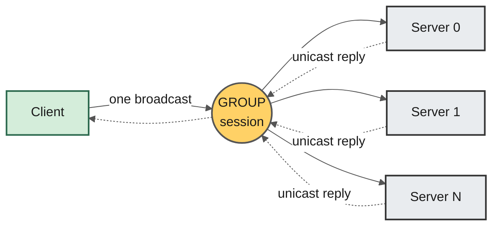
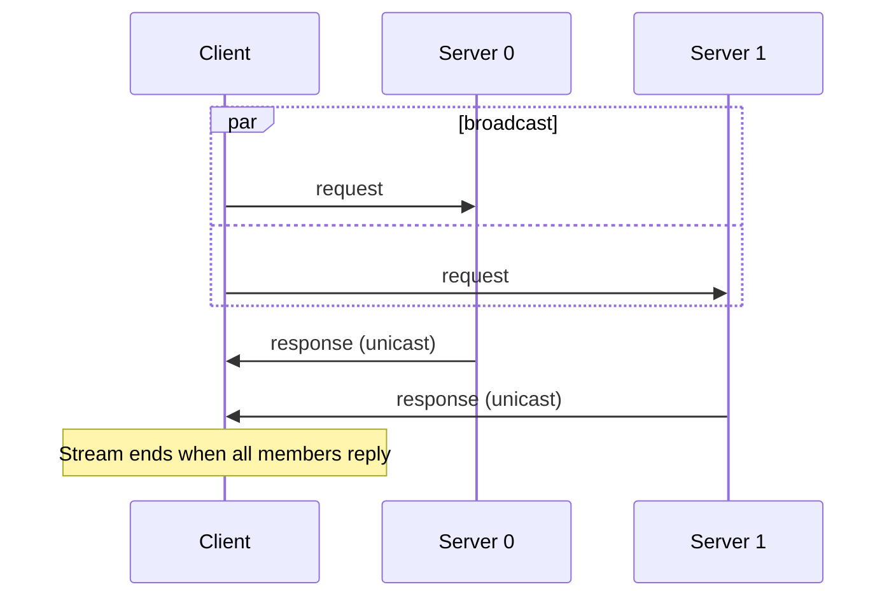
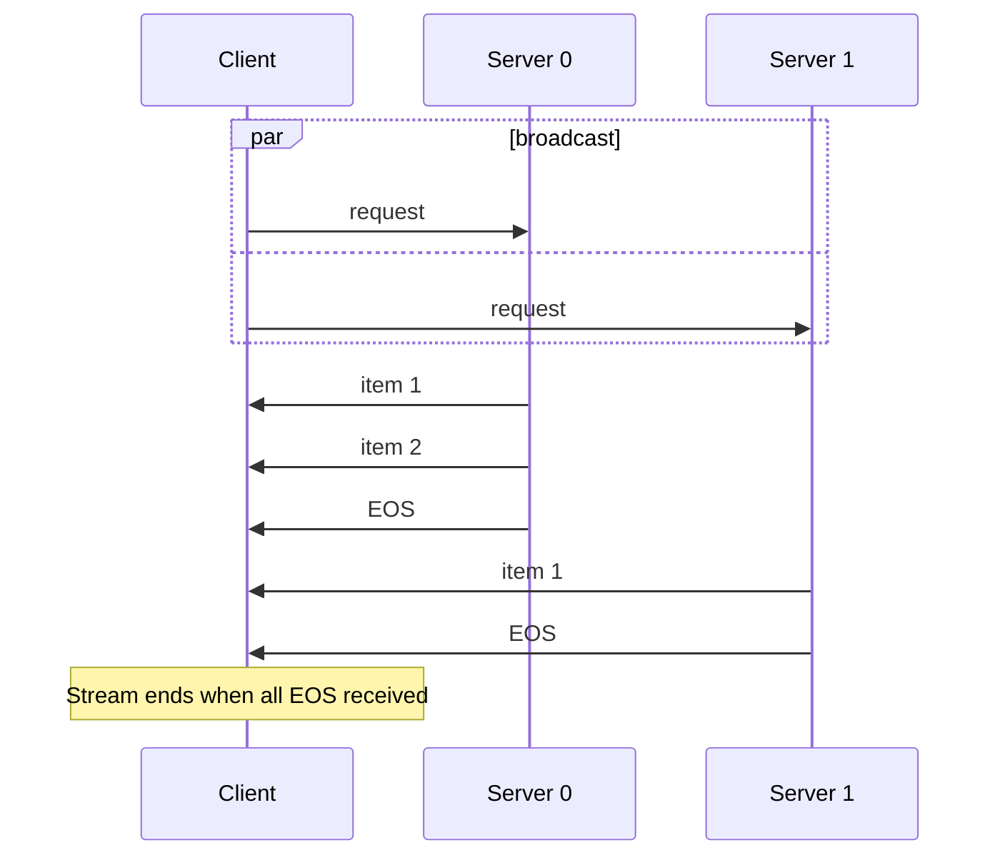
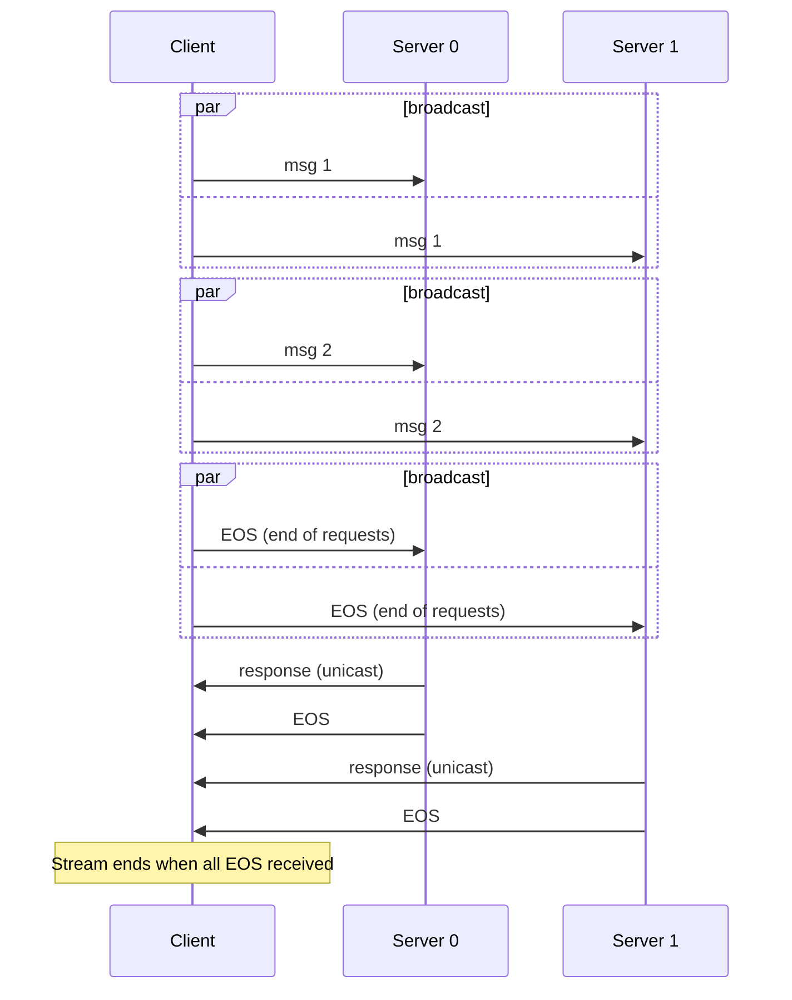
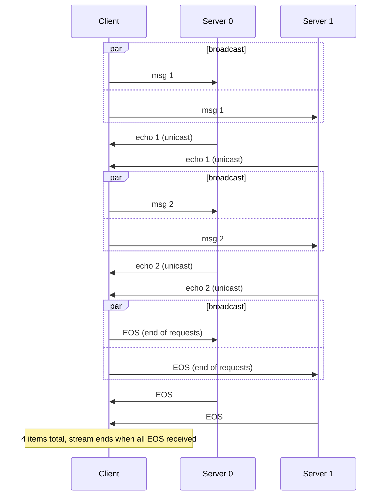
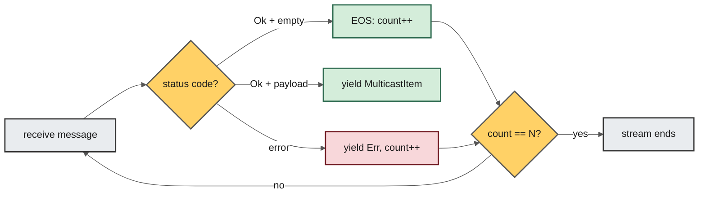
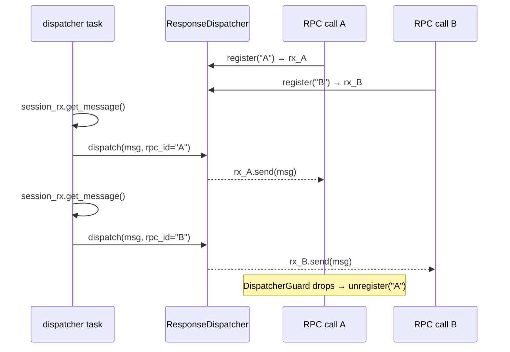

Standard RPC is point-to-point: one client talks to one server.
But agentic AI workloads rarely fit that mold. A coordinator agent might need to
fan out a task to a pool of workers and merge their results. A monitoring service
might need to poll every node in a cluster with a single call. A voting protocol
might need every participant to weigh in before a decision is made.

Today we are releasing **SlimRPC Multicast** — also called **Group RPC** — as part
of [SLIM v1.3](https://github.com/agntcy/slim). It extends the familiar
protobuf-based RPC model with native one-to-many semantics: broadcast a request
to a group of servers, collect every response, and know exactly which member
sent what. The best part? **Your server code doesn't change at all.**

<!--more-->

## A Quick Recap: What Is SlimRPC?

[SlimRPC](https://docs.agntcy.org/slim/slim-rpc/) is
SLIM's answer to gRPC. You write a `.proto` file, run the
[SlimRPC compiler](https://docs.agntcy.org/slim/slim-slimrpc-compiler/), and get
type-safe client stubs and server servicers — just like gRPC — except the
transport is [SLIM](https://github.com/agntcy/slim) instead of HTTP/2.
That gives you end-to-end MLS encryption, automatic service discovery,
reliable delivery with per-message acknowledgments, and now: **multicast**.

SlimRPC supports all four gRPC interaction patterns:

| Pattern | Description |
|---|---|
| **Unary-Unary** | Single request → single response |
| **Unary-Stream** | Single request → stream of responses |
| **Stream-Unary** | Stream of requests → single response |
| **Stream-Stream** | Bidirectional streaming |

Group RPC adds a multicast variant of each one.

## The Problem with Point-to-Point

Consider a simple protobuf service:

```proto
service Test {
  rpc ExampleUnaryUnary(ExampleRequest) returns (ExampleResponse);
  rpc ExampleUnaryStream(ExampleRequest) returns (stream ExampleResponse);
  rpc ExampleStreamUnary(stream ExampleRequest) returns (ExampleResponse);
  rpc ExampleStreamStream(stream ExampleRequest) returns (stream ExampleResponse);
}
```

With standard SlimRPC (or gRPC), calling `ExampleUnaryUnary` talks to **one**
server. Each server instance registers under its own distinct SLIM name
(e.g. `agntcy/grpc/server1`, `agntcy/grpc/server2`), and the client already
knows these names — but it still has to call each one individually.

You could loop over servers and call each one sequentially, but that means:

- **N serial round-trips** instead of one broadcast.
- **N separate sessions** instead of one shared group session.
- **No built-in correlation** between responses and their source.
- **Manual bookkeeping** for tracking which servers have replied and which
  have failed.

Group RPC solves all of this at the transport level.

## Architecture Overview



The design is straightforward:

1. The client creates a **group channel** via `Channel.new_group(app, members)`
   instead of the usual `Channel.new(app, remote)`.
2. Under the hood, the channel holds a single **SLIM Multicast session**. All
   members are auto-invited on the first RPC call.
3. Every request is **broadcast** to all members via the group session.
4. Each server runs the **exact same handler** it would run for a point-to-point
   call — it doesn't know (or care) that it's part of a group.
5. Responses are sent **unicast** directly back to the client, so members never
   see each other's replies.
6. The client's `ResponseDispatcher` multiplexes incoming messages by `rpc-id`,
   tagging each response with the identity of the member that sent it.

### Session Naming

The group session name is derived from the client's own name to avoid
collisions:

```text
client name:   org / namespace / my-client
group name:    org / namespace / <uuid-v4>
```

This scopes the group address to the same org/namespace as the client.

## What Changes for the Developer?

### Server: Nothing

Seriously — zero changes. The same `TestServicer` (Python) or `TestServer` (Go)
implementation you wrote for point-to-point SlimRPC works as-is for multicast.
Each server in the group receives the broadcast request and processes it through
the same handler. SLIM's session layer handles the rest.

### Client: One Constructor Swap

The only change is how you create the channel. Instead of pointing at a single
remote name, you supply a list of members:

**Python — Point-to-Point:**

```python
channel = slim_bindings.Channel.new_with_connection(
    local_app, remote_name, conn_id
)
stub = TestStub(channel)
response = await stub.ExampleUnaryUnary(request)
```

**Python — Multicast:**

```python
channel = slim_bindings.Channel.new_group_with_connection(
    local_app, server_names, conn_id
)
stub = TestGroupStub(channel)
async for context, response in stub.ExampleUnaryUnary(request):
    print(f"[{context}] {response}")
```

The key differences:

1. `Channel.new_group_with_connection(app, members, conn_id)` replaces
   `Channel.new_with_connection(app, remote, conn_id)`.
2. `TestGroupStub` replaces `TestStub` — both are auto-generated by the
   SlimRPC compiler from the same `.proto` file.
3. Every method returns an **async generator** of `(context, response)` tuples
   instead of a single response. The `context` tells you which member sent it.

## Multicast Interaction Patterns

All four standard patterns have multicast equivalents. The mental model is
always the same: **broadcast the request side, collect tagged responses from
every member.**

### Multicast Unary-Unary

One request in, one response per member out.



### Multicast Unary-Stream

One request in, each member streams multiple responses back.



### Multicast Stream-Unary

A stream of requests is broadcast to all; each member accumulates them and replies once.



### Multicast Stream-Stream

A stream of requests is broadcast to all; each member streams its own responses.
Client sends and receives concurrently.



## The EOS Protocol

Knowing when *all* members are done is critical. SlimRPC uses an explicit
**End-Of-Stream (EOS)** marker — an empty-payload message with status code `Ok`.
Every server handler sends an EOS after its last response, regardless of
the interaction pattern:

| Pattern | Server sends |
|---|---|
| Unary-Unary | response → EOS |
| Unary-Stream | item… → EOS |
| Stream-Unary | response → EOS |
| Stream-Stream | item… → EOS |

The client counts EOS markers. When `eos_count == num_members`, the response
stream terminates. If a member sends an error instead, that error counts as
its EOS — the stream won't hang waiting for a member that has already failed.



## A Complete Example

Let's walk through a full working example. We'll use the same protobuf
definition from above and run **two server instances** with **one multicast
client**.

### The Proto File

```proto
syntax = "proto3";
package example_service;

service Test {
  rpc ExampleUnaryUnary(ExampleRequest) returns (ExampleResponse);
  rpc ExampleStreamStream(stream ExampleRequest) returns (stream ExampleResponse);
}

message ExampleRequest {
  string example_string = 1;
  int64  example_integer = 2;
}

message ExampleResponse {
  string example_string = 1;
  int64  example_integer = 2;
}
```

Compile with `buf generate` or `protoc` using the SlimRPC plugin. The compiler
produces **both** `TestStub` (point-to-point) and `TestGroupStub` (multicast)
from the same definition.

### Server (Python) — Unchanged

The server implementation is identical to a standard SlimRPC server. It
doesn't know whether it's serving a point-to-point or multicast client.
The handlers are the same you'd write for any SlimRPC service:

```python
class TestService(TestServicer):
    async def ExampleUnaryUnary(self, request, context):
        return ExampleResponse(
            example_integer=1,
            example_string="Hello, World!"
        )

    async def ExampleStreamStream(self, request_iterator, context):
        async for request in request_iterator:
            yield ExampleResponse(
                example_integer=request.example_integer * 100,
                example_string=f"Echo: {request.example_string}",
            )
```

The only thing we parameterise is the **instance name**, which becomes the
third component of the SLIM name. This lets us run multiple copies of the
same server side by side:

```python
# The instance name becomes the SLIM address:
# "server1" → agntcy/grpc/server1,  "server2" → agntcy/grpc/server2
local_name = slim_bindings.Name("agntcy", "grpc", instance)
```

Launch two instances in separate terminals:

```bash
# Terminal 1 — registers as agntcy/grpc/server1
python server.py --instance server1

# Terminal 2 — registers as agntcy/grpc/server2
python server.py --instance server2
```

> 📄 Full server source:
> [server.py](https://github.com/agntcy/slim/blob/main/data-plane/bindings/python/examples/slimrpc/simple/server.py)

### Multicast Client (Python)

The client creates a **group channel** targeting both servers — this is the
only line that differs from a regular point-to-point client:

```python
# P2P:   Channel.new_with_connection(app, one_server, conn_id)
# Group:
server_names = [
    slim_bindings.Name("agntcy", "grpc", "server1"),
    slim_bindings.Name("agntcy", "grpc", "server2"),
]
channel = slim_bindings.Channel.new_group_with_connection(
    local_app, server_names, conn_id
)
```

Then use the generated `TestGroupStub` instead of `TestStub`. Every method
becomes an async generator that yields `(context, response)` tuples — one
per member:

```python
stub = TestGroupStub(channel)

# === Multicast Unary-Unary ===
request = ExampleRequest(example_integer=1, example_string="hello")
async for context, resp in stub.ExampleUnaryUnary(
    request, timeout=timedelta(seconds=5)
):
    print(f"  [{context}] {resp}")
# Output:
#   [agntcy/grpc/server1] example_integer: 1, example_string: "Hello, World!"
#   [agntcy/grpc/server2] example_integer: 1, example_string: "Hello, World!"
```

Streaming works the same way — responses from all members are interleaved
and tagged:

```python
# === Multicast Stream-Stream ===
async def stream_requests():
    for i in range(3):
        yield ExampleRequest(example_integer=i, example_string=f"item {i}")

async for context, resp in stub.ExampleStreamStream(
    stream_requests(), timeout=timedelta(seconds=5)
):
    print(f"  [{context}] {resp}")
# Each server echoes all 3 items → 6 responses total, tagged by source
```

> 📄 Full client source:
> [client_group.py](https://github.com/agntcy/slim/blob/main/data-plane/bindings/python/examples/slimrpc/simple/client_group.py)

### Multicast Client (Go)

The same pattern in Go — `ChannelNewGroupWithConnection` plus the generated
`TestGroupClient`:

```go
serverNames := []*slim_bindings.Name{
    slim_bindings.NewName("agntcy", "grpc", "server1"),
    slim_bindings.NewName("agntcy", "grpc", "server2"),
}
channel, _ := slim_bindings.ChannelNewGroupWithConnection(app, serverNames, &connId)
client := pb.NewTestGroupClient(channel)

stream, _ := client.ExampleUnaryUnary(ctx, &pb.ExampleRequest{
    ExampleInteger: 1,
    ExampleString:  "hello",
})
for {
    item, err := stream.Recv()
    if err != nil { log.Fatal(err) }
    if item == nil { break }
    log.Printf("[%s] %+v", item.Context, item.Value)
}
```

> 📄 Full client source:
> [client_group.go](https://github.com/agntcy/slim/blob/main/data-plane/bindings/go/examples/slimrpc/simple/cmd/client_group/client_group.go)

Both the Go `TestGroupClient` and the Python `TestGroupStub` are generated
from the same `.proto` file by the SlimRPC compiler.

## Under the Hood: The ResponseDispatcher

When multiple RPC calls share the same group session, how does the client
route each incoming message to the right caller? The answer is the
`ResponseDispatcher`.



Every outgoing request carries a unique `rpc-id` (UUID). Each server echoes it
back on its responses. A single background task reads all incoming messages
from the group session and dispatches them to per-RPC channels keyed by
`rpc-id`. When an RPC caller is done (or dropped), a `DispatcherGuard`
automatically unregisters its channel.

This means **multiple concurrent RPCs can share the same persistent group
session** — no session-per-call overhead.

## Message Metadata

SlimRPC uses a small set of metadata keys to coordinate the protocol:

| Key | Set by | Purpose |
|---|---|---|
| `service` | Client | Service name (absent on responses) |
| `method` | Client | Method name (absent on responses) |
| `rpc-id` | Client | UUID identifying the call; echoed on responses |
| `slimrpc-code` | Server | Integer status code; present on every response |
| `slimrpc-timeout` | Client | Deadline as Unix timestamp |

A message is an **EOS** when `slimrpc-code = 0` (Ok) and the payload is empty.
A message is a **request** when `service` is present. A message is a **response**
when `slimrpc-code` is present and `service` is absent.

## Error Handling

In a multicast scenario, one member might fail while others succeed. SlimRPC
handles this gracefully:

- A member error is yielded as an `Err` item in the response stream.
- That error **counts as the member's EOS**, so the stream won't hang.
- Other members continue sending responses normally.
- The `origin` field on the error identifies which member failed.

If the underlying group session closes unexpectedly before all members have
replied, the client yields a `multicast_session_closed` error that lists
which members completed and which didn't.

## Cross-Language Support

SlimRPC Multicast works across all languages supported by the SLIM bindings,
thanks to the [UniFFI](https://mozilla.github.io/uniffi-rs/) binding layer.
The core implementation is in Rust, with UniFFI-compatible wrappers for
types that don't map directly to foreign languages (like async streams):

| UniFFI Type | Role |
|---|---|
| `MulticastResponseReader` | Pull-based reader for unary-input multicast results |
| `MulticastBidiStreamHandler` | Concurrent send/receive for stream-input multicast |
| `MulticastStreamMessage` | `Data(RpcMulticastItem) \| Error \| End` |
| `RpcMulticastItem` | Payload + `RpcMessageContext{source: Name}` |

This means the same multicast semantics are available in **Python, Go, Kotlin,
Java, .NET**, and of course **Rust** natively.

## Key Design Decisions

### Servers Don't Know About Groups

This is perhaps the most important design choice. Servers run the **exact same
handlers** for both point-to-point and multicast calls. The multicast
coordination — broadcasting, EOS counting, response tagging — is entirely a
client-side and transport-level concern. This means:

- Existing services gain multicast support for free.
- No server-side code changes or redeployment needed.
- The same server can serve both P2P and multicast clients simultaneously.

### Unicast Responses

Responses travel **directly** from each member to the client via unicast publish.
Members never see each other's responses. This keeps each member's session
free of cross-member traffic and avoids O(N²) message amplification.

### Persistent Session with Lazy Initialization

The group session is created on the first RPC call and reused for all
subsequent calls. If the session dies, it's transparently recreated. Members
are re-invited on every session creation. This amortizes the session
handshake cost across many RPC calls.

### Smart Constructor

The `Channel` constructor is smart about the member list:

- **1 member**: creates a standard P2P channel (no multicast overhead).
- **Many members**: creates a GROUP channel with a generated session name.

This means library code can accept a member list without special-casing the
single-server scenario.

## Getting Started

1. **Install the SlimRPC compiler** — download pre-built binaries for your
   platform from the
   [releases page](https://github.com/agntcy/slim/releases?q=protoc-slimrpc-plugin)
   and place them on your `PATH`.

2. **Generate stubs** — the compiler now produces both `TestStub` and
   `TestGroupStub` (or `TestClient` and `TestGroupClient` in Go) from
   the same `.proto` file:

   ```bash
   buf generate
   ```

3. **Write your server** — implement the servicer exactly as you would for
   standard SlimRPC or gRPC.

4. **Write your client** — use `Channel.new_group_with_connection` and the
   generated `GroupStub`/`GroupClient`.

5. **Run it** — start a SLIM node, launch your servers, and run the client.
   Complete examples are in the repository:
   - [Python example](https://github.com/agntcy/slim/tree/main/data-plane/bindings/python/examples/slimrpc/simple)
   - [Go example](https://github.com/agntcy/slim/tree/main/data-plane/bindings/go/examples/slimrpc/simple)

## What's Next

Group RPC in SLIM v1.3 lays the foundation for a number of exciting
extensions we're exploring:

- **Context propagation**: allowing group members to observe each other's
  responses within the same session, enabling collaborative reasoning patterns.
- **Dynamic membership**: inviting and removing members from a live group
  session without recreating it.
- **Aggregation primitives**: built-in reducers (majority vote, first-response,
  quorum) that collapse multicast responses into a single result.

If you're building multi-agent systems, we'd love to hear your use cases.
Join our [Slack community](https://join.slack.com/t/agntcy/shared_invite/zt-3hb4p7bo0-5H2otGjxGt9OQ1g5jzK_GQ)
or open an issue on [GitHub](https://github.com/agntcy/slim).

---

*Have questions? Join our [Slack community](https://join.slack.com/t/agntcy/shared_invite/zt-3hb4p7bo0-5H2otGjxGt9OQ1g5jzK_GQ) or check out our [GitHub](https://github.com/agntcy).*
