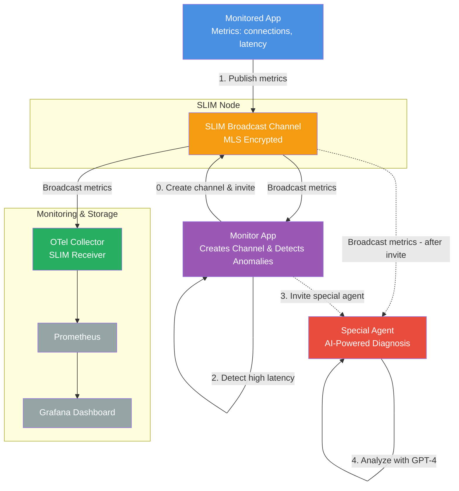

[SLIM (Secure Low-Latency Interactive Messaging)](https://github.com/agntcy/slim) was designed as the transport layer for agentic AI protocols like [A2A (Agent-to-Agent)](https://a2a-protocol.org/latest/). While SLIM was built to enable AI agents to communicate securely across network boundaries, its core capabilities—network traversal, end-to-end encryption, and dynamic channel management—also apply to standard distributed applications. This post explores its use for an **observability and remediation** use case.

Modern distributed systems face critical challenges when transporting telemetry data. Applications run behind firewalls, in different cloud regions, at the edge, or across organizational boundaries. Traditional observability requires exposed collector endpoints and complex firewall management. Telemetry contains sensitive information yet TLS terminates at load balancers, leaving data exposed through intermediate infrastructure. Furthermore, hardcoded endpoint configurations break as systems scale elastically across regions.

SLIM addresses these challenges by enabling remote components to communicate without requiring exposed endpoints or complex NAT/firewall configurations. [Message Layer Security (MLS)](https://www.rfc-editor.org/rfc/rfc9420.txt) protects telemetry from source to destination, and dynamic channel management allows you to reconfigure topologies at runtime without restarting applications.

## The Observability and Remediation Use Case

Consider a modern distributed application running across multiple environments—cloud, edge, and on-premises—often spanning separate Kubernetes clusters in different regions or cloud providers. When incidents occur, you need real-time monitoring with continuous telemetry streaming to dashboards and storage. Different stakeholders—operations teams in one cluster, SREs in another, executives from headquarters—need visibility into the same data from different network segments. AI agents should monitor telemetry streams for anomalies, and when problems arise, specialized diagnostic agents running in separate clusters should join dynamically to investigate root causes while engineers observe live agent analysis and approve remediation actions.

Traditional observability architectures struggle with this scenario. Hardcoded collector addresses make it difficult to add consumers dynamically across network segments. Sharing telemetry between clusters requires VPNs or complex tunneling. Broadcasting to multiple consumers requires intermediate message queues. Most critically, standard telemetry pipelines weren't designed for AI agents to join channels dynamically and collaborate.

## Why Use SLIM for Observability?

SLIM provides several capabilities that address common challenges in distributed observability.

### Network Traversal Without Exposed Endpoints

When working across Kubernetes clusters—whether in different AWS regions, separate GCP projects, or hybrid cloud/on-premises environments—each cluster boundary becomes a network boundary requiring careful firewall configuration, load balancer setup, and security group management.

SLIM simplifies these requirements. Applications and collectors connect outbound to SLIM nodes, meaning only the SLIM routing infrastructure needs exposed addresses. Components behind firewalls and NATs can communicate without VPN tunnels or complex ingress configurations. A workload in your AWS EKS cluster can send telemetry to a collector in your on-premises Kubernetes cluster without port forwarding or firewall exceptions.

### End-to-End Encryption for Sensitive Telemetry

While standard OTLP over TLS protects point-to-point connections, TLS frequently terminates at load balancers or proxies. This means your telemetry—containing API keys, business metrics, and internal system details—flows in plaintext through infrastructure you may not fully control.

SLIM uses Message Layer Security (MLS) to provide true end-to-end encryption from application to collector. Messages remain encrypted even when traversing SLIM nodes, load balancers, or proxies. Only authorized channel participants possess the keys to decrypt telemetry, ensuring confidentiality across untrusted infrastructure.

### Dynamic Channel Management

Traditional observability architectures are largely static. Routing telemetry to a new collector typically requires application restarts. Adding a monitoring agent to investigate an incident requires reconfiguration and redeployment. Pre-configured topologies can't easily adapt at runtime.

SLIM's Channel Manager API enables runtime topology changes without restarts or downtime. When a monitor agent detects elevated latency, it can create an incident-specific channel and invite specialized diagnostic agents to join the telemetry stream. Once the investigation completes, it removes participants dynamically via API calls.

### Broadcast Telemetry to Multiple Consumers

Point-to-point OTLP forces an awkward choice: either implement multiple exporters in your applications (adding complexity and resource consumption) or introduce intermediate message queues (adding latency and operational complexity). Neither option is ideal when you want collectors, dashboards, and AI agents all receiving the same telemetry simultaneously.

SLIM's broadcast channels support multiple simultaneous consumers. A single application publishes to a channel, and all participants—traditional collectors storing to Prometheus, real-time Grafana dashboards, AI agents performing anomaly detection, and specialized diagnostic agents analyzing patterns—receive the same data stream.

### AI Agent Integration

Standard telemetry pipelines were designed for collectors and storage systems, not AI agents. Agents that need to analyze telemetry typically must poll storage backends (introducing latency) and have limited ways to coordinate with other agents.

SLIM treats AI agents as channel participants. Agents receive live telemetry streams alongside collectors, eliminating polling latency. They can use the A2A protocol on separate SLIM channels to coordinate their analysis and share findings. Agents join and leave channels dynamically based on incident needs, with both telemetry and agent communication using the same MLS security model.


## Demo Scenario: Intelligent Incident Response

The following demo demonstrates SLIM's capabilities for dynamic observability and AI-powered incident response.

The monitor application starts up and creates a SLIM channel for telemetry. It invites two participants: the monitored application (which generates metrics using the SLIM OpenTelemetry SDK) and an OpenTelemetry Collector (configured with a SLIM receiver to export metrics to Prometheus and Grafana). The monitor app itself also joins the channel to watch the telemetry stream for anomalies.

During normal operation, the monitored app continuously sends metrics—active connections and service latency. The collector stores these metrics for dashboards while the monitor app observes in the background. 

When the application enters a high load period where the number of active connections increases and processing latency exceeds 200ms (the threshold used by the monitoring application), the monitor app triggers an alert.

The monitor app then invites a specialized diagnostic agent to join the telemetry channel. This agent collects metrics for 10 seconds, performs statistical analysis, and queries Azure OpenAI's GPT-4 to diagnose the root cause. After completing the analysis, the agent prints the findings and signals completion.

The monitor app receives the completion notification, removes the special agent from the channel, and waits for the next incident. In the demo, this flow repeats in a cycle, simulating periodic issues. While the demo runs locally for simplicity, the same architecture works across cluster boundaries.

Here's the architecture:



The architecture shows: a single source (the monitored app) broadcasts telemetry to multiple consumers (collector and monitor app). The monitor app creates the channel and manages participant lifecycles. The special agent joins when needed, with no pre-configuration. LLM-powered diagnostics operate on live telemetry streams. Standard OpenTelemetry metrics flow through SLIM to Prometheus/Grafana. All communication is encrypted with MLS.

The building blocks for observability over SLIM—including the SLIM receiver and exporter for collectors and SDK exporter for applications—are available in the [slim-otel repository](https://github.com/agntcy/slim-otel). 
The complete working demo instead is available in the [agentic-apps repository](https://github.com/agntcy/agentic-apps/tree/main/observability_app) in the observability_app folder.

## Running the Demo

This section provides step-by-step instructions to run the incident response demo.

### Step 1: Clone and Build the Collector

Clone the repository and build the custom OpenTelemetry Collector with SLIM components:

```bash
git clone https://github.com/agntcy/agentic-apps.git
cd agentic-apps/observability_app

# Build the collector with SLIM receiver/exporter as Docker image
task collector:docker:build
```

This will install the [OpenTelemetry Collector Builder (OCB)](https://opentelemetry.io/docs/collector/extend/ocb/), generate the collector code with SLIM components using `builder-config.yaml`, and create a Docker image.

### Step 2: Start Infrastructure

Start all infrastructure services (SLIM node, OTel Collector, Prometheus, and Grafana):

```bash
task infra:start
```

Verify all services are running:
```bash
task infra:status
```

### Step 3: Configure Grafana Dashboard

Import the pre-configured dashboard:
1. Open http://localhost:3000 and login with `admin` / `admin`
2. Navigate to Dashboards → Import
3. Upload the `grafana-dashboard.json` file available in the repo

### Step 4: Run the Applications

Open three separate terminal windows and run each application:

**Terminal 1 - Monitored Application** (generates metrics):
```bash
task monitored-application:run
```

**Terminal 2 - Monitor Application** (creates channel, detects anomalies):
```bash
task monitor-application:run
```
This will invite both the **monitored-application** and the **OTel Collector** to the same SLIM channel.
This channel is used to distribute telemetry

**Terminal 3 - Special Agent** (AI-powered diagnostics):

First, set your Azure OpenAI credentials:
```bash
export AZURE_OPENAI_API_KEY="your-api-key"
export AZURE_OPENAI_ENDPOINT="https://your-endpoint.openai.azure.com/"
export AZURE_OPENAI_DEPLOYMENT="gpt-4o"  # Optional, defaults to gpt-4o
```

Then run the agent:
```bash
task special-agent:run
```

The **special-agent** will start and wait to be invited by the **monitor-application**

### Step 5: Observe the Demo Flow

Watch the terminal outputs to see the incident response cycle:

**Low Load Period (20 seconds)**
- Monitored app sends metrics (connections: ~50, latency: ~50ms)
- Monitor app observes quietly
- Metrics flow to Collector → Prometheus → Grafana

**High Load Period (20 seconds) - Incident Detected**
- Connections increase and Service Latency spikes
- Monitor app detects consecutive samples above 200ms threshold and triggers the alert
- Monitor app invites the special agent

**AI Analysis (10 seconds)**
- Special agent joins the channel and collects telemetry
- GPT-4 analyzes the metrics and produces diagnostic insights
- Special agent reports findings

**Cleanup and Reset**
- Monitor app receives completion notification
- Monitor app removes the special agent from the channel
- Cycle repeats as app alternates between low and high load

### Step 6: View Dashboards

View real-time metrics in Grafana:

1. Navigate to http://localhost:3000
2. Open the metrics on the imported dashboard

### Step 7: Clean Up

Stop all applications with `Ctrl+C` in each terminal.

Stop infrastructure:
```bash
task infra:stop
```

This stops and removes all Docker containers (SLIM node, collector, Prometheus, Grafana).

## Conclusion

SLIM extends beyond agentic AI to support observability and remediation in distributed applications. The demo shows how AI agents can join telemetry channels dynamically to diagnose incidents using LLMs, collaborating with traditional collectors over MLS-encrypted channels that work across cluster boundaries.

The [SLIM-OTel code](https://github.com/agntcy/slim-otel) and [observability demo](https://github.com/agntcy/agentic-apps/tree/main/observability_app) are open source. You can try it in your environment, adapt it for your setup, or contribute to the codebase.

---

*SLIM and SLIM OpenTelemetry components are developed by AGNTCY Contributors and released under the Apache 2.0 License.*
