# SLIM MVP: Enterprise AI Agent Fleet — Multicluster Secure Communications

> **Related issue:** [#1372 — Epic: SLIM multicluster autoconfig installation for server fleets](https://github.com/agntcy/slim/issues/1372)

---

## Table of Contents

1. [Executive Summary](#1-executive-summary)
2. [Business Problem](#2-business-problem)
3. [Solution: SLIM as the Communication Backbone](#3-solution-slim-as-the-communication-backbone)
4. [Architecture](#4-architecture)
5. [Use Case: Enterprise Cluster-Monitoring Agent Fleet](#5-use-case-enterprise-cluster-monitoring-agent-fleet)
6. [Communication Flows](#6-communication-flows)
7. [Security Model](#7-security-model)
8. [Demo Scenario](#8-demo-scenario)
9. [Key Value Propositions](#9-key-value-propositions)
10. [Implementation Notes](#10-implementation-notes)

---

## 1. Executive Summary

This MVP demonstrates how **SLIM (Secure Low-Latency Interactive Messaging)** enables AI
agents deployed across multiple Kubernetes clusters — including clusters hidden behind
corporate VPNs and firewalls — to communicate securely without exposing any agent as a
network server.

Agents subscribe to **named channels** (topics) matching the problem they need to solve.
When a cluster event fires, the relevant agents wake up, collaborate through SLIM, and
escalate to a human operator if needed. All of this works across network boundaries that
would otherwise require complex firewall rules, VPN tunnels, or service mesh configuration
per agent.

**Core value proposition:** SLIM turns the hardest part of multi-cluster agent
communication — the network — into a non-problem, while making the system *more* secure, not
less.

---

## 2. Business Problem

### 2.1 The Enterprise Fleet Reality

Large enterprises operate AI agent fleets across tens or hundreds of Kubernetes clusters.
These clusters span different environments:

| Environment | Network constraint |
|---|---|
| On-prem data centers | Corporate firewall / private network |
| Branch offices | VPN-only access |
| Cloud regions | Transit VPC, private endpoints |
| Edge / OT networks | Strictly air-gapped or NAT-only outbound |

Each cluster runs **specialized AI agents**:

- **Performance agents** — track CPU, memory, latency, and SLO compliance
- **Security agents** — detect anomalies, policy violations, CVEs in running images
- **Remediation agents** — attempt automated fixes (node drain, pod restart, config rollback)
- **Escalation agents** — page a human operator when automated resolution is insufficient

### 2.2 What Makes Agent Communication Hard

Traditional approaches require agents to expose themselves as servers:

```
Agent A ──► opens TCP port ──► registered in service registry ──► firewall rule
Agent B ──► DNS lookup ──► TLS handshake ──► mTLS cert rotation ──► calls Agent A
```

This creates a dense web of operational complexity:

- **Every cluster behind a VPN requires explicit firewall/NAT rules** per agent pair
- **Every agent needs a stable DNS name and TLS certificate**, even for ephemeral workloads
- **Human operators** wanting to observe or intervene must be given network-level access
  to the relevant cluster
- **Agent-to-agent topology changes** (scale-up, migration) invalidate stale service
  registry entries and routing rules

### 2.3 Requirements for the MVP

| Requirement | Description |
|---|---|
| **Zero exposed ports per agent** | Agents must not listen on any TCP/UDP port |
| **Cross-cluster messaging** | Agents on Cluster A and Cluster B communicate transparently |
| **Works behind VPN / NAT** | Outbound-only connectivity from cluster to SLIM overlay is sufficient |
| **Event-driven wake-up** | Agents are idle until a relevant event arrives on their channel |
| **Multi-channel membership** | A single agent can participate in multiple topic channels simultaneously |
| **Human-in-the-loop** | Operators can observe, validate, and act via the same channel mechanism |
| **End-to-end encryption** | Agent messages are encrypted with MLS; SLIM nodes cannot read payloads |
| **Workload identity** | SPIRE provides SPIFFE certificates — no shared secrets, no static API keys |

---

## 3. Solution: SLIM as the Communication Backbone

### 3.1 What SLIM Provides

SLIM is a **publish-subscribe message router** with a session layer. Its architecture has
three components that cleanly separate concerns:

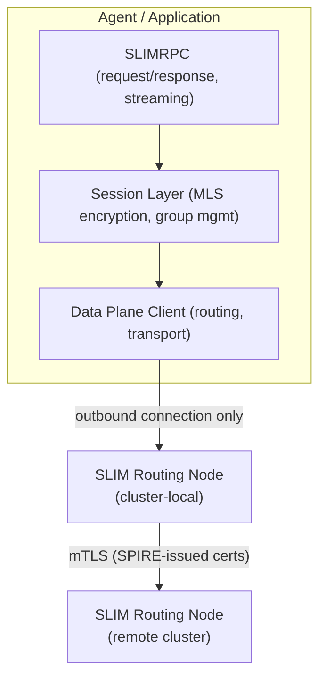

### 3.2 The Channel Model

Every agent is identified by a **hierarchical name**: `<org>/<namespace>/<agent-type>[#id]`.

Agents **subscribe** to a named channel topic. The SLIM controller sees these subscriptions
and automatically creates routes between the cluster-local SLIM node and any remote nodes
that have subscribers for the same topic.

```
channel: acme/monitoring/security-incident
          │       │            │
          │       │            └── topic (problem domain)
          │       └── namespace (cluster or team scope)
          └── org (enterprise identifier)
```

Key properties:
- An agent subscribes with **no knowledge of the remote agent's address** — only the channel name
- The SLIM router handles delivery; the agent never opens a listening port
- Multiple agents can subscribe to the same channel → **multicast delivery**
- An agent can subscribe to **multiple channels** simultaneously

### 3.3 Why SLIM Solves the Network Problem

| Traditional approach | SLIM approach |
|---|---|
| Agent opens a port and registers in a service registry | Agent connects **outbound** to the local SLIM node — no inbound port |
| Firewall rules required for every agent pair | Only the SLIM node itself needs one exposed endpoint per cluster |
| DNS + TLS cert per agent | Workload identity via SPIRE SVID — automatic, no manual cert management |
| Service mesh or VPN tunnel between every cluster pair | SLIM nodes federate; agents are completely unaware of cluster topology |
| Agent scale-out changes routing config | Agents with the same name auto-form a group; SLIM load-balances |

---

## 4. Architecture

### 4.1 High-Level System Architecture

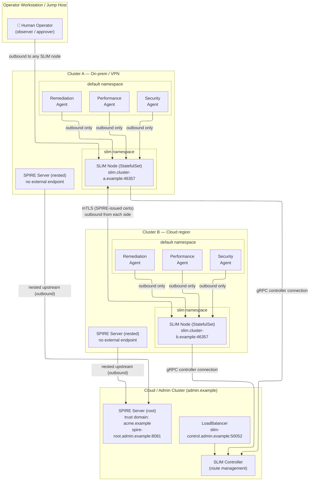

> **SPIRE nested deployment:** Workload-cluster SPIRE servers connect outbound to the
> admin root SPIRE server as nested (downstream) servers. Only the admin SPIRE server
> requires an external endpoint — workload SPIRE servers never need to be reachable
> from outside their own cluster. See [SPIRE nested architecture](https://spiffe.io/docs/latest/architecture/nested/readme/).

### 4.2 Network Topology — What Crosses the Firewall

The diagram below shows **exactly which connections must be allowed** through firewalls or
VPN gateways. Only SLIM nodes and SPIRE servers open outbound connections — agents and
workload SPIRE servers never listen on externally reachable ports.

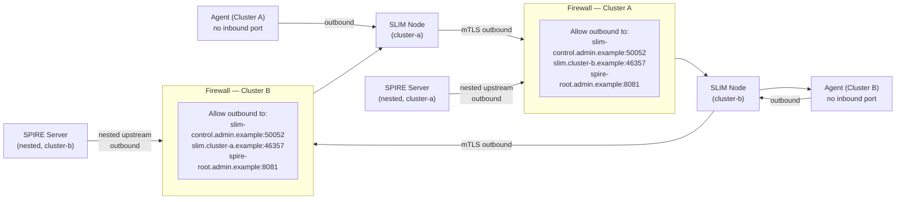

**Firewall rule summary:**

| Source | Destination | Port | Protocol | Purpose |
|---|---|---|---|---|
| Cluster A SLIM node | `slim.cluster-b.example` | 46357 | TCP/mTLS | Data plane inter-cluster |
| Cluster B SLIM node | `slim.cluster-a.example` | 46357 | TCP/mTLS | Data plane inter-cluster |
| Cluster A SLIM node | `slim-control.admin.example` | 50052 | TCP/gRPC+mTLS | Controller |
| Cluster B SLIM node | `slim-control.admin.example` | 50052 | TCP/gRPC+mTLS | Controller |
| Cluster A SPIRE Server (nested) | `spire-root.admin.example` | 8081 | TCP/mTLS | SPIRE nested upstream |
| Cluster B SPIRE Server (nested) | `spire-root.admin.example` | 8081 | TCP/mTLS | SPIRE nested upstream |
| Agents (all clusters) | local SLIM node | 46357 | TCP (local) | Agent ↔ SLIM (cluster-internal) |

> **No agent-to-agent, no agent-to-internet, and no inbound rules for workload SPIRE
> servers are required.**

### 4.3 Channel Subscription Model

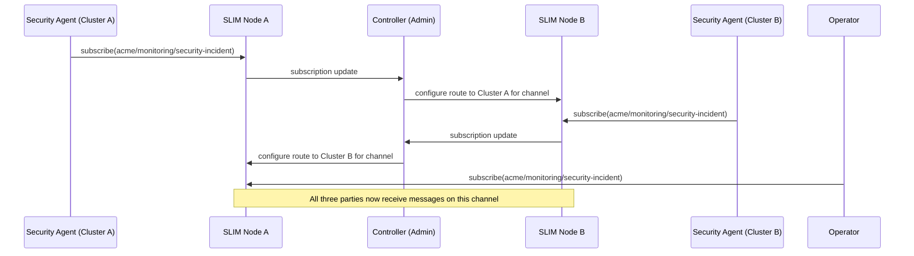

### 4.4 Multi-Channel Agent Participation

A single agent can join multiple channels, each scoped to a different problem domain:

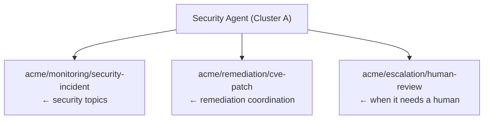

This is achieved by the agent creating multiple SLIM sessions, each with its own channel
name. The SLIM session layer manages group membership independently per channel.

---

## 5. Use Case: Enterprise Cluster-Monitoring Agent Fleet

### 5.1 Scenario Description

**Company:** ACME Corp
**Fleet:** 20 Kubernetes clusters across 3 regions (US-East, EU-West, APAC)
**Problem:** Security incident detected on a node in EU-West Cluster 7

- Clusters in EU-West sit behind a corporate VPN; no inbound ports are permitted
- Cluster 7 runs a **Security Monitoring Agent** and a **Remediation Agent**
- The cloud (US-East admin cluster) hosts the SLIM Controller and an **Escalation Handler**
- A human operator is on-call via their laptop connected to corporate VPN

### 5.2 Agent Roster

| Agent | Channel(s) | Location | Description |
|---|---|---|---|
| `acme/eu-west/security-monitor` | `security-incident`, `escalation` | Cluster 7 (EU) | Detects anomalies, CVEs |
| `acme/eu-west/remediation` | `security-incident`, `cve-patch` | Cluster 7 (EU) | Automated fixes |
| `acme/us-east/security-monitor` | `security-incident` | Cluster 1 (US) | Cross-region correlation |
| `acme/admin/escalation-handler` | `escalation` | Admin cluster | LLM-backed escalation agent |
| `acme/admin/human-operator` | `escalation`, `security-incident` | Operator laptop | Human observer / approver |

### 5.3 Event Types

| Event | Trigger | Severity |
|---|---|---|
| Anomalous pod CPU spike | Metrics threshold | Low |
| CVE detected in running image | Image scan | Medium |
| Node compromise indicators | Audit log analysis | High |
| Policy violation cascade | OPA/Gatekeeper alerts | High |
| Agent escalation | Agent decision | Critical |

---

## 6. Communication Flows

### 6.1 Flow A: Automated Security Incident Resolution

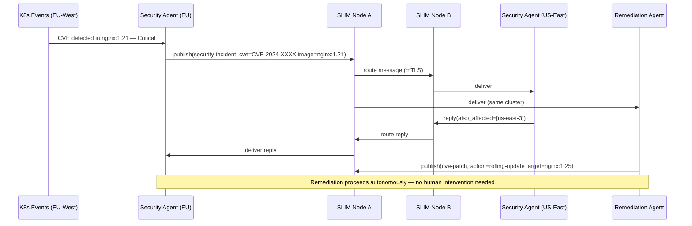

### 6.2 Flow B: Human-in-the-Loop Escalation

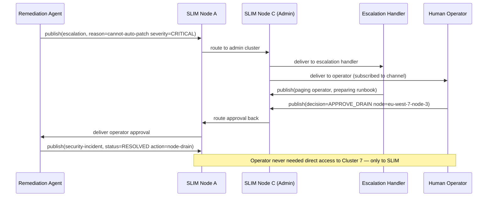

### 6.3 Flow C: Agent Joining Multiple Channels

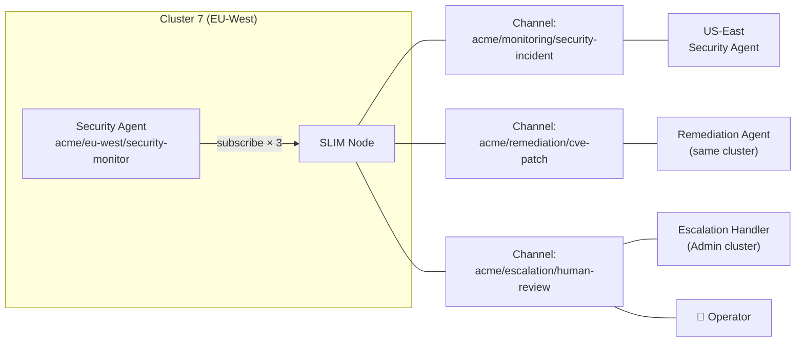

### 6.4 Message Flow Timeline (Full Incident Lifecycle)

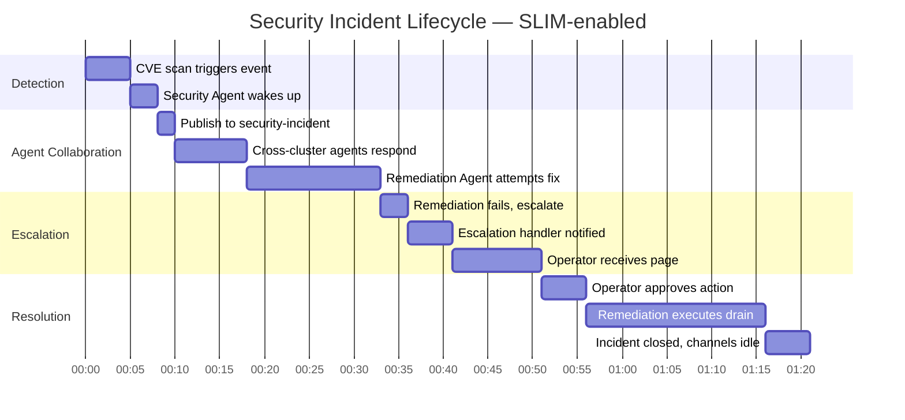

---

## 7. Security Model

### 7.1 Layered Security Architecture

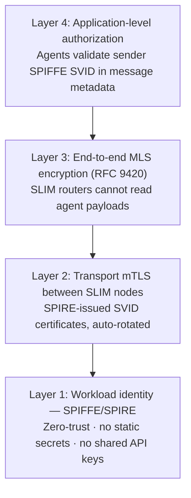

### 7.2 SPIRE Nested Deployment Across Clusters

SPIFFE peer **federation** requires every SPIRE server to expose an endpoint reachable
from the other clusters — not viable in VPN-restricted or air-gapped environments.

**SPIRE nested deployment** solves this: workload-cluster SPIRE servers act as nested
(downstream) servers and connect *outbound* to the admin root SPIRE server. Only the
admin SPIRE server requires an external endpoint.

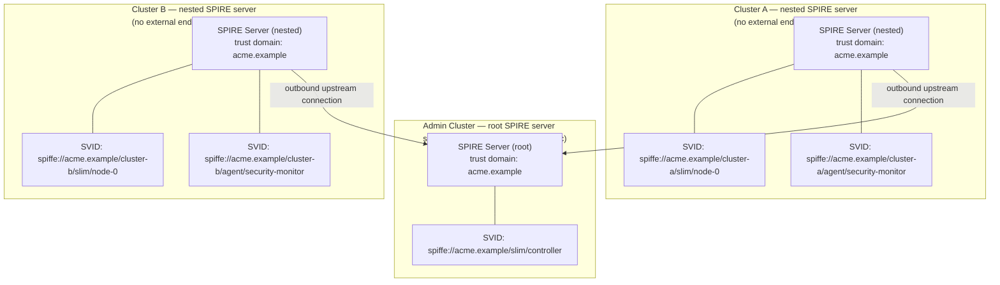

All SVIDs are issued under the **single shared trust domain** (`acme.example`).
The root SPIRE server is the chain-of-trust anchor; nested servers delegate issuance to
their local workloads. SLIM nodes on different clusters can mutually authenticate because
they share the same trust domain and their certificates chain to the same root.

### 7.3 Security Properties

| Property | Mechanism | Benefit |
|---|---|---|
| No exposed agent ports | SLIM outbound-only model | Eliminates entire attack surface class |
| Workload identity | SPIRE SVID (X.509 + JWT) | No static credentials — identity is cryptographic |
| Inter-node transport | mTLS with SPIRE-issued certs | Auto-rotated, zero-touch cert management |
| Agent payload privacy | MLS group encryption | SLIM routing nodes are zero-knowledge to payloads |
| Operator access control | Channel subscription + SVID | Operator only subscribes; no cluster-level access needed |
| Audit trail | SLIM controller events + SPIRE attestation | Full provenance of who joined which channel |

---

## 8. Demo Scenario

### 8.1 Environment Setup

The demo uses three kind clusters to simulate the production environment:

| Cluster | Role | Simulates |
|---|---|---|
| `kind-admin.example` | SLIM Controller + SPIRE Server | Cloud management plane |
| `kind-cluster-a.example` | SLIM nodes + Security & Remediation Agents | On-prem cluster (VPN-restricted) |
| `kind-cluster-b.example` | SLIM nodes + Security Agent | Cloud cluster (remote region) |

```bash
# 1. Start clusters and install SPIRE (nested deployment)
sudo task multi-cluster:up

# 2. Deploy Controller on admin cluster
task controller:deploy

# 3. Deploy SLIM on workload clusters
task slim:deploy

# 4. Deploy agents
task demo:agents:deploy
```

### 8.2 Demo Script — Step by Step

#### Step 1: Show baseline — agents running, channels empty

```bash
# Show agents are running but NOT listening on any port
kubectl get pods -n default  # agents running
kubectl exec -it <security-agent-pod> -- ss -tlnp  # no open ports
```

#### Step 2: Inject a simulated CVE event

```bash
# Inject a CVE detection event into Security Agent on Cluster A
kubectl exec -it <security-agent-pod> -- \
  python3 inject_event.py --type cve --severity critical --image nginx:1.21
```

#### Step 3: Watch agents collaborate on the security-incident channel

```bash
# Follow the channel in real time (operator view)
slimctl channel subscribe acme/monitoring/security-incident --cluster admin.example
```

Expected output:
```
[00:00] eu-west/security-monitor  → CVE-2024-XXXX detected in nginx:1.21
[00:02] us-east/security-monitor  → Confirmed affected: us-east-3 also running nginx:1.21
[00:04] eu-west/remediation       → Attempting rolling update to nginx:1.25
[00:19] eu-west/remediation       → Node tainted, cannot auto-patch — escalating
```

#### Step 4: Observe escalation to human operator

```bash
# Operator joins escalation channel from their laptop
slimctl channel subscribe acme/escalation/human-review
```

Expected output:
```
[00:22] eu-west/security-monitor  → Escalation requested: node-drain required
[00:24] admin/escalation-handler  → Runbook loaded, paging operator
[APPROVAL REQUIRED]
```

#### Step 5: Operator approves and watches resolution

```bash
# Operator sends approval
slimctl channel publish acme/escalation/human-review \
  '{"decision": "APPROVE_DRAIN", "node": "eu-west-7-node-3"}'
```

Expected output:
```
[00:31] eu-west/remediation       → Node drain initiated
[00:51] eu-west/remediation       → Drain complete, workloads rescheduled
[00:52] eu-west/security-monitor  → Incident resolved — CVE remediated
```

### 8.3 Demo Talking Points

1. **"Notice that no agent opened a port"** — `ss -tlnp` shows nothing. Yet cross-cluster
   messaging worked transparently.

2. **"The only firewall rules needed"** — point to the two SLIM node endpoints, not the
   dozens of agent-pair rules a traditional approach would require.

3. **"The operator joined from a laptop"** — connected to corporate VPN, authenticated via
   SPIRE, and joined the channel. No jump host, no kubectl proxy, no cluster-level access.

4. **"MLS means SLIM nodes are zero-knowledge"** — the SLIM routers forwarded every byte
   without being able to read a single word of the agent messages.

5. **"Adding a new cluster is trivial"** — register it with SPIRE, deploy SLIM with the
   correct group name, point it at the controller. No routing rule changes in other
   clusters.

---

## 9. Key Value Propositions

### 9.1 Simplified Operations

| Before SLIM | With SLIM |
|---|---|
| Firewall rules: O(n²) agent pairs | Firewall rules: O(n) SLIM nodes |
| DNS + cert per agent | Zero per-agent network config |
| Service registry maintenance | Channel names are self-describing, DNS-free |
| VPN access required per cluster | One SLIM endpoint per cluster suffices |

### 9.2 Enhanced Security

- **Zero server exposure per agent** — drastically reduces attack surface
- **End-to-end MLS encryption** — infrastructure operators cannot read agent payloads
- **Cryptographic workload identity** — SPIRE eliminates static credential sprawl
- **Principle of least privilege** — operators observe only what they subscribe to

### 9.3 Developer Experience

- Agents use high-level SLIMRPC or pub/sub APIs — no networking code
- Language support: **Python, Go, Java, .NET (C#), Kotlin, Rust**
- Protocol support: **A2A, MCP, custom protobuf**
- Session types: **point-to-point, multicast (group), streaming**

### 9.4 Operational Scalability

- **Dynamic topology** — agents join/leave channels without reconfiguration
- **Auto-routing** — SLIM Controller creates inter-cluster routes on first subscription
- **Fleet-scale** — tested with large StatefulSet deployments; single control plane for all
- **Multi-language agents** — Python ML agent ↔ Go infrastructure agent ↔ Java app agent,
  all on the same channel

---

## 10. Implementation Notes

### 10.1 Tech Stack

| Component | Technology |
|---|---|
| SLIM Node (data plane) | Rust — high-performance message router |
| SLIM Session Layer | Rust — MLS (RFC 9420) encryption + group management |
| SLIMRPC | Protobuf + generated stubs (all languages) |
| SLIM Controller | Go (Kubernetes controller pattern) |
| Workload identity | SPIRE / SPIFFE |
| Demo agents | Python (ADK or custom SLIM Python bindings) |
| Deployment | Kubernetes (Helm charts) |
| Observability | OpenTelemetry (SLIM has native OTEL support) |

### 10.2 Key APIs Used in Demo Agents

```python
import slim_bindings

# Agent startup — outbound connection only, no listening port
svc = slim_bindings.Service.new(slim_node_addr)
app = svc.create_app_with_secret(agent_name, shared_secret)
conn_id = svc.connect(slim_bindings.ClientConfig.new_with_tls(slim_node_addr))

# Subscribe to a channel
app.subscribe(app.name(), conn_id)

# Join the security-incident group channel
session_cfg = slim_bindings.SessionConfig(
    session_type=slim_bindings.SessionType.MULTICAST,
    mls_enabled=True,
)
session, done = await app.create_session(session_cfg, "acme/monitoring/security-incident")
await done  # wait for group to form

# Publish an event
await app.publish("acme/monitoring/security-incident", payload_bytes)

# Receive messages (event-driven)
async for msg in app.receive():
    await handle_event(msg)
```

### 10.3 Helm Deployment Snippet

```yaml
# values-cluster-a.yaml
slim:
  config:
    services:
      slim/0:
        node_id: "${env:SLIM_SVC_ID}"
        group_name: "cluster-a.example"
        dataplane:
          servers:
            - endpoint: "0.0.0.0:46357"
              metadata:
                local_endpoint: "${env:MY_POD_IP}"
                external_endpoint: "slim.cluster-a.example:46357"
              tls:
                source:
                  type: spire
    controller:
      clients:
        - endpoint: "https://slim-control.admin.example:50052"
          tls:
            source:
              type: spire
```

### 10.4 Prerequisites for Demo Environment

- `kind` v0.20+
- `kubectl` v1.28+
- `helm` v3.12+
- `task` (Taskfile runner)
- `spire-server` / `spire-agent` (deployed via Helm chart in clusters)
- SLIM Helm charts (`charts/slim`, `charts/slim-control-plane`)
- Docker for building demo agent images

---

## Appendix A: Glossary

| Term | Definition |
|---|---|
| **SLIM** | Secure Low-Latency Interactive Messaging — the transport framework |
| **SLIMRPC** | SLIM's request/response RPC layer built on top of the session layer |
| **MLS** | Messaging Layer Security (RFC 9420) — E2E encryption for groups |
| **SPIRE** | SPIFFE Runtime Environment — issues SVID certificates to workloads |
| **SPIFFE** | Secure Production Identity Framework for Everyone |
| **SVID** | SPIFFE Verifiable Identity Document (X.509 cert or JWT) |
| **Channel** | A named pub/sub topic in SLIM (hierarchical: org/ns/topic) |
| **Group session** | A SLIM multicast session with multiple subscribers |
| **Data plane** | SLIM message routing layer (pure forwarding, zero payload inspection) |
| **Control plane** | SLIM management layer (route configuration, monitoring) |
| **Session layer** | SLIM encryption + group membership layer (sits above data plane) |

## Appendix B: References

- [SLIM Repository](https://github.com/agntcy/slim)
- [SLIM Documentation](https://docs.agntcy.org/slim/overview/)
- [Multi-Cluster Deployment Strategy](../../deployments/multicluster/multi_cluster_strategy.md)
- [SLIM Data Plane README](../../data-plane/README.md)
- [SLIM Control Plane README](../../control-plane/control-plane/README.md)
- [SPIFFE/SPIRE](https://spiffe.io/)
- [MLS RFC 9420](https://www.rfc-editor.org/rfc/rfc9420)
- [A2A Protocol](https://a2a.ai)
- [MCP Protocol](https://modelcontextprotocol.io)
- [Issue #1372 — Multicluster Epic](https://github.com/agntcy/slim/issues/1372)
