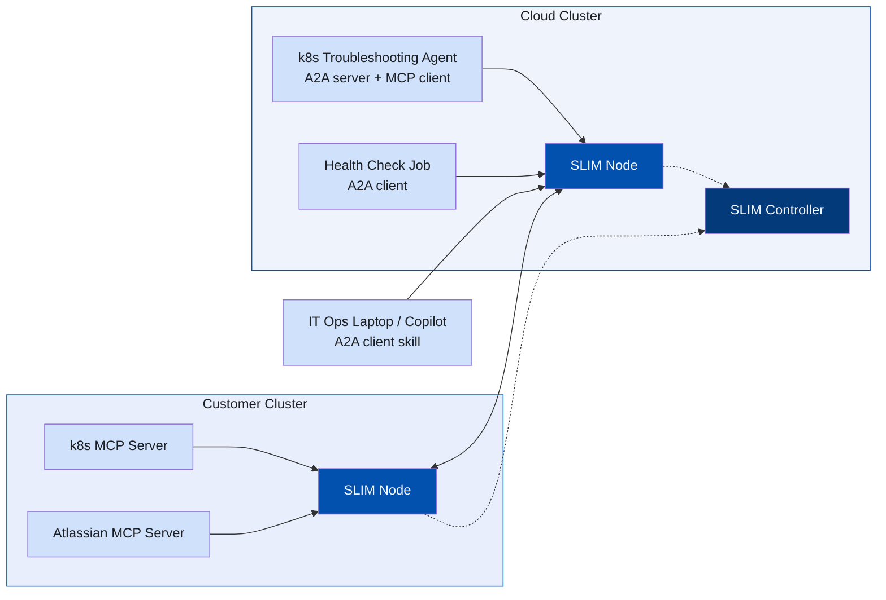
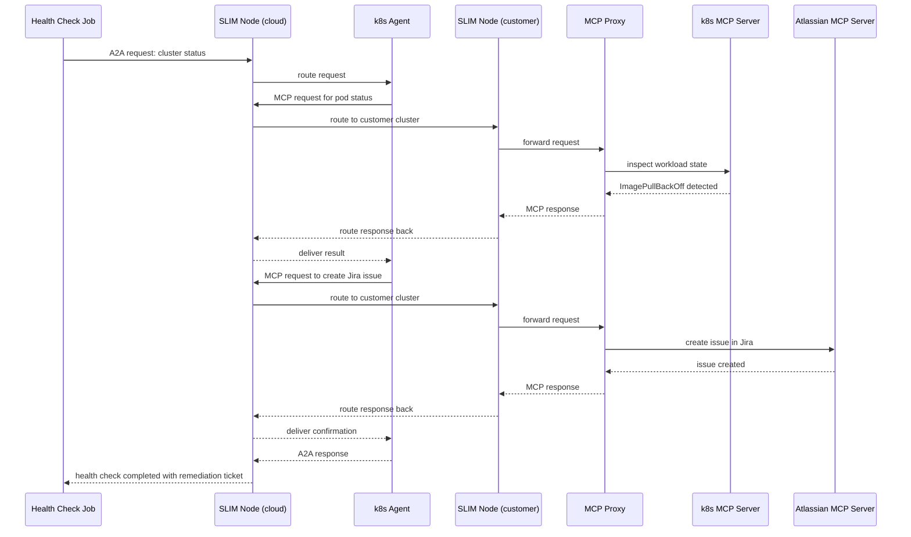

This post walks through a concrete multicluster customer-remediation scenario
built on [SLIM](https://docs.agntcy.org/slim/overview/): a customer cluster
stays private, a cloud-hosted troubleshooting agent remains reachable, and both
humans and automation can operate across that boundary without exposing every
service involved.

The updated demo combines [A2A](https://a2a-protocol.org/latest/) for
agent-to-agent interaction, [MCP](https://modelcontextprotocol.io/) for tool
access into Kubernetes and Jira, and [SPIRE](https://spiffe.io/spire/) for
workload identity. The result is a system where a private cluster can be
onboarded with outbound connectivity only, queried from Copilot through an A2A
skill, and monitored continuously by a health-check job that can open a Jira
issue automatically when something breaks.

<!--more-->

> Related issue: [#1372 — Epic: SLIM multicluster autoconfig installation for server fleets](https://github.com/agntcy/slim/issues/1372)

## The problem with cross-cluster remediation

Customer remediation flows usually break down at the network boundary.

In a typical deployment, some services run in a public cloud cluster while the
systems they need to inspect or repair live inside a private datacenter or a
customer-managed Kubernetes cluster. Traditional approaches solve that problem
with a mix of public ingress endpoints, reverse proxies, VPN access, and
hand-maintained routing rules. That model is expensive to operate and expands
the attack surface every time a new service needs to be reached.

The updated slide deck sharpens this point nicely:

| Approach | Operational drawback | Security drawback |
|---|---|---|
| HTTP or gRPC | Every service must be exposed directly | No end-to-end payload protection |
| VPNs | Coarse-grained and hard to manage across organizations | Too much network reach for routine operations |
| Reverse proxies | Per-service configuration and customer-side maintenance | Data is exposed in intermediate hops |
| SLIM | One endpoint per SLIM node, outbound-only participation | MLS protects payloads end-to-end |

## How SLIM changes the model

SLIM moves the system from "connect to a host and port" to "talk to a named
service over a secure overlay".

- Services connect outbound to a local SLIM node instead of listening on a
  public port.
- The customer cluster only needs the address of the controller and a valid
  identity token to join the topology.
- SLIM nodes forward traffic over gRPC and TLS, while MLS protects the payload
  itself end-to-end.
- Agents and tools can be written in different languages and still share the
  same transport layer.

At a high level, the demo topology looks like this:


```mermaid
graph LR
    subgraph CUSTOMER[Customer Cluster]
        KMCP[k8s MCP Server] --> CSN[SLIM Node]
        AMCP[Atlassian MCP Server] --> CSN
    end

    subgraph CLOUD[Cloud Cluster]
        SN[SLIM Node]
        CTRL[SLIM Controller]
        K8S[k8s Troubleshooting Agent\nA2A server + MCP client]
        HCJ[Health Check Job\nA2A client]
        SN -.-> CTRL
        K8S --> SN
        HCJ --> SN
    end

    COPILOT[IT Ops Laptop / Copilot\nA2A client skill] --> SN
    CSN <--> SN
    CSN -.-> CTRL

    style CUSTOMER fill:#e8eefb,stroke:#0251af,color:#1c1e21
    style CLOUD fill:#eff3fc,stroke:#0251af,color:#1c1e21
    style SN fill:#0251af,color:#f3f6fd
    style CSN fill:#0251af,color:#f3f6fd
    style CTRL fill:#023a7a,color:#f3f6fd
    style K8S fill:#cfe1fb,color:#1c1e21
    style HCJ fill:#cfe1fb,color:#1c1e21
    style KMCP fill:#cfe1fb,color:#1c1e21
    style AMCP fill:#cfe1fb,color:#1c1e21
    style COPILOT fill:#cfe1fb,color:#1c1e21
```

This architecture is what makes the demo interesting. The cloud side hosts the
shared control plane and the troubleshooting logic. The customer side keeps its
tools and data local. SLIM bridges the two without turning the customer cluster
into a publicly exposed API surface.

## What the demo actually shows

The updated presentation material focuses on two concrete workflows.

### 1. Human interaction over A2A and MCP

An IT operator uses Copilot with an A2A CLI skill to ask questions about the
customer cluster, such as the list of pods running in a namespace or the root
cause of a failure. The request travels over SLIM to a cloud-hosted Kubernetes
troubleshooting agent. That agent then uses MCP, again over SLIM, to reach the
customer-side Kubernetes MCP server and gather the data it needs before sending
an A2A response back to the operator.

### 2. Automated health checks and Jira issue creation

A health-check job in the cloud periodically asks the troubleshooting agent for
the status of the customer cluster. If a pod enters an `ImagePullBackOff`
state, the agent investigates, determines the issue, and calls the customer's
Atlassian MCP server to create a Jira issue automatically.

The second flow is the most important operationally because it shows that the
same connectivity model supports both observability and action.


```mermaid
sequenceDiagram
    participant HCJ as Health Check Job
    participant SNc as SLIM Node (cloud)
    participant Agent as k8s Agent
    participant SNp as SLIM Node (customer)
    participant Proxy as MCP Proxy
    participant KMCP as k8s MCP Server
    participant AMCP as Atlassian MCP Server

    HCJ->>SNc: A2A request: cluster status
    SNc->>Agent: route request
    Agent->>SNc: MCP request for pod status
    SNc->>SNp: route to customer cluster
    SNp->>Proxy: forward request
    Proxy->>KMCP: inspect workload state
    KMCP-->>Proxy: ImagePullBackOff detected
    Proxy-->>SNp: MCP response
    SNp-->>SNc: route response back
    SNc-->>Agent: deliver result
    Agent->>SNc: MCP request to create Jira issue
    SNc->>SNp: route to customer cluster
    SNp->>Proxy: forward request
    Proxy->>AMCP: create issue in Jira
    AMCP-->>Proxy: issue created
    Proxy-->>SNp: MCP response
    SNp-->>SNc: route response back
    SNc-->>Agent: deliver confirmation
    Agent-->>SNc: A2A response
    SNc-->>HCJ: health check completed with remediation ticket
```

## Zero-touch onboarding matters

Another improvement in the updated demo is the emphasis on onboarding. Instead of framing
the story as a generic multicluster agent fleet, the updated material shows why
customer onboarding has to be nearly frictionless.

The customer only needs:

1. The public address of the SLIM controller.
2. A valid authentication token, issued through SPIRE-backed identity.

From there, the customer-side SLIM node connects outbound, registers with the
controller, and receives routing configuration automatically. No VPN bootstrap,
no manual route installation, and no per-service ingress setup.

The configuration surface is intentionally small:

```yaml
slim:
  services:
    slim/0:
      controller:
        clients:
          - endpoint: "https://slim-control-plane.example:443"
            auth:
              type: spire
              jwt_audiences:
                - "slim"
```

That simplicity shows up clearly in the controller views before and after a new
cluster joins.

<div style="display:flex; flex-wrap:wrap; gap:16px; margin: 1.5em 0;">
  <figure style="flex:1 1 340px; margin:0;">
    
    <figcaption style="font-size:0.95em; margin-top:0.5em; color:#5b6470;">Before onboarding, only the cloud-side node is registered.</figcaption>
  </figure>
  <figure style="flex:1 1 340px; margin:0;">
    
    <figcaption style="font-size:0.95em; margin-top:0.5em; color:#5b6470;">After onboarding, the customer cluster appears as a new registered node.</figcaption>
  </figure>
  <figure style="flex:1 1 340px; margin:0;">
    
    <figcaption style="font-size:0.95em; margin-top:0.5em; color:#5b6470;">Before onboarding, only local cloud services are routable.</figcaption>
  </figure>
  <figure style="flex:1 1 340px; margin:0;">
    
    <figcaption style="font-size:0.95em; margin-top:0.5em; color:#5b6470;">After onboarding, customer-side MCP services become reachable through the established link.</figcaption>
  </figure>
</div>

The service naming convention reinforces that model. Cloud-hosted services use
names such as `splunk/eu-central-1/k8s_troubleshooting_agent`, while
customer-side services use names such as
`customer-1/on-prem-cluster/k8s-mcp-proxy`. That structure keeps routing and
ownership explicit without leaking network topology into application code.

## Why this is a better fit for AI-assisted operations

The original draft was already directionally correct: the hard part of
multicluster agent systems is not agent logic, it is secure communication
across messy enterprise networks.

This revised version improves that story by grounding it in a real operations flow. Instead of
describing an abstract agent fleet, the demo shows a concrete path from:

1. A human asking Copilot for live cluster state.
2. An A2A request reaching a cloud-hosted troubleshooting agent.
3. MCP calls crossing into the private customer cluster over SLIM.
4. An automated Jira issue being created when the health-check job finds a
   workload failure.

That makes the value proposition much clearer.

- SLIM gives you one transport layer for A2A, MCP, and other protocols.
- Customer environments remain private and outbound-only.
- Operators and automation both use the same connectivity model.
- MLS keeps payloads encrypted even when traffic traverses shared routing
  infrastructure.
- SPIRE gives every participant workload identity without static secrets.

## Slides and demo assets

The full presentation is embedded below so the blog post carries the
updated deck directly.

<div style="position: relative; padding-bottom: 56.25%; height: 0; overflow: hidden; max-width: 100%; margin-bottom: 1.5em; border:1px solid #d7dbe0; border-radius:8px;">
  <iframe src="{{ '/presentations/slim-multicluster-demo/site/' | relative_url }}" title="SLIM multicluster demo slides" style="position:absolute; top:0; left:0; width:100%; height:100%; border:0;" loading="lazy"></iframe>
</div>

If you prefer to open the deck directly, use the [interactive Slidev version]({{ '/presentations/slim-multicluster-demo/site/' | relative_url }}).

The recordings are intentionally not published from this repository anymore.
GitHub Pages does not support serving the required large video assets from Git
LFS, so the published post now carries the deck and screenshots only. The demo
recordings can be linked back here once they are hosted on external object
storage or a dedicated media platform.

## Closing thoughts

The updated demo tells a stronger story than the original draft because it ties
multicluster communication to an operational outcome: onboarding a customer
cluster, diagnosing issues through an agent interface, and filing remediation
tickets automatically without dismantling the customer's network boundaries.

That is the core promise of SLIM in this space. It does not just make
multicluster AI agents possible. It makes them practical to deploy in the kinds
of private, policy-heavy environments where they are actually needed.
