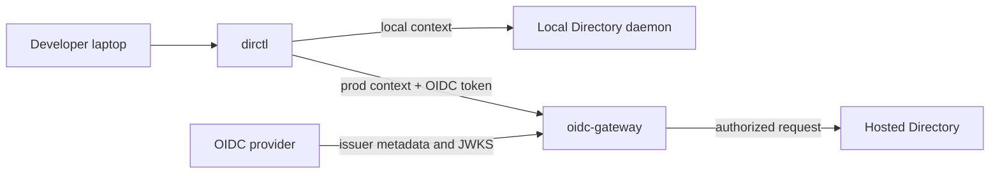
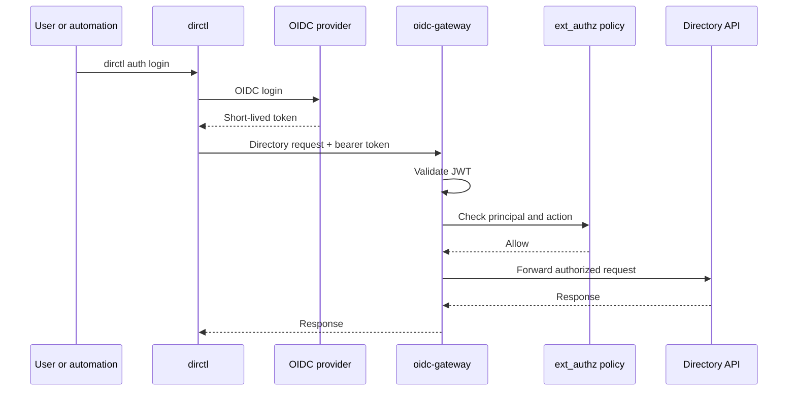

When you work with [Agent Directory](https://docs.agntcy.org/dir/overview/), you often move between two worlds.

On your laptop, you want a fast local Directory server where you can test records, validate metadata, and iterate without needing a cluster. When you are ready to search, publish, or interact with a shared environment, you want the hosted Directory testbed with real authentication at the edge.

`dirctl context` makes that switch explicit. Instead of remembering a different `--server-addr`, `--auth-mode`, OIDC issuer, or TLS setting for every command, you can name each Directory target once and then move between them safely.

<!--more-->

**TL;DR:** Run a local Directory daemon on `localhost:8888`, create a `dirctl` config with `local` and `prod` contexts, authenticate to the hosted testbed with OIDC, and show the active Directory context in your zsh or powerlevel10k prompt.

### What You'll Learn

In this post, you'll learn:

- How to run a local Directory server with `dirctl daemon`
- How to create a reusable `dirctl` client config
- How to switch between local and hosted Directory contexts
- How OIDC authentication works for the hosted testbed
- What `oidc-gateway` does in a production-style deployment
- How to show the active Directory context in zsh and powerlevel10k

## The Workflow: One CLI, Two Directories

A typical developer workflow looks like this:

1. Start a local Directory server on your laptop.
2. Push, pull, search, and validate records locally.
3. Switch to the hosted testbed.
4. Authenticate with OIDC.
5. Run the same `dirctl` commands against the remote Directory.

The commands are familiar in both places. The target and authentication are different.



Without contexts, you can still pass flags manually:

```bash
dirctl --server-addr localhost:8888 search --name "*"

dirctl --server-addr prod.gateway.ads.outshift.io:443 \
  --auth-mode oidc \
  --oidc-issuer https://prod.idp.ads.outshift.io \
  --oidc-client-id dirctl \
  search --skill "natural_language_processing"
```

That works, but it does not scale well once you have a local daemon, a staging Directory, a hosted testbed, and maybe a partner environment. Contexts give each target a short name.

`dirctl context` is available starting with `dirctl` v1.4.0, which is planned for an upcoming release. If your local CLI does not recognize the `context` command yet, upgrade to v1.4.0 or newer when it is available.

## Step 1: Run a Local Directory Server

For local development, the fastest path is the built-in daemon:

```bash
dirctl daemon start
```

The daemon runs a self-contained Directory server in one process. It starts the gRPC API on `localhost:8888`, uses SQLite for persistence, and stores records in a local filesystem OCI store. By default, its state lives under:

```text
~/.agntcy/dir/
```

In another terminal, point `dirctl` at the local daemon:

```bash
dirctl --server-addr localhost:8888 search --name "*"
```

This local mode is useful for quick experiments because it does not require Docker, Kubernetes, PostgreSQL, or an external registry. For a deeper comparison between the local daemon and Docker Compose deployment modes, see the [Local Deployment guide](https://docs.agntcy.org/dir/dir-deployment-local/).

## Step 2: Create a dirctl Client Config

Now let's stop passing the server address every time.

`dirctl` looks for reusable client contexts in:

```text
~/.config/dirctl/config.yaml
```

Create the directory and config file:

```bash
mkdir -p ~/.config/dirctl
$EDITOR ~/.config/dirctl/config.yaml
```

Start with two contexts: one for the local daemon and one for the hosted testbed.

```yaml
current_context: local
contexts:
  local:
    server_address: localhost:8888
    auth_mode: insecure
  prod:
    server_address: prod.gateway.ads.outshift.io:443
    auth_mode: oidc
    oidc_issuer: https://prod.idp.ads.outshift.io
    oidc_client_id: dirctl
```

The shape is intentionally small:

- `current_context` is the default context used by `dirctl`.
- `contexts` contains named client configurations.
- `server_address` is the Directory endpoint for that context.
- `auth_mode` tells `dirctl` how to authenticate.
- `oidc_issuer` and `oidc_client_id` are used by `dirctl auth login` for OIDC-backed environments.

Keep this file focused on configuration, not credentials. Do not paste bearer tokens into the file for normal interactive use. `dirctl auth login` stores the cached login token separately, and automation should prefer short-lived tokens from its identity provider.

## Step 3: Use dirctl context

Once the config exists, inspect it:

```bash
dirctl context list
dirctl context current
dirctl context show
dirctl context validate
```

The most important command is `set`:

```bash
dirctl context set prod
```

After that, ordinary commands use the `prod` context by default:

```bash
dirctl search --skill "natural_language_processing"
```

You can switch back to your local daemon just as easily:

```bash
dirctl context set local
dirctl search --name "*"
```

For one command only, use `--context`. This is handy when you want to query another Directory without changing your default:

```bash
dirctl --context local search --name "*"
dirctl --context prod search --skill "natural_language_processing"
```

Use `dirctl context show` when you want to confirm what will be used. Sensitive values are redacted in the output, so it is safe to copy into a support thread when debugging configuration issues.

## Step 4: Authenticate to the Hosted Testbed

The local daemon is intentionally simple. It usually runs with `auth_mode: insecure` because it is bound to your laptop and used for development.

The hosted testbed is different. It sits behind an authentication gateway and expects an authenticated identity. For a human operator, the normal flow is:

```bash
dirctl context set prod
dirctl auth login
dirctl auth status
dirctl search --skill "natural_language_processing"
```

`dirctl auth login` starts the OIDC login flow for the active context. Depending on the environment, it can use a browser-based flow, a no-browser flow, or a device flow. Once complete, `dirctl` can reuse the cached token for later commands.

Directory supports several authentication modes:

| Mode | Best for |
|------|----------|
| empty / auto | Let `dirctl` try SPIFFE, then cached OIDC, then local insecure mode |
| `oidc` | Human login, CI workload identity, and external automation with bearer tokens |
| `x509` | SPIFFE X.509-SVID clients using mTLS |
| `jwt` | SPIFFE JWT-SVID or compatible JWT-based service identity |
| `tls` | Custom PKI and mTLS setups |
| `insecure` / `none` | Local development and testing only |

For day-to-day use, keep the local context explicit with `auth_mode: insecure` and the hosted context explicit with `auth_mode: oidc`. That makes the intent obvious when you run `dirctl context show`.

## What is oidc-gateway?

`oidc-gateway` is the edge component that lets users and automation access Directory from outside the cluster using standards-based identity.

In a production-style deployment, the Directory backend can keep its internal trust model focused on SPIFFE/SPIRE while external callers authenticate through OIDC, JWT, or mTLS at the gateway. The gateway verifies the credential, asks an authorization service whether the principal is allowed, and forwards only authorized requests to Directory.



This separation matters. The CLI gets a familiar login experience, operators can integrate with their existing identity provider, and backend services do not need to grow one-off authentication paths for every external client.

With recent `oidc-gateway` deployments, operators may expose two hostnames:

- An OIDC/JWT hostname for `auth_mode: oidc`, cached OIDC login, pre-issued JWTs, and CI workload identity.
- An mTLS hostname for `auth_mode: x509` or `auth_mode: tls`, where the gateway validates the client certificate.

Use the endpoint that matches the credential you send. If you use the OIDC context above, point it at the OIDC/JWT hostname. For operator-level setup, see [OIDC Authentication for Directory](https://docs.agntcy.org/dir/directory-oidc-authentication/).

## Step 5: Show the Directory Context in zsh

Contexts reduce typing, but they also introduce a new question: which Directory am I pointing at right now?

If you use zsh, you can add a small helper that prints the active `dirctl` context. It fails quietly when `dirctl` is unavailable or no context is configured.

```zsh
function dirctl_context_prompt() {
  local ctx
  ctx=$(dirctl context current --quiet 2>/dev/null) || return
  [[ -n "$ctx" ]] && print -r -- "dir:$ctx"
}
```

You can try it directly:

```zsh
dirctl_context_prompt
```

If your current context is `prod`, it prints:

```text
dir:prod
```

For a simple custom prompt, you can wire it into `PROMPT`:

```zsh
setopt PROMPT_SUBST
PROMPT='$(dirctl_context_prompt) %~ %# '
```

That is enough to make the active Directory visible before every command.

## Powerlevel10k Integration

If you use [powerlevel10k](https://github.com/romkatv/powerlevel10k), define a custom prompt segment in `~/.p10k.zsh`:

```zsh
function prompt_dirctl_context() {
  local ctx
  ctx=$(dirctl context current --quiet 2>/dev/null) || return
  [[ -n "$ctx" ]] || return

  p10k segment -f 39 -i 'DIR' -t "$ctx"
}
```

Then add `dirctl_context` to one of your prompt element arrays:

```zsh
typeset -g POWERLEVEL9K_RIGHT_PROMPT_ELEMENTS=(
  dirctl_context
  status
  command_execution_time
  time
)
```

Now your prompt shows the active Directory context next to your other session state. When the prompt says `prod`, you know commands are going to the hosted testbed. When it says `local`, you know you are working against your daemon.

## Troubleshooting

### `dirctl context current --quiet` prints nothing

No `current_context` is set, or the config file does not exist yet. Create `~/.config/dirctl/config.yaml`, then run:

```bash
dirctl context set local
```

### `dirctl context validate` reports an unknown field

The client config parser validates known fields. Check for typos such as `server-addr` instead of `server_address`, or `authMode` instead of `auth_mode`.

### `server_address is required`

Every usable context needs a `server_address`:

```yaml
contexts:
  local:
    server_address: localhost:8888
```

### The local context cannot connect

Make sure the daemon is running:

```bash
dirctl daemon start
```

Then test the local context:

```bash
dirctl --context local search --name "*"
```

### The prod context says you are not authenticated

Log in again:

```bash
dirctl context set prod
dirctl auth login
dirctl auth status
```

If login succeeds but API calls still fail, confirm that your user or organization is allowed by the hosted environment's policy.

### OIDC and mTLS endpoints are easy to mix up

If your context uses `auth_mode: oidc`, use the OIDC/JWT gateway hostname. If your context uses `auth_mode: x509` or `auth_mode: tls`, use the mTLS gateway hostname.

## Wrap-up

`dirctl context` is a small feature with a big impact on day-to-day Directory usage.

You can keep a local daemon for fast iteration, use the hosted testbed with OIDC when you need a shared Directory, and make the active target visible in your shell prompt. The result is less flag juggling, fewer accidental commands against the wrong environment, and a smoother path from local development to authenticated Directory access.

For deeper reference material, continue with the [Directory CLI guide](https://docs.agntcy.org/dir/directory-cli/), the [Local Deployment guide](https://docs.agntcy.org/dir/dir-deployment-local/), and [OIDC Authentication for Directory](https://docs.agntcy.org/dir/directory-oidc-authentication/).
