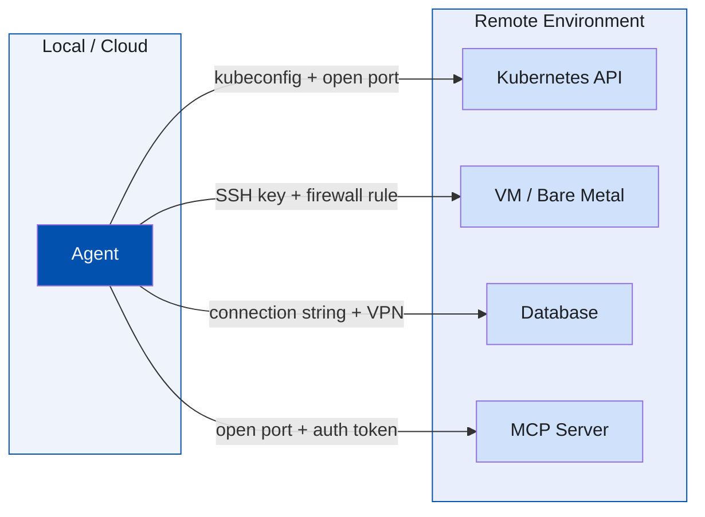
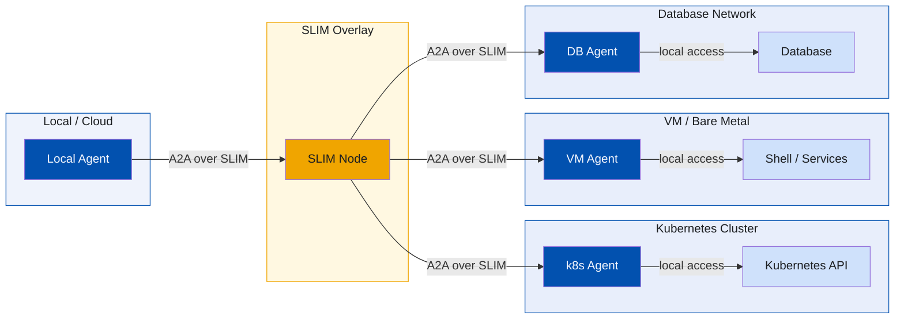
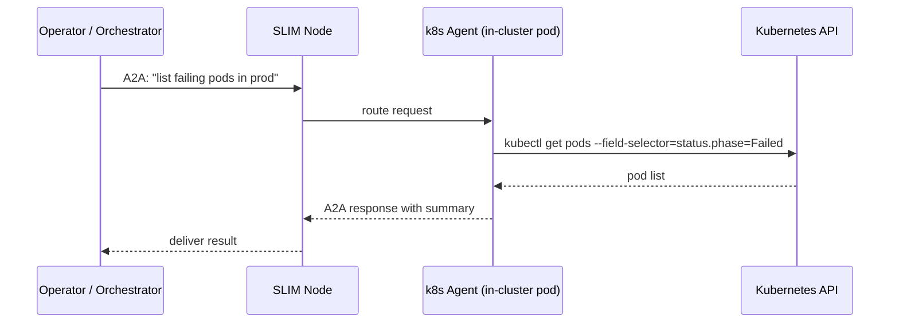
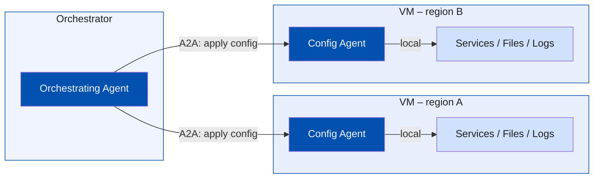

There is a moment in Portal when the game clicks. You stop trying to find a way
around the obstacle and you realise you can just connect two surfaces with a
portal and walk straight through. The puzzle hasn't changed, but your perception
of the solution has — and that makes all the difference.

Something similar happens when you build AI agent systems and you stop asking
"how do I give my agent access to this remote resource?" and start asking "what
if I deployed an agent where the resource already lives?".

<!--more-->

## The old mental model

The natural instinct when connecting an agent to a remote resource is to reach
for familiar tools: expose an API, open a port, set up a VPN, distribute
credentials. The agent lives on your laptop or in your cloud, so you bring the
remote resource to it.

For Kubernetes this might look like distributing a `kubeconfig`, opening the
API server to your agent's network, and calling `kubectl` locally. For a remote
VM it might mean SSH access and an Ansible control machine with an up-to-date
inventory. For a database it might mean a connection string, firewall rules, and
a VPN. [MCP](https://modelcontextprotocol.io/) servers follow the same pattern:
you stand up an MCP server that wraps the remote resource, expose it on a port
the agent can reach, and handle authentication between the two.

Each connection solves the immediate problem but widens the attack surface,
adds credentials to manage, and ties the agent to a specific network topology.
The agent becomes fragile: move the cluster, change the firewall, rotate a
key — and the agent breaks.

## Now you're thinking with agents

The shift is straightforward once you see it: instead of opening your
infrastructure to the agent, you deploy a small agent inside the
infrastructure and let your local agent talk to it.

The remote agent lives next to the resource. It has whatever local access it
needs — a `kubeconfig` that never leaves the cluster, a shell on the VM, a
database connection that stays inside the network. Your local agent never needs
any of that. It just sends an intent ("what pods are failing in the prod
namespace?") to the remote agent over
[A2A](https://a2a-protocol.org/latest/) and gets a result back.

The remote environment only needs an outbound connection to a
[SLIM](https://github.com/agntcy/slim) node. No inbound ports. No VPN. No
credentials shipped out of the environment.

## Example: Kubernetes cluster management

The typical approach to letting an agent manage a Kubernetes cluster involves
distributing a `kubeconfig` to wherever the agent runs and making the API
server reachable from there. For a private cluster this often means a VPN, a
bastion host, or an ingress rule — any of which expands the attack surface
and requires ongoing maintenance.

The agent-native approach deploys a small Kubernetes agent *inside* the cluster.
It runs as a pod with a service account that gives it the access it needs. It
never exposes the API server externally. Your local agent or a cloud-hosted
orchestrator communicates with it via A2A, asking questions and requesting
actions in natural language.

The cluster's security posture is unchanged. The `kubeconfig` stays inside the
cluster. The API server is never exposed. The agent pod itself can be locked
down to a least-privilege service account scoped to exactly the namespaces it
needs to observe.

When you need to reach a second cluster, you deploy another agent pod there.
The orchestrator addresses each cluster's agent by its SLIM name — no new
network rules, no new credentials to distribute.

## Example: VM and server configuration

Configuring remote VMs traditionally means SSH access, an Ansible control
machine, and a maintained inventory. Every new VM is a new entry in the
inventory and a new host that needs to trust your control machine's key.

Instead, deploy a configuration agent directly on the VM. It runs with the
local permissions it needs to apply configuration, restart services, and tail
logs. Your orchestrator sends it instructions via A2A.

You can ask the agent to tail logs and report on errors, apply a configuration
change, restart a service, or investigate why a process keeps crashing — all
without SSH, without maintaining an inventory, and without any inbound firewall
rules on the VM. The VM only needs to reach the SLIM node outbound to join
the topology.

This also makes edge deployments much cleaner. A device at a factory or retail
site connects outbound to SLIM when it starts up. From that moment it is
reachable by name from your orchestration plane without any per-site network
configuration.

## What makes this practical

Two things enable this pattern at scale:

**[A2A](https://a2a-protocol.org/latest/)** provides the standard protocol for
agent-to-agent communication. Instead of inventing a bespoke API for each remote
capability, every agent speaks the same language. The orchestrator does not need
to know whether the remote agent wraps `kubectl`, Ansible, or something else
entirely — it sends a task and receives a result.

**[SLIM](https://github.com/agntcy/slim)** provides the transport. Rather than
addressing agents by IP and port, SLIM uses a hierarchical naming scheme
(`org/namespace/agent-name`) and routes messages through lightweight nodes that
act as brokers. A remote agent connects outbound to its nearest SLIM node at
startup and is immediately reachable by name from anywhere else on the overlay.
There is no need for publicly routable addresses, inbound firewall rules, or
VPN tunnels. SLIM also handles end-to-end MLS encryption and per-message
acknowledgment, so the reliability and confidentiality properties hold regardless
of what network sits between the agents.

## The properties that fall out

Once you adopt this pattern a number of useful properties emerge:

**Reduced attack surface.** Remote environments only need one outbound connection
to SLIM. No API ports, no SSH, no VPN endpoints. The blast radius of a
compromised credential is limited to what the agent on that environment is
allowed to do.

**Network-topology independence.** Your orchestrator addresses remote agents by
SLIM name. Whether the remote environment is in a public cloud, a private
datacenter, or behind a carrier-grade NAT, the addressing model is the same.
Move the environment and reconnect it to SLIM — nothing in the orchestrator
changes.

**Semantic access control.** A raw API gives a caller access to everything the
API exposes. An agent acts as a capability boundary: you define what it can do,
what it will refuse, and how it will report back. The remote agent can enforce
policies that a raw API cannot.

**Uniform interface.** Every remote capability — a Kubernetes cluster, a VM, a
network device, a database — is reached through the same A2A interface. Your
orchestrator does not need a different SDK or a different mental model for each
one.

## Things to consider

The pattern shifts complexity rather than eliminating it. Before adopting it,
there are a few areas worth thinking through carefully.

**Authorization: who can ask the agent to do what?**

With a raw API, the API itself enforces authorization — Kubernetes RBAC,
database roles, IAM policies. A remote agent introduces two separate questions:
is the *caller* allowed to make this request, and is the *action the agent
derives from it* something that caller should be able to trigger? SLIM provides
transport-level caller identity, but the authorization policy for what each
caller may ask the agent to do needs to be designed explicitly. Neither question
is answered automatically.

**The agent is now the security boundary**

The remote agent holds the privileged local credentials, so it deserves the
same scrutiny as any privileged service: minimal permissions scoped to what it
actually needs, and isolation from untrusted input. Prompt injection — where
malicious content in data the agent reads manipulates it into taking unintended
actions — is a concrete risk worth designing against.

**Auditability**

A raw API call produces a deterministic log entry. An agent's action is derived
from a task description, so the chain from "what was requested" to "what was
done" is less direct. Remote agents should log every action they take with the
originating task ID and caller identity attached, so that natural language
instructions can be traced back to the concrete operations they triggered.

**Operational overhead of many agents**

Agent proliferation has a cost: binaries to keep updated, SLIM identities to
manage, configurations to maintain across environments. Treat remote agents like
any other workload — version-controlled configuration, a defined deployment
pipeline, a clear owner. The overhead is manageable, but it does not disappear.

## Closing thoughts

Portal hands you a new tool and the whole game changes. The puzzles were always
there — what changed is that you now have something that lets you approach them
differently. Agents are the same kind of gift. The hard parts of connecting
to remote infrastructure were always there; agents just give you a new primitive
for thinking about them — one that lets you deploy capability where the resource
lives rather than dragging the resource out to where your agent is.

A2A and SLIM are what make that primitive practical: a common language for
agent communication and a transport that does not care about network topology.
The connectivity, security, and operational problems do not disappear, but with
the right mental model they become much more tractable.

---

*Have questions? Join our [Slack community](https://join.slack.com/t/agntcy/shared_invite/zt-3hb4p7bo0-5H2otGjxGt9OQ1g5jzK_GQ) or check out our [GitHub](https://github.com/agntcy).*
