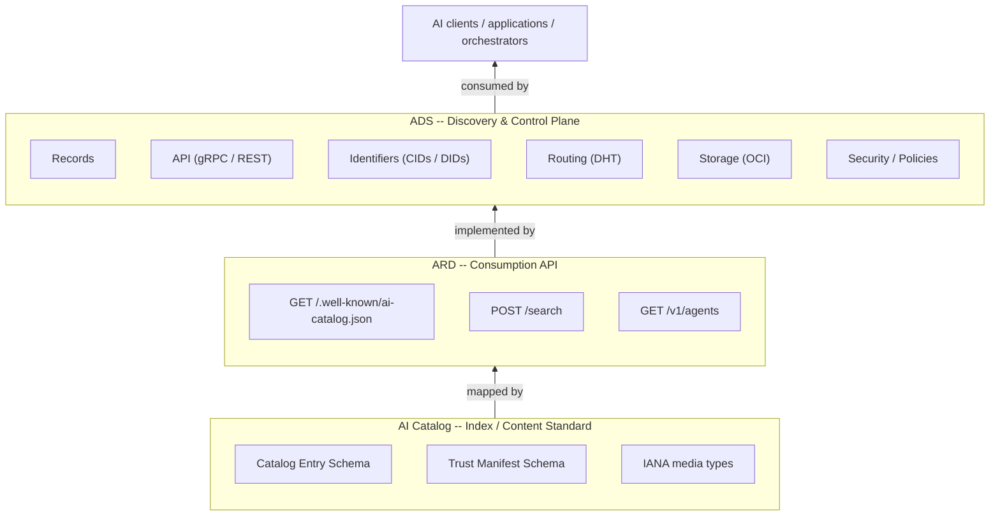
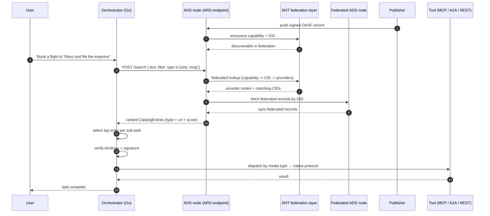
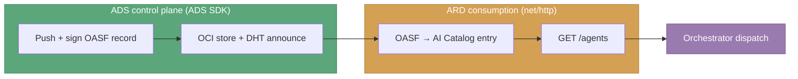

A developer integrating agentic capabilities today faces a discovery problem that looks deceptively like a solved one. We have standards, registries, catalogs, and well-knowns; surely finding the right tool is just a lookup? In practice it is not, because the ecosystem has fragmented into protocols that each describe the *same* artifact differently; be it a resource, tool, agent, or a full agentic system. And while the artifact is one thing; its discovery representations are many.

The question of discovery and interoperability is not achieved by picking a winning format or specification. [AI Catalog](https://agent-card.github.io/ai-catalog) and [Agentic Resource Discovery](https://agenticresourcediscovery.org/) are not competing standards; they are complementary lenses on the same underlying problem. Each one tries to answers a shared set of questions - *what is this artifact*, *what can it do*, *how to use it*, *who published it*, and *can I trust it*.

Most of these formats are **higher-level discovery protocols**: they define a vocabulary and an envelope. What they do *not* define is the hard part -- a secure, federated, capability-driven discovery layer that actually links these artifacts, routes queries across organizational boundaries, and provides security and control policies embedded in. That layer is exactly what [Agent Directory Service (ADS)](https://github.com/agntcy/dir) provides - not another competing registry, but a **low-level protocol** the others can be built on.

<!-- **TL;DR:** AI Catalog and ARD are intentionally artifact-agnostic envelopes; they identify *what* an agentic thing is and delegate *how* to invoke it to the native protocol. ADS supplies the shared schema, identity, routing, and security layer beneath them. A consumer can therefore discover through ARD, verify through ADS, and invoke through MCP or A2A -- one flow, many protocols. -->

## Three layers, one stack

A recurring design mistake is to collapse "the format", "the query API", and "the system" into one monolith. The agentic ecosystem deliberately keeps them apart, and the separation is the whole reason it interoperates.



### Layer 1: AI Catalog: the index standard

The [AI Catalog](https://agent-card.github.io/ai-catalog/) is a *typed, nestable JSON container* for describing heterogeneous AI artifacts. Each entry identifies an artifact by an **IANA media type** and a **domain-anchored URN**. The catalog is therefore *protocol-agnostic*: it can describe an MCP server, an A2A agent, a custom tool, or a set of catalogs in the same way.

```json
{
  "identifier": "urn:ai:acme.com:agents:weather",
  "displayName": "Weather Agent",
  "type": "application/mcp-server+json",
  "url": "https://api.acme.com/mcp/weather.json",
  "capabilities": ["WeatherTool", "ForecastTool"],
  "representativeQueries": ["current wind speed in Chicago", "5-day forecast for Seattle"]
}
```

### Layer 2: ARD: the consumption API

The [Agentic Resource Discovery](https://agenticresourcediscovery.org/) is a *read-only discovery API layer* on top of the AI Catalog. The API is intentionally minimal and provides only static (`GET /.well-known/ai-catalog.json`) and dynamic (`GET /agents`, `POST /search`) discovery endpoints as entire consumption surface. It sits *before* invocation and never speaks other protocols; it just tells which resource to use and where they live.

```json
{
  "specVersion": "1.0",
  "host": {
    "displayName": "AGNTCY Directory",
    "identifier": "https://ai-catalog.outshift.io",
    "trustManifest": {
      "identity": "urn:ai:org.agntcy:host:12D3KooWLf9p3cedc86xGQBaqak6rAFmQk1HxKAK1yh7umHE3amu",
      "identityType": "did"
    }
  },
  "collections": [
    {
      "displayName": "A2A Agents",
      "url": "https://ai-catalog.outshift.io/v1/agents?filter=type%3Dapplication%2Fa2a-agent-card%2Bjson",
      "description": "Agents that publish an A2A agent card.",
      "mediaType": "application/a2a-agent-card+json",
      "tags": [],
      "metadata": {}
    },
    {
      "displayName": "MCP Servers",
      "url": "https://ai-catalog.outshift.io/v1/agents?filter=type%3Dapplication%2Fmcp-server-card%2Bjson",
      "description": "Agents that expose an MCP server connection.",
      "mediaType": "application/mcp-server-card+json",
      "tags": [],
      "metadata": {}
    },
    {
      "displayName": "Agent Skills",
      "url": "https://ai-catalog.outshift.io/v1/agents?filter=type%3Dapplication%2Fagentskill%2Bmd",
      "description": "Agents that publish a reusable Agent Skill definition.",
      "mediaType": "application/agentskill+md",
      "tags": [],
      "metadata": {}
    }
  ]
}
```

### Layer 3: ADS: the discovery and control plane

ARD is a contract; something has to *fill and manage* the real records, real storage, and real trust. That role is performed by [ADS](https://docs.agntcy.org/dir/overview/), the only layer with a **control plane**: it ingests records, content-addresses them with CIDs, signs and verifies them, announces them to a DHT, replicates them over OCI, and enforces zero-trust identity between data, clients, and nodes. Where ARD answers "what fits this task?", ADS owns "what exists, best fit, who vouches for it, and where it physically lives."

The clean consequence is that **ADS is a reference implementation of ARD.** A directory node exposes its [OASF](https://docs.agntcy.org/oasf/open-agentic-schema-framework/) records as AI Catalog entries and serves them over the ARD endpoints so the same inventory is reachable by any ARD client integration.

## What the specs leave unsolved

Both the AI Catalog and ARD specifications are scrupulous about scope. They define the *what* and the *how*, but not the *where* or the *who*. They describe a trust model, but do not ship a trust plane. They describe federation, but they do not ship a routing plane. They describe distribution, but they do not ship a storage plane.

### Identity

AI Catalog's [Trust Manifest](https://agent-card.github.io/ai-catalog/#trust-manifest) carries an `identity` URI, `attestations`, `provenance` and an optional `signature` fields. ARD reuses this object and additionally *requires* that the cryptographic identity align with the domain embedded in the resource's URN. Both specs describe verification procedures, but neither defines how.

ADS already runs one. Records are addressed by [CID](https://github.com/multiformats/cid), so `provenance` models are native, not bolted on. Workload identity comes from [SPIFFE](https://spiffe.io/) and [DNS/HTTPS](https://datatracker.ietf.org/doc/html/rfc1035/) where every component gets a verifiable ID which is precisely the `identity` ARD wants anchored to a publisher domain. ADS also ships a signing and verification plane, so the `signature` field is not just a placeholder; it is a verifiable signature over the record's CID.

### Federation

ARD's federation model (`auto`, `referrals`, `none`) is elegant precisely because it assumes the implementations can route. *"Query upstream registries and merge"* is one HTTP line in the spec and a distributed-systems problem in practice. ADS solves the routing problem with a [libp2p Kad-DHT](https://github.com/libp2p/specs/tree/master/kad-dht) and a two-phase lookup: *capability to CIDs*, then *CID to servers*. An ARD `referrals` response is, underneath, a projection of that routing table.

### Distribution

AI Catalog's maps the logical format onto OCI registries for content-addressed storage. ADS uses the [OCI distribution spec](https://github.com/opencontainers/distribution-spec) as its reference storage model. The mapping the spec describes as future work is the mechanism ADS already ships today.

## End-to-End Discovery-to-Invocation Flow with ARD over ADS

[ADS v1.5](https://github.com/agntcy/dir) ships with a reference implementation of the ARD specification. A publisher can push a record to ADS and have it automatically available through any ARD client, regardless of whether the client speaks MCP, A2A, or any other protocol. The publisher does not need to implement multiple discovery protocols; they can rely on ADS to bridge the gap.

Below is a sequence diagram showing how a user request flows through the orchestrator defining an agentic workflow, ADS, and the federated DHT layer to discover and invoke the appropriate capability.



The decisive line is where the orchestrator dispatches runs **by media type**. ADS doesn't invoke anything; it tells the orchestrator *which* protocol each capability speaks, and the orchestrator routes accordingly. This is how one discovery query spans heterogeneous protocols and domains, exactly as envisioned in the agnostic discovery model of ADS. One caveat here is that the orchestrator must manually map ARD POST request (e.g. via LLM) to the appropriate GET request since ADS only supports deterministic search over ARD.

## Building the orchestrator in Go

We use the recommended split: **plain `net/http` for the ARD consumption API** and the **ADS control-plane SDK** when we need to push, sign, or verify records. The code below is illustrative, modeled on the published [ADS Go SDK](https://dir.agntcy.org/latest/dir/dir-sdk/#go-sdk) and the [ARD spec](https://agenticresourcediscovery.org/).

### Step 1: Publish an agentic capability to ADS

```go
package publisher

import (
	adsclient "github.com/agntcy/dir/client"
	corev1 "github.com/agntcy/dir/api/core/v1"
)

// Publish an OASF record to ADS, sign it, then announce to DHT for federated discovery.
// Local node indexes it and can serve it locally over ADS or ARD right away.
func Publish(ctx context.Context, client *adsclient.Client, record *corev1.Record) error {
    // Push locally
	ref, err := client.Push(ctx, &corev1.New(&typesv1.Record{
        Name: "weather-agent",
        Version: "1.0.0",
        // ...
    }))
	if err != nil {
		return err
	}

    // Sign the record to prove authenticity and integrity.
    if err := client.Sign(ctx, ref); err != nil {
        return err
    }

    // Publish to DHT for federated discovery, so other nodes can find it.
    // Optional if only local discovery is needed.
    if err := client.Publish(ctx, ref); err != nil {
        return err
    }

	return nil
}
```

### Step 2: Discover over ARD

```go
package orchestrator

import (
    catalogv1 "github.com/agntcy/dir/api/catalog/v1"
)

// Discover asks a local ADS node (via its ARD endpoint) for capabilities matching a task.
func Discover(ctx context.Context, registry, taskQuery string) ([]*catalogv1.CatalogEntry, error) {
	httpReq, err := http.NewRequestWithContext(ctx, http.MethodGet, registry+"/v1/agents", bytes.NewReader([]byte(taskQuery)))
	if err != nil {
		return nil, err
	}
	httpReq.Header.Set("Content-Type", "application/json")

	resp, err := (&http.Client{Timeout: 10 * time.Second}).Do(httpReq)
	if err != nil {
		return nil, err
	}
	defer resp.Body.Close()

	var out catalogv1.AICatalog
	if err := json.NewDecoder(resp.Body).Decode(&out); err != nil {
		return nil, err
	}
	return out.Entries, nil
}
```

### Step 2: Dispatch by media type to the native protocol

Discovery hands us a `type` and a `url`. The orchestrator's job is to route to the right execution path and not to "guess" a protocol:

```go
// Dispatch routes a discovered entry to its native invocation path.
func Dispatch(ctx context.Context, e *catalogv1.CatalogEntry, task map[string]any) (any, error) {
	switch e.Type {
	case "application/mcp-server-card+json":
		// Fetch the MCP server descriptor at e.URL, then speak JSON-RPC.
		return invokeMCP(ctx, e.URL, task)
	case "application/a2a-agent-card+json":
		// Load the A2A agent card at e.URL, then speak A2A.
		return invokeA2A(ctx, e.URL, task)
	case "application/agentskill+md":
		// Install or load the skill referenced by e.URL.
		return loadSkill(ctx, e.URL)
	default:
		return nil, fmt.Errorf("unsupported media type: %s", e.Type)
	}
}
```

This `switch` *is* the interoperability boundary. ADS guarantees the `type` is a well-known IANA media type; the orchestrator owns the mapping from type to protocol client. Add a new artifact type to your stack, and you add one `case` while the discovery itself is unchanged.

### Step 3: Verify trust before you invoke

```go
// VerifyTrust confirms the entry owns its claimed identity and trust signals.
func VerifyTrust(ctx context.Context, client *adsclient.Client, e *catalogv1.CatalogEntry) error {
	did, cid, err := publisherFromURN(e.Identifier) // urn:ai:org.agntcy:cid:<cid>
	if err != nil {
		return err
	}
	return client.Verify(ctx, did, cid) // checks signature, provenance, and identity alignment
}
```

### Step 4: Tie it together

```go
func Handle(ctx context.Context, registry, taskQuery string) error {
	entries, err := Discover(ctx, registry, taskQuery)
	if err != nil {
		return err
	}
	for _, e := range entries {
		if err := VerifyTrust(ctx, client, e); err != nil {
			continue // skip anything we can't verify
		}
		if _, err := Dispatch(ctx, e, map[string]any{"task": taskQuery}); err == nil {
			return nil // first trusted, working capability wins
		}
	}
	return errors.New("no trusted capability satisfied the task")
}
```

## Where the ADS control plane earns its keep

The consumption side is plain HTTP, but the *security gate* of what comes back depends entirely on the ADS control plane that produced it. When you publish the agents your orchestrator will later discover, you use the ADS SDK, not raw HTTP. This is the division of labor that makes the whole stack work:



Publishers and platform teams drive the **control plane** (push, sign, index, federate). Orchestrators and clients ride the **consumption plane** (search, verify, dispatch). The contract between them is the AI Catalog entry, which is why an agentic resource published and discovered regardless of the protocol or domain.

### Why this matters

Here is the dependency between ARD and ADS, made concrete as a mapping table.

| Higher-level concept | Spec field                      | ADS primitives                       | Supported by ADS                                                               |
| -------------------- | ------------------------------- | ------------------------------------ | ------------------------------------------------------------------------------ |
| Artifact identity    | `identifier`                    | OASF record + verifiable domain name | ✅                                                                              |
| Content integrity    | `provenance.sourceDigest`       | CID (content addressing)             | ✅                                                                              |
| Publisher identity   | `trustManifest.identity`        | SPIFFE + DID identity                | ✅                                                                              |
| Authenticity         | `trustManifest.signature`       | OIDC / key-based sign + verify       | ✅                                                                              |
| Search               | ARD REST API                    | ARD REST API without `POST /search`  | ADS only supports deterministic search due to security and complexity concerns |
| Federation           | `federation: referrals \| auto` | DHT two-phase routing + sync         | ✅                                                                              |
| Distribution         | OCI mapping                     | OCI v1.1 distribution spec           | ✅                                                                              |

- **No protocol lock-in for publishers.** A record pushed to ADS is reachable through AI Catalog resolution, an ARD search registry, or a direct gRPC query. The publisher does not need to worry.
- **Security is solved once, at the bottom.** SPIFFE identity, DID resolution, CID integrity, and signing available directly. Higher layers reference them through `trustManifest` fields instead of reinventing key management.
- **Federation is real, not only desirable.** ARD's `referrals` and `auto` modes need a routing fabric to be more than a single registry. The DHT can be that fabric.

---

*ADS and its components are developed by AGNTCY Contributors and released under the Apache 2.0 License.*
