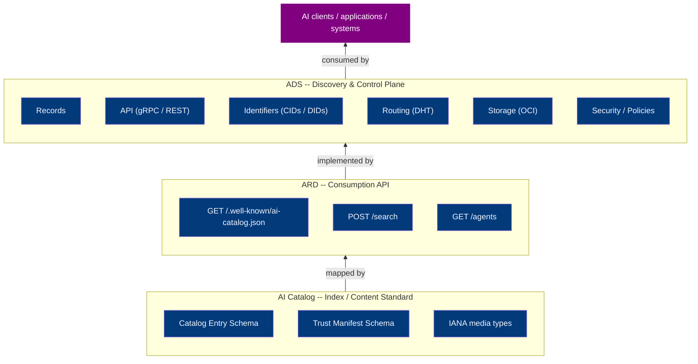
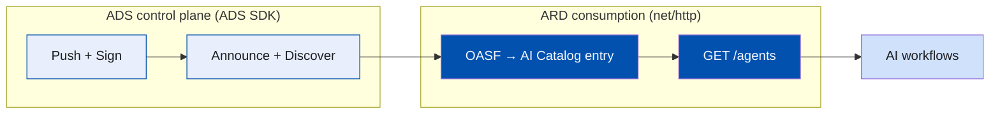

A developer integrating agentic capabilities today faces a discovery problem that looks deceptively like a solved one. We have standards, registries, catalogs, and well-knowns; surely finding the right tool is just a lookup? In practice it is not, because the ecosystem has fragmented into protocols that each describe the *same* artifact differently; be it a resource, tool, agent, or a full agentic system. And while the artifact is one thing; its discovery representations are many.

The question of discovery and interoperability is not achieved by picking a winning format or specification. [AI Catalog](https://agent-card.github.io/ai-catalog) and [Agentic Resource Discovery (ARD)](https://agenticresourcediscovery.org/) are not competing standards; they are complementary lenses on the same underlying problem. Each one tries to answers a shared set of questions - *what is this artifact*, *what can it do*, *how to use it*, *who published it*, and *can I trust it*.

Most of these formats are **higher-level discovery protocols**: they define a vocabulary and an envelope. What they do *not* define is the hard part -- a secure, federated, capability-driven discovery layer that actually links these artifacts, routes queries across organizational boundaries, and provides security and control policies embedded in. That layer is exactly what [Agent Directory Service (ADS)](https://github.com/agntcy/dir) provides - not another competing registry, but a **low-level protocol** the others can be built on.

<!-- **TL;DR:** AI Catalog and ARD are intentionally artifact-agnostic envelopes; they identify *what* an agentic thing is and delegate *how* to invoke it to the native protocol. ADS supplies the shared schema, identity, routing, and security layer beneath them. A consumer can therefore discover through ARD, verify through ADS, and invoke through MCP or A2A -- one flow, many protocols. -->

## Three layers, one stack

A recurring design mistake is to collapse "the format", "the query API", and "the system" into one monolith. The agentic ecosystem deliberately keeps them apart, and the separation is the whole reason it interoperates.



### Layer 1: AI Catalog as the index standard

The [AI Catalog](https://agent-card.github.io/ai-catalog/) is a *typed, nestable JSON container* for describing heterogeneous AI artifacts. Each entry identifies an artifact by an **IANA media type** and a **domain-anchored URN**. The catalog is therefore *protocol-agnostic*: it can describe an MCP server, an A2A agent, a custom tool, or a set of catalogs in the same way. On its own, the catalog is a static index intended to be consumed by AI applications and served over higher-level discovery protocols like ARD.

```json
{
  "identifier": "urn:ai:acme.com:agents:weather",
  "displayName": "Weather Agent",
  "type": "application/mcp-server+json",
  "url": "https://api.acme.com/mcp/weather.json",
  "capabilities": ["WeatherTool", "ForecastTool"],
  "representativeQueries": [
    "current wind speed in Chicago",
    "5-day forecast for Seattle",
  ]
}
```

### Layer 2: ARD as the consumption API

The [Agentic Resource Discovery](https://agenticresourcediscovery.org/) is a *read-only discovery API layer* on top of the AI Catalog. It defines how AI artifacts are cataloged, discovered, and searched within and across registries. It promotes the search-first discovery where registries maintain a shared index while the clients find capabilities over standard HTTP REST APIs instead of loading every tool description into an LLM context window. The ARD spec is intentionally agnostic about the underlying storage, identity, and routing mechanisms; it only defines the *contract* but does not ship discovery or control plane.

```bash
$ curl -s https://your-discovery-service/search \
  -H 'content-type: application/json' \
  -d '{"query": {"text":"book me a flight to Tokyo"}, "pageSize":3}'
{
  "results": [
    {
      "identifier": "urn:ai:acme.com:travel:concierge",
      "displayName": "Travel Concierge",
      "type": "application/mcp-server+json",
      "url": "https://api.acme.com/mcp/travel.json",
      "score": 95,
      "source": "https://registry.acme.com/api/v1/"
    }
  ],
  "referrals": [
    {
      "identifier": "urn:ai:example.org:registry",
      "type": "application/ai-registry",
      "url": "https://registry.acme.com/search"
    }
  ]
}
```

### Layer 3: ADS as the discovery and control plane

ARD is a contract; something has to *fill and manage* the data, storage, routing, and trust. That role is performed by [ADS](https://docs.agntcy.org/dir/overview/), the only layer with a **control plane**: it ingests records, content-addresses them with CIDs, signs and verifies them, announces them to a DHT, replicates them over OCI, and enforces zero-trust identity between data, clients, and nodes. Where ARD answers "what fits this task?", ADS owns "what exists, best fit, who vouches for it, and where it physically lives."

The clean consequence is that **ADS is a reference implementation of ARD.** ADS is a distributed registry that exposes its [OASF](https://docs.agntcy.org/oasf/open-agentic-schema-framework/) records as AI Catalog entries and serves them securely over the ARD endpoints so the same inventory is reachable by both ADS and ARD client integration. Operators publish records to ADS and consumer discover through ARD, verify through ADS, and invoke through MCP or A2A -- one flow, many protocols.

```bash
# Start local ADS node in the background
$ dirctl daemon start &

# Define sample agent skill data
$ export SKILL_DATA="This is a sample agent skill for weather details over AccuWeather."

# Push and sign a sample record
$ cat <<EOF | dirctl push --sign --stdin
{
  "name": "Weather Agent",
  "schema_version": "1.0.0",
  "version": "1.0.0",
  "description": "Helps with tracking weather information",
  "authors": ["Example Organization"],
  "created_at": "2025-01-01T00:00:00Z",
  "skills": [
    {"name": "natural_language_processing/natural_language_understanding/contextual_comprehension"}
  ],
  "modules": [
    {
      "name": "core/language_model/agentskills",
      "data": {
        "skill_file": "SKILL.md",
        "skill_manifest": {
          "name": "Weather Agent",
          "description": "Helps with tracking weather information",
          "version": "1.0.0"
        }
      },
      "artifact": {
        "data": "$(echo "$SKILL_DATA" | base64)",
        "media_type": "application/agentskill+md",
        "digest": "sha256:$(echo -n "$SKILL_DATA" | sha256sum | awk '{print $1}')",
        "size": $(echo -n "$SKILL_DATA" | wc -c)
      }
    }
  ]
}
EOF

# Discover via ARD over ADS
$ curl -s http://localhost:8889/v1/agents | \
    jq -r '.results[] | "\(.displayName) \(.identifier) \(.mediaType)"'

# Verify the record
$ dirctl verify baeareieojr2mtkdtddnllqhanf3aev4qcsd5rz6oj4by6f563l3mmnro5y

# Stop the ADS daemon
$ dirctl daemon stop
```

## What the specs leave unsolved

Both the AI Catalog and ARD specifications are scrupulous about scope. They define the *what* and the *how*, but not the *where* or the *who*. They describe identity, federation, distribution, and security but do not ship a control plane that supports it.

### Identity

AI Catalog's [Trust Manifest](https://agent-card.github.io/ai-catalog/#trust-manifest) carries `identity`, `attestations`, `provenance` and an optional `signature` field for security policies. ARD reuses this object and additionally *requires* that the cryptographic identity aligns with the domain embedded in the resource's URN. Both specs describe verification procedures, but neither defines how.

ADS already runs one. Records are addressed by [CID](https://github.com/multiformats/cid), so `provenance` models are native, not bolted on. Workload identity comes from [SPIFFE](https://spiffe.io/) and [DNS/HTTPS](https://datatracker.ietf.org/doc/html/rfc1035/) where every component gets a verifiable ID which is precisely the `identity` ARD wants anchored to a publisher. ADS also ships a signing and verification plane, so the `signature` is not just a placeholder but actually a verifiable field over the data.

### Federation

ARD's federation model is elegant precisely because it assumes the implementations can route. *"Query upstream registries and merge"* is one HTTP line in the spec and a distributed-systems problem in practice. ADS solves the routing problem with a [libp2p Kad-DHT](https://github.com/libp2p/specs/tree/master/kad-dht) and a two-phase lookup: *capability to CIDs*, then *CID to servers*. An ARD `referrals` response is, underneath, a projection of that routing table.

### Distribution

AI Catalog's maps the logical format onto OCI registries for content-addressed storage. ADS uses the [OCI distribution spec](https://github.com/opencontainers/distribution-spec) as its reference storage model. The mapping the spec describes as future work is the mechanism ADS already ships today. When a record is pushed to ADS, it is automatically stored in the given OCI registry and made available for fetch by CID. The ARD `url` field can directly point to the OCI location, or it can point to the ADS node which proxies the fetch.

## End-to-End Discovery-to-Invocation with ARD over ADS

[ADS v1.5](https://github.com/agntcy/dir/releases/tag/v1.5.0) ships with a reference implementation of the ARD specification. A publisher can push an artifact to ADS and have it automatically available through any ARD client, regardless of whether the client speaks MCP, A2A, or any other protocol. The publisher does not need to implement multiple discovery protocols; they can rely on ADS to bridge the gap.

Below is a sequence diagram showing a sample end-to-end flow, from discovery to invocation, across heterogeneous protocols. The idea is simple: an agentic application queries ADS over ARD, discovers capabilities, verifies trust, and dispatches work to the appropriate protocol based on its requirements. 

> Full code samples are available in [github.com/agntcy/dir](https://github.com/agntcy/dir/tree/main/samples) repository.


The decisive step is where the application dispatches runs **by media type**. ADS doesn't invoke anything; it tells the application *which* protocol each capability speaks, and the application routes accordingly. This is how one discovery query spans heterogeneous protocols and domains, exactly as envisioned in the agnostic discovery model of ADS.

## Building the application

We use the following tools and libraries to build a sample producer/consumer application:
- **ARD consumption API**: plain `net/http` or `curl` for the ARD consumption API used for discovery.
- **ADS client tools**: [Go SDK](https://github.com/agntcy/dir/tree/main/client) or [dirctl](https://github.com/agntcy/dir/tree/main/cli) CLI for pushing, signing, and verifying records.

Code snippets below are simplified for clarity and focus on ideas. The samples in the repository include full working implementations.

### Step 1: Publish an agentic capability to ADS

```go
import (
  adsclient "github.com/agntcy/dir/client"
  corev1 "github.com/agntcy/dir/api/core/v1"
)

// Publish an OASF record to ADS, sign it, then announce to DHT for federated discovery.
// Local node indexes it and can serve it locally over ADS or ARD right away.
func Publish(ctx context.Context, client *adsclient.Client) error {
  // Push locally
  ref, err := client.Push(ctx, corev1.New(&typesv1.Record{
      Name: "weather-agent",
      Version: "1.0.0",
      // ...
  }))
  if err != nil {
    return err
  }

  // Sign the record to prove authenticity and integrity.
  // Provider can be a private key or OIDC token.
  if err := client.Sign(ctx, {ref, provider}); err != nil {
      return err
  }

  // Publish to DHT for federated discovery, so other nodes can find it.
  // Optional if only local discovery is needed.
  if err := client.Publish(ctx, {ref}); err != nil {
      return err
  }

  return nil
}
```

### Step 2: Discover over ARD

```go
import (
  catalogv1 "github.com/agntcy/dir/api/catalog/v1"
)

// Discover asks a local ADS node via its ARD endpoint for capabilities matching a task.
// The consumer application can extend this with more complex query matching and ranking logic as needed.
func Discover(ctx context.Context, taskQuery string) ([]*catalogv1.CatalogEntry, error) {
  // Find relevant capabilities
  httpReq, err := http.NewRequestWithContext(ctx, http.MethodGet, "http://localhost:8889/v1/agents", bytes.NewReader([]byte(taskQuery)))
  if err != nil {
    return nil, err
  }
  httpReq.Header.Set("Content-Type", "application/json")

  resp, err := (&http.Client{Timeout: 10 * time.Second}).Do(httpReq)
  if err != nil {
    return nil, err
  }
  defer resp.Body.Close()

  // Read the response
  outBytes, err := io.ReadAll(resp.Body)
  if err != nil {
    return nil, err
  }

  // Unmarshal the response into a ListAgentsResponse
  // Note: use protojson since the response is a protobuf message
  // and we're communicating over HTTP with JSON encoding
  var out catalogv1.ListAgentsResponse
  if err := protojson.Unmarshal(outBytes, &out); err != nil {
    return nil, err
  }

  return out.Results, nil
}
```

### Step 2: Dispatch by media type to the native protocol

Discovery hands us a `mediaType` and other relevant details such as `url` about the discovered capabilities. The application's job is now to route to the right execution path and not to "guess" a protocol:

```go
import (
  catalogv1 "github.com/agntcy/dir/api/catalog/v1"
)

// Dispatch routes a discovered entry to its native invocation path.
func Dispatch(ctx context.Context, entry *catalogv1.CatalogEntry, task map[string]any) error {
  switch entry.MediaType {
  case "application/mcp-server-card+json":
    // Fetch the MCP server descriptor at entry.URL, then speak JSON-RPC.
    return invokeMCP(ctx, entry.URL, task)
  case "application/a2a-agent-card+json":
    // Load the A2A agent card at entry.URL, then speak A2A.
    return invokeA2A(ctx, entry.URL, task)
  case "application/agentskill+md":
    // Pull the agent skill markdown at entry.URL, then execute.
    return invokeAgentSkill(ctx, entry.URL, task)
  default:
    return fmt.Errorf("unsupported media type: %s", entry.MediaType)
  }
}
```

**This `switch` is the interoperability boundary.** ARD guarantees the `mediaType` is a well-known IANA media type; the consumer owns the mapping logic and decides what to do with each type. Add a new artifact type to your stack, and you add one `case` while the discovery itself is unchanged.

### Step 3: Verify trust before you invoke

```go
import (
  adsclient "github.com/agntcy/dir/client"
  corev1 "github.com/agntcy/dir/api/core/v1"
)

// Verify confirms the entry owns its claimed identity and trust signals.
// Identifier format is expected to be urn:ai:org.agntcy:cid:<cid>
func Verify(ctx context.Context, client *adsclient.Client, e *catalogv1.CatalogEntry) error {
  // Get AGNTYCY identifier
  cid, found := strings.CutPrefix(e.Identifier, "urn:ai:org.agntcy:cid:")
  if !found {
    return fmt.Errorf("invalid identifier format: %s", e.Identifier)
  }

  // Verify provenance
  if verified, err := client.Verify(ctx, &adssignv1.VerifyRequest{
    RecordRef: &adscorev1.RecordRef{Cid: cid},
  }); err != nil {
    return fmt.Errorf("failed to verify provenance: %w", err)
  } else if !verified.Success {
    return fmt.Errorf("provenance verification failed: %s", *verified.ErrorMessage)
  }

  // Verify naming
  // We do not fail here, simply log a warning
  if verified, err := client.GetVerificationInfo(ctx, cid); err != nil {
    fmt.Printf("Warning: failed to get verification info for CID %s: %v\n", cid, err)
  } else if !verified.Verified {
    fmt.Printf("Warning: identity verification failed for CID %s: %+v\n", cid, verified)
  }

  return nil
}
```

### Step 4: Tie it together

Once the discovery, verification, and dispatch functions are implemented, the consumer application can orchestrate them in a single flow. The following function demonstrates how to handle a task query by discovering capabilities, verifying trust, and dispatching to the appropriate protocol:

```go
import (
  adsclient "github.com/agntcy/dir/client"
  corev1 "github.com/agntcy/dir/api/core/v1"
)

func Handle(ctx context.Context, client *adsclient.Client, taskQuery string) error {
  entries, err := Discover(ctx, taskQuery)
  if err != nil {
    return err
  }

  for _, e := range entries {
    // Skip anything we can't verify
    if err := Verify(ctx, client, e); err != nil {
      continue
    }

    // First trusted, working capability wins
    if err := Dispatch(ctx, e, map[string]any{"task": taskQuery}); err == nil {
      return nil
    }
  }

  return errors.New("no trusted capability satisfied the task")
}
```

## Where the ADS control plane earns its keep

The consumption side is plain HTTP, but the *security gate* of what comes back depends entirely on the ADS control plane that produced it. When you publish the agents your application later discovers, you use the ADS SDK, not raw HTTP. This is the division of labor that makes the whole stack work:



Publishers and platform teams drive the **control plane** (push, sign, announce). Orchestrators and clients ride the **consumption plane** (discover, verify, dispatch). The contract between them is the AI Catalog and ARD, which is why an agentic resource can be published and discovered regardless of the protocol or domain.

### Why this matters

ADS is not just another registry; it is the shared control plane that makes the discovery work. The AI Catalog and ARD specifications define the *what* and the *how* for discovery, but without a control plane, they are just static formats. ADS provides the *where* and the *who* -- a secure, federated, capability-driven discovery layer that actually links these artifacts, routes queries across organizational boundaries, and provides security and control policies embedded in.

- **No protocol lock-in for publishers.** A record pushed to ADS is reachable through AI Catalog resolution, an ARD search registry, or a direct gRPC query. The publisher does not need to worry.
- **Security is solved once, at the bottom.** SPIFFE identity, DID resolution, CID integrity, and signing available directly. Higher layers reference them through `trustManifest` fields instead of reinventing key management.
- **Federation is real, not only desirable.** ARD's `referrals` and `auto` modes need a routing fabric to be more than a single registry. The DHT can be that fabric.

The table below summarizes how the higher-level specification concepts map to the underlying ADS primitives and what is solved by ADS:

| Spec concept       | Spec field                      | ADS primitives                       | Supported by ADS                                                |
| ------------------ | ------------------------------- | ------------------------------------ | --------------------------------------------------------------- |
| Artifact identity  | `identifier`                    | OASF record + verifiable domain name | ✅                                                               |
| Content integrity  | `provenance.sourceDigest`       | CID (content addressing)             | ✅                                                               |
| Publisher identity | `trustManifest.identity`        | SPIFFE + DNS/HTTPS identity          | ✅                                                               |
| Authenticity       | `trustManifest.signature`       | OIDC / key-based sign + verify       | ✅                                                               |
| Search             | ARD REST API                    | ARD REST API without `POST /search`  | ADS only supports deterministic search due to security concerns |
| Federation         | `federation: referrals \| auto` | DHT two-phase routing + sync         | ✅                                                               |
| Distribution       | OCI mapping                     | OCI v1.1 distribution spec           | ✅                                                               |

## What's Next

The current ARD implementation in ADS is a reference implementation of the spec, but there are many features we plan to add in future releases of ADS:

- **POST /search** endpoint with advanced query capabilities and relevance ranking as described in ARD.
- **New artifact types** beyond agent skills, including tools, datasets, and full agentic systems.
- **Client tooling and SDKs** for to simplify integration with ADS and ARD, both for publishers and consumers.

If you're building multi-agent systems, we'd love to hear your use cases.
Join our [Slack community](https://join.slack.com/t/agntcy/shared_invite/zt-3hb4p7bo0-5H2otGjxGt9OQ1g5jzK_GQ)
or open an issue on [GitHub](https://github.com/agntcy/dir).

---

*ADS and its components are developed by AGNTCY Contributors and released under the Apache 2.0 License.*
