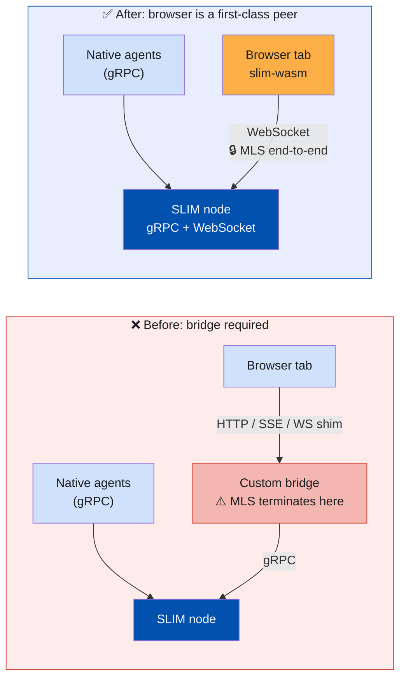
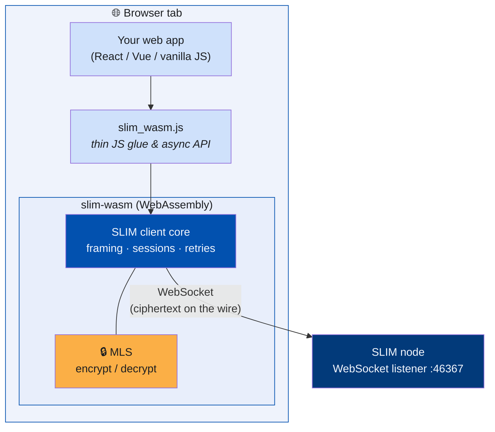
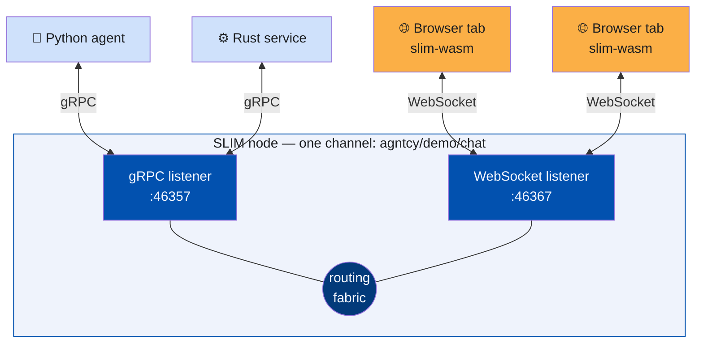
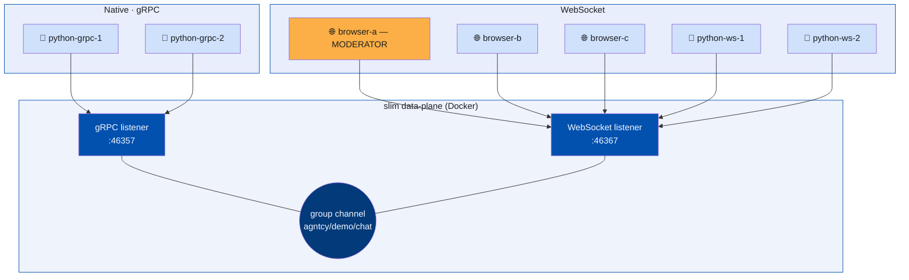
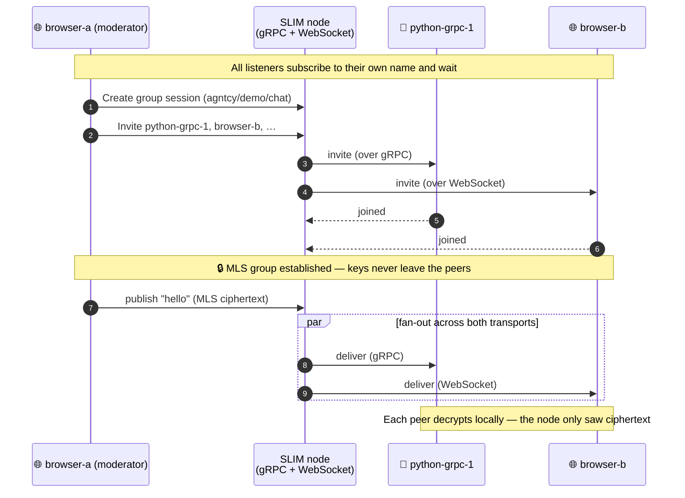

[SLIM (Secure Low-Latency Interactive Messaging)](https://docs.agntcy.org/slim/overview/)
was built to be the transport layer for agentic AI — letting agents,
tools, and services talk to each other securely across network
boundaries with native support for point-to-point and group
communication. Until now, "an agent" in SLIM meant a process: something
running in a container, on a VM, at the edge, or on a developer's
laptop. Browsers — where humans actually *live* — were on the outside
looking in.

This release closes that gap. SLIM now ships with a **WebAssembly
build of the data-plane client** and a **WebSocket transport** on the
SLIM node, so any modern browser tab can be a first-class participant
in a SLIM channel: subscribing to names, joining multicast groups,
exchanging end-to-end encrypted messages with MLS, and talking to
native peers — all without a custom bridge or a separate web gateway.

> **TL;DR**
> - A new **WebSocket listener** on the SLIM data plane runs side-by-side
>   with the existing gRPC listener — same node, same channels, same
>   identities.
> - **`slim-wasm`** compiles the SLIM client core to WebAssembly so a
>   browser tab runs the *real* client — framing, sessions, retries, and
>   MLS — not a thin shim.
> - **Transport is an implementation detail**: gRPC agents and WebSocket
>   browser tabs share one multicast channel and never know how the others
>   connected.
> - **No bridge, no gateway, no plaintext hop** — MLS encryption stays
>   end-to-end, all the way into the JavaScript app.

<!--more-->

---

## Why this matters

Agentic systems are not just backend systems. A growing number of
real workloads need a human, or a UI rendered for a human, sitting on
the same channel as the agents:

- **Human-in-the-loop agents** — approving a remediation, signing off
  on a transaction, or just watching what the agents are doing in real
  time.
- **Operator consoles and copilots** — a dashboard that does not poll a
  REST API every second but instead *subscribes* to the same group
  channel that the agents publish on.
- **Customer-facing chat and collaboration UIs** built on top of A2A,
  MCP, or custom agent protocols, where the browser is just another
  participant in the conversation.
- **Demos and onboarding** — being able to open a URL and *be on the
  bus* is by far the fastest way to explain what SLIM does.

Up to this release, getting a browser onto SLIM meant standing up a
custom HTTP/SSE bridge or a per-app WebSocket shim that translated to
SLIM's gRPC transport on the backend. That bridge became a piece of
infrastructure that had to be deployed, scaled, secured, and
maintained — and it broke the end-to-end security story, because MLS
could no longer run all the way to the user's tab.

With native browser support, the browser tab *is* the SLIM endpoint.
There is no translation layer in the middle, no extra service to
operate, and MLS-encrypted payloads stay encrypted from the publisher
all the way into the JavaScript application that consumes them.



## What's new

Two changes work together to make this possible.

### 1. A WebSocket transport on the data plane

The SLIM data plane already supports a `grpc` listener for
service-to-service traffic. We've added a peer `websocket` listener
that speaks the same SLIM wire protocol over a standard WebSocket
connection.

That means a single SLIM node can now expose *both* listeners side by
side, in the same config, on the same data plane:

```yaml
# server-config.yaml (excerpt)
dataplane:
  servers:
    - endpoint: "0.0.0.0:46357"      # gRPC, for native clients
      tls:
        insecure: true
    - endpoint: "0.0.0.0:46367"      # WebSocket, for browsers
      tls:
        insecure: true
      websocket:
        path: "/ws"
```

Same routing fabric, same identities, same channels — just a second
way in.

> The `insecure: true` flags above keep the local demo simple. In
> production, terminate both listeners with TLS (so browsers connect
> over `wss://`) and drive identities through your normal SLIM
> auth setup — the WebSocket path is a transport, not a security
> shortcut.

### 2. `slim-wasm`: SLIM's data-plane client as WebAssembly

We compile the SLIM client core to WebAssembly with `wasm-pack`, and
expose it as a small JavaScript module (`slim_wasm.js`) that any web
app can `import` directly.

From the application's point of view, the API mirrors the one our
Python and Rust bindings already expose: connect to a SLIM node,
subscribe to a name, create or join a session (point-to-point or
multicast), invite peers, publish, receive. The browser is no longer
a special case — it is just another transport choice for the same
client.

Because the heavy lifting — framing, MLS, session state, retries —
runs *inside the WebAssembly module in the tab*, the JavaScript glue
stays tiny, and end-to-end encryption is preserved all the way to the
UI.

Here is what actually lives inside a browser tab, and where the
security boundary sits:



The node only ever sees ciphertext: payloads are encrypted and
decrypted *inside the WASM module*, so the plaintext never leaves the
tab.

## Mixed-transport, by design

The most important property of this release is one that is easy to
miss: **transport is an implementation detail.**

A native Python agent connected over gRPC, a server-side Rust
component over gRPC, and a React app connected over WebSocket can all
sit on the same SLIM multicast channel. Once they are members of the
channel, they exchange messages exactly the same way. None of them
knows or cares how the others got onto the bus.



A message published by any member fans out to every other member
through the shared routing fabric — the transport each peer used to
connect never enters the picture.

We put together a demo specifically to make that point hard to argue
with.

## The demo: seven participants, two transports, one channel

The demo lives in
[`data-plane/examples/websocket-grpc-demo`](https://github.com/agntcy/slim/tree/main/data-plane/examples/websocket-grpc-demo)
and the full setup, prerequisites, and troubleshooting are in its
[README](https://github.com/agntcy/slim/blob/main/data-plane/examples/websocket-grpc-demo/README.md).

Topology:



What this is showing:

- **One** SLIM data plane in Docker, with two listeners enabled in a
  single YAML config — gRPC on `:46357`, WebSocket on `:46367`.
- **Seven participants** sharing one single multicast channel named
  `agntcy/demo/chat`:
  - Two native Python listeners over **gRPC**.
  - Two native Python listeners over **WebSocket** (same Python SDK,
    different client config).
  - Three browser tabs over **WebSocket**, running `slim-wasm`.
- One of the browser tabs (`browser-a`) is the **moderator**: it
  creates the group session and invites everyone else by name. The
  rest are passive listeners that subscribe to their own name and
  wait for the invite to arrive.

Once everyone has joined, every message published on the channel
fans out to all six other participants, regardless of whether they
came in over gRPC or WebSocket, and regardless of whether they are a
Python process on the host or a JavaScript application in a browser.

Here is the full lifecycle, from the moderator creating the session to
a message fanning out across both transports:



Toggling **Enable MLS** in the moderator tab before creating the
session shows the exact same flow with end-to-end encryption running
across both transports — encrypted in the browser, decrypted in the
browser, never in plaintext on the wire or on the node.

### Watch the demo

Rather than take our word for it, watch seven participants across two
transports land on a single channel and start talking:

<!--
  📹 VIDEO PLACEHOLDER
  Replace `IhQrhSs6izk` below (in both the iframe src and the link) with
  the real YouTube ID once the demo recording is uploaded.
-->
<div class="video-embed" style="position:relative;padding-bottom:56.25%;height:0;overflow:hidden;max-width:100%;">
  <iframe
    src="https://www.youtube.com/embed/IhQrhSs6izk"
    title="SLIM in the Browser — WebSocket + WebAssembly demo"
    frameborder="0"
    allow="accelerometer; autoplay; clipboard-write; encrypted-media; gyroscope; picture-in-picture; web-share"
    allowfullscreen
    style="position:absolute;top:0;left:0;width:100%;height:100%;">
  </iframe>
</div>

Watch on YouTube: [youtube.com/watch?v=IhQrhSs6izk](https://www.youtube.com/watch?v=IhQrhSs6izk)

The recording walks through the full flow: bringing up the gateway,
starting the four native Python listeners one by one, opening the
three browser tabs, having the moderator create the group and invite
everyone, exchanging multicast messages, then switching the same
session to a point-to-point send between two participants — without
restarting anything.

### Try it yourself

From a fresh clone of [`agntcy/slim`](https://github.com/agntcy/slim):

```bash
cd data-plane/examples/websocket-grpc-demo

# 1. Bring up the SLIM data plane (gRPC + WebSocket listeners)
docker compose up --build -d

# 2. Build the Python SDK and the slim-wasm package (one-time)
task python:build
task run:browser:build-wasm

# 3. Start the four native Python listeners
task run:python:grpc-1   # in its own terminal
task run:python:grpc-2
task run:python:ws-1
task run:python:ws-2

# 4. Serve the browser demo
task run:browser:serve
```

Then open three browser tabs:

- `http://localhost:8080/examples/websocket-grpc-demo/browser/?role=moderator&app=browser-a`
- `http://localhost:8080/examples/websocket-grpc-demo/browser/?role=listener&app=browser-b`
- `http://localhost:8080/examples/websocket-grpc-demo/browser/?role=listener&app=browser-c`

In the moderator tab: **Connect & subscribe → Create session (Group
multicast) → Invite all**. From that moment on, anything any
participant publishes shows up everywhere else.

## What this unlocks

A few directions we're particularly excited about:

- **Real human-in-the-loop UIs over SLIM** — operator consoles,
  approval flows, and chat surfaces that are full peers on the same
  channels as the agents, with the same MLS-encrypted payloads.
- **Zero-bridge deployments** — no per-app WebSocket gateways, no
  HTTP/SSE translation services, no extra surface to operate. The
  SLIM node is the surface.
- **Faster demos, faster onboarding** — sharing a SLIM-backed app is
  now as simple as sharing a URL.
- **Edge and embedded UIs** — `slim-wasm` runs anywhere a modern
  WebAssembly + WebSocket runtime does, which today is essentially
  every browser and an increasing number of edge runtimes.

## Where to look in the code

- `data-plane/core/slim-wasm/` — the WebAssembly client crate and
  build target.
- `data-plane/pkg/` — the prebuilt `slim_wasm.js` /
  `slim_wasm_bg.wasm` consumed by web apps.
- The WebSocket listener implementation lives in the data-plane
  transport layer, alongside the existing gRPC listener.
- `data-plane/examples/websocket-grpc-demo/` — the end-to-end demo
  used in this post, including its `server-config.yaml`, the browser
  page, the native Python listeners, and the `Taskfile.yaml` that
  orchestrates them.

## Wrapping up

SLIM has always been about giving agents a secure, low-latency,
group-aware transport that does not force you to pick between
performance and end-to-end security. With WebAssembly bindings and a
WebSocket transport, that promise now extends all the way into the
browser tab — and the humans, dashboards, and copilots that live
there are no longer second-class citizens on the bus.

Go open three tabs and invite them to your channel.

---

*Have questions or want to show us what you're building? Join our
[Slack community](https://join.slack.com/t/agntcy/shared_invite/zt-3hb4p7bo0-5H2otGjxGt9OQ1g5jzK_GQ)
or check out [SLIM on GitHub](https://github.com/agntcy/slim).*
