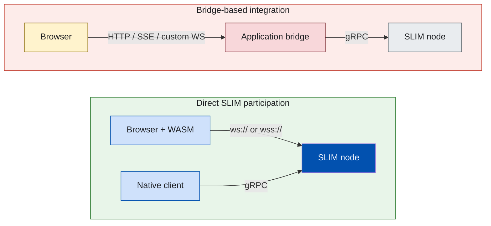
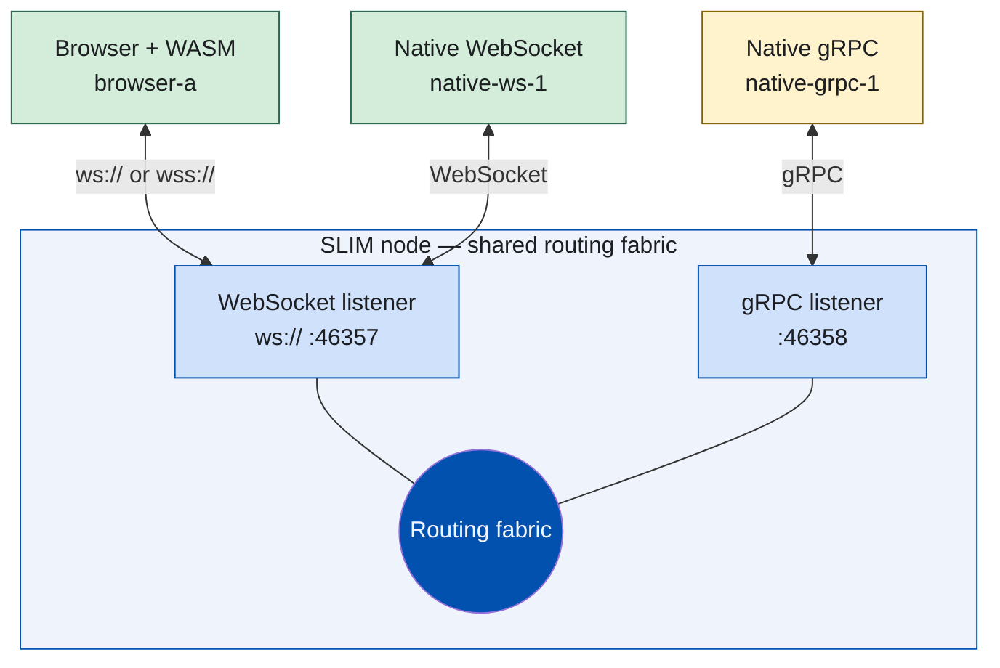
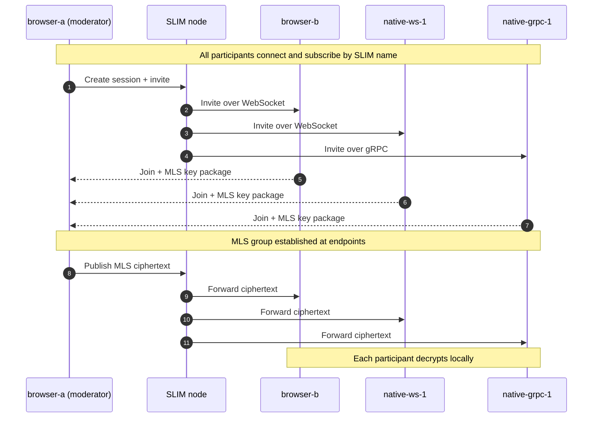
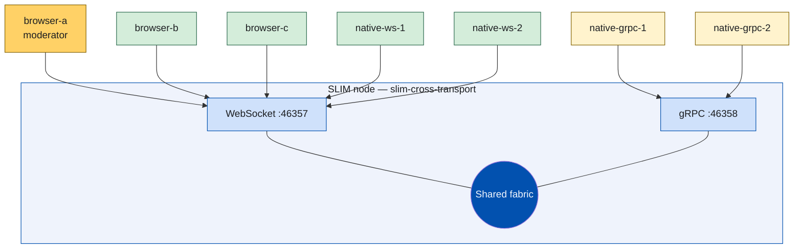

Agentic systems increasingly span data centers, edge nodes, and browser-based
operator interfaces. Those environments rarely share a single transport:
backend services often connect over gRPC, while browsers can only speak
WebSocket (or secure WebSocket) to the outside world.

[SLIM (Secure Low-Latency Interactive Messaging)](https://docs.agntcy.org/slim/overview/)
now addresses that gap directly. A single SLIM node can expose **WebSocket and
gRPC listeners on the same routing fabric**, and browser applications can
participate as first-class endpoints through **WebAssembly bindings** —
without a custom HTTP bridge or a WebSocket-to-gRPC translation layer.

This post explains how dual-transport configuration works, how browser
bindings fit into the SLIM session model, and where this capability is most
useful in production-style agent systems.

<!--more-->

### What you'll learn

In this post, you'll learn:

- How to configure one SLIM node with multiple listeners (WebSocket + gRPC)
- How SLIM infers transport from endpoint schemes, including `ws://` and
  `wss://`
- How browser applications connect through
  `@agntcy/slim-bindings-react-native/web`
- How cross-transport multicast and MLS sessions behave end to end
- Practical use cases for browser-native SLIM participation
- Where the cross-transport demo application and browser bindings live, so you can run
  them yourself

## The integration problem

Many teams expose agent traffic to browsers through an application-specific
bridge: the browser talks HTTP or a custom WebSocket protocol to a gateway,
and the gateway translates requests onto gRPC or another backend transport.
That approach works, but it adds operational surface area and often weakens
security boundaries — the bridge becomes a trusted intermediary that sees
application payloads.

SLIM takes a different path. Browser tabs load the same Rust session and MLS
stack (compiled to WebAssembly), connect outbound to a SLIM WebSocket
listener, and participate in the same named sessions as native gRPC or
WebSocket clients. The node routes messages; it does not decrypt
application data when MLS is enabled.



## How dual-transport configuration works

SLIM selects the transport **from the endpoint string**. There is no separate
`transport:` field in the server configuration — the scheme (or its absence)
determines the protocol:

| Endpoint form | Transport | Typical use |
|---|---|---|
| `ws://host:port` | WebSocket (plaintext) | Local development |
| `wss://host:port` | WebSocket over TLS | Production browsers |
| `host:port` or `http://…` | gRPC | Native services, high-throughput backends |

Both WebSocket schemes are fully supported. Use `ws://` only on trusted local
networks. Production browser applications served over HTTPS must connect to a
`wss://` endpoint so the page remains mixed-content safe and the WebSocket
upgrade is TLS-protected.

### Configuring two listeners on one node

A SLIM data-plane node declares one or more `servers` entries under
`services.<service-id>.dataplane`. Each entry becomes an independent listener
on the **same routing fabric**. Messages published in a session reach every
member regardless of which listener they connected through.

The cross-transport demo uses this configuration:

```yaml
services:
  slim/0:
    node_id: slim-cross-transport
    dataplane:
      servers:
        # WebSocket listener — browsers and native WebSocket clients
        - endpoint: "ws://0.0.0.0:46357"
          tls:
            insecure: true

        # gRPC listener — native backend clients (bare host:port = gRPC)
        - endpoint: "0.0.0.0:46358"
          tls:
            insecure: true

      clients: []
```

Reading the configuration line by line:

- **`node_id`** — Logical name of this node in the topology. Other
  participants and operators refer to it in logs and diagnostics.
- **`dataplane.servers`** — Inbound listeners. Add one block per transport
  you want the node to accept.
- **`endpoint: "ws://0.0.0.0:46357"`** — Opens a WebSocket listener on all
  interfaces, port 46357. Any client — browser WASM or native — that dials
  `ws://127.0.0.1:46357` (or `wss://…` in production) attaches here.
- **`endpoint: "0.0.0.0:46358"`** — Opens a gRPC listener on port 46358.
  Native clients configured with a bare `host:port` endpoint use this path.
- **`tls.insecure: true`** — Disables TLS verification for local demos only.
  **Do not use this in production.** For production, configure proper TLS
  material and use `wss://` for browser-facing WebSocket endpoints.
- **`clients: []`** — This node acts purely as a listener in the demo; it
  does not dial outbound to other nodes.

For production, the WebSocket listener would typically look like:

```yaml
        - endpoint: "wss://0.0.0.0:443"
          tls:
            cert_file: /path/to/server.crt
            key_file: /path/to/server.key
```

Browser code then connects with `service.connectAsync("wss://slim.example.com", …)`
and `app.subscribeAsync(local, connId)`. The bindings validate that browser
endpoints use `ws://` or `wss://` only.

The full demo configuration is in
[`slim-cross-transport/configs/server-config.yaml`](https://github.com/agntcy/agentic-apps/blob/main/slim-cross-transport/configs/server-config.yaml)
in the [cross-transport demo application](https://github.com/agntcy/agentic-apps/tree/main/slim-cross-transport).

### Cross-transport routing on one fabric

Once connected, participants are addressed by **SLIM name**
(`org/namespace/application`), not by IP or port. A browser tab on WebSocket
and a backend service on gRPC can join the same multicast session because the
node forwards by name through a shared routing fabric.



After a session is established, every participant uses the same SLIM session
API — `createSession`, `invite`, `publish`, `subscribe` — regardless of
transport. Transport is a connection detail; session semantics are not.

## Browser bindings architecture

The browser entry point is the web export of the React Native bindings
package:

```typescript
import {
  Direction,
  Name,
  Service,
  SessionType,
  uniffiInitAsync,
} from "@agntcy/slim-bindings-react-native/web";
```

The initialization sequence is:

1. **`uniffiInitAsync()`** loads the generated WASM module and validates
   UniFFI checksums.
2. **`Service.connectAsync(...)`** opens an outbound WebSocket to the SLIM
   node (`ws://` or `wss://`) and returns a connection id for routing.
3. **`Service.createAppWithDirectionAsync(...)`** creates the same core `App`
   used on native platforms; **`App.subscribeAsync(...)`** advertises the
   local SLIM name on that connection so the node can route messages back.
4. **Session operations** (`createSessionAndWaitAsync`, `inviteAndWaitAsync`,
   `publishAndWaitAsync`, message listeners) follow the same API surface as
   native bindings.

Example connection from a browser tab:

```typescript
await uniffiInitAsync();

const local = Name.fromString("org/default/browser-a");
const service = new Service("browser-a");
const connId = await service.connectAsync(
  "ws://127.0.0.1:46357",   // use wss:// in production
  undefined,                 // optional auth token query param
);
const app = await service.createAppWithDirectionAsync(
  local,
  sharedSecret,
  Direction.Bidirectional,
);
await app.subscribeAsync(local, connId);
```

For a multicast session, the moderator installs routes on the upstream
connection, creates the group, and invites participants by name:

```typescript
for (const participant of participants) {
  await app.setRouteAsync(participant, connId);
}

const session = await app.createSessionAndWaitAsync(
  {
    sessionType: SessionType.Group,
    maxRetries: 10,
    interval: 1_000,
    metadata: new Map(),
    mlsSettings: { headerIntegrityValidationPercent: 100 },
  },
  Name.fromString("org/default/room-1"),
);

for (const participant of participants) {
  await session.inviteAndWaitAsync(participant);
}
```

### Browser bindings on npm

Browser bindings ship in
[`@agntcy/slim-bindings-react-native@2.0.0-alpha.7`](https://www.npmjs.com/package/@agntcy/slim-bindings-react-native/v/2.0.0-alpha.7)
on npm, including the prebuilt WASM binary and the stable `/web` entry point
([`web.ts`](https://github.com/agntcy/slim-bindings/blob/main/react-native/web.ts)).
The cross-transport demo installs them with `npm install`.

Under the hood, the package is built with `uniffi-bindgen-react-native`
(`ubrn`) and `wasm-bindgen`, producing TypeScript bindings, a JavaScript
loader, and the WASM binary under `generated/web/`. The WASM crate enables
the `web` feature on
[`agntcy-slim-bindings`](https://github.com/agntcy/slim/tree/main/crates/slim-bindings),
which compiles the browser WebSocket client and session layer while reusing
the same MLS and messaging primitives as native builds.

## Where browser bindings are useful

Browser-native SLIM participation is valuable whenever a human or a
web-based UI must share a secure channel with backend agents — without
standing up a custom gateway.

#### Human-in-the-loop agent workflows

Approval gates, remediation confirmations, and policy exceptions often
require a person on the same channel as the agents proposing an action. With
browser bindings, an operator UI joins the SLIM session directly, receives
live agent messages, and responds in real time — including under MLS when
required.

#### Operator consoles and observability surfaces

Dashboards that today poll REST endpoints can instead subscribe to SLIM
sessions. An operator sees the same event stream as the agents, with lower
latency and without duplicating message semantics in a separate API layer.

#### Cross-transport collaboration

A typical deployment might run inference agents over gRPC inside a cluster
while a browser-based copilot connects over `wss://` through an ingress
controller. Both sides participate in one multicast room because SLIM routes
by name, not by transport.

#### Interactive product demos and onboarding

Demonstrating SLIM routing, session lifecycle, and MLS encryption is much
clearer when a browser tab is a visible participant alongside terminal-based
native clients. The included demo is designed for exactly this purpose.

#### React Native and web from one binding surface

The `@agntcy/slim-bindings-react-native` package targets React Native on
mobile and the web through the same generated UniFFI surface. Teams building
agent tooling that must run on desktop browsers and mobile clients can share
TypeScript integration code and session logic.

## MLS remains end to end

Enabling MLS does not change the routing topology. Browser and native
participants negotiate group keys at the endpoints. The SLIM node forwards
ciphertext; it does not hold MLS decryption keys for application payloads.



On the WASM target, MLS uses WebCrypto with the P-256 ciphersuite. Browser
private keys are encoded as PKCS#8 for WebCrypto compatibility; public keys
use the uncompressed SEC1 representation. This encoding is handled in the
Rust authentication layer before MLS operations begin, so application code
does not need browser-specific cryptography logic.

## The cross-transport demo

Everything above comes together in a runnable demo that places browser tabs,
native WebSocket clients, and native gRPC clients in the same MLS-protected
session on a single node. The reference implementation lives in the
[`slim-cross-transport`](https://github.com/agntcy/agentic-apps/tree/main/slim-cross-transport)
application within the
[`agentic-apps`](https://github.com/agntcy/agentic-apps/tree/main)
monorepo. Rather than repeat the setup steps here, the demo ships with a README
that covers prerequisites, the exact commands, and a step-by-step script — and
the [video walkthrough](#video-walkthrough) below shows the full flow end to end.

- **Cross-transport demo application:** [`agentic-apps/slim-cross-transport`](https://github.com/agntcy/agentic-apps/tree/main/slim-cross-transport) — browser UI plus native WebSocket and gRPC clients on one node (the app shown in the [video walkthrough](#video-walkthrough))
- **Setup and run instructions:** [demo README](https://github.com/agntcy/agentic-apps/blob/main/slim-cross-transport/README.md)
- **Simpler browser-only examples** (point-to-point, group, MLS variants):
  [`slim-bindings/react-native/examples/browser`](https://github.com/agntcy/slim-bindings/tree/main/react-native/examples/browser)

The topology includes seven participants on one node:



The browser UI supports:

- multicast (group) and point-to-point (unicast) sessions;
- MLS or plaintext, selected per session;
- moderator and participant roles;
- automatic acceptance of incoming invitations;
- multiple concurrent session cards on one connection; and
- mid-session participant invitation on group sessions.

The moderator/participant roles, session creation, and invitation flow are
walked through in the [video walkthrough](#video-walkthrough) below; the [demo README](https://github.com/agntcy/agentic-apps/blob/main/slim-cross-transport/README.md)
has the copy-pasteable commands and default values.

### Video walkthrough

<div style="position: relative; padding-bottom: 56.25%; height: 0; overflow: hidden; max-width: 100%; margin-bottom: 1.5em; border: 1px solid #d7dbe0; border-radius: 8px;">
  <iframe src="https://www.youtube.com/embed/e_iXhiHPfl8" title="SLIM cross-transport demo — WebSocket, gRPC, and the browser" style="position: absolute; top: 0; left: 0; width: 100%; height: 100%; border: 0;" frameborder="0" allow="accelerometer; autoplay; clipboard-write; encrypted-media; gyroscope; picture-in-picture; web-share" allowfullscreen></iframe>
</div>

Watch on YouTube: [youtube.com/watch?v=e_iXhiHPfl8](https://www.youtube.com/watch?v=e_iXhiHPfl8)

## Closing thoughts

Cross-transport support removes a long-standing gap between browser clients
and backend agent infrastructure. A single SLIM node can accept WebSocket
(`ws://` and `wss://`) and gRPC connections on one routing fabric; browser
applications participate through the same session and MLS model as native
clients; and teams no longer need a bespoke translation layer to put a human
or web UI on an agent channel.

Transport is a connection detail. Once participants join a SLIM session,
they communicate through the same APIs — whether they arrived over
WebSocket or gRPC.

---

*Have questions or want to show us what you're building? Join our
[Discord community](https://discord.gg/FbEnSHXD34),
read the [SLIM documentation](https://docs.agntcy.org/slim/overview/), or
explore [SLIM](https://github.com/agntcy/slim) and
[SLIM bindings](https://github.com/agntcy/slim-bindings) on GitHub.*
