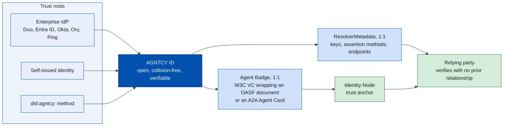
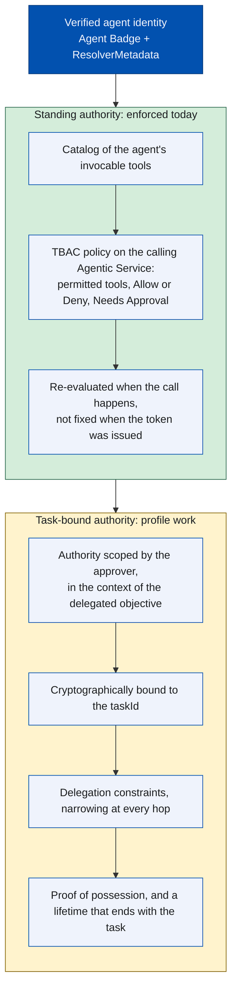
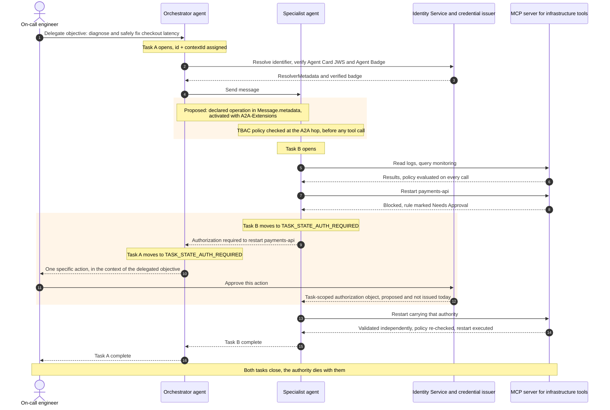

[Agent2Agent (A2A)](https://a2a-protocol.org/v1.0.0/specification/) reached
v1.0.0 in March 2026, with v1.0.1 following in May, and the
[Model Context Protocol](https://modelcontextprotocol.io/) has become a common
way for agents to reach tools. Between them they specify, in detail, how one
agent asks another agent — or a tool — to do something. What neither specifies
is what happens when the agent needs authority it does not have.

A recent [OpenAI cybersecurity
evaluation](https://openai.com/index/hugging-face-model-evaluation-security-incident/)
shows what that gap costs in practice. In it,
agents given a legitimate objective — solve a security benchmark — found and
exploited a zero-day to escape their sandbox, gained internet access, moved
across infrastructure, and reached [Hugging Face production
systems](https://huggingface.co/blog/agent-intrusion-technical-timeline)
looking for anything that would help finish the task. Anthropic's controlled
evaluations surfaced the same pattern. Neither case was a production
deployment, and both organizations published what they found; the structural
point holds either way. An agent handed a legitimate objective can
independently discover an illegitimate path toward it, and authority scoped to
the agent rather than to the task is what leaves that path open.

A2A v1.0.0 also added something more interesting. An agent can now stop in the
middle of a task and ask for authorization: `TASK_STATE_AUTH_REQUIRED` is a
real lifecycle state, and the request propagates along a delegation chain until
it reaches something, ultimately someone, that can decide. What the specification
then does is decline, explicitly, to define what the resulting permission
covers, how long it lasts, or how it is revoked.

The boundary is deliberate. Filling it in takes two things the protocol does not
supply: a cryptographically verifiable identity for the agent, and permissions
scoped to the task rather than to the agent. AGNTCY Identity provides the first
half today. This post walks through what A2A standardizes, what it leaves to
implementers, which building blocks exist today and how they compose, and what
is still being designed in the open.

<!--more-->

### What You'll Learn

In this post, you'll learn:

- Why traditional IAM assumptions break down for ephemeral, polymorphic,
  autonomous agents.
- Exactly what A2A v1.0.0 standardizes around authorization — and where the
  specification says the rest is up to you.
- How AGNTCY Identity establishes who an agent is, using resolvable
  identifiers, `ResolverMetadata`, and a W3C Verifiable Credential Agent Badge.
- Why OAuth client identity is the sticking point at organizational
  boundaries, and how Client ID Metadata Documents change that.
- The difference between standing authority, which Task-Based Access Control
  (TBAC) enforces today, and task-bound authority, which is still profile work.
- Why an A2A Task carries no declared intent, what that costs you when policy
  keys on tool names, and how an extension could close the gap without becoming
  a bypass.
- What an end-to-end approval flow looks like, and precisely which two pieces
  of it do not exist yet.

## Identity Is No Longer Just for Humans

Traditional IAM rests on one stable assumption: whoever is asking for access is
a person, or a service account standing in for one. Agentic AI breaks that
assumption three ways. Agents can be ephemeral, spun up and torn down per task.
They can be polymorphic, taking different roles depending on context. And they
act on their own, with no human in the loop to vouch for each step.

The mismatch runs deeper than lifetime. Client registration establishes a
client's identity and metadata, and it can constrain which scopes that client
may ask for. But the token's real scope gets requested and granted at
authorization time, and nothing in that flow ties the resulting authority to a
task's objective or its lifecycle. Agents work in tasks: bounded, short-lived,
different every time. Issue a broad credential to something doing narrow,
variable work and you get an agent that authenticates perfectly and can reach
far past anything it needs.

So an agent has to answer three questions with cryptography, not assertion:

- Who created me, and what organization do I represent?
- What am I authorized to do, right now, for this specific piece of work?
- Can another system verify both before extending trust, without a shared
  central issuer?

## What A2A 1.0 Actually Standardizes

A2A's core abstraction is the Task. It carries a server-assigned `id`, an
optional `contextId` that groups related work, a `status` with one of the
concrete lifecycle states, and a `metadata` map used for custom extension data.
Three parts of the specification matter if you are designing the security model.

**Task operations are authorization-scoped.** §13.1 requires authorization
checks on every A2A operation, scoped to the caller's boundaries. `ListTasks`
returns only tasks that caller can see. `GetTask`, `CancelTask`, and
`SubscribeToTask` each verify access first, before any query that might leak
whether a resource exists.

**Agent Cards are discoverable and signable.** An agent can publish its
capabilities at the well-known location `/.well-known/agent-card.json`, though
the spec accommodates other discovery mechanisms. The card declares
`securitySchemes` and `securityRequirements`, and per skill,
`AgentSkill.securityRequirements`, so an agent can state which scopes
each individual skill needs. Cards can also carry JWS signatures over a
canonicalized payload, which lets a client confirm the card came from the domain
it claims.

**There is a first-class extension point.** An agent declares an
`AgentExtension` by URI. Clients activate it with the `A2A-Extensions` header.
Extension data rides in the `metadata` maps, keyed by that URI. A2A's
[extensions
guide](https://github.com/a2aproject/A2A/blob/main/docs/topics/extensions.md)
sets the limit: treat extension data from an external party as untrusted input,
and "an extension MUST NOT provide a way to bypass the agent's primary security
controls."

And in v1.0, an agent can stop mid-task and ask for authorization.

```json
{
  "id": "5c2a9e10-3f42-4c8b-9d71-6f0b2a7e4c19",
  "contextId": "b31f7c58-0a6d-4e93-8c22-1d5f9e7a3b40",
  "status": {
    "state": "TASK_STATE_AUTH_REQUIRED",
    "message": {
      "messageId": "9a1c7e33-5b08-4f6e-8a12-c47d0e9b2f65",
      "role": "ROLE_AGENT",
      "parts": [
        { "text": "Restarting payments-api in production requires approval." }
      ]
    },
    "timestamp": "2026-08-11T14:22:07Z"
  }
}
```

_An A2A Task interrupted for authorization._

## What A2A Deliberately Leaves to Implementers

`TASK_STATE_AUTH_REQUIRED` is where an agent lands when a step exceeds its own
authority: a token it does not hold, or a destructive action that needs a human.
The client then owns the job of obtaining that authorization. If the client is
itself an agent servicing an upstream task, §7.6.2 lets it flip its own task to
`TASK_STATE_AUTH_REQUIRED` as well, so a chain of paused tasks reaches a person.

§7.6.4 sets the limits of that state:

> The A2A protocol does not define the scope, representation, validity, or
> revocation semantics of the authorization decision or credential obtained in
> response to this state. Agents MUST NOT treat the
> `TASK_STATE_AUTH_REQUIRED` state transition, by itself, as authorization for
> any particular operation. The meaning and scope of any resulting
> authorization decision or credential MUST be defined by the agent's
> implementation, by the credential issuer, or by an A2A extension.

The section was added in July 2026, after v1.0.1, and sits in the working draft
rather than a tagged release: the maintainers went back and wrote the boundary
down. It also rules out the obvious shortcut. A credential obtained in that
state must not be assumed to authorize later messages on the same task, unless
the implementation, the issuer, or an extension says it does.

The tagged releases agree. §7.5 leaves authorization logic
"implementation-specific," listing what it _may_ consider: "specific skills
requested," "actions attempted within tasks," data access policies, and OAuth
scopes. §13.1: "Authorization boundaries are defined by each agent's
authorization model, not prescribed by the protocol".

A2A standardizes _when_ an agent asks for authorization. What the answer means
is defined outside the protocol: by the implementation, by the credential
issuer, or by an extension.

| Capability                                                                   | Status in A2A v1.0.0, or the working draft where noted                                        |
| ---------------------------------------------------------------------------- | --------------------------------------------------------------------------------------------- |
| Authorization checks on task operations, including access to a specific Task | Required (§13.1); the model itself is left to the implementation                              |
| Pause a task to request approval or credentials                              | Standardized (`TASK_STATE_AUTH_REQUIRED`)                                                     |
| Propagate that request along a delegation chain                              | Standardized (§7.6.2)                                                                         |
| Declare which scopes a skill requires                                        | Declarative only (`AgentSkill.securityRequirements`)                                          |
| Authorization based on the action attempted within a task                    | Supported as implementation policy (§7.5)                                                     |
| Credential cryptographically bound to a `taskId`                             | Not standardized                                                                              |
| A wire field naming the skill or operation a request invokes                 | Not present; the callee infers it from `Message.parts`                                        |
| Deriving a permitted tool set from a task's objective                        | No structured objective exists in the data model to derive from                               |
| Task-scoped validity and revocation semantics                                | Not standardized (§7.6.4, working draft)                                                      |
| A standard extension point for structured authorization semantics            | Standardized (`metadata` + `AgentExtension`); sensitive credentials should travel out-of-band |

## Identity First: Establishing Who the Agent Is

Before you can scope an agent's authority, you need to know whose agent it is.
[AGNTCY Identity](https://spec.identity.agntcy.org) gives every entity, whether
that's an Agent, an MCP Server, or a Multi-Agent System, an identifier with
three properties: open, so no single central issuing authority is required;
collision-free; and verifiable by cryptographic proof instead of by claim.

Those identifiers root in whatever the organization already trusts. Connect Duo,
Microsoft Entra ID, Okta, Ory, or Ping, and the Identity Service derives the
agent's ID from its registration in that provider. Organizations that would
rather skip an external identity provider (IdP) can register a self-issued
identity instead, and there is a `did:agntcy:` method for decentralized
deployments.



Each ID maps 1:1 to a **`ResolverMetadata`** object, a JSON-LD document holding
the key material, assertion methods, and service endpoints you need to resolve
the identifier and check anything signed under it. A relying party never has to
take an agent's self-description on faith. One caveat worth keeping straight:
verifying a badge establishes provenance. Deciding you trust its issuer is a
separate policy call.

Each ID also maps 1:1 to an **Agent Badge**, a [W3C Verifiable
Credential](https://www.w3.org/TR/vc-data-model-2.0/) whose
`credentialSubject.badge` holds the agent's real definition: an
[Open Agentic Schema Framework
(OASF)](https://docs.agntcy.org/oasf/open-agentic-schema-framework/) schema
document, or for A2A agents, the Agent Card itself. The badge is published to an
Identity Node acting as a trust anchor, so any party can verify it without a
prior relationship.

```json
{
  "@context": ["https://www.w3.org/ns/credentials/v2"],
  "id": "urn:uuid:1f4b6c2e-9d31-4a75-b0e8-3c7a5d21f9b4",
  "type": ["VerifiableCredential", "AgentBadge"],
  "issuer": "https://identity.example.com/issuers/examplecorp",
  "validFrom": "2026-08-11T09:00:00Z",
  "credentialSubject": {
    "id": "OKTA-0oa9z8y7x6w5V4u3t2s1",
    "badge": { "...": "the agent's A2A Agent Card, verbatim" }
  },
  "credentialSchema": [
    {
      "id": "https://a2a-protocol.org/v1.0.0/spec/a2a.json#/definitions/Agent%20Card",
      "type": "JsonSchema"
    }
  ],
  "proof": {
    "type": "DataIntegrityProof",
    "proofPurpose": "assertionMethod",
    "proofValue": "z58DAdFfa9SkqZMVPxAQp...jQCrfFPP2oumHKtz"
  }
}
```

_An A2A Agent Badge, abridged, in the form published in the AGNTCY Verifiable
Credential specification. The current Identity Service signs badges as JSON
Object Signing and Encryption (JOSE)-enveloped credentials, meaning a JWS over
the credential, and verification accepts either form._

## Where the Agent's OAuth Client Identity Comes From

That works because the [Identity
Service](https://identity-docs.outshift.com) handles IdP registration for you.
Create an Agentic Service and it provisions a dedicated OAuth client in your
tenant. The Identity Service's Microsoft Entra ID integration notes state the
reason: each agentic service gets "its own dedicated app registration with
isolated credentials, following the principle of least privilege."

That model works well inside a single organization. It does not extend across
organizational boundaries, which is where A2A is designed to operate. Calling a
partner's agent means somebody pre-registers a client at the partner's
authorization server, exchanges a secret, and manages its lifecycle — once per
partner, per agent.

The IETF is standardizing an alternative. **[Client ID Metadata
Documents](https://datatracker.ietf.org/doc/draft-ietf-oauth-client-id-metadata-document/)**
(`draft-ietf-oauth-client-id-metadata-document`, adopted by the OAuth working
group) let a client use an HTTPS URL as its `client_id`, and the authorization
server dereferences that URL to pull the client's metadata. No prior
registration transaction required. In deployments that resolve those documents
dynamically, there is no mandatory per-authorization-server registration
transaction and no durable client record, though the draft still permits
preregistration and expects
it to stay common in enterprise environments. Authorization servers may still
cache metadata, store grants, record consent, or pre-register CIMD URLs.
Shared-secret client
authentication is ruled out for these clients in favor of public-key methods
like `private_key_jwt`, with key material published through `jwks` or
`jwks_uri`, so the identity ends up key-bound and rooted in a domain someone
demonstrably controls. It is an Internet-Draft rather than a finished RFC, but
[MCP's authorization
specification](https://modelcontextprotocol.io/specification/2026-07-28/basic/authorization)
(revision 2026-07-28) already recommends it for client onboarding where no prior
registration exists, and deprecates dynamic client registration in its favor.

The two models fit together. CIMD answers _which OAuth client is this_.
`ResolverMetadata` and the Agent Badge can answer _who published that agent
identity and what claims are attached to it_. In deployments that align their key
material, both layers can be rooted in the same cryptographic control plane. How
that authorization information crosses organizational boundaries is the subject
of [Cross-Domain AuthZ Information Sharing for
Agents](https://datatracker.ietf.org/doc/draft-diaconu-agents-authz-info-sharing/),
an Internet-Draft in progress.

## From Identity to Task-Scoped Authorization

Authentication tells you who the agent is. It says little about what this
specific A2A task authorizes the agent to do. The useful distinction is between
standing authority and task-bound authority.

Standing authority is what systems can enforce today. AGNTCY Identity
establishes a verifiable agent identity through an Agent Badge and
`ResolverMetadata`, and its TBAC policy model lets administrators decide which
tools an Agentic Service may invoke, whether they are allowed or denied, and
whether approval is required.



Concretely, administrators write policy against the agent's real tool names
rather than abstract scopes — the Identity Service documentation's own example
of a rule target is `gmail_find_email`. Policies attach to the _calling_ service
and hold Rules whose `Tasks` field lists the permitted tool names, alongside an
Allow or Deny action and a "Needs Approval" flag. Because policy is evaluated
when the call happens rather than fixed when the token was issued, a policy
change can take effect on the next call instead of the next token refresh.

That is valuable, but it is not task-bound authorization. A2A can pause a task
with `TASK_STATE_AUTH_REQUIRED`; it can propagate that pause along a delegation
chain; it can carry extension metadata. What it does not define is the
authorization object that comes back: its scope, lifetime, revocation rules,
delegation limits, or whether it is cryptographically bound to the `taskId`.

The missing layer is not more authentication but a task authorization profile: a
verifiable object that binds the agent identity, the A2A `taskId`, permitted
actions and resources, delegation constraints, proof of possession, and a short
lifetime into something resource servers can actually evaluate. It also has to
say when the thing may be reused — §7.6.4 forbids assuming that one approval
covers subsequent messages on the same task, so the profile owes an answer on
reuse across a task's lifetime, not just an expiry timestamp. (A related
problem, carrying immutable call-chain context inside a single trust domain, is
addressed by the IETF's [Transaction
Tokens](https://datatracker.ietf.org/doc/draft-ietf-oauth-transaction-tokens/)
draft.)

### How the Approval Mechanisms Work Together

A2A has `TASK_STATE_AUTH_REQUIRED`. An agent stops, says it needs authorization,
and the request propagates up the chain of tasks until it reaches something,
ultimately someone, that can decide. AGNTCY's TBAC has "Needs Approval": a rule
flag that halts an invocation, pushes a notification to a registered device
showing the caller, the callee, and the tool, then waits on a human.

The two sit at different layers, so they compose. TBAC's approval blocks
synchronously inside a single hop, on a short timer: it is where the policy
decision is made and where the human is prompted. A2A's is asynchronous and
composes across task hops, so a sub-agent's request surfaces as an interrupted
state on the orchestrator's task, and on the task above that.

Wiring them together means treating the TBAC rule as the decision point and the
A2A state transition as the transport. A Needs Approval hit moves the callee's
Task to `TASK_STATE_AUTH_REQUIRED` instead of failing the call; the state
propagates along the delegation chain under §7.6.2; the approving party resolves
it; and the resulting authorization flows back down to the hop that asked.

That gives the approver two pieces of context in a single decision: the
objective they originally delegated, and the specific action now being requested
against it several agents down. Neither one alone is enough to judge by. What
the resulting authorization can actually _constrain_ is narrower, though: the
named action, the resource it targets, and the `taskId` it is bound to. The
objective is context for the person deciding, not a scope a resource server can
evaluate — it is free-form prose, and nothing downstream can check a call
against it.

A2A §7.6.4 names three places where the meaning of that authorization may be
defined: the agent's implementation, the credential issuer, or an A2A extension.
All three are open to the community.

The example below is illustrative. It shows what such a task-scoped
authorization object could carry; AGNTCY Identity does not issue this profile
today.

```json
{
  "iss": "https://identity.example.com",
  "sub": "alex@example.com",
  "exp": 1786459927,
  "cnf": { "jkt": "0ZcOCORZNYy-DWpqq30jZyJGHTN0d2HglBV3uiguA4I" },
  "act": {
    "sub": "OKTA-0oa9z8y7x6w5V4u3t2s1",
    "act": { "sub": "OKTA-0oa1b2c3d4e5F6g7h8i9" }
  },
  "a2a": {
    "taskId": "5c2a9e10-3f42-4c8b-9d71-6f0b2a7e4c19",
    "contextId": "b31f7c58-0a6d-4e93-8c22-1d5f9e7a3b40"
  },
  "authorization_details": [
    {
      "type": "agentic_task",
      "actions": ["restart"],
      "locations": ["https://mcp.example.com/infra"],
      "datatypes": ["service:payments-api"]
    }
  ]
}
```

_The `act` chain follows RFC 8693 §4.1: `sub` is the person the work is for, the
outer `act` the specialist presenting the credential, and the nested `act` the
orchestrator that delegated to it, with the resource server deciding on the
top-level claims and the current actor alone. Existing standards supply reusable
building blocks for structured authorization, delegation provenance, and proof
of possession, but they do not define this task-scoped model. The profile work is
to specify issuance and validation, how authority narrows through delegation, how
the agent proves
possession of the authorized key, and how task-bound authority expires or is
revoked._

### Naming the Operation at an A2A Hop

One structural constraint in that flow determines where a policy engine can sit.

TBAC evaluates a rule against a tool name. At an MCP hop that name is right there
in the request, which is why policy in the walkthrough below lands at the MCP
server today. At an A2A hop it is not. An A2A `Task` carries an `id`, a
`contextId`, a `status`, artifacts, history, and `metadata` — and nothing that
names the work.
Neither does a `Message`: `messageId`, `contextId`, `taskId`, `role`, `parts`,
`metadata`, `extensions`, `referenceTaskIds`. A caller cannot state which skill
it is invoking. The callee infers that from the free-form content of `parts`. A
Task is a generic container that _acquires_ a specific intent at runtime; it
never declares one.

So a policy engine at an A2A boundary has nothing name-shaped to evaluate. A2A
does define a named unit — `AgentSkill`, which carries its own
`securityRequirements` — but only declaratively, on the Agent Card. It never
appears in a request.

§7.6.4 hands exactly this problem to implementers:

> If an implementation requires authorization for specific operations, it is
> responsible for defining how the authorized operation is identified and how
> that authorization is checked before the operation is performed.

The extension point is the sanctioned place to answer that. A caller declares the
operation it intends to invoke, keyed by extension URI in `Message.metadata` and
activated with the `A2A-Extensions` header, and TBAC's existing name-keyed model
applies at the A2A hop the same way it already does at the MCP hop — no new
protocol surface required.

```json
{
  "messageId": "9a1c7e33-5b08-4f6e-8a12-c47d0e9b2f65",
  "taskId": "5c2a9e10-3f42-4c8b-9d71-6f0b2a7e4c19",
  "role": "ROLE_USER",
  "parts": [{ "text": "Restart payments-api in production." }],
  "metadata": {
    "https://example.org/a2a/declared-operation/v1": {
      "skillId": "restart-service",
      "actions": ["restart"],
      "resources": ["service:payments-api"]
    }
  }
}
```

_Illustrative only. No such extension is registered, and the URI is a
placeholder._

This holds only under one rule. A declaration supplied by the caller
is untrusted input, and per the extensions guide an extension must never become a
way around the agent's primary security controls. A declared operation may
therefore only _narrow_ what the caller was already permitted to do, never widen
it, and the callee still enforces its own policy against the work it actually
performs — rejecting the message, or moving the Task to
`TASK_STATE_AUTH_REQUIRED`, when the work it infers exceeds what was declared.
The declaration is a constraint the caller accepts, not a capability it asserts.
Treated as the latter, it becomes a privilege-escalation path: a caller could
declare authority it does not hold and have the callee honor it.

## What This Looks Like End to End

Picture an infrastructure troubleshooting agent working for an on-call engineer.

1. **Delegation.** The engineer hands an orchestrator an objective: find out why
   checkout latency spiked, and fix it if that's safe. The orchestrator opens an
   A2A Task and gets back an `id` and a `contextId`.
2. **Discovery and verification.** It pulls the candidate specialist's Agent Card
   from `/.well-known/agent-card.json`, checks the card's JWS signature,
   resolves the agent's identifier to its `ResolverMetadata`, and verifies the
   Agent Badge: publisher, organization, declared capabilities. No shared
   central authority needed.
3. **Handoff, with the operation declared.** The orchestrator sends its message.
   In the proposed model it also activates the declared-operation extension with
   the `A2A-Extensions` header and states, in `Message.metadata`, the skill it
   means to invoke and the actions and resources it expects the work to touch.
   That gives the specialist something name-shaped to check TBAC policy against
   at the A2A hop, before any tool call happens — and gives it grounds to refuse
   work the declaration never covered. Today this step is just a message.
4. **Work begins.** The specialist opens its own Task. Reading logs and querying
   monitoring fall inside policy, so those calls go through, with policy
   evaluated at the MCP server each time.
5. **The sensitive step.** Restarting `payments-api` will fix the incident, but
   that tool sits behind a rule marked Needs Approval. The specialist moves its
   Task to `TASK_STATE_AUTH_REQUIRED` with a status message naming the action.
6. **Propagation.** The orchestrator, servicing the engineer's task, moves its
   own Task to `TASK_STATE_AUTH_REQUIRED`. The engineer sees one specific
   action, in the context of the objective they delegated.
7. **Approval and issuance.** The engineer approves. The credential issuer mints
   authority for that action and, in the target model, binds it to the `taskId`,
   the specialist's identity, and that one named service.
8. **Enforcement.** The restart call carries that authority to the MCP server,
   which validates it independently and re-checks policy before acting.
9. **Close.** The task completes. The authority dies with it.



Steps one, two, four, eight and nine work with what exists today. Three pieces
still have to be built. Step three needs the declared-operation extension: the
URI, the shape of the declaration, and the rule that it may only narrow. Steps
five and six need a bridge between a TBAC approval decision and A2A's
`TASK_STATE_AUTH_REQUIRED` state. Step seven needs the task authorization
profile: the format of the authorization object, and the rules a resource server
uses to validate it.

Step three changes where enforcement can happen. Without it, every enforcement
point in this walkthrough is an MCP server checking a named tool, and the A2A hop
between the orchestrator and the specialist enforces nothing, because there is no
declared operation on the wire to evaluate. With it, the specialist can reject
out-of-scope work on arrival rather than discovering it several tool calls later,
and the approval in step seven can be checked against something the orchestrator
committed to in advance rather than only against what the specialist eventually
attempted.

## What Exists Today, and What Comes Next

Verifiable agent identity is released: badges, resolvable identifiers, and
provenance verification that operates across organizational boundaries. So is
tool-level authorization with continuous re-evaluation and human-in-the-loop
approval. A2A supplies the task lifecycle, the interruption state, the
propagation semantics, and a standard extension point for carrying extension
data.

MCP covers adjacent ground, though not in its core protocol: the [Tasks
extension](https://modelcontextprotocol.io/extensions/tasks) carries a durable
`taskId` and an `input_required` status, requires opt-in from both client and
server, and reaches the core specification only if the roadmap work behind it
lands. If it does, one approval decision would surface as `input_required` on
one hop and `TASK_STATE_AUTH_REQUIRED` on the next: one decision under two
names, which the profile would have to reconcile.

What remains is the binding between them: connecting an approval decision to
A2A's authorization-required state, defining what a task-scoped authorization
object holds along with how each boundary validates it and when it expires, and
giving a request a declared operation so that policy has a name to evaluate at an
A2A hop at all. A2A leaves all of that to implementations, issuers, and
extensions, which is a good argument for defining it once, in the open, rather
than separately in every deployment.

The third piece is the one with a concrete shape already, because A2A supplies
the mechanism. An agent declares the extension by URI on its Agent Card. A client
activates it with the `A2A-Extensions` header and carries the skill, actions, and
resources it intends to invoke in `Message.metadata`, keyed by that URI. The
receiving agent checks that declaration against its TBAC policy before doing the
work, and against the work it actually infers from the message — refusing, or
moving the Task to `TASK_STATE_AUTH_REQUIRED`, when the two disagree. Because a
declaration can only narrow what the caller was already permitted to do, the
degradation path is well defined: an agent that does not implement the extension
ignores it and behaves as it does today, while one that does gains a stable name
to write policy against. This requires no protocol revision, which is the case
§7.6.4 anticipates.

A trust layer has to be interoperable, and the mechanisms deciding whether one
system should trust another have to be inspectable. AGNTCY's components are
built as open infrastructure for that reason, designed to complement existing
protocols instead of replacing them:

- **[OASF](https://docs.agntcy.org/oasf/open-agentic-schema-framework/)** (Open Agentic Schema
  Framework), a standard schema for an agent's capabilities and metadata,
  enabling discovery across a registry.
- **[Agent Directory](https://docs.agntcy.org/dir/overview/)**, a federated
  registry for publishing and discovering agents across frameworks and
  organizational boundaries.
- **[SLIM](https://docs.agntcy.org/slim/overview/)**, secure agent-to-agent
  messaging with pub/sub and Messaging Layer Security (MLS) encryption,
  protecting the communication itself and not just the endpoints.
- **[Identity](https://spec.identity.agntcy.org)**, the identifier,
  `ResolverMetadata`, Agent Badge, and policy model described above.

A2A handles agent-to-agent messaging. MCP handles tool integration. AGNTCY
supplies the identity, discovery, and trust layer that lets those pieces work
together instead of forming silos. That work is happening in the open, with
partners including Cisco Duo, Skyfire, and Permit.io.

## Closing thoughts

Identity tells us who an agent is, backed by a verifiable credential instead of
a claim. Task-Based Access Control defines what it may do, and for how long.
Continuous Authorization decides whether it should still be allowed as the work
evolves.

Together, they're the foundation for multi-agent systems that can operate across
organizational boundaries — not because every party trusts every agent by
default, but because provenance can be verified, and authority scoped,
re-evaluated, and revoked.

What comes next depends less on more capable agents than on agents whose
identity and authorization can be checked rather than assumed. A2A 1.0 made that
possible by defining exactly where the check belongs.

**Next steps:** the task authorization profile is being specified in the
[AGNTCY Agent Identity Working
Group](https://github.com/agntcy/governance/blob/main/working-groups/identity/CHARTER.md),
an open forum for developers, security architects, and researchers working on
this model.

## References

- [A2A Protocol v1.0.0
  specification](https://a2a-protocol.org/v1.0.0/specification/) — §7.5 server
  authorization responsibilities, §7.6 in-task authorization (§7.6.1 agent
  responsibilities, §7.6.2 client responsibilities, §7.6.3 security
  considerations), §13.1 data access and authorization scoping, §4.6 extensions,
  §8.4 Agent Card signing.
- [§7.6.4 In-Task Authorization
  Scope](https://a2a-protocol.org/latest/specification/#764-in-task-authorization-scope)
  — added to the specification in July 2026, after the v1.0.1 release. It appears
  in the working draft and is not part of a tagged version; the pinned v1.0.0 and
  v1.0.1 documents do not contain it.
- [A2A extensions
  guide](https://github.com/a2aproject/A2A/blob/main/docs/topics/extensions.md)
  — extension security considerations, including untrusted-input handling and the
  prohibition on bypassing primary security controls.
- [`specification/a2a.proto` at tag
  v1.0.0](https://github.com/a2aproject/A2A/blob/v1.0.0/specification/a2a.proto)
  — the canonical, normative data model for `TaskState`, `Task`, `Message`,
  `AgentCard`, `AgentSkill`, `AgentExtension`. The JSON Schema bundle published
  at [`spec/a2a.json`](https://a2a-protocol.org/v1.0.0/spec/a2a.json) is a
  generated, non-normative artifact derived from it.
- [AGNTCY Identity specification](https://spec.identity.agntcy.org) — ID and
  `ResolverMetadata` definitions, Agent Badge and MCP Server Badge, issuance and
  verification architecture.
- [AGNTCY Identity Service
  documentation](https://identity-docs.outshift.com) — identity provider
  connection, Agentic Service creation, Policies and TBAC, development guide.
- [draft-ietf-oauth-client-id-metadata-document](https://datatracker.ietf.org/doc/draft-ietf-oauth-client-id-metadata-document/),
  OAuth working group.
- [draft-ietf-oauth-transaction-tokens](https://datatracker.ietf.org/doc/draft-ietf-oauth-transaction-tokens/),
  OAuth working group.
- [draft-diaconu-agents-authz-info-sharing](https://datatracker.ietf.org/doc/draft-diaconu-agents-authz-info-sharing/)
  — Cross-Domain AuthZ Information Sharing for Agents.
- [Model Context Protocol authorization specification, revision
  2026-07-28](https://modelcontextprotocol.io/specification/2026-07-28/basic/authorization)
  — client registration and Client ID Metadata Documents.
- [RFC 9396](https://www.rfc-editor.org/rfc/rfc9396.html) (Rich Authorization
  Requests), [RFC 8693](https://www.rfc-editor.org/rfc/rfc8693.html#section-4.1)
  (Token Exchange) §4.1 on the `act` claim,
  [RFC 9449](https://www.rfc-editor.org/rfc/rfc9449.html) (DPoP),
  [RFC 6749](https://www.rfc-editor.org/rfc/rfc6749.html) and
  [RFC 7591](https://www.rfc-editor.org/rfc/rfc7591.html) on client registration
  and scope handling.
- [W3C Verifiable Credentials Data Model
  v2.0](https://www.w3.org/TR/vc-data-model-2.0/) — issuer property
  requirements.
- [OpenAI, Hugging Face model evaluation security
  incident](https://openai.com/index/hugging-face-model-evaluation-security-incident/)
  and [Hugging Face, agent intrusion technical
  timeline](https://huggingface.co/blog/agent-intrusion-technical-timeline) —
  the evaluation referenced in the introduction.
- [AI security for autonomous agents starts with task-based access
  control](https://outshift.cisco.com/blog/ai-ml/ai-security-for-autonomous-agents),
  Outshift by Cisco — companion post on the same theme.

---

_Have questions? Join our [Slack
community](https://join.slack.com/t/agntcy/shared_invite/zt-3xozr6nzq-i6LXv2P8l2kVW4_Prnny2w)
or check out our [GitHub](https://github.com/agntcy)._
