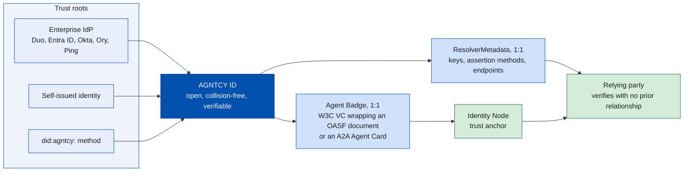
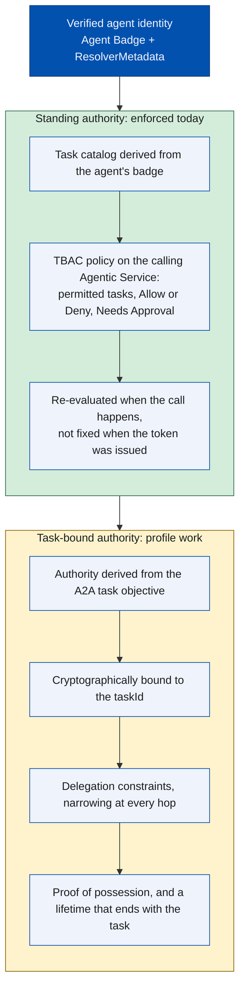
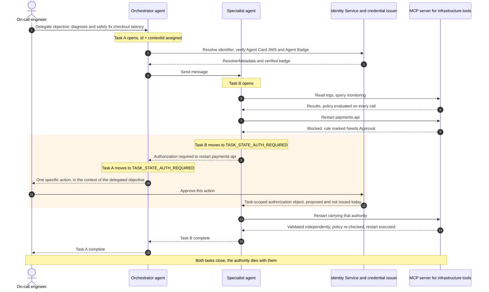

[Agent2Agent (A2A)](https://a2a-protocol.org/v1.0.0/specification/) reached
v1.0.0 in March 2026 and the
[Model Context Protocol](https://modelcontextprotocol.io/) has become a common
way for agents to reach tools. Between them they specify, in detail, how one
agent asks another agent — or a tool — to do something.

A2A v1.0.0 also added something more interesting. An agent can now stop in the
middle of a task and ask for authorization: `TASK_STATE_AUTH_REQUIRED` is a
real lifecycle state, and the request propagates up a delegation chain until it
reaches something, ultimately someone, that can decide. What the specification
then does is decline, explicitly, to define what the resulting permission
covers, how long it lasts, or how it is revoked.

That is a deliberate boundary rather than an oversight, and it is where the
interesting work now sits. Filling it in takes two things the protocol does not
supply: a cryptographically verifiable identity for the agent, and permissions
scoped to the task rather than to the agent. AGNTCY Identity provides the first
half today. This post walks through what A2A standardizes, what it leaves to
implementers, what the two layers give you together right now, and what is still
being designed in the open.

<!--more-->

### What You'll Learn

In this post, you'll learn:

- Why traditional IAM assumptions break down for ephemeral, polymorphic,
  autonomous agents.
- Exactly what A2A v1.0.0 standardizes around authorization — and the four
  places the specification says the rest is up to you.
- How AGNTCY Identity establishes who an agent is, using resolvable
  identifiers, `ResolverMetadata`, and a W3C Verifiable Credential Agent Badge.
- Why OAuth client identity is the sticking point at organizational
  boundaries, and how Client ID Metadata Documents change that.
- The difference between standing authority, which Task-Based Access Control
  enforces today, and task-bound authority, which is still profile work.
- What an end-to-end approval flow looks like, and precisely which two pieces
  of it do not exist yet.

## Identity Is No Longer Just for Humans

Traditional IAM rests on one stable assumption: whoever is asking for access is
a person, or a service account standing in for one. Agentic AI breaks that
assumption three ways. Agents can be ephemeral, spun up and torn down per task.
They can be polymorphic, taking different roles depending on context. And they
act on their own, with no human in the loop to vouch for each step.

The mismatch runs deeper than lifetime. Client registration establishes a
client's identity and metadata, and it can constrain which scopes that client
may ask for. But the token's real scope gets requested and granted at
authorization time, and nothing in that flow ties the resulting authority to a
task's objective or its lifecycle. Agents work in tasks: bounded, short-lived,
different every time. Issue a broad credential to something doing narrow,
variable work and you get an agent that authenticates perfectly and can reach
far past anything it needs.

So an agent has to answer three questions with cryptography, not assertion:

- Who created me, and what organization do I represent?
- What am I authorized to do, right now, for this specific piece of work?
- Can another system verify both before extending trust, without the two of us
  sharing a central authority?

## What A2A 1.0 Actually Standardizes

A2A's core abstraction is the Task. It carries a server-assigned `id`, an
optional `contextId` that groups related work, a `status` with one of the
concrete lifecycle states, and a `metadata` map used for custom extension data.
Three parts of the specification matter if you are designing the security model.

**Task operations are authorization-scoped.** §13.1 requires authorization
checks on every A2A operation, scoped to the caller's boundaries. `ListTasks`
returns only tasks that caller can see. `GetTask`, cancellation, and
subscription each verify access first, before any query that might leak whether
a resource exists.

**Agent Cards are discoverable and signable.** An agent can publish its
capabilities at the registered well-known location
`/.well-known/agent-card.json`, though the spec accommodates other discovery
mechanisms. The card declares `securitySchemes` and `securityRequirements`, and
per skill, `AgentSkill.securityRequirements`, so an agent can state which scopes
each individual skill needs. Cards can also carry JWS signatures over a
canonicalized payload, which lets a client confirm the card came from the domain
it claims.

**There is a first-class extension point.** An agent declares an
`AgentExtension` by URI. Clients activate it with the `A2A-Extensions` header.
Extension data rides in the `metadata` maps, keyed by that URI. The spec is
blunt that an extension must never become a way around an agent's primary
security controls.

And in v1.0, an agent can stop mid-task and ask for authorization.

```json
{
  "id": "5c2a9e10-3f42-4c8b-9d71-6f0b2a7e4c19",
  "contextId": "b31f7c58-0a6d-4e93-8c22-1d5f9e7a3b40",
  "status": {
    "state": "TASK_STATE_AUTH_REQUIRED",
    "message": {
      "messageId": "9a1c7e33-5b08-4f6e-8a12-c47d0e9b2f65",
      "role": "ROLE_AGENT",
      "parts": [
        { "text": "Restarting payments-api in production requires approval." }
      ]
    },
    "timestamp": "2026-08-11T14:22:07Z"
  }
}
```

_An A2A Task interrupted for authorization. One migration note: v1.0 serializes
lifecycle states in SCREAMING_SNAKE_CASE on the JSON wire, so
`TASK_STATE_AUTH_REQUIRED` replaces the `auth-required` of v0.3._

## What A2A Deliberately Leaves to Implementers

`TASK_STATE_AUTH_REQUIRED` is where an agent lands when it hits a step it can't
take on its own authority. Maybe it needs a token it doesn't hold. Maybe a human
has to approve something destructive. Either way, the client picks up
responsibility for getting that authorization. And if the client is itself an
agent servicing an upstream task, §7.6.2 lets it flip its own task to
`TASK_STATE_AUTH_REQUIRED` too, so a chain of paused tasks propagates up to a
person.

Useful primitive — but §7.6.4 draws a hard line around it:

> The A2A protocol does not define the scope, representation, validity, or
> revocation semantics of the authorization decision or credential obtained in
> response to this state. Agents MUST NOT treat the
> `TASK_STATE_AUTH_REQUIRED` state transition, by itself, as authorization for
> any particular operation. The meaning and scope of any resulting
> authorization decision or credential MUST be defined by the agent's
> implementation, by the credential issuer, or by an A2A extension.

The spec says the same thing in other places. §7.5: "Authorization logic is
implementation-specific." §13.1: "Authorization boundaries are defined by each
agent's authorization model, not prescribed by the protocol."

A2A standardizes _when_ an agent asks for authorization. What the answer means
is defined outside the protocol: by the implementation, by the credential
issuer, or by an extension.

| Capability                                                     | Status in A2A v1.0.0                                                                              |
| -------------------------------------------------------------- | ------------------------------------------------------------------------------------------------- |
| Access check for a specific Task                               | Required (§13.1)                                                                                  |
| Authorization checks on task operations                        | Required; the model itself is left to the implementation                                          |
| Pause a task to request approval or credentials                | Standardized (`TASK_STATE_AUTH_REQUIRED`)                                                         |
| Propagate that request up a delegation chain                   | Standardized (§7.6.2)                                                                             |
| Declare which scopes a skill requires                          | Declarative only (`AgentSkill.securityRequirements`)                                              |
| Authorization based on the action attempted within a task      | Supported as implementation policy (§7.5)                                                         |
| Credential cryptographically bound to a `taskId`               | Not standardized                                                                                  |
| Permission derived from the task's semantic intent             | Not standardized                                                                                  |
| Automatically narrow tools and scopes to what the task needs   | Not standardized                                                                                  |
| Task-scoped validity and revocation semantics                  | Not standardized (§7.6.4)                                                                         |
| A sanctioned place to carry structured authorization semantics | Standardized (`metadata` + `AgentExtension`); sensitive credentials preferably travel out-of-band |

## Identity First: Establishing Who the Agent Is

Before you can scope an agent's authority, you need to know whose agent it is.
[AGNTCY Identity](https://spec.identity.agntcy.org) gives every entity, whether
that's an Agent, an MCP Server, or a Multi-Agent System, an identifier with
three properties: open, so no central issuing authority is required;
collision-free; and verifiable by cryptographic proof instead of by claim.

Those identifiers root in whatever the organization already trusts. Connect Duo,
Microsoft Entra ID, Okta, Ory, or Ping, and the Identity Service derives the
agent's ID from its registration in that provider. Organizations that would
rather skip an external IdP can register a self-issued identity instead, and
there is a `did:agntcy:` method for decentralized deployments.



Each ID maps 1:1 to a **`ResolverMetadata`** object, a JSON-LD document holding
the key material, assertion methods, and service endpoints you need to resolve
the identifier and check anything signed under it. A relying party never has to
take an agent's self-description on faith. One caveat worth keeping straight:
verifying a badge establishes provenance. Deciding you trust its issuer is a
separate policy call.

Each ID also maps 1:1 to an **Agent Badge**, a [W3C Verifiable
Credential](https://www.w3.org/TR/vc-data-model-2.0/) whose
`credentialSubject.badge` holds the agent's real definition: an
[OASF](https://docs.agntcy.org/oasf/open-agentic-schema-framework/) schema document, or for A2A
agents, the Agent Card itself. The badge is published to an Identity Node acting
as a trust anchor, so any party can verify it without a prior relationship.

```json
{
  "@context": ["https://www.w3.org/ns/credentials/v2"],
  "id": "urn:uuid:1f4b6c2e-9d31-4a75-b0e8-3c7a5d21f9b4",
  "type": ["VerifiableCredential", "AgentBadge"],
  "issuer": "https://identity.example.com/issuers/examplecorp",
  "validFrom": "2026-08-11T09:00:00Z",
  "credentialSubject": {
    "id": "OKTA-0oa9z8y7x6w5V4u3t2s1",
    "badge": { "...": "the agent's A2A Agent Card, verbatim" }
  },
  "credentialSchema": [
    {
      "id": "https://a2a-protocol.org/v1.0.0/spec/a2a.json#/definitions/Agent%20Card",
      "type": "JsonSchema"
    }
  ],
  "proof": {
    "type": "DataIntegrityProof",
    "proofPurpose": "assertionMethod",
    "proofValue": "z58DAdFfa9SkqZMVPxAQp...jQCrfFPP2oumHKtz"
  }
}
```

_An A2A Agent Badge, abridged, in the form published in the AGNTCY Verifiable
Credential specification. The current Identity Service signs badges as
JOSE-enveloped credentials, meaning a JWS over the credential, and verification
accepts either form._

## Where the Agent's OAuth Client Identity Comes From

That works because the [Identity
Service](https://identity-docs.outshift.com) handles IdP registration for you.
Create an Agentic Service and it provisions a dedicated OAuth client in your
tenant. The Identity Service's Microsoft Entra ID integration notes are blunt
about the reason: each agentic service gets "its own dedicated app registration
with isolated credentials, following the principle of least privilege."

Inside one organization that model is excellent. At the organizational boundary
it runs out of road, which is unfortunate, because the boundary is where A2A is
built to operate. Calling a partner's agent means somebody pre-registers a
client at the partner's authorization server, exchanges a secret, and manages
its lifecycle. Multiply that by every partner and every agent.

The IETF is standardizing a way out. **[Client ID Metadata
Documents](https://datatracker.ietf.org/doc/draft-ietf-oauth-client-id-metadata-document/)**
(`draft-ietf-oauth-client-id-metadata-document`, adopted by the OAuth working
group) let a client use an HTTPS URL as its `client_id`, and the authorization
server dereferences that URL to pull the client's metadata. No prior
relationship required. In deployments that resolve those documents dynamically,
there is no mandatory per-authorization-server registration transaction and no
durable client record, though the draft still permits preregistration and expects
it to stay common in enterprise environments. Authorization servers may still
cache metadata, store grants, record consent, or pre-register CIMD URLs.
Shared-secret client
authentication is ruled out for these clients in favor of public-key methods
like `private_key_jwt`, with key material published through `jwks` or
`jwks_uri`, so the identity ends up key-bound and rooted in a domain someone
demonstrably controls. It is an Internet-Draft rather than a finished RFC, but
[MCP's authorization
specification](https://modelcontextprotocol.io/specification/draft/basic/authorization)
already recommends it for client onboarding where no prior registration exists,
and deprecates dynamic client registration in its favor.

The two models fit together. CIMD answers _which OAuth client is this_.
`ResolverMetadata` and the Agent Badge can answer _who published that agent
identity and what claims are attached to it_. In deployments that align their key
material, both layers can be rooted in the same cryptographic control plane. How
that authorization information crosses organizational boundaries is the subject
of [Cross-Domain AuthZ Information Sharing for
Agents](https://datatracker.ietf.org/doc/draft-diaconu-agents-authz-info-sharing/),
an Internet-Draft in progress.

## From Identity to Task-Scoped Authorization

Authentication tells you who the agent is. It says little about what this
specific A2A task authorizes the agent to do. The useful distinction is between
standing authority and task-bound authority.

Standing authority is what systems can enforce today. AGNTCY Identity
establishes a verifiable agent identity through an Agent Badge and
`ResolverMetadata`, and its TBAC policy model lets administrators decide which
tasks or tools an Agentic Service may invoke, whether they are allowed or
denied, and whether approval is required.



Concretely, the Identity Service builds a task catalog from the agent's badge,
so administrators write policy against the agent's real tools and invocations
instead of abstract scopes. Policies attach to the _calling_ service and hold
Rules listing permitted tasks, an Allow or Deny action, and a "Needs Approval"
flag. Because authorization is decided when the call happens rather than fixed
when the token was issued, a policy change can take effect on the next call
instead of the next token refresh.

That is already valuable, but it is not the same as task-bound authorization.
A2A can pause a task with `TASK_STATE_AUTH_REQUIRED`; it can propagate that
pause up a delegation chain; it can carry extension metadata. What it does not
define is the authorization object that comes back: its scope, lifetime,
revocation rules, delegation limits, or whether it is cryptographically bound to
the `taskId`.

So the missing layer is not more authentication. It is a task authorization
profile: a verifiable object that binds the agent identity, the A2A `taskId`,
permitted actions and resources, delegation constraints, proof of possession,
and a short lifetime into something resource servers can actually evaluate.
(A related problem, carrying immutable call-chain context inside a single trust
domain, is addressed by the IETF's [Transaction
Tokens](https://datatracker.ietf.org/doc/draft-ietf-oauth-transaction-tokens/)
draft.)

### How the Approval Mechanisms Work Together

A2A has `TASK_STATE_AUTH_REQUIRED`. An agent stops, says it needs authorization,
and the request propagates up the chain of tasks until it reaches something,
ultimately someone, that can decide. AGNTCY's TBAC has "Needs Approval": a rule
flag that halts an invocation, pushes a notification to a registered device
showing the caller, the callee, and the tool, then waits on a human.

The two sit at different layers, which is exactly what makes them composable.
TBAC's approval blocks synchronously inside a single hop, on a short timer: it is
where the policy decision is made and where the human is prompted. A2A's is
asynchronous and composes across task hops, so a sub-agent's request surfaces as
an interrupted state on the orchestrator's task, and on the task above that.

Wiring them together means treating the TBAC rule as the decision point and the
A2A state transition as the transport. A Needs Approval hit moves the callee's
Task to `TASK_STATE_AUTH_REQUIRED` instead of failing the call; the state
propagates up the delegation chain under §7.6.2; the approving party resolves it;
and the resulting authorization flows back down to the hop that asked.

That gives the approver two pieces of context in a single decision: the objective
they originally delegated, and the specific action now being requested against it
several agents down. The authorization issued in response can be scoped to both.
A2A §7.6.4 names three places where the meaning of that authorization may be
defined: the agent's implementation, the credential issuer, or an A2A extension.
All three are open to the community.

The example below is illustrative. It shows what such a task-scoped
authorization object could carry; AGNTCY Identity does not issue this profile
today.

```json
{
  "iss": "https://identity.example.com",
  "sub": "OKTA-0oa9z8y7x6w5V4u3t2s1",
  "exp": 1786012800,
  "cnf": { "jkt": "0ZcOCORZNYy-DWpqq30jZyJGHTN0d2HglBV3uiguA4I" },
  "act": {
    "sub": "OKTA-0oa1b2c3d4e5F6g7h8i9",
    "act": { "sub": "alex@example.com" }
  },
  "a2a": {
    "taskId": "5c2a9e10-3f42-4c8b-9d71-6f0b2a7e4c19",
    "contextId": "b31f7c58-0a6d-4e93-8c22-1d5f9e7a3b40"
  },
  "authorization_details": [
    {
      "type": "agentic_task",
      "actions": ["restart"],
      "locations": ["https://mcp.example.com/infra"],
      "datatypes": ["service:payments-api"]
    }
  ]
}
```

_Existing standards supply reusable building blocks for structured
authorization, delegation provenance, and proof of possession, but they do not
define this task-scoped model. The profile work is to specify issuance and
validation, how authority narrows through delegation, how the agent proves
possession of the authorized key, and how task-bound authority expires or is
revoked._

## What This Looks Like End to End

Picture an infrastructure troubleshooting agent working for an on-call engineer.

1. **Delegation.** The engineer hands an orchestrator an objective: find out why
   checkout latency spiked, and fix it if that's safe. The orchestrator opens an
   A2A Task and gets back an `id` and a `contextId`.
2. **Discovery and verification.** It pulls the candidate specialist's Agent Card
   from `/.well-known/agent-card.json`, checks the card's JWS signature,
   resolves the agent's identifier to its `ResolverMetadata`, and verifies the
   Agent Badge: publisher, organization, declared capabilities. No shared
   central authority needed.
3. **Work begins.** The specialist opens its own Task. Reading logs and querying
   monitoring fall inside policy, so those calls go through, with policy
   evaluated at the MCP server each time.
4. **The sensitive step.** Restarting `payments-api` will fix the incident, but
   that task sits behind a rule marked Needs Approval. The specialist moves its
   Task to `TASK_STATE_AUTH_REQUIRED` with a status message naming the action.
5. **Propagation.** The orchestrator, servicing the engineer's task, moves its
   own Task to `TASK_STATE_AUTH_REQUIRED`. The engineer sees one specific
   action, in the context of the objective they delegated.
6. **Approval and issuance.** The engineer approves. The credential issuer mints
   authority for that action and, in the target model, binds it to the `taskId`,
   the specialist's identity, and that one named service.
7. **Enforcement.** The restart call carries that authority to the MCP server,
   which validates it independently and re-checks policy before acting.
8. **Close.** The task completes. The authority dies with it.



Steps one through three, seven and eight work with what exists today. Two pieces
still have to be built. Steps four and five need a bridge between a TBAC
approval decision and A2A's `TASK_STATE_AUTH_REQUIRED` state. Step six needs the
task authorization profile: the format of the authorization object, and the
rules a resource server uses to validate it.

## What Exists Today, and What Comes Next

Verifiable agent identity is released: badges, resolvable identifiers, and
cryptographic verification that works across organizational boundaries. So is
tool-level authorization with continuous re-evaluation and human-in-the-loop
approval. A2A supplies the task lifecycle, the interruption state, the
propagation semantics, and a sanctioned place to carry extension data.

What remains is the binding between them: connecting an approval decision to
A2A's authorization-required state, and defining what a task-scoped
authorization object holds, how each boundary validates it, and when it expires.
A2A leaves that to implementations, issuers, and extensions, which is a good
argument for defining it once, in the open, rather than separately in every
deployment. A trust layer is only worth something if it is interoperable, and
the mechanisms deciding whether one system should trust another have to be
inspectable. That is why AGNTCY's components are built as open infrastructure,
designed to complement existing protocols instead of replacing them:

- **[OASF](https://docs.agntcy.org/oasf/open-agentic-schema-framework/)** (Open Agentic Schema
  Framework), a standard schema for an agent's capabilities and metadata,
  enabling discovery across a registry.
- **[Agent Directory](https://docs.agntcy.org/dir/overview/)**, a federated
  registry for publishing and discovering agents across frameworks and
  organizational boundaries.
- **[SLIM](https://docs.agntcy.org/slim/overview/)**, secure agent-to-agent
  messaging with pub/sub and MLS encryption, protecting the communication itself
  and not just the endpoints.
- **[Identity](https://spec.identity.agntcy.org)**, the identifier,
  `ResolverMetadata`, Agent Badge, and policy model described above.

A2A handles agent-to-agent messaging. MCP handles tool integration. AGNTCY
supplies the identity, discovery, and trust layer that lets those pieces work
together instead of forming silos. That work is happening in the open, with
partners including Cisco Duo, Skyfire, and Permit.io.

## Closing thoughts

Identity tells us who an agent is, backed by a verifiable credential instead of
a claim. Task-Based Access Control defines what it may do, and for how long.
Continuous Authorization decides whether it should still be allowed as the work
evolves.

Together, they're the foundation for multi-agent systems that can operate across
organizational boundaries — not because every party trusts every agent by
default, but because trust itself has become something that can be verified,
scoped, and revoked.

The future of AI won't depend solely on more capable agents. It will depend on
agents whose identity and authorization can be checked, not assumed. A2A 1.0
made that possible by defining exactly where the check belongs.

**Next steps:** the task authorization profile is being specified in the
[AGNTCY Agent Identity Working
Group](https://github.com/agntcy/governance/blob/main/working-groups/identity/CHARTER.md),
an open forum for developers, security architects, and researchers working on
this model.

## References

- [A2A Protocol v1.0.0
  specification](https://a2a-protocol.org/v1.0.0/specification/) — §7.5 server
  authorization responsibilities, §7.6 in-task authorization, §7.6.4 in-task
  authorization scope, §13.1 data access and authorization scoping, §4.6
  extensions, §8.4 Agent Card signing.
- [`specification/a2a.proto` at tag
  v1.0.0](https://github.com/a2aproject/A2A/blob/v1.0.0/specification/a2a.proto)
  — the canonical, normative data model for `TaskState`, `Task`, `Message`,
  `AgentCard`, `AgentSkill`, `AgentExtension`. The JSON Schema bundle published
  at [`spec/a2a.json`](https://a2a-protocol.org/v1.0.0/spec/a2a.json) is a
  generated, non-normative artifact derived from it.
- [AGNTCY Identity specification](https://spec.identity.agntcy.org) — ID and
  `ResolverMetadata` definitions, Agent Badge and MCP Server Badge, issuance and
  verification architecture.
- [AGNTCY Identity Service
  documentation](https://identity-docs.outshift.com) — identity provider
  connection, Agentic Service creation, Policies and TBAC, development guide.
- [draft-ietf-oauth-client-id-metadata-document](https://datatracker.ietf.org/doc/draft-ietf-oauth-client-id-metadata-document/),
  OAuth working group.
- [draft-ietf-oauth-transaction-tokens](https://datatracker.ietf.org/doc/draft-ietf-oauth-transaction-tokens/),
  OAuth working group.
- [draft-diaconu-agents-authz-info-sharing](https://datatracker.ietf.org/doc/draft-diaconu-agents-authz-info-sharing/)
  — Cross-Domain AuthZ Information Sharing for Agents.
- [Model Context Protocol authorization
  specification](https://modelcontextprotocol.io/specification/draft/basic/authorization)
  — client registration and Client ID Metadata Documents.
- [RFC 9396](https://www.rfc-editor.org/rfc/rfc9396.html) (Rich Authorization
  Requests), [RFC 8693](https://www.rfc-editor.org/rfc/rfc8693.html#section-4.1)
  (Token Exchange) §4.1 on the `act` claim,
  [RFC 9449](https://www.rfc-editor.org/rfc/rfc9449.html) (DPoP),
  [RFC 6749](https://www.rfc-editor.org/rfc/rfc6749.html) and
  [RFC 7591](https://www.rfc-editor.org/rfc/rfc7591.html) on client registration
  and scope handling.
- [W3C Verifiable Credentials Data Model
  v2.0](https://www.w3.org/TR/vc-data-model-2.0/) — issuer property
  requirements.

---

_Have questions? Join our [Slack
community](https://join.slack.com/t/agntcy/shared_invite/zt-3xozr6nzq-i6LXv2P8l2kVW4_Prnny2w)
or check out our [GitHub](https://github.com/agntcy)._
