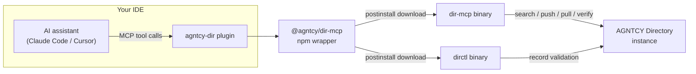

**TL;DR**: `dir-mcp` is now installable as a first-class plugin from the [AGNTCY Directory MCP repository](https://github.com/agntcy/dir-mcp). One command (or one click) wires your IDE straight into the AGNTCY Agent Directory with the power of MCP server like search, publish, validate, and generate OASF records without ever leaving the editor.

<!--more-->

## The problem: wiring up an MCP server by hand gets old fast

If you've worked with the [AGNTCY Directory](https://github.com/agntcy/dir) before, you know the drill: describe your agent as an OASF record, validate it against the schema, push it to a Directory instance, and search for others' records when you need to compose something new. `dir-mcp` exposes all of that as MCP tools so an AI assistant can do it for you but until now, getting it running meant downloading the right `dir-mcp` and `dirctl` binaries for your platform, hand-editing an `mcp.json`, and hoping the paths lined up.

That's a lot of ceremony for "I just want my assistant to talk to the Directory."



## What's new: real marketplace plugins

`dir-mcp` now ships two purpose-built plugin packages, one per IDE, each using that IDE's native mechanism instead of a generic MCP config blob:

- **Claude Code**: a `.claude-plugin/marketplace.json` at the repo root registers the `agntcy-dir` plugin, backed by `dir-mcp-plugins/claude`.
- **Cursor**: a matching `.cursor-plugin/marketplace.json` registers the equivalent plugin from `dir-mcp-plugins/cursor`.

Both plugins bundle the same set of MCP tools, a set of ready-made skills, and the wiring needed to talk to a Directory instance. Behind the scenes, a new `@agntcy/dir-mcp` npm wrapper package handles the part that used to be manual: its `postinstall` step downloads the correct `dir-mcp` and `dirctl` binaries for your OS and architecture, so the plugin works out of the box on macOS, Linux, or Windows without you touching a download page.

## Installing in Claude Code

You can install the plugin from the terminal or entirely through the UI whichever fits your workflow.

### Option A: the CLI

```bash
claude plugin marketplace add https://github.com/agntcy/dir-mcp
claude plugin install agntcy-dir@agntcy-dir-mcp
```

### Option B: the UI (VS Code extension or desktop app)

**In the VS Code extension:**

1. Type `/plugins` in the prompt box to open the **Manage plugins** panel.
2. Switch to the **Marketplaces** tab.
3. Enter the GitHub repo `agntcy/dir-mcp` (a full Git URL or local path also works) and press Enter to register it.
4. Switch to the **Plugins** tab and search for `agntcy-dir`.
5. Click **Install**, then pick a scope: **Install for you**, **Install for this project**, or **Install locally**.

**In the desktop app:**

1. Click the **+** button and select **Plugins** to open the plugin browser.
2. Add the `agntcy/dir-mcp` GitHub repo as a marketplace from the same dialog.
3. Select the `agntcy-dir` plugin and choose an installation scope.

## Installing in Cursor

Cursor users install the same functionality by adding the `agntcy/dir-mcp` GitHub repository as a marketplace:

1. Open Cursor's **Settings** and go to the **Plugins** (Marketplace) panel.
2. Add a new marketplace and point it at the `agntcy/dir-mcp` GitHub repo (a full Git URL or local path also works).
3. Search for `agntcy-dir` in the newly added marketplace and install it.

The plugin drops its MCP wiring into `~/.cursor/mcp.json` (or a project-local `.cursor/mcp.json`), plus `.mdc` rules files so Cursor's agent knows when to reach for the Directory tools automatically.

## What you actually get

Once installed, either IDE exposes the same underlying toolset:

- `agntcy_dir_search_local`, `agntcy_dir_pull_record`, `agntcy_dir_push_record` — search, fetch, and publish OASF records
- `agntcy_dir_verify_record`, `agntcy_dir_verify_name` — verify record authenticity and provenance
- `agntcy_oasf_validate_record` — validate a record against the OASF schema
- `agntcy_oasf_import_record` / `agntcy_oasf_export_record` — convert to and from other agent-description formats (A2A, MCP, GitHub Copilot agent files, Agent Skills)
- `agntcy_oasf_get_schema`, `agntcy_oasf_get_schema_skills`, `agntcy_oasf_get_schema_domains`, `agntcy_oasf_list_versions` — browse the OASF taxonomy and schema versions directly from your editor

Both plugins read their runtime configuration from `~/.config/dir-mcp/config.json` and hot-reload it on change, so switching between a local Directory server and a hosted one doesn't require restarting your IDE.

## Why this matters

Packaging `dir-mcp` as a native marketplace plugin turns "connect my AI assistant to the Agent Directory" from a multi-step setup task into a one-line install. It also puts the Directory's discovery and publishing workflow directly in the loop of everyday agent development: describe an agent, validate it, publish it, and find others' agents to compose with — all as skills your assistant already knows how to invoke.

If you maintain agents that others might want to discover, or you're building something that composes existing agents, give the plugin a try and publish your first OASF record straight from your editor.

---

*Have questions? Join our [Slack community](https://join.slack.com/t/agntcy/shared_invite/zt-3hb4p7bo0-5H2otGjxGt9OQ1g5jzK_GQ) or check out our [GitHub](https://github.com/agntcy).*
