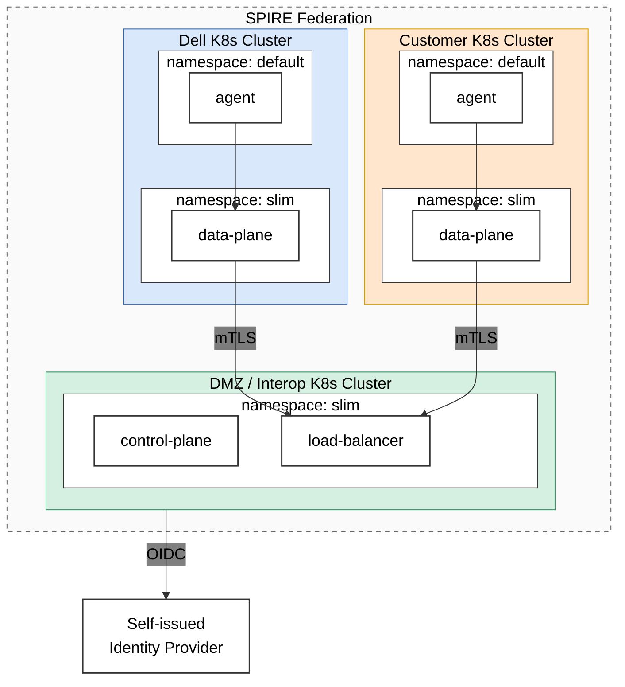
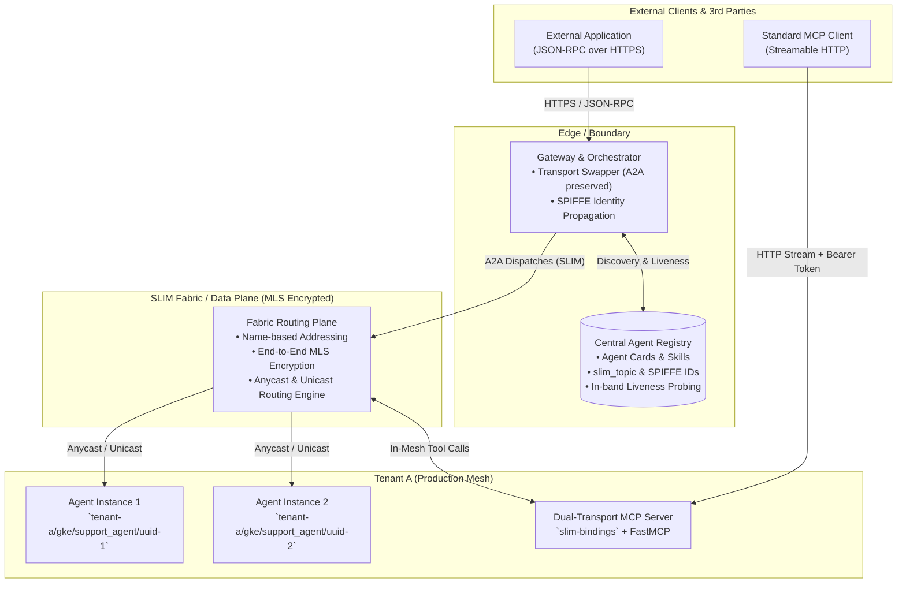
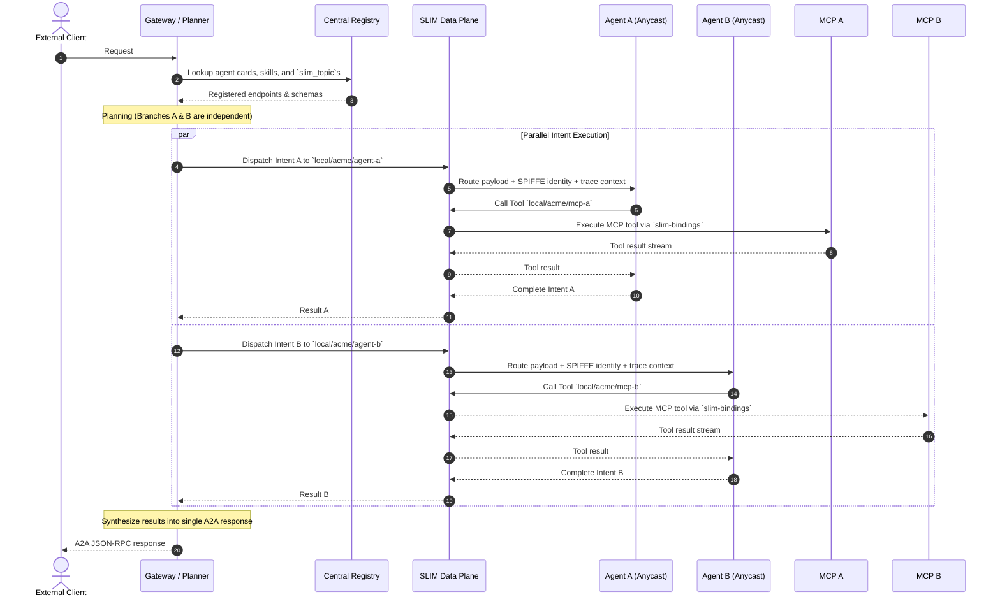

# Joint Blog Post Draft (Dell / Cisco)

**Abstract:** Dell’s application of SLIM to a customer use case facilitating agentic interaction across enterprise boundaries.

Dell was recently approached by a customer to engage in a co-innovation project related to agentic interoperability across enterprise boundaries. For this work we wanted to consider leading edge technologies to demonstrate the art of the possible in potentially validating new patterns of agentic architecture. Along with Cisco, Dell is a founding member of the [AGNTCY project](https://agntcy.org/) whose goal is to redesign and reimplement the cross-cutting concerns necessary to support an “Internet of Agents (IoA)”. We chose to build our agents using the AGNTCY SDK and to facilitate their communication using the [Secure Low-Latency Interactive Messaging (SLIM)](https://slim.agntcy.org/latest/) protocol, which will be the focus of this article.

Dell chose SLIM as the communication layer for this project for several reasons:

*   Encryption via Message Layer Security (MLS) which doesn’t rely on TLS
*   SLIM’s semantics are analogous with gRPC allowing integration across several A2A-compatible agent SDKs
*   SLIM’s name-based routing for message passing is familiar from other event-driven efforts
*   SLIM’s integration with SPIRE allows for identity verification of connected applications
*   In a multi-tenant scenario a SPIRE Federation allows the SLIM control plane to validate the identity of any applications, such as tenant-resident Data Planes, that connect to it.

Due to security constraints applicable to our respective customer networks, both parties agreed to host representative environments in a cloud provider where we could demonstrate the necessary interaction. In designing our approach we were inspired by the [multi-cluster deployment strategy](https://github.com/agntcy/slim/blob/98881353a0b21b8ddf7afed84f998497a9ca32e5/deployments/multicluster/multi_cluster_strategy.md) offered by the SLIM project which showed end to end message security across multiple clusters participating in a SPIRE Federation.

**Figure 1: SLIM connection across multiple clusters**
<!--  -->

The above diagram shows the two respective tenants for Dell and the customer, along with an “Interoperability” (Interop) tenant. Each tenant hosts a Kubernetes cluster that is a member of a SPIRE Federation. SPIRE allows unique cryptographic IDs to be assigned to each workload in the cluster. These IDs can be validated across tenant boundaries by virtue of shared “trust bundles”. This allows identity verification at every step for full end to end messaging security. Points at which trust is asserted include:

*   A local application attempts connection to a SLIM data plane and presents its assigned ID
*   A SLIM data plane in a given tenant attempts connection to the SLIM control plane in the Interop tenant and presents its assigned ID. This ID is verified by virtue of the SPIRE trust bundle.
*   A message from an application in the Dell tenant is sent to the Customer tenant, including its ID in a message header. The receiving application is able to verify that ID by virtue of the SPIRE trust bundle.

The inclusion of the Interop cluster was an implementation requirement based on the interaction between SLIM’s control plane and data planes at the time the architecture was designed. However our conception of the role this tenant might play grew to possibly include a centralized authority of trust for interoperability services – like connection brokering, agent discovery, identity provider, etc. We perceived a possible advantage in having a third party intermediary who could independently attest to the trustworthiness of other parties participating in the Federation.

## Agentic SDK Integration with SLIM and Agent Communications 

A SLIM endpoint is identifiable by a name (for example, `local/acme/support_agent`) rather than a host and port. Applications dial the fabric (i.e., the data plane), announcing either their own name or addressing a recipient by name, and the fabric routes traffic accordingly. Because there is no ingress, no NAT traversal, no DNS configuration, and no per-tenant certificate requirement, the only prerequisites are the endpoint name and the data plane. The data plane functions analogous to pub-sub platforms, but provides a more streamlined, effective alternative to standard web-domain HTTPS routing. SLIM encrypts payloads end to end with Message Layer Security at the session layer, so traffic stays confidential even where TLS terminates at an intermediate hop. For us the practical consequence was operational: onboarding an agent from a second tenant required no certificate issuance, no SAN updates, and no per-partner TLS negotiation — only a name and a data plane endpoint.

The entrypoint to our services is the gateway application which serves both native SLIM requests and traditional JSON-RPC over HTTPS, translating external calls into the SLIM protocol for intra-tenant communication. The request stays A2A end to end — the transport is swapped, not the protocol — and nothing is re-serialized, re-modelled, or downgraded on the way through. Trace context and the caller's SPIFFE identity travel in message metadata, so identity propagates across the tenant boundary rather than terminating at the edge. On the receiving side an agent binds the same A2A service handler it would run behind HTTP, so agent business logic stays transport-agnostic.

In our workflow, each agent uses a descriptive name that clearly identifies its purpose and the capabilities required to provide its service. Because agent cards are registered alongside their names in a central registry for discovery, external applications can discover and connect to them via the gateway application. We extended the standard A2A agent card with a `slim_topic` field, which is the routing key the gateway resolves against, along with SPIFFE identity, owning organization, and per-skill `inputs` and `outputs`. Agents self-register with a Discovery service at startup, so bringing an agent online and making it visible are a single act; liveness is then probed over SLIM itself, which exercises the real transport rather than a side-channel health port.

**Figure 2: Handling an incoming request via the orchestrator and routed through SLIM**

SLIM natively supports two delivery modes, Unicast and Anycast, distinguished by the presence of a fourth segment in the naming convention (e.g., `local/acme/support_agent/<uuid>`). Appending the fourth parameter routes traffic via Unicast, while omitting it enables Anycast routing. Our application code never writes that segment; the fabric supplies it. The request is published using the wildcard form and responders reply on a channel for their specific instance, so fan-out and reply affinity fall out of the naming scheme with no application involvement. The scaling model follows directly. Because throughput to a single agent is bounded, capacity could be added by registering additional replicas under the same naming pattern and letting the data plane route across them. This would require accounting for the need to share context between the agent replicas of course, but the protocol supports it.

**Figure 3: Handling of intent via delegation to internal agents and tooling routed by SLIM**

Within our tenant the prototype gateway can decompose complex requests into granular intents that individual agents execute based on the capabilities advertised in their agent cards and published to the internal agent registry. The resulting plan is a validated, acyclic topological execution graph. Using SLIM we can parallelize independent calls across agents using Anycast delivery. Ultimately, name-based routing delivers cross-tenant reachability without complex network re-engineering—enabling a topology that widens as dynamically as the execution plan itself.

All intra tenant communications go through a SLIM data-plane which natively supports MCP integration. The effort required to add slim-bindings is minimal – effectively a simple wrapper of the HTTPs based FastMCP server. This also provided us with multiple ways to interact with the MCP server itself, facilitating interactions with applications over both HTTPs and SLIM.

## Agent-to-MCP Proxy (Luca)

TBD

## Conclusion

TBD

I plan to say more in this section about the feedback we received from the customer and their desire to pivot to less cutting edge technology based on the need to integrate with an industry partner. I will also mention that we continue to use SLIM for the internal operations of the Dell tenant, just not for cross-tenant communication. (see [GitHub - agntcy/blogs: AGNTCY blogs website](https://github.com/agntcy/blogs))
