# K8s Remediation Use Case<br> Using SLIM

---

## K8s Remediation Use Case

<div style="display:flex; justify-content:center; margin-top:15px; transform:scale(2.2); transform-origin:top center">

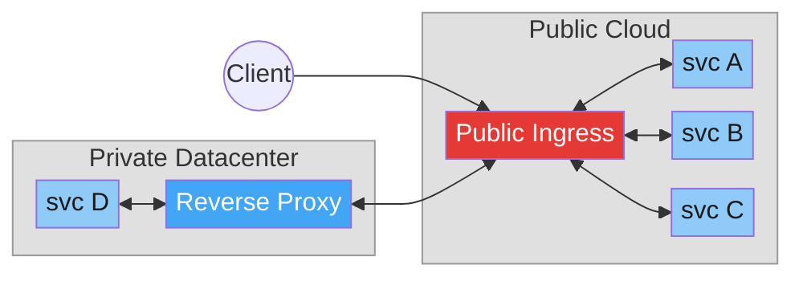

</div>

<div style="margin-top:150px; font-size:14px; line-height:2; text-align:center">

✗ Every service needs a **dedicated public endpoint**

✗ **Reverse proxy** requires configuration on the customer's cluster

✗ Data flows **in the clear** through middle boxes 

</div>

---

## How SLIM solves the problem

<div style="display:flex; justify-content:center; margin-top:15px; transform:scale(2.2); transform-origin:top center">

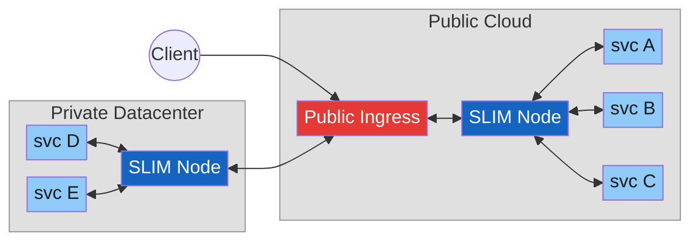

</div>

<div style="margin-top:150px; font-size:14px; line-height:2; text-align:center">

✓ **Single SLIM endpoint** exposes all services — no per-service ingress

✓ Private SLIM nodes connect **outbound** — communication is **bidirectional** once established

✓ **E2E encryption** via MLS over **gRPC/TLS** — data stays encrypted through all intermediate nodes

</div>

<!--
## Comparison with Existing Solutions

<br>

<div style="font-size: 18px;">

| **System/Protocol** | **Limitation** |
|---|---|
| HTTP/gRPC | • No E2E encryption <br> • Services must be exposed on the internet |
| VPNs | • No E2E encryption <br> • No per-service granularity <br> • Hard to manage across orgs |
| Reverse proxies | • No E2E encryption <br> • Complex configuration on customer cluster <br> |

</div>
-->


---

## What is SLIM

**Secure Low-latency Interactive Messaging** — a communication framework that provides the secure transport layer for services across network boundaries.

<div style="font-size: 13px; width: fit-content; margin: 0 auto; font-size:16px;">

| | |
|---|---|
| **gRPC / HTTP2** | Easy NAT & firewall traversal |
| **E2E Encrypted** | TLS transport + MLS data encryption |
| **Flexible Patterns** | Point-to-point, group channels, RPC |
| **Distributed** | Separate Data Plane and Controller |
| **No Direct Exposure** | Services reachable without exposed ports |
| **Multi-language** | Rust core → Python, Go, C#, JS/TS, Kotlin, Java |
| **Protocol Agnostic** | A2A, MCP, OTel, custom protocols |

</div>

---

## SLIM Architecture
<br>

<div style="transform: scale(0.85); transform-origin: top center;">

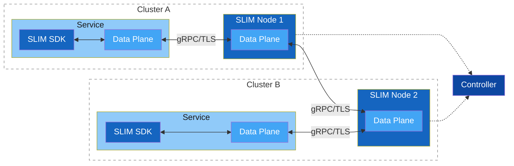

<div style="display:flex; justify-content:center; gap:70px; margin-top:40px; font-size:20px;">
  <div style="text-align:center;"><strong>SLIM SDK</strong><br>Reliable delivery <br> E2E encryption</div>
  <div style="text-align:center;"><strong>Data Plane</strong><br>Message forwarding <br> Connection Management (gRPC)</div>
  <div style="text-align:center;"><strong>Controller</strong><br>Node configuration <br> Route management</div>
</div>

</div>


---

## Zero Trust Data Security

<div style="transform: scale(1.1); transform-origin: top center; margin-top:30px; margin-top:60px;">

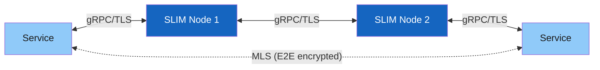

</div>

<div style="display:flex; justify-content:center; gap:40px; margin-top:70px; font-size:16px;">
  <div style="text-align:center; padding:15px 25px;">
    <strong> Network Security</strong><br>
    <strong>gRPC/TLS</strong><br>
    Encrypts every connection<br>
    Protects data in transit between nodes
  </div>
  <div style="text-align:center; padding:15px 25px;">
    <strong> Data Security</strong><br>
    <strong>Message Layer Security (MLS) Protocol </strong><br>
    Encrypts data end-to-end<br>
    Content safe even if nodes are compromised
  </div>
</div>

---

## Communication Patterns — P2P, Group and RPCs

SLIM natively supports the following interaction patterns between services.

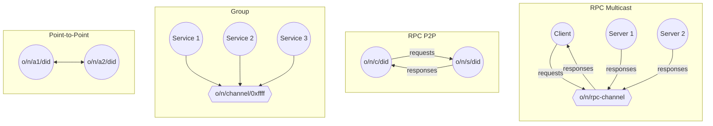

Services are identified using a hierarchical naming system based on Decentralized Identifiers (DIDs):
- `organization/namespace/service/h(did:key)` — the DID is the hash of the public key presented by the service

Services can join a shared channel and form groups:
- `organization/namespace/group/0xffffffff`

---
layout: cover
---

# K8s Remediation Use Case Demo

---

## Demo Functional Topology

<div style="transform:scale(1.1); transform-origin:top center; margin-top:50px;">

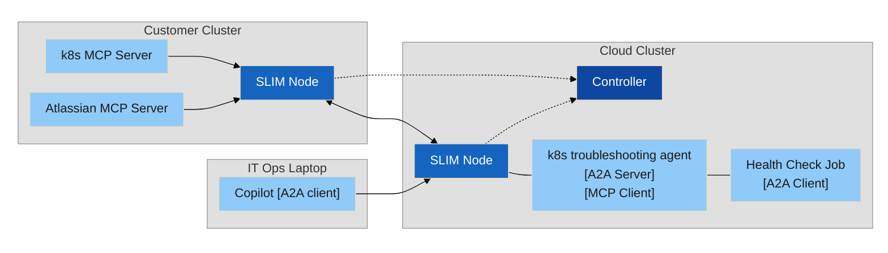

</div>

<div style="display:flex; justify-content:center; gap:30px; margin-top:50px; font-size:18px;">
  <div>── <strong>data</strong> (gRPC)</div>
  <div>┄┄ <strong>control</strong> (gRPC)</div>
</div>

---

## Demo Full Deployment 

<div style="transform:scale(1.1); transform-origin:top center; margin-top:70px;">

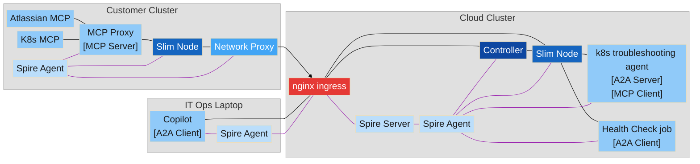

</div>

<div style="display:flex; justify-content:center; gap:30px; margin-top:70px; font-size:18px;">
  <div>── <strong>data</strong> (gRPC)</div>
  <div><span style="color:#9C27B0;">──</span> <strong>SPIRE auth</strong> (token provisioning)</div>
</div>

---

## How to Configure Service Names

In SLIM all services are identified by a name `organization/namespace/service/h(did:key)`


<table style="font-size:14px; width:100%; border-collapse:collapse">
  <thead>
    <tr>
      <th style="padding:18px 12px; text-align:left; white-space:nowrap; border-bottom:2px solid #ccc">Entity</th>
      <th style="padding:18px 12px; text-align:left; white-space:nowrap; border-bottom:2px solid #ccc">Pattern</th>
      <th style="padding:18px 12px; text-align:left; white-space:nowrap; border-bottom:2px solid #ccc">Example</th>
    </tr>
  </thead>
  <tbody>
    <tr>
      <td style="padding:18px 12px; white-space:nowrap; border-bottom:1px solid #ccc">Splunk</td>
      <td style="padding:18px 12px; white-space:nowrap; border-bottom:1px solid #ccc"><code>splunk/&lt;deployment-region&gt;/&lt;service-name&gt;</code></td>
      <td style="padding:18px 12px; white-space:nowrap; border-bottom:1px solid #ccc"><code>splunk/eu-central-1/k8s_troubleshooting_agent</code></td>
    </tr>
    <tr>
      <td style="padding:18px 12px; white-space:nowrap; border-bottom:1px solid #ccc">Customer (on-cluster)</td>
      <td style="padding:18px 12px; white-space:nowrap; border-bottom:1px solid #ccc"><code>&lt;customer-id&gt;/&lt;cluster-id&gt;/&lt;service-name&gt;</code></td>
      <td style="padding:18px 12px; white-space:nowrap; border-bottom:1px solid #ccc"><code>customer-1/on-prem-cluster/k8s-mcp-proxy</code></td>
    </tr>
    <tr>
      <td style="padding:18px 12px; white-space:nowrap; border-bottom:1px solid #ccc">Customer (off-cluster)</td>
      <td style="padding:18px 12px; white-space:nowrap; border-bottom:1px solid #ccc"><code>&lt;customer-id&gt;/off-cluster/&lt;service-name&gt;</code></td>
      <td style="padding:18px 12px; white-space:nowrap; border-bottom:1px solid #ccc"><code>customer-1/off-cluster/a2acli</code></td>
    </tr>
  </tbody>
</table>

---

## Customer Zero-Touch Onboarding

The onboarding of a new customer to the platform is fully automated. The customer only needs:

<div style="display:flex; justify-content:center; gap:40px; margin-top:30px; font-size:24px;">
  <div style="text-align:center; padding:15px 25px;">
    <strong>🔑 Authentication Token</strong>
  </div>
  <div style="text-align:center; padding:15px 25px;">
    <strong>🌐 Controller Public Address</strong>
  </div>
</div>

```yaml
slim:
  services:
    slim/0:
      controller:
        clients:
          - endpoint: "https://slim-control-plane-south.dev.eticloud.io:443"
            tls:
              insecure: false
              include_system_ca_certs_pool: true
            auth:
              type: spire
              jwt_audiences:
                - "slim"
              socket_path: /tmp/spire-agent/public/spire-agent.sock

```
---

## Customer Onboarding Demo

<div style="display:flex; justify-content:center;">
<video controls style="max-width: 88%; max-height: 78vh; object-fit: contain;">
  <source src="/videos/routes.mp4" type="video/mp4">
</video>
</div>

---

## Human Interaction

<br>

Any human operator can connect to the platform at any time with minimal configuration:

<div style="display:flex; justify-content:center; gap:40px; margin-top:15px; font-size:18px;">
  <div style="text-align:center; padding:15px 25px;">
    <strong>🔑 Authentication Token</strong>
  </div>
  <div style="text-align:center; padding:15px 25px;">
    <strong>🌐 SLIM Public Endpoint</strong>
  </div>
</div>

```yaml
slim:
  endpoint: "https://slim-dataplane.dev.eticloud.io"
  local-name: "customer-1/off-cluster/a2acli"
  spire:
    socket-path: "/tmp/spire-agent/public/api.sock"
    jwt-audiences:
      - "slim"
```

---

## Human Interaction — Sequence Diagram

<div style="transform:scale(1.05); transform-origin:top center; margin-top:15px">

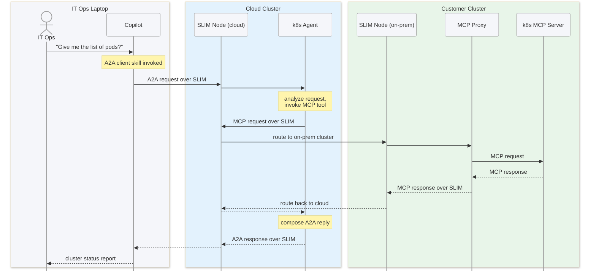

</div>

---

## Automated Health Check — Sequence Diagram

<div style="transform:scale(1); transform-origin:top center; margin-top:15px">

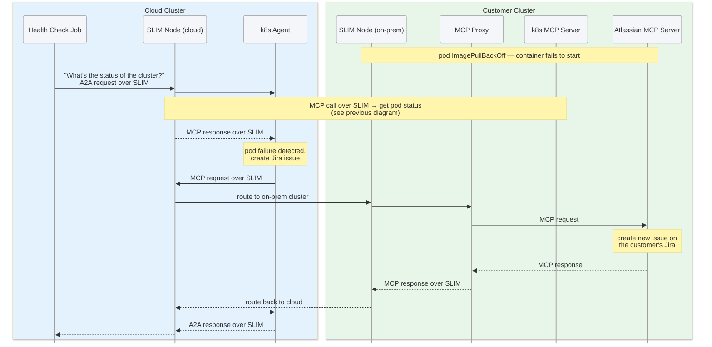

</div>

---

## Human Interaction Demo

<video controls style="max-width: 100%; max-height: 100%; object-fit: contain;">
  <source src="/videos/application.mp4" type="video/mp4">
</video>


---
layout: cover
---

# K8s Remediation Use Case<br> Using SLIM

---

## SLIM Controller Status: Before Onboarding

Node List: Only one SLIM node is available

<div style="display:flex; flex-direction:column; gap:10px; margin-top:8px">
  <div>
    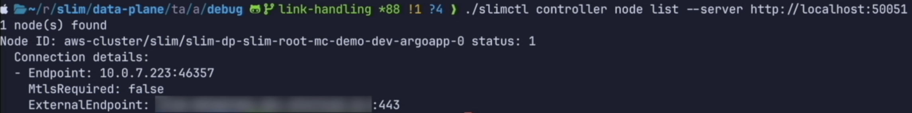
  </div>
</div>

Link List: No connections established

<div style="display:flex; flex-direction:column; gap:10px; margin-top:8px">
  <div>
    
  </div>
</div>

---

## SLIM Controller Status: Before Onboarding

Route List: Only Local services are available

<div style="display:flex; gap:10px; align-items:flex-start; margin-top:8px">
  <div style="flex:1">
    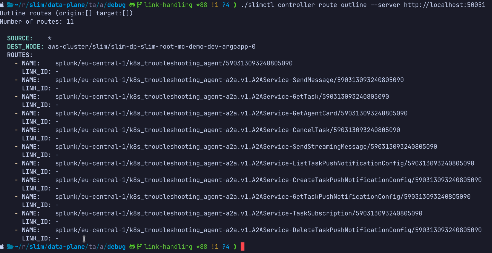
  </div>
</div>

---

## SLIM Controller Status: After Onboarding

Node List: New SLIM node registered

<div style="display:flex; flex-direction:column; gap:10px; margin-top:8px">
  <div>
    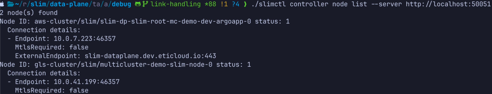
  </div>
</div>


Link List: New connection established with remote cluster

<div style="display:flex; flex-direction:column; gap:10px; margin-top:8px">
  <div>
    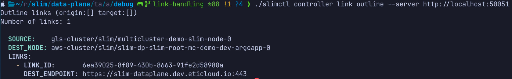
  </div>
</div>

---

## SLIM Controller Status: After Onboarding

Route List: Customer services are now reachable

<div style="display:flex; gap:10px; align-items:flex-start; margin-top:8px">
  <div style="flex:1">
    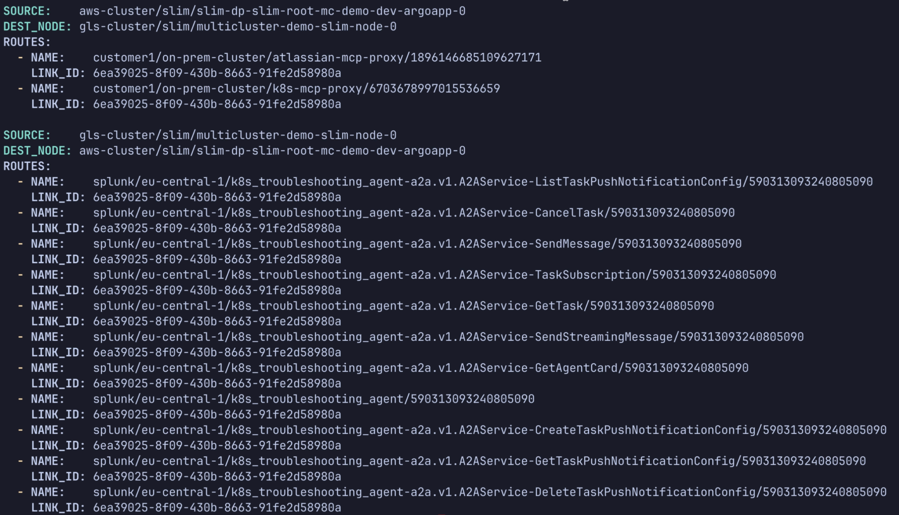
  </div>
</div>

---
