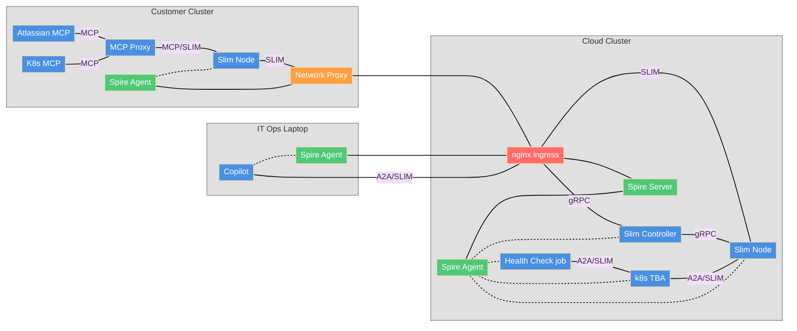

# SLIM Multicluster Demo

---

## Use Case

- The customer needs to access the services (Agents) running in the Splunk cloud
- Splunk needs to access services in the customer environment (e.g. Kubectl, Jira)
- Customer IT should be able to access services running in both environments 

- Problems:
    - All the agents need to be exposed publically on the internet
    - Reverse Proxy to access customer environment (customized for each app)
    - Data flow in the clear on middle boxes
---

## How SLIM solves the problem

- No need to expose services one by one
- gRPC based streaming communication for cross network boundaries
- e2e encryption
- 

---

## Introducing SLIM

see slides 35/36/37 of agntcy-intro

---

## SLIM Multicluster Demo Deployment

---

## Customer On-Boarding

- screen shot with routes and upfront description of the demo 

---

## Video

---

## Human in the Loop

- show the a2acli.yaml file

---

## Video