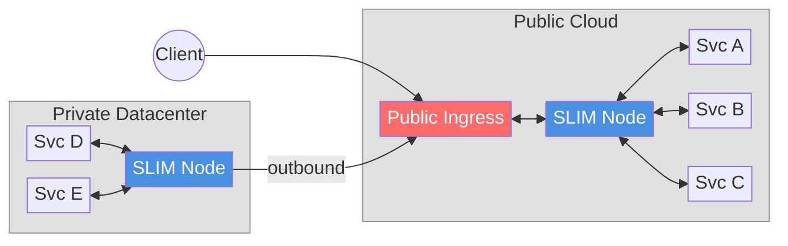
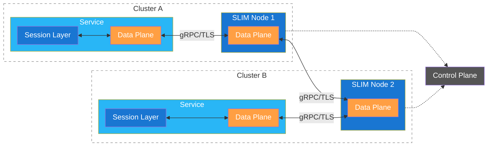
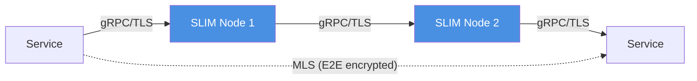
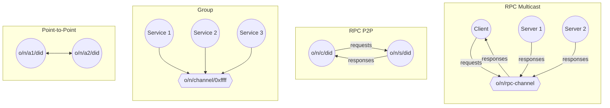
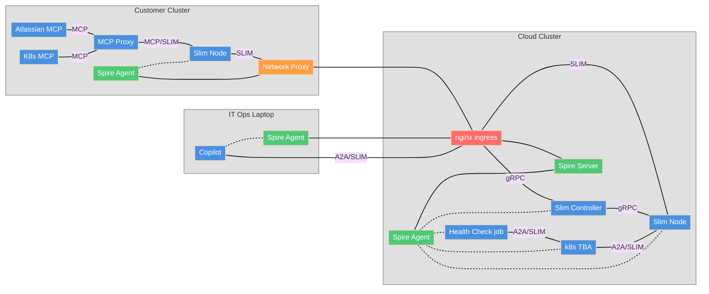
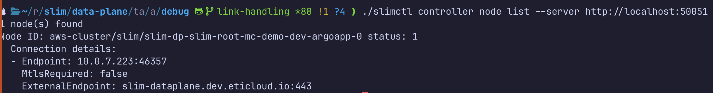
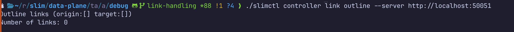
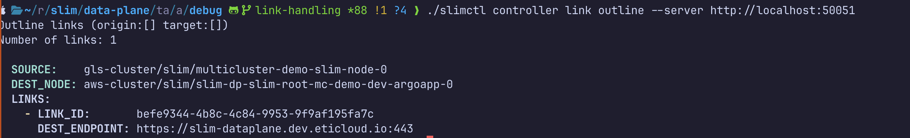
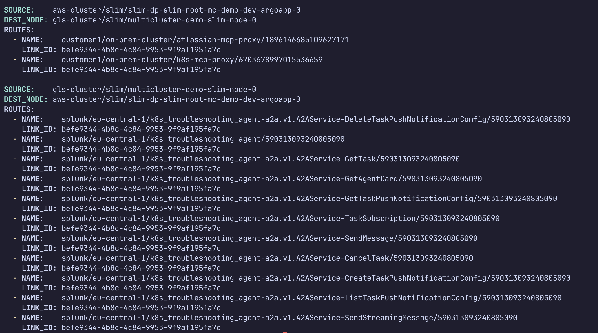

# SLIM Multicluster Demo

---

## Use Case

- The customer needs to access the services (Agents) running in the Splunk cloud
- Splunk needs to access services in the customer environment (e.g. Kubectl, Jira)
- Customer IT should be able to access services running in both environments 

- Problems:
    - All the agents need to be exposed publically on the internet
    - Reverse Proxy to access customer environment (customized for each app)
    - Data flow in the clear on middle boxes
---

## How SLIM solves the problem

**SLIM** — Secure Low latency Interactive Messaging

<div style="font-size: 11px;">

| <span style="font-size: 13px; font-weight: bold;">Problem</span> | <span style="font-size: 13px; font-weight: bold;">SLIM Solution</span> |
|---|---|
| **Public cloud:** every new service requires a dedicated public endpoint | Single SLIM endpoint exposes all services — no per-service ingress |
| **Private environments:** services behind firewalls are unreachable | Private SLIM nodes connect outbound to a public SLIM endpoint — no inbound exposure needed |
| Data flows in the clear on middle boxes | E2E encryption via MLS — data stays encrypted through intermediate nodes |

</div>

<br>

<div style="transform: scale(0.75); transform-origin: top left;">



*e.g. Svc A communicates with Svc E through: Svc A ↔ SLIM Node ↔ Public Ingress ↔ SLIM Node ↔ Svc E*

</div>

---

## Comparison with Existing Solutions

<div style="font-size: 12px;">

| **System/Protocol** | **Limitation** |
|---|---|
| Message queues (SQS, RabbitMQ, Kafka, NATS etc.) | • One-directional <br> • No e2e encryption <br> • Can't cross org boundaries |
| HTTP/gRPC | • No E2E encryption <br> • Services must be exposed on the internet |
| VPNs | • No per-service granularity <br> • No e2e encryption <br> • Hard to manage across orgs |
| Reverse proxies | • Per-service exposure and configuration <br> • No e2e encryption <br> • Does not solve cross-org trust |

</div>

---

## SLIM Architecture

<div style="font-size: 11px;">

| **Layer** | **Primary Function** | **Key Responsibilities** |
|---|---|---|
| Data Plane | Message Routing | Message forwarding, Connection management, gRPC over HTTP/2 |
| Session Layer | Secure Messaging | Reliable delivery, E2E encryption |
| Control Plane | Network Orchestration | Node configuration, Route management |

</div>

<br>

<div style="transform: scale(0.85); transform-origin: top left;">



</div>

<div style="font-size: 9px;">

Each service embeds a **Session Layer** and connects to a local **SLIM Node**, which handles cross-network delivery through the **Data Plane**.

</div>

---

## Zero Trust Data Security

**Network Security + Data Security**

| **Network Security (TLS)** | **Data Security (E2E / MLS)** |
|---|---|
| Secures the link | Secures the data |
| If a node is compromised, traffic can be read | Even if a node is compromised, content stays encrypted |
| Fine for single-hop, trusted infrastructure | Essential for multi-cloud, cross-org scenarios |



MLS: https://www.rfc-editor.org/rfc/rfc9420.txt

---

## Communication Patterns — P2P, Group and RPCs

SLIM natively supports the following interaction patterns between services.



Services are identified using a hierarchical naming system based on Decentralized Identifiers (DIDs):
- `organization/namespace/service/h(did:key)` — the DID is the hash of the public key presented by the service

Services can join a shared channel and form groups:
- `organization/namespace/group/0xffffffff`

---

## SLIM Multicluster Demo Deployment



---

## Customer Zero-Touch On-Boarding

The on-boarding of a new customer in the platform is fully automated

The customer only needs:
- An authentication Token
- The public address of the Controller

```yaml
slim:
  services:
    slim/0:
      controller:
        clients:
          - endpoint: "https://slim-control-plane-south.dev.eticloud.io:443"
            tls:
              insecure: false
              include_system_ca_certs_pool: true
            auth:
              type: spire
              jwt_audiences:
                - "slim"
              socket_path: /tmp/spire-agent/public/spire-agent.sock

```

---

## Customer On-Boarding: Before

Before on-boarding, the controller only knows about its own cloud-side node. No links to external environments exist yet.

<div style="display:flex; gap:10px; align-items:flex-start; margin-top:8px">
  <div style="flex:1">
    <p style="margin:0 0 4px; font-weight:bold; font-size:11px">Nodes (cloud only)</p>
    
  </div>
  <div style="flex:1">
    <p style="margin:0 0 4px; font-weight:bold; font-size:11px">Links (none)</p>
    
  </div>
</div>

---

## Customer On-Boarding: Install the Helm Chart

Show the values we see in the demo

---

## Customer On-Boarding: After

After the chart is installed, the controller automatically discovers the new node, creates a link, and populates routes to the customer's services.

<div style="display:flex; gap:10px; align-items:flex-start; margin-top:8px">
  <div style="flex:1">
    <p style="margin:0 0 4px; font-weight:bold; font-size:11px">New cross-cluster link</p>
    
  </div>
  <div style="flex:1">
    <p style="margin:0 0 4px; font-weight:bold; font-size:11px">Routes to customer services</p>
    
  </div>
</div>

---

## Customer On-Boarding Demo

<video controls style="max-width: 100%; max-height: 100%; object-fit: contain;">
  <source src="/videos/routes.mp4" type="video/mp4">
</video>

---

## Human Interaction

- Humand can use an a2a CLI to interact with the cloud services
  - connecting to the SLIM endpoint and invoking A2A RPCs on the services running in the cloud cluster
- Authentication is handled via JWT tokens (using SPIRE in this particular case)
- The a2a CLI can also be used as a skill for an agent
  - enabling automated human-in-the-loop workflows — demonstrated in the video
- The CLI configuration is minimal:

```yaml
slim:
  endpoint: "https://slim-dataplane.dev.eticloud.io"
  local-name: "agntcy/cli/a2acli"
  spire:
    socket-path: "/tmp/spire-agent/public/api.sock"
    jwt-audiences:
      - "slim"
```

---

## Human Interacion Demo

<video controls style="max-width: 100%; max-height: 100%; object-fit: contain;">
  <source src="/videos/application.mp4" type="video/mp4">
</video>
