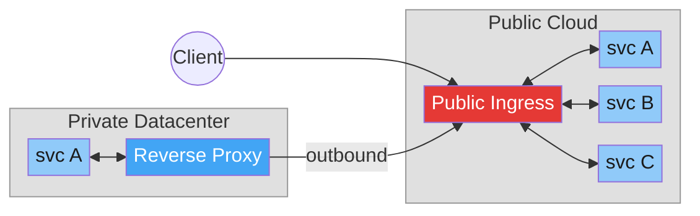
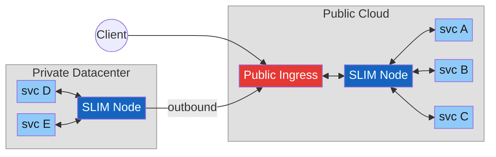
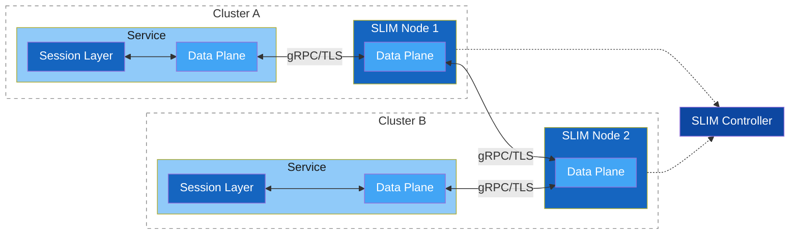
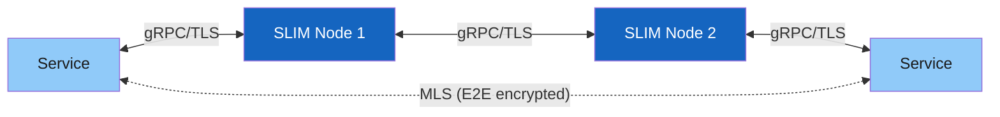
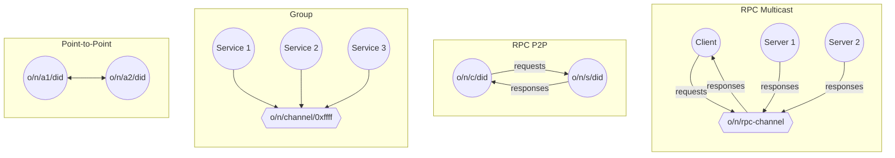
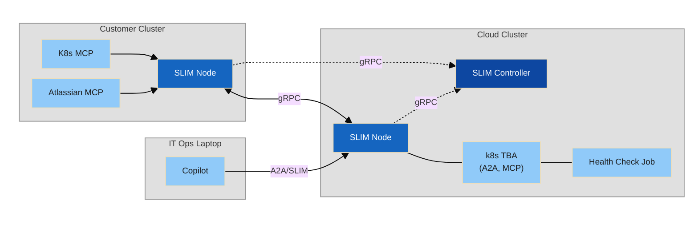
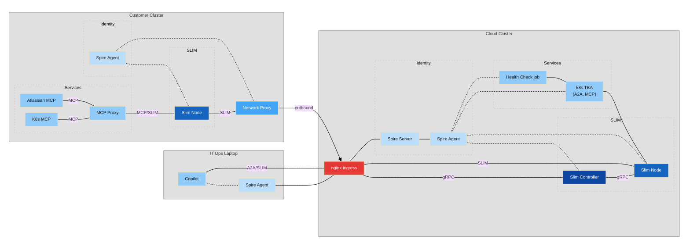
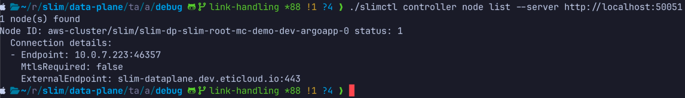
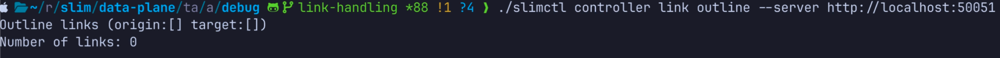

# SLIM Multicluster Demo

---

## Use case

<div style="display:flex; justify-content:center; margin-top:15px; transform:scale(2.2); transform-origin:top center">



</div>

<div style="margin-top:150px; font-size:14px; line-height:2; text-align:center">

✗ Every service needs a **dedicated public endpoint**

✗ **Custom reverse proxy** required per customer app

✗ Data flows **in the clear** through middle boxes

</div>

---

## Use Case: How SLIM solves the problem

<div style="display:flex; justify-content:center; margin-top:15px; transform:scale(2.2); transform-origin:top center">



</div>

<div style="margin-top:150px; font-size:14px; line-height:2; text-align:center">

✓ **Single SLIM endpoint** exposes all services — no per-service ingress

✓ Private SLIM nodes connect **outbound** — no inbound firewall exposure

✓ **E2E encryption** via MLS — data stays encrypted through all intermediate nodes

</div>

<!--

**SLIM** — Secure Low latency Interactive Messaging

<div style="font-size: 11px;">

| <span style="font-size: 13px; font-weight: bold;">Problem</span> | <span style="font-size: 13px; font-weight: bold;">SLIM Solution</span> |
|---|---|
| **Public cloud:** every new service requires a dedicated public endpoint | Single SLIM endpoint exposes all services — no per-service ingress |
| **Private environments:** services behind firewalls are unreachable | Private SLIM nodes connect outbound to a public SLIM endpoint — no inbound exposure needed |
| Data flows in the clear on middle boxes | E2E encryption via MLS — data stays encrypted through intermediate nodes |

</div>

<br>

<div style="transform: scale(0.75); transform-origin: top left;">

*e.g. svc A communicates with svc E through: svc A ↔ SLIM Node ↔ Public Ingress ↔ SLIM Node ↔ svc E*

</div>
-->
---

## Comparison with Existing Solutions

<br>

<div style="font-size: 18px;">

| **System/Protocol** | **Limitation** |
|---|---|
| HTTP/gRPC | • No E2E encryption <br> • Services must be exposed on the internet |
| VPNs | • No per-service granularity <br> • No e2e encryption <br> • Hard to manage across orgs |
| Reverse proxies | • Per-service exposure and configuration <br> • No e2e encryption <br> • Does not solve cross-org trust |

</div>

---

## SLIM Architecture

<div style="font-size: 11px;">

| **Component** | **Key Responsibilities** |
|---|---|---|
| Data Plane | Message forwarding, Connection management, gRPC over HTTP/2 |
| Slim SDK | Reliable delivery, E2E encryption |
| Controller | Node configuration, Route management |

</div>

<br>

<div style="transform: scale(0.85); transform-origin: top left;">



</div>

<div style="font-size: 9px;">

Each service embeds a **Session Layer** and connects to a local **SLIM Node**, which handles cross-network delivery through the **Data Plane**.

</div>

---

## Zero Trust Data Security

**Network Security + Data Security**

| **Network Security (TLS)** | **Data Security (E2EE / MLS)** |
|---|---|
| Secures the link | Secures the data |
| If a node is compromised, traffic can be read | Even if a node is compromised, content stays encrypted |
| Fine for single-hop, trusted infrastructure | Essential for multi-cloud, cross-org scenarios |



MLS: https://www.rfc-editor.org/rfc/rfc9420.txt

---

## Communication Patterns — P2P, Group and RPCs

SLIM natively supports the following interaction patterns between services.



Services are identified using a hierarchical naming system based on Decentralized Identifiers (DIDs):
- `organization/namespace/service/h(did:key)` — the DID is the hash of the public key presented by the service

Services can join a shared channel and form groups:
- `organization/namespace/group/0xffffffff`

---
layout: cover
---

# SLIM Multicluster Demo

---

## SLIM Multicluster Demo — Functional Topology

<div style="font-size: 9px; margin-bottom: 4px;">

── data channel &nbsp;&nbsp;&nbsp; ┄┄ control channel

</div>



---

## SLIM Multicluster Demo — Full Deployment

<div style="font-size: 9px; margin-bottom: 4px;">

── data channel &nbsp;&nbsp;&nbsp; ┄┄ control channel

</div>



---

## How to Configure SLIM Names

In SLIM all services are identified by a name `organization/namespace/service/h(did:key)`


<table style="font-size:14px; width:100%; border-collapse:collapse">
  <thead>
    <tr>
      <th style="padding:18px 12px; text-align:left; white-space:nowrap; border-bottom:2px solid #ccc">Entity</th>
      <th style="padding:18px 12px; text-align:left; white-space:nowrap; border-bottom:2px solid #ccc">Pattern</th>
      <th style="padding:18px 12px; text-align:left; white-space:nowrap; border-bottom:2px solid #ccc">Example</th>
    </tr>
  </thead>
  <tbody>
    <tr>
      <td style="padding:18px 12px; white-space:nowrap; border-bottom:1px solid #cc">Splunk</td>
      <td style="padding:18px 12px; white-space:nowrap; border-bottom:1px solid #cc"><code>splunk/&lt;deployment-region&gt;/&lt;service-name&gt;</code></td>
      <td style="padding:18px 12px; white-space:nowrap; border-bottom:1px solid #cc"><code>splunk/eu-central-1/k8s_troubleshooting_agent</code></td>
    </tr>
    <tr>
      <td style="padding:18px 12px; white-space:nowrap; border-bottom:1px solid #cc">Customer (on-cluster)</td>
      <td style="padding:18px 12px; white-space:nowrap; border-bottom:1px solid #cc"><code>&lt;customer-id&gt;/&lt;cluster-id&gt;/&lt;service-name&gt;</code></td>
      <td style="padding:18px 12px; white-space:nowrap; border-bottom:1px solid #cc"><code>customer-1/on-prem-cluster/k8s-mcp-proxy</code></td>
    </tr>
    <tr>
      <td style="padding:18px 12px; white-space:nowrap; border-bottom:1px solid #cc">Customer (off-cluster)</td>
      <td style="padding:18px 12px; white-space:nowrap; border-bottom:1px solid #cc"><code>&lt;customer-id&gt;/off-cluster/&lt;service-name&gt;</code></td>
      <td style="padding:18px 12px; white-space:nowrap; border-bottom:1px solid #cc"><code>customer-1/off-cluster/a2acli</code></td>
    </tr>
  </tbody>
</table>

---

## Customer Zero-Touch On-Boarding

The on-boarding of a new customer in the platform is fully automated

The customer only needs:
- An authentication Token
- The public address of the Controller

```yaml
slim:
  services:
    slim/0:
      controller:
        clients:
          - endpoint: "https://slim-control-plane-south.dev.eticloud.io:443"
            tls:
              insecure: false
              include_system_ca_certs_pool: true
            auth:
              type: spire
              jwt_audiences:
                - "slim"
              socket_path: /tmp/spire-agent/public/spire-agent.sock

```
---

## SLIM Controller Status: Before On-Boarding

Node List: Only one SLIM node available

<div style="display:flex; flex-direction:column; gap:10px; margin-top:8px">
  <div>
    
  </div>
</div>

Link List: No connection set

<div style="display:flex; flex-direction:column; gap:10px; margin-top:8px">
  <div>
    
  </div>
</div>

---

## SLIM Controller Status: Before On-Boarding

Route List: Only Local services are available

<div style="display:flex; gap:10px; align-items:flex-start; margin-top:8px">
  <div style="flex:1">
    
  </div>
</div>

---

## SLIM Controller Status: After On-Boarding

Node List: New SLIM node registerd

<div style="display:flex; flex-direction:column; gap:10px; margin-top:8px">
  <div>
    
  </div>
</div>


Link List: New connection established with remote cluster

<div style="display:flex; flex-direction:column; gap:10px; margin-top:8px">
  <div>
    
  </div>
</div>

---

## SLIM Controller Status: After On-Boarding

Route List: Customer services are now reachable

<div style="display:flex; gap:10px; align-items:flex-start; margin-top:8px">
  <div style="flex:1">
    
  </div>
</div>

---

## Customer On-Boarding Demo

<video controls style="max-width: 100%; max-height: 100%; object-fit: contain;">
  <source src="/videos/routes.mp4" type="video/mp4">
</video>

---

## Human Interaction

<br>

- Humans can use an a2a CLI to interact with the cloud services
  - connecting to the SLIM endpoint and invoking A2A RPCs on the services running in the cloud cluster
- Authentication is handled via JWT tokens (using SPIRE in this particular case)
- The a2a CLI can also be used as a skill for an agent
  - enabling automated human-in-the-loop workflows — demonstrated in the video
- The CLI configuration is minimal:

```yaml
slim:
  endpoint: "https://slim-dataplane.dev.eticloud.io"
  local-name: "customer-1/off-cluster/a2acli"
  spire:
    socket-path: "/tmp/spire-agent/public/api.sock"
    jwt-audiences:
      - "slim"
```

---

## Human Interaction Demo

<video controls style="max-width: 100%; max-height: 100%; object-fit: contain;">
  <source src="/videos/application.mp4" type="video/mp4">
</video>
